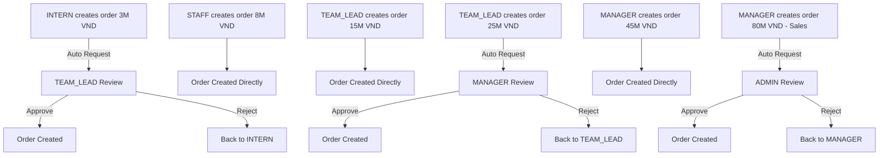

# Ma Trận Quyền Hạn RBAC - Hướng Dẫn Chi Tiết

## Tổng Quan Hệ Thống

### Thống Kê Hệ Thống RBAC

| Thành Phần | Số Lượng | Ghi Chú |
|------------|----------|---------|
| **Organization Levels** | 5 | ADMIN, MANAGER, TEAM_LEAD, STAFF, INTERN |
| **Permission Actions** | 113 | Phân bố qua 42 categories |
| **Permission Resources** | 21 | Phân bố qua 6 categories |
| **Permission Templates** | 5 | Simplified từ 8 templates cũ |
| **Priority Range** | 300-1000 | ADMIN=1000, MANAGER=700, TEAM_LEAD=600, STAFF=500, INTERN=300 |

### Cấu Trúc Phân Cấp (Hierarchy)

```
Level 1: ADMIN (Priority: 1000)
    ├── Toàn quyền quản trị hệ thống
    ├── Truy cập tất cả dữ liệu và chức năng
    └── Có thể override mọi restrictions
         ↓
Level 2: MANAGER (Priority: 700)
    ├── Quản lý team
    ├── Duyệt các thao tác quan trọng
    └── Giám sát nhân viên
         ↓
Level 3: TEAM_LEAD (Priority: 600)
    ├── Dẫn dắt nhóm nhỏ
    ├── Phân công công việc
    └── Hỗ trợ team members
         ↓
Level 4: STAFF (Priority: 500)
    ├── Nhân viên chính thức
    ├── Thực hiện công việc hàng ngày
    └── Theo phân công
         ↓
Level 5: INTERN (Priority: 300)
    ├── Nhân viên thực tập
    ├── Quyền hạn hạn chế
    └── Đang học tập và làm quen
```

## 1. Permission Resources (21 Resources)

### 1.1. Business Data (3 Resources)

#### CUSTOMERS - Khách Hàng
- **ID**: `f6e3f5dd-8c2a-4d15-8a0f-2ff3a7d9c4c1`
- **Icon**: `IconUsers` | **Color**: `#3B82F6` (Blue)
- **Mô tả**: Customer records, profiles, and contact information

#### ORDERS - Đơn Hàng
- **ID**: `0b5f9d28-2e8d-4d52-9c5f-6a3cb2ad7e11`
- **Icon**: `IconShoppingCart` | **Color**: `#10B981` (Green)
- **Mô tả**: Order records, transactions, and order management

#### PRODUCTS - Sản Phẩm
- **ID**: `b1a6d3f2-5c44-4b0e-90c2-6b0f4e2d7a33`
- **Icon**: `IconPackage` | **Color**: `#F59E0B` (Amber)
- **Mô tả**: Product catalog, inventory, and product information

### 1.2. User Management (4 Resources)

#### USERS - Người Dùng
- **ID**: `3b2f9e61-4d8a-46a5-92cb-1e0f7d6a3b44`
- **Icon**: `IconUser` | **Color**: `#EF4444` (Red)
- **Mô tả**: User accounts, profiles, and user management

#### DEPARTMENTS - Phòng Ban
- **ID**: `54c1e3a7-6b2d-4f7d-8a9c-2d1f5b6a7e22`
- **Icon**: `IconBuildingBank` | **Color**: `#06B6D4` (Cyan)
- **Mô tả**: Department structure, organization, and management

#### ORGANIZATION_LEVELS - Cấp Bậc Tổ Chức
- **ID**: `9d8f2c31-7e4b-4e2a-8a9d-5c7b2d1f6a66`
- **Icon**: `IconHierarchy` | **Color**: `#8B5CF6` (Purple)
- **Mô tả**: Organizational hierarchy levels and management

#### TEAM_MANAGEMENT - Quản Lý Team
- **ID**: `e1a4b7c2-5d6f-43b9-8d1a-7c5f2e3a9b10`
- **Icon**: `IconUsers` | **Color**: `#14B8A6` (Teal)
- **Mô tả**: Team assignment, task management, and team coordination

### 1.3. Financial (4 Resources)

#### FINANCIAL_DATA - Dữ Liệu Tài Chính
- **ID**: `2e6d4c81-9f3a-4937-82db-6a1f5c3b7d88`
- **Icon**: `IconCurrencyDollar` | **Color**: `#F97316` (Orange)
- **Mô tả**: General financial records and business financial information

#### SALARY_DATA - Dữ Liệu Lương ⚠️ HIGHLY SENSITIVE
- **ID**: `7f2b1d93-6e4a-4d6a-9bc5-1d2a3f4e5c77`
- **Icon**: `IconMoney` | **Color**: `#DC2626` (Dark Red)
- **Mô tả**: Employee salary and compensation information (highly sensitive)

#### BUDGET_DATA - Dữ Liệu Ngân Sách
- **ID**: `5d1a7c42-8b3e-4f9d-8e2a-4c7b5d1f3a11`
- **Icon**: `IconChartPie` | **Color**: `#F59E0B` (Amber)
- **Mô tả**: Department and project budget information

#### TRANSACTIONS - Giao Dịch
- **ID**: `81e4a6d2-3f5b-4b7a-8d9c-6a2f1e5b4c22`
- **Icon**: `IconCreditCard` | **Color**: `#10B981` (Green)
- **Mô tả**: Financial transactions requiring approval

### 1.4. Reporting (4 Resources)

#### REPORTS - Báo Cáo
- **ID**: `6a3d1f92-5b7c-47e9-8c2d-1f4a5e7b9d33`
- **Icon**: `IconChartBar` | **Color**: `#8B5CF6` (Purple)
- **Mô tả**: Business reports, analytics, and data visualization

#### ANALYTICS - Phân Tích
- **ID**: `b7e2a1d4-3c5f-4d7a-9b8c-2e1f4a6d5c44`
- **Icon**: `IconChartLine` | **Color**: `#A855F7` (Fuchsia)
- **Mô tả**: Advanced analytics, data mining, and business intelligence

#### KPIS - Chỉ Số KPI
- **ID**: `1f5d7a23-9c2b-4a6d-8e1f-3c4b5d6e7a55`
- **Icon**: `IconTarget` | **Color**: `#84CC16` (Lime)
- **Mô tả**: Key Performance Indicators and metrics tracking

#### PERFORMANCE_REVIEWS - Đánh Giá Hiệu Suất
- **ID**: `d3a6c1b2-5e4f-4a7e-9b8d-6c5a4f3e2d66`
- **Icon**: `IconStar` | **Color**: `#F59E0B` (Amber)
- **Mô tả**: Employee performance reviews and evaluations

### 1.5. System Configuration (6 Resources)

#### SETTINGS - Cài Đặt Hệ Thống
- **ID**: `e9d1f2a3-4c5e-4a7d-8e9b-6c5d4e3f2a77`
- **Icon**: `IconSettings` | **Color**: `#6B7280` (Gray)
- **Mô tả**: System settings, configurations, and preferences

#### WORKFLOWS - Quy Trình Làm Việc
- **ID**: `0f6c8e1d-2a3b-4d7c-9e8a-5b6c7d8e9f88`
- **Icon**: `IconGitBranch` | **Color**: `#EC4899` (Pink)
- **Mô tả**: Business process workflows and automation

#### INTEGRATIONS - Tích Hợp
- **ID**: `9b2a1c7d-3d5f-4c6a-8d1e-2f3b4a5c6d99`
- **Icon**: `IconPlug` | **Color**: `#14B8A6` (Teal)
- **Mô tả**: Third-party integrations and API connections

#### PERMISSIONS - Quyền Hạn
- **ID**: `6c8d9e1f-2c3a-4d7b-9e8c-5a1d2f3b4c00`
- **Icon**: `IconShield` | **Color**: `#DC2626` (Dark Red)
- **Mô tả**: Permission management and access control configuration

#### CONFIDENTIAL_INFO - Thông Tin Mật ⚠️ HIGHLY CONFIDENTIAL
- **ID**: `12a5d7e9-b1c2-4a6d-8e9a-7b6c5d4e3f11`
- **Icon**: `IconEyeOff` | **Color**: `#991B1B` (Darkest Red)
- **Mô tả**: Highly confidential business information and documents

#### AUDIT_LOGS - Nhật Ký Kiểm Toán
- **ID**: `8e1f2a3b-4d5c-4a7e-9b8d-6c5a4f3e2d22`
- **Icon**: `IconFileText` | **Color**: `#374151` (Dark Gray)
- **Mô tả**: System audit logs and security monitoring information

## 2. Permission Actions (113 Actions)

### 2.1. Phân Loại Theo Category

| Category | Số Actions | Risk Levels | Ghi Chú |
|----------|------------|-------------|---------|
| **BASIC_CRUD** | 4 | LOW-HIGH | READ, CREATE, UPDATE, DELETE |
| **ADVANCED** | 6 | MEDIUM-HIGH | EXPORT, IMPORT, SHARE, PUBLISH, ARCHIVE, RESTORE |
| **SYSTEM** | 6 | MEDIUM-CRITICAL | CONFIGURE, MONITOR, AUDIT, ACCESS_SENSITIVE_DATA, VIEW_CONFIDENTIAL_INFO, BYPASS_WORKFLOW_APPROVAL |
| **APPROVAL** | 3 | MEDIUM-HIGH | APPROVE, REJECT, ESCALATE |
| **BULK_OPERATIONS** | 4 | HIGH-CRITICAL | BULK_CREATE, BULK_UPDATE, BULK_DELETE, BULK_EXPORT |
| **TEAM_MANAGEMENT** | 4 | LOW-HIGH | MANAGE_TEAM, ASSIGN_TASKS, VIEW_TEAM_REPORTS, CONDUCT_REVIEWS |
| **FINANCIAL** | 4 | HIGH-CRITICAL | ACCESS_SALARY_DATA, APPROVE_TRANSACTIONS, VIEW_FINANCIAL_REPORTS, BUDGET_MANAGEMENT |
| **CUSTOMER_MANAGEMENT** | 4 | MEDIUM-HIGH | ASSIGN_CUSTOMER, TRANSFER_CUSTOMER, MERGE_CUSTOMERS, CONVERT_LEAD |
| **COMMUNICATION** | 4 | LOW | SEND_EMAIL, MAKE_CALL, SEND_SMS, SCHEDULE_MEETING |
| **DEAL_MANAGEMENT** | 3 | LOW-HIGH | CLOSE_DEAL, CHANGE_DEAL_STAGE, APPROVE_DISCOUNT |
| **REPORTING** | 4 | LOW-MEDIUM | CREATE_REPORT, SCHEDULE_REPORT, VIEW_DASHBOARD, EXPORT_ANALYTICS |
| **USER_MANAGEMENT** | 4 | MEDIUM-CRITICAL | MANAGE_USERS, ASSIGN_ROLES, RESET_PASSWORD, VIEW_USER_ACTIVITY |
| **AUTOMATION** | 3 | MEDIUM-HIGH | CONFIGURE_INTEGRATION, CREATE_WORKFLOW, EXECUTE_API |
| **SECURITY_OPERATIONS** | 3 | HIGH-CRITICAL | MANAGE_SECURITY_POLICIES, CONFIGURE_ACCESS_CONTROLS, VIEW_SECURITY_LOGS |
| **+28 more categories** | 57 | VARIOUS | Enterprise features (BI, Analytics, Backup, etc.) |

### 2.2. Top 20 Critical Actions

| # | Action Key | Category | Risk Level | Requires Approval | Mô Tả |
|---|-----------|----------|------------|-------------------|-------|
| 1 | **BYPASS_WORKFLOW_APPROVAL** | SYSTEM | CRITICAL | ✅ Yes | Bỏ qua quy trình phê duyệt tiêu chuẩn |
| 2 | **ACCESS_SENSITIVE_DATA** | SYSTEM | CRITICAL | ✅ Yes | Truy cập dữ liệu nhạy cảm và mật của doanh nghiệp |
| 3 | **VIEW_CONFIDENTIAL_INFO** | SYSTEM | CRITICAL | ✅ Yes | Xem thông tin và tài liệu bảo mật |
| 4 | **CONFIGURE** | SYSTEM | CRITICAL | ✅ Yes | Cấu hình các thiết lập và tham số hệ thống |
| 5 | **ACCESS_SALARY_DATA** | FINANCIAL | CRITICAL | ✅ Yes | Truy cập thông tin lương và thù lao |
| 6 | **APPROVE_TRANSACTIONS** | FINANCIAL | CRITICAL | ✅ Yes | Phê duyệt các giao dịch tài chính và chi phí |
| 7 | **BUDGET_MANAGEMENT** | FINANCIAL | CRITICAL | ✅ Yes | Quản lý ngân sách phòng ban và dự án |
| 8 | **MANAGE_USERS** | USER_MANAGEMENT | CRITICAL | ✅ Yes | Tạo và chỉnh sửa tài khoản người dùng |
| 9 | **ASSIGN_ROLES** | USER_MANAGEMENT | CRITICAL | ✅ Yes | Gán vai trò và quyền hạn cho người dùng |
| 10 | **MANAGE_SECURITY_POLICIES** | SECURITY_OPERATIONS | CRITICAL | ✅ Yes | Quản lý chính sách bảo mật hệ thống |
| 11 | **CONFIGURE_ACCESS_CONTROLS** | SECURITY_OPERATIONS | CRITICAL | ✅ Yes | Cấu hình kiểm soát truy cập và quyền hạn |
| 12 | **BULK_DELETE** | BULK_OPERATIONS | CRITICAL | ✅ Yes | Xóa nhiều bản ghi trong thao tác hàng loạt |
| 13 | **MANAGE_TENANTS** | TENANT_MANAGEMENT | CRITICAL | ✅ Yes | Quản lý các tenant trong hệ thống |
| 14 | **CONFIGURE_MULTI_TENANCY** | TENANT_MANAGEMENT | CRITICAL | ✅ Yes | Cấu hình multi-tenancy architecture |
| 15 | **MIGRATE_DATA** | DATA_MIGRATION | CRITICAL | ✅ Yes | Di chuyển dữ liệu giữa các hệ thống |
| 16 | **RESTORE_BACKUP** | BACKUP_RECOVERY | CRITICAL | ✅ Yes | Khôi phục từ bản sao lưu |
| 17 | **CONFIGURE_DISASTER_RECOVERY** | BACKUP_RECOVERY | CRITICAL | ✅ Yes | Cấu hình khôi phục sau thảm họa |
| 18 | **DELETE** | BASIC_CRUD | HIGH | ✅ Yes | Xóa bản ghi vĩnh viễn hoặc xóa mềm |
| 19 | **IMPORT** | ADVANCED | HIGH | ✅ Yes | Nhập dữ liệu từ nguồn bên ngoài |
| 20 | **PUBLISH** | ADVANCED | HIGH | ✅ Yes | Xuất bản nội dung hoặc bản ghi để truy cập công khai |

## 3. Ma Trận Quyền Chi Tiết Theo Role

### 3.1. ADMIN Template (Priority: 1000, Level: 1)

#### Thông Tin Template
- **Template Key**: `ADMIN`
- **Template Name**: Admin Template
- **Hierarchy Level**: 1 (Cao nhất)
- **Priority**: 1000
- **Applicable To**: Level 1 only
- **Description**: Toàn quyền quản trị hệ thống - Full access to all data and functions. Requires MFA for sensitive operations. Can access all departments and override restrictions.

#### Quyền Trên Resources (21/21 Resources)

| Resource | READ | CREATE | UPDATE | DELETE | EXPORT | SPECIAL |
|----------|------|--------|--------|--------|--------|---------|
| **CUSTOMERS** | ✅ All | ✅ All | ✅ All | ✅ All | ✅ All | ASSIGN, TRANSFER, MERGE |
| **ORDERS** | ✅ All | ✅ All | ✅ All | ✅ All | ✅ All | APPROVE (Unlimited) |
| **PRODUCTS** | ✅ All | ✅ All | ✅ All | ✅ All | ✅ All | BULK_IMPORT |
| **USERS** | ✅ All | ✅ All | ✅ All | ✅ All | ✅ All | MANAGE, ASSIGN_ROLES |
| **DEPARTMENTS** | ✅ All | ✅ All | ✅ All | ✅ All | ✅ All | RESTRUCTURE |
| **ORGANIZATION_LEVELS** | ✅ All | ✅ All | ✅ All | ✅ All | ✅ All | CONFIGURE |
| **TEAM_MANAGEMENT** | ✅ All | ✅ All | ✅ All | ✅ All | ✅ All | CROSS_DEPT_ASSIGN |
| **FINANCIAL_DATA** | ✅ All | ✅ All | ✅ All | ✅ All | ✅ All | VIEW_ALL_REPORTS |
| **SALARY_DATA** | ✅ All | ✅ All | ✅ All | ⚠️ Restricted | ✅ All | ACCESS (MFA Required) |
| **BUDGET_DATA** | ✅ All | ✅ All | ✅ All | ✅ All | ✅ All | MANAGE_ALL_BUDGETS |
| **TRANSACTIONS** | ✅ All | ✅ All | ✅ All | ✅ All | ✅ All | APPROVE (Unlimited) |
| **REPORTS** | ✅ All | ✅ All | ✅ All | ✅ All | ✅ All | SCHEDULE, SHARE_PUBLIC |
| **ANALYTICS** | ✅ All | ✅ All | ✅ All | ✅ All | ✅ All | ADVANCED_ANALYTICS |
| **KPIS** | ✅ All | ✅ All | ✅ All | ✅ All | ✅ All | SET_COMPANY_KPIS |
| **PERFORMANCE_REVIEWS** | ✅ All | ✅ All | ✅ All | ✅ All | ✅ All | CONDUCT_ALL_REVIEWS |
| **SETTINGS** | ✅ All | ✅ All | ✅ All | ✅ All | ✅ All | CONFIGURE_SYSTEM |
| **WORKFLOWS** | ✅ All | ✅ All | ✅ All | ✅ All | ✅ All | CREATE_COMPLEX_WORKFLOWS |
| **INTEGRATIONS** | ✅ All | ✅ All | ✅ All | ✅ All | ✅ All | MANAGE_ALL_INTEGRATIONS |
| **PERMISSIONS** | ✅ All | ✅ All | ✅ All | ✅ All | ✅ All | CONFIGURE_ACCESS_CONTROLS |
| **CONFIDENTIAL_INFO** | ✅ All | ✅ All | ✅ All | ⚠️ Restricted | ✅ All | VIEW (MFA Required) |
| **AUDIT_LOGS** | ✅ All | ❌ No | ❌ No | ❌ No | ✅ All | CONDUCT_SECURITY_AUDIT |

#### Quyền System Actions (113/113 Actions)

**✅ TẤT CẢ 113 ACTIONS** - Admin có full access, bao gồm:

- ✅ All BASIC_CRUD (4/4)
- ✅ All ADVANCED (6/6)
- ✅ All SYSTEM (6/6) - Including BYPASS_WORKFLOW_APPROVAL
- ✅ All APPROVAL (3/3)
- ✅ All BULK_OPERATIONS (4/4)
- ✅ All TEAM_MANAGEMENT (4/4)
- ✅ All FINANCIAL (4/4)
- ✅ All CUSTOMER_MANAGEMENT (4/4)
- ✅ All COMMUNICATION (4/4)
- ✅ All DEAL_MANAGEMENT (3/3)
- ✅ All REPORTING (4/4)
- ✅ All USER_MANAGEMENT (4/4)
- ✅ All AUTOMATION (3/3)
- ✅ All 42 categories

#### Access Limitations

| Limitation Type | Value | Notes |
|----------------|-------|-------|
| **Max Record Value** | Unlimited | Không giới hạn |
| **Allowed Priority Levels** | ALL | Tất cả levels |
| **Time Restrictions** | None | 24/7 access |
| **Approval Required** | Only for CRITICAL actions | MFA required for SALARY_DATA, CONFIDENTIAL_INFO |
| **Monitoring Level** | Standard | Audit logs enabled |
| **Data Access Scope** | ALL_RECORDS | Truy cập toàn bộ dữ liệu |

---

### 3.2. MANAGER Template (Priority: 700, Level: 2)

#### Thông Tin Template
- **Template Key**: `MANAGER`
- **Template Name**: Manager Template
- **Hierarchy Level**: 2
- **Priority**: 700
- **Applicable To**: Level 2 only
- **Description**: Quản lý team và duyệt các thao tác quan trọng - Manage teams, approve important actions (up to 50M VND for Sales, 100M VND for Admin), view department and team data, limited cross-department access.

#### Quyền Trên Resources (21/21 Resources)

| Resource | READ | CREATE | UPDATE | DELETE | EXPORT | SPECIAL |
|----------|------|--------|--------|--------|--------|---------|
| **CUSTOMERS** | ✅ Department | ✅ Department | ✅ Department | ⚠️ Approval Required | ✅ Department | ASSIGN, TRANSFER (Dept) |
| **ORDERS** | ✅ Department | ✅ Department | ✅ Department | ⚠️ Approval if >50M | ✅ Department | APPROVE ≤50M VND |
| **PRODUCTS** | ✅ All | ✅ Department | ✅ Department | ❌ No | ✅ Department | VIEW_CATALOG |
| **USERS** | ✅ Department | ⚠️ Limited | ⚠️ Team Only | ❌ No | ❌ No | RESET_PASSWORD (Team) |
| **DEPARTMENTS** | ✅ Own Dept | ❌ No | ⚠️ Own Dept Only | ❌ No | ✅ Own | VIEW_STRUCTURE |
| **ORGANIZATION_LEVELS** | ✅ All | ❌ No | ❌ No | ❌ No | ❌ No | VIEW_ONLY |
| **TEAM_MANAGEMENT** | ✅ Department | ✅ Department | ✅ Department | ⚠️ Approval Required | ✅ Department | MANAGE_TEAM, ASSIGN_TASKS |
| **FINANCIAL_DATA** | ✅ Department | ✅ Department | ✅ Department | ❌ No | ✅ Department | VIEW_DEPT_REPORTS |
| **SALARY_DATA** | ❌ No | ❌ No | ❌ No | ❌ No | ❌ No | ❌ NO ACCESS |
| **BUDGET_DATA** | ✅ Department | ✅ Department | ✅ Department | ❌ No | ✅ Department | MANAGE_DEPT_BUDGET |
| **TRANSACTIONS** | ✅ Department | ✅ Department | ⚠️ Own Only | ❌ No | ✅ Department | APPROVE ≤50M (Sales) / ≤100M (Admin) |
| **REPORTS** | ✅ Department | ✅ Department | ✅ Own | ❌ No | ✅ Department | CREATE, SCHEDULE |
| **ANALYTICS** | ✅ Department | ⚠️ Templates Only | ❌ No | ❌ No | ✅ Department | VIEW_DEPT_ANALYTICS |
| **KPIS** | ✅ Department | ✅ Team | ✅ Team | ❌ No | ✅ Department | SET_TEAM_KPIS |
| **PERFORMANCE_REVIEWS** | ✅ Team | ✅ Team | ✅ Team | ❌ No | ✅ Team | CONDUCT_TEAM_REVIEWS |
| **SETTINGS** | ✅ Department | ⚠️ Limited | ⚠️ Limited | ❌ No | ❌ No | VIEW_DEPT_SETTINGS |
| **WORKFLOWS** | ✅ Department | ✅ Department | ✅ Department | ⚠️ Approval Required | ✅ Department | CREATE_DEPT_WORKFLOWS |
| **INTEGRATIONS** | ✅ Department | ❌ No | ❌ No | ❌ No | ❌ No | VIEW_ONLY |
| **PERMISSIONS** | ✅ Team | ❌ No | ❌ No | ❌ No | ❌ No | VIEW_ONLY |
| **CONFIDENTIAL_INFO** | ⚠️ Department Only | ❌ No | ❌ No | ❌ No | ❌ No | VIEW (Dept, Approval Required) |
| **AUDIT_LOGS** | ⚠️ Team Only | ❌ No | ❌ No | ❌ No | ❌ No | VIEW_TEAM_LOGS |

#### Quyền System Actions (Estimated: ~75/113 Actions)

**✅ CÓ QUYỀN** (75 actions):
- ✅ BASIC_CRUD (4/4): READ, CREATE, UPDATE, DELETE (with scope limits)
- ✅ ADVANCED (5/6): EXPORT, SHARE, ARCHIVE, RESTORE - ❌ NO: IMPORT, PUBLISH
- ✅ APPROVAL (3/3): APPROVE, REJECT, ESCALATE
- ✅ TEAM_MANAGEMENT (4/4): MANAGE_TEAM, ASSIGN_TASKS, VIEW_TEAM_REPORTS, CONDUCT_REVIEWS
- ✅ FINANCIAL (2/4): VIEW_FINANCIAL_REPORTS, APPROVE_TRANSACTIONS (limited) - ❌ NO: ACCESS_SALARY_DATA, full BUDGET_MANAGEMENT
- ✅ CUSTOMER_MANAGEMENT (4/4): ASSIGN_CUSTOMER, TRANSFER_CUSTOMER (dept), MERGE_CUSTOMERS (approval), CONVERT_LEAD
- ✅ COMMUNICATION (4/4): All communication actions
- ✅ DEAL_MANAGEMENT (3/3): CLOSE_DEAL, CHANGE_DEAL_STAGE, APPROVE_DISCOUNT (limited)
- ✅ REPORTING (4/4): CREATE_REPORT, SCHEDULE_REPORT, VIEW_DASHBOARD, EXPORT_ANALYTICS
- ⚠️ USER_MANAGEMENT (2/4): VIEW_USER_ACTIVITY, RESET_PASSWORD (team only) - ❌ NO: MANAGE_USERS, ASSIGN_ROLES

**❌ KHÔNG CÓ QUYỀN** (38 actions):
- ❌ SYSTEM (6/6): All system actions (CONFIGURE, BYPASS_WORKFLOW_APPROVAL, etc.)
- ❌ SECURITY_OPERATIONS (3/3): All security operations
- ❌ BULK_OPERATIONS (2/4): BULK_DELETE, BULK_IMPORT (có BULK_UPDATE, BULK_EXPORT limited)
- ❌ Enterprise features: Tenant management, Multi-tenancy, Advanced BI, etc.

#### Access Limitations

| Limitation Type | Value | Notes |
|----------------|-------|-------|
| **Max Record Value** | 50M VND (Sales) / 100M VND (Admin) | Transaction approval limits |
| **Allowed Priority Levels** | HIGH, MEDIUM, LOW | Cannot handle CRITICAL |
| **Time Restrictions** | Business Hours (07:00-19:00) | Extended hours possible with approval |
| **Approval Required** | For cross-department actions | Cross-team transfers, budget changes |
| **Monitoring Level** | Standard | Activity logs tracked |
| **Data Access Scope** | DEPARTMENT_RECORDS | `departmentId = :userDepartmentId` |

---

### 3.3. TEAM_LEAD Template (Priority: 600, Level: 3)

#### Thông Tin Template
- **Template Key**: `TEAM_LEAD`
- **Template Name**: Team Lead Template
- **Hierarchy Level**: 3
- **Priority**: 600
- **Applicable To**: Level 3 only
- **Description**: Dẫn dắt nhóm nhỏ, phân công công việc - Lead small teams, assign tasks, approve minor actions (up to 20M VND), view team and own data. Can handle medium-high priority items.

#### Quyền Trên Resources (21/21 Resources)

| Resource | READ | CREATE | UPDATE | DELETE | EXPORT | SPECIAL |
|----------|------|--------|--------|--------|--------|---------|
| **CUSTOMERS** | ✅ Team | ✅ Team | ✅ Team | ❌ No | ✅ Team | ASSIGN (Team) |
| **ORDERS** | ✅ Team | ✅ Team | ✅ Team | ❌ No | ✅ Team | APPROVE ≤20M VND |
| **PRODUCTS** | ✅ All | ⚠️ Limited | ⚠️ Limited | ❌ No | ✅ Team | VIEW_CATALOG |
| **USERS** | ✅ Team | ❌ No | ❌ No | ❌ No | ❌ No | VIEW_TEAM_LIST |
| **DEPARTMENTS** | ✅ Own Dept | ❌ No | ❌ No | ❌ No | ❌ No | VIEW_ONLY |
| **ORGANIZATION_LEVELS** | ✅ All | ❌ No | ❌ No | ❌ No | ❌ No | VIEW_ONLY |
| **TEAM_MANAGEMENT** | ✅ Team | ✅ Team | ✅ Team | ❌ No | ✅ Team | ASSIGN_TASKS, VIEW_TEAM_REPORTS |
| **FINANCIAL_DATA** | ✅ Team | ⚠️ Limited | ⚠️ Own | ❌ No | ⚠️ Summary Only | VIEW_TEAM_SUMMARY |
| **SALARY_DATA** | ❌ No | ❌ No | ❌ No | ❌ No | ❌ No | ❌ NO ACCESS |
| **BUDGET_DATA** | ⚠️ Team Summary | ❌ No | ❌ No | ❌ No | ❌ No | VIEW_SUMMARY_ONLY |
| **TRANSACTIONS** | ✅ Team | ✅ Team | ⚠️ Own | ❌ No | ✅ Team | APPROVE ≤20M VND |
| **REPORTS** | ✅ Team | ✅ Team | ✅ Own | ❌ No | ✅ Team | CREATE (Templates) |
| **ANALYTICS** | ✅ Team | ❌ No | ❌ No | ❌ No | ⚠️ Limited | VIEW_TEAM_ANALYTICS |
| **KPIS** | ✅ Team | ⚠️ Own | ⚠️ Own | ❌ No | ✅ Team | VIEW_TEAM_KPIS |
| **PERFORMANCE_REVIEWS** | ⚠️ Team (Limited) | ❌ No | ❌ No | ❌ No | ❌ No | VIEW_ONLY |
| **SETTINGS** | ✅ Personal | ⚠️ Personal | ⚠️ Personal | ❌ No | ❌ No | PERSONAL_SETTINGS_ONLY |
| **WORKFLOWS** | ✅ Team | ❌ No | ❌ No | ❌ No | ❌ No | VIEW_ONLY |
| **INTEGRATIONS** | ⚠️ Limited | ❌ No | ❌ No | ❌ No | ❌ No | VIEW_ONLY |
| **PERMISSIONS** | ❌ No | ❌ No | ❌ No | ❌ No | ❌ No | ❌ NO ACCESS |
| **CONFIDENTIAL_INFO** | ❌ No | ❌ No | ❌ No | ❌ No | ❌ No | ❌ NO ACCESS |
| **AUDIT_LOGS** | ⚠️ Own Only | ❌ No | ❌ No | ❌ No | ❌ No | VIEW_OWN_LOGS |

#### Quyền System Actions (Estimated: ~50/113 Actions)

**✅ CÓ QUYỀN** (50 actions):
- ✅ BASIC_CRUD (4/4): READ, CREATE, UPDATE, DELETE (with team scope)
- ✅ ADVANCED (3/6): EXPORT, SHARE, ARCHIVE - ❌ NO: IMPORT, PUBLISH, RESTORE
- ⚠️ APPROVAL (2/3): APPROVE (limited), ESCALATE - ❌ NO: REJECT
- ✅ TEAM_MANAGEMENT (3/4): ASSIGN_TASKS, VIEW_TEAM_REPORTS - ⚠️ MANAGE_TEAM (limited), ❌ NO: CONDUCT_REVIEWS
- ❌ FINANCIAL (0/4): No financial actions
- ✅ CUSTOMER_MANAGEMENT (2/4): ASSIGN_CUSTOMER (team), CONVERT_LEAD - ⚠️ TRANSFER_CUSTOMER (approval), ❌ NO: MERGE_CUSTOMERS
- ✅ COMMUNICATION (4/4): All communication actions
- ✅ DEAL_MANAGEMENT (2/3): CLOSE_DEAL (approval), CHANGE_DEAL_STAGE - ⚠️ APPROVE_DISCOUNT (≤10%, need approval)
- ✅ REPORTING (3/4): CREATE_REPORT, VIEW_DASHBOARD - ⚠️ SCHEDULE_REPORT (limited), ⚠️ EXPORT_ANALYTICS (limited)
- ❌ USER_MANAGEMENT (1/4): VIEW_USER_ACTIVITY (team) - ❌ NO: Others

**❌ KHÔNG CÓ QUYỀN** (63 actions):
- ❌ All SYSTEM actions
- ❌ All SECURITY_OPERATIONS
- ❌ All BULK_OPERATIONS
- ❌ Most FINANCIAL operations
- ❌ All USER_MANAGEMENT (except view)
- ❌ All AUTOMATION
- ❌ All Enterprise features

#### Access Limitations

| Limitation Type | Value | Notes |
|----------------|-------|-------|
| **Max Record Value** | 20M VND | Order/Transaction approval limit |
| **Allowed Priority Levels** | MEDIUM, LOW | Cannot handle HIGH/CRITICAL |
| **Time Restrictions** | Business Hours (08:00-18:00) | Strict working hours |
| **Approval Required** | Cross-team actions, deals >20M | Manager approval needed |
| **Monitoring Level** | Standard | Activity tracked |
| **Data Access Scope** | TEAM_RECORDS | `assignedToTeamId = :userTeamId OR assignedToUserId = :userId` |

---

### 3.4. STAFF Template (Priority: 500, Level: 4)

#### Thông Tin Template
- **Template Key**: `STAFF`
- **Template Name**: Staff Template
- **Hierarchy Level**: 4
- **Priority**: 500
- **Applicable To**: Level 4 only
- **Description**: Thực hiện công việc hàng ngày - Perform daily tasks, manage own data and assigned records. Can create customers/orders, handle low-medium priority items. No approval rights.

#### Quyền Trên Resources (21/21 Resources)

| Resource | READ | CREATE | UPDATE | DELETE | EXPORT | SPECIAL |
|----------|------|--------|--------|--------|--------|---------|
| **CUSTOMERS** | ✅ Own | ✅ Yes | ✅ Own | ❌ No | ✅ Own | ASSIGNED_ONLY |
| **ORDERS** | ✅ Own | ✅ Yes | ✅ Own | ❌ No | ✅ Own | CREATE (assigned to self) |
| **PRODUCTS** | ✅ All | ❌ No | ❌ No | ❌ No | ⚠️ Limited | VIEW_CATALOG_ONLY |
| **USERS** | ✅ Team List | ❌ No | ❌ No | ❌ No | ❌ No | VIEW_TEAM_LIST |
| **DEPARTMENTS** | ✅ Own Dept | ❌ No | ❌ No | ❌ No | ❌ No | VIEW_ONLY |
| **ORGANIZATION_LEVELS** | ✅ All | ❌ No | ❌ No | ❌ No | ❌ No | VIEW_ONLY |
| **TEAM_MANAGEMENT** | ✅ Own | ❌ No | ❌ No | ❌ No | ❌ No | VIEW_OWN_TASKS |
| **FINANCIAL_DATA** | ✅ Own | ❌ No | ❌ No | ❌ No | ❌ No | VIEW_OWN_RECORDS |
| **SALARY_DATA** | ❌ No | ❌ No | ❌ No | ❌ No | ❌ No | ❌ NO ACCESS |
| **BUDGET_DATA** | ❌ No | ❌ No | ❌ No | ❌ No | ❌ No | ❌ NO ACCESS |
| **TRANSACTIONS** | ✅ Own | ⚠️ Limited | ⚠️ Own | ❌ No | ⚠️ Own | NO_APPROVAL_RIGHTS |
| **REPORTS** | ✅ Own | ⚠️ Templates | ⚠️ Own | ❌ No | ✅ Own | CREATE_FROM_TEMPLATES |
| **ANALYTICS** | ✅ Personal | ❌ No | ❌ No | ❌ No | ❌ No | VIEW_PERSONAL_ONLY |
| **KPIS** | ✅ Own | ❌ No | ❌ No | ❌ No | ❌ No | VIEW_OWN_KPIS |
| **PERFORMANCE_REVIEWS** | ✅ Own | ❌ No | ❌ No | ❌ No | ❌ No | VIEW_OWN_REVIEWS |
| **SETTINGS** | ✅ Personal | ✅ Personal | ✅ Personal | ❌ No | ❌ No | PERSONAL_SETTINGS_ONLY |
| **WORKFLOWS** | ⚠️ Assigned | ❌ No | ❌ No | ❌ No | ❌ No | EXECUTE_ASSIGNED_WORKFLOWS |
| **INTEGRATIONS** | ❌ No | ❌ No | ❌ No | ❌ No | ❌ No | ❌ NO ACCESS |
| **PERMISSIONS** | ❌ No | ❌ No | ❌ No | ❌ No | ❌ No | ❌ NO ACCESS |
| **CONFIDENTIAL_INFO** | ❌ No | ❌ No | ❌ No | ❌ No | ❌ No | ❌ NO ACCESS |
| **AUDIT_LOGS** | ⚠️ Own Only | ❌ No | ❌ No | ❌ No | ❌ No | VIEW_OWN_LOGS |

#### Quyền System Actions (Estimated: ~30/113 Actions)

**✅ CÓ QUYỀN** (30 actions):
- ✅ BASIC_CRUD (3/4): READ, CREATE, UPDATE - ❌ NO: DELETE
- ✅ ADVANCED (2/6): EXPORT (own), SHARE (limited) - ❌ NO: IMPORT, PUBLISH, ARCHIVE, RESTORE
- ❌ APPROVAL (0/3): No approval rights
- ❌ TEAM_MANAGEMENT (0/4): No team management
- ❌ FINANCIAL (0/4): No financial actions
- ✅ CUSTOMER_MANAGEMENT (1/4): CONVERT_LEAD (own customers) - ❌ NO: ASSIGN, TRANSFER, MERGE
- ✅ COMMUNICATION (4/4): SEND_EMAIL, MAKE_CALL, SEND_SMS, SCHEDULE_MEETING
- ✅ DEAL_MANAGEMENT (1/3): CHANGE_DEAL_STAGE (own deals) - ❌ NO: CLOSE_DEAL, APPROVE_DISCOUNT
- ✅ REPORTING (2/4): CREATE_REPORT (templates), VIEW_DASHBOARD (personal) - ❌ NO: SCHEDULE_REPORT, EXPORT_ANALYTICS
- ❌ USER_MANAGEMENT (0/4): No user management

**❌ KHÔNG CÓ QUYỀN** (83 actions):
- ❌ All SYSTEM actions
- ❌ All APPROVAL actions
- ❌ All TEAM_MANAGEMENT actions
- ❌ All FINANCIAL actions
- ❌ All SECURITY_OPERATIONS
- ❌ All BULK_OPERATIONS
- ❌ All USER_MANAGEMENT
- ❌ All AUTOMATION
- ❌ All Enterprise features

#### Access Limitations

| Limitation Type | Value | Notes |
|----------------|-------|-------|
| **Max Record Value** | 10M VND | Can only create/handle records ≤10M |
| **Allowed Priority Levels** | LOW, MEDIUM | Cannot handle HIGH/CRITICAL |
| **Time Restrictions** | Business Hours (08:00-18:00) | Strict working hours |
| **Approval Required** | Most non-routine actions | Team Lead approval needed |
| **Monitoring Level** | Standard | Activity tracked |
| **Data Access Scope** | OWN_RECORDS | `assignedToUserId = :userId OR createdByUserId = :userId` |

---

### 3.5. INTERN Template (Priority: 300, Level: 5)

#### Thông Tin Template
- **Template Key**: `INTERN`
- **Template Name**: Intern Template
- **Hierarchy Level**: 5 (Thấp nhất)
- **Priority**: 300
- **Applicable To**: Level 5 only
- **Description**: Quyền hạn hạn chế, đang học tập - Limited access for learning. Read-only for most data, can only handle low priority items. Requires supervisor approval for critical actions. Comprehensive monitoring enabled.

#### Quyền Trên Resources (21/21 Resources)

| Resource | READ | CREATE | UPDATE | DELETE | EXPORT | SPECIAL |
|----------|------|--------|--------|--------|--------|---------|
| **CUSTOMERS** | ✅ Own (Read-only) | ⚠️ Approval Required | ❌ No | ❌ No | ❌ No | READ_ONLY_MODE |
| **ORDERS** | ✅ Own (Read-only) | ⚠️ Approval Required | ❌ No | ❌ No | ❌ No | READ_ONLY_MODE |
| **PRODUCTS** | ✅ All (Read-only) | ❌ No | ❌ No | ❌ No | ❌ No | VIEW_CATALOG_ONLY |
| **USERS** | ✅ Team List (Read-only) | ❌ No | ❌ No | ❌ No | ❌ No | VIEW_ONLY |
| **DEPARTMENTS** | ✅ Own Dept (Read-only) | ❌ No | ❌ No | ❌ No | ❌ No | VIEW_ONLY |
| **ORGANIZATION_LEVELS** | ✅ All (Read-only) | ❌ No | ❌ No | ❌ No | ❌ No | VIEW_ONLY |
| **TEAM_MANAGEMENT** | ✅ Own Tasks | ❌ No | ❌ No | ❌ No | ❌ No | VIEW_ASSIGNED_TASKS |
| **FINANCIAL_DATA** | ❌ No | ❌ No | ❌ No | ❌ No | ❌ No | ❌ NO ACCESS |
| **SALARY_DATA** | ❌ No | ❌ No | ❌ No | ❌ No | ❌ No | ❌ NO ACCESS |
| **BUDGET_DATA** | ❌ No | ❌ No | ❌ No | ❌ No | ❌ No | ❌ NO ACCESS |
| **TRANSACTIONS** | ❌ No | ❌ No | ❌ No | ❌ No | ❌ No | ❌ NO ACCESS |
| **REPORTS** | ✅ Own (Read-only) | ❌ No | ❌ No | ❌ No | ❌ No | VIEW_OWN_REPORTS |
| **ANALYTICS** | ✅ Personal (Read-only) | ❌ No | ❌ No | ❌ No | ❌ No | VIEW_PERSONAL_DASHBOARD |
| **KPIS** | ✅ Own (Read-only) | ❌ No | ❌ No | ❌ No | ❌ No | VIEW_OWN_KPIS |
| **PERFORMANCE_REVIEWS** | ✅ Own (Read-only) | ❌ No | ❌ No | ❌ No | ❌ No | VIEW_OWN_REVIEWS |
| **SETTINGS** | ✅ Personal | ⚠️ Personal (Limited) | ⚠️ Personal (Limited) | ❌ No | ❌ No | BASIC_PERSONAL_SETTINGS |
| **WORKFLOWS** | ⚠️ Assigned (Read-only) | ❌ No | ❌ No | ❌ No | ❌ No | VIEW_ASSIGNED_WORKFLOWS |
| **INTEGRATIONS** | ❌ No | ❌ No | ❌ No | ❌ No | ❌ No | ❌ NO ACCESS |
| **PERMISSIONS** | ❌ No | ❌ No | ❌ No | ❌ No | ❌ No | ❌ NO ACCESS |
| **CONFIDENTIAL_INFO** | ❌ No | ❌ No | ❌ No | ❌ No | ❌ No | ❌ NO ACCESS |
| **AUDIT_LOGS** | ⚠️ Own Only (Read-only) | ❌ No | ❌ No | ❌ No | ❌ No | VIEW_OWN_LOGS |

#### Quyền System Actions (Estimated: ~15/113 Actions)

**✅ CÓ QUYỀN** (15 actions - MOSTLY READ-ONLY):
- ⚠️ BASIC_CRUD (1/4): READ only - ❌ NO: CREATE, UPDATE, DELETE (require approval)
- ❌ ADVANCED (0/6): No advanced actions
- ❌ APPROVAL (0/3): No approval rights
- ❌ TEAM_MANAGEMENT (0/4): No team management
- ❌ FINANCIAL (0/4): No financial access
- ❌ CUSTOMER_MANAGEMENT (0/4): No customer management (CREATE requires approval)
- ✅ COMMUNICATION (3/4): SEND_EMAIL, MAKE_CALL (supervised), SCHEDULE_MEETING - ⚠️ SEND_SMS (approval)
- ❌ DEAL_MANAGEMENT (0/3): No deal management
- ⚠️ REPORTING (1/4): VIEW_DASHBOARD (personal, limited) - ❌ NO: CREATE, SCHEDULE, EXPORT
- ❌ USER_MANAGEMENT (0/4): No user management

**❌ KHÔNG CÓ QUYỀN** (98 actions):
- ❌ All SYSTEM actions
- ❌ All APPROVAL actions
- ❌ All TEAM_MANAGEMENT actions
- ❌ All FINANCIAL actions
- ❌ All SECURITY_OPERATIONS
- ❌ All BULK_OPERATIONS
- ❌ All USER_MANAGEMENT
- ❌ All AUTOMATION
- ❌ All ADVANCED operations
- ❌ All Enterprise features

#### Access Limitations

| Limitation Type | Value | Notes |
|----------------|-------|-------|
| **Max Record Value** | 5M VND (with approval) | Cannot create records >5M |
| **Allowed Priority Levels** | LOW ONLY | Cannot handle MEDIUM/HIGH/CRITICAL |
| **Time Restrictions** | Business Hours (08:00-17:00) | Strictly enforced, no overtime |
| **Approval Required** | ALL non-read actions | Team Lead/Manager approval mandatory |
| **Monitoring Level** | COMPREHENSIVE | All activities logged and monitored |
| **Data Access Scope** | OWN_RECORDS (Read-only) | `assignedToUserId = :userId AND isReadOnlyMode = true` |
| **Special Restrictions** | - Cannot delete any records<br>- Cannot export data<br>- Cannot access financial info<br>- Cannot manage users<br>- Requires supervisor for critical actions<br>- Limited to public/non-sensitive data | Learning mode with supervision |

---

## 4. So Sánh Tổng Quan Giữa Các Roles

### 4.1. Ma Trận So Sánh Tổng Thể

| Chỉ Số | ADMIN | MANAGER | TEAM_LEAD | STAFF | INTERN |
|--------|-------|---------|-----------|-------|--------|
| **Priority** | 1000 | 700 | 600 | 500 | 300 |
| **Hierarchy Level** | 1 | 2 | 3 | 4 | 5 |
| **Total Actions Access** | 113/113 (100%) | ~75/113 (66%) | ~50/113 (44%) | ~30/113 (27%) | ~15/113 (13%) |
| **Resources Access** | 21/21 (100%) | 21/21 (95%*) | 21/21 (60%*) | 21/21 (30%*) | 21/21 (15%*) |
| **Data Scope** | ALL_RECORDS | DEPARTMENT | TEAM | OWN | OWN (Read-only) |
| **Max Transaction Value** | Unlimited | 50M/100M VND | 20M VND | 10M VND | 5M VND |
| **Approval Rights** | ✅ All levels | ✅ Up to 50M/100M | ⚠️ Up to 20M | ❌ No | ❌ No |
| **Time Restrictions** | ❌ None (24/7) | ⚠️ Extended hours | ⚠️ Business hours | ⚠️ Strict hours | ⚠️ Strict hours |
| **Monitoring Level** | Standard | Standard | Standard | Standard | Comprehensive |
| **Can Manage Users** | ✅ Yes (All) | ⚠️ Limited (Team) | ❌ No | ❌ No | ❌ No |
| **Can Access Salary** | ✅ Yes (MFA) | ❌ No | ❌ No | ❌ No | ❌ No |
| **Can Configure System** | ✅ Yes | ❌ No | ❌ No | ❌ No | ❌ No |
| **Cross-Dept Access** | ✅ Yes | ⚠️ Limited | ❌ No | ❌ No | ❌ No |
| **Bulk Operations** | ✅ Yes | ⚠️ Limited | ❌ No | ❌ No | ❌ No |

*Note: Percentage indicates level of access, not just view permission

### 4.2. Use Cases Theo Role

#### ADMIN - Trường Hợp Sử Dụng
- **Ai nên có role này**: CEO, CTO, System Administrator
- **Khi nào cần**: System configuration, emergency overrides, security audits
- **Ví dụ cụ thể**:
  - Cấu hình tích hợp mới với hệ thống bên thứ ba
  - Khôi phục dữ liệu từ backup sau sự cố
  - Cấp quyền đặc biệt cho dự án riêng
  - Xem báo cáo lương toàn công ty (với MFA)

#### MANAGER - Trường Hợp Sử Dụng
- **Ai nên có role này**: Sales Manager, Support Manager, Accounting Manager
- **Khi nào cần**: Department operations, team oversight, budget management
- **Ví dụ cụ thể**:
  - Phê duyệt đơn hàng 40M VND của Sales team
  - Xem báo cáo doanh thu phòng Sales
  - Phân công khách hàng VIP cho nhân viên
  - Quản lý ngân sách phòng ban quý III

#### TEAM_LEAD - Trường Hợp Sử Dụng
- **Ai nên có role này**: Team Lead Sales A, Team Lead Support, Senior Staff (promoted)
- **Khi nào cần**: Small team coordination, task assignment, daily operations
- **Ví dụ cụ thể**:
  - Phân công 5 khách hàng mới cho team members
  - Phê duyệt đơn hàng 15M VND
  - Xem báo cáo hiệu suất team tuần này
  - Hỗ trợ staff giải quyết khiếu nại khách hàng

#### STAFF - Trường Hợp Sử Dụng
- **Ai nên có role này**: Sales Staff, Support Staff, Accountant
- **Khi nào cần**: Daily operational tasks, customer interaction, order processing
- **Ví dụ cụ thể**:
  - Tạo đơn hàng 8M VND cho khách hàng được gán
  - Cập nhật thông tin khách hàng của mình
  - Gọi điện và gửi email cho khách hàng
  - Xem dashboard cá nhân với KPI tháng này

#### INTERN - Trường Hợp Sử Dụng
- **Ai nên có role này**: Intern, Probation Staff, Training Period Employee
- **Khi nào cần**: Learning period, supervised work, limited tasks
- **Ví dụ cụ thể**:
  - Xem catalog sản phẩm để học
  - Gọi điện cho khách hàng (có supervisor nghe)
  - Xem dashboard cá nhân để theo dõi tiến độ
  - Tạo đơn hàng 3M VND (cần Team Lead approve)

## 5. Workflow Phê Duyệt (Approval Workflows)

### 5.1. Quy Trình Phê Duyệt Đơn Hàng



### 5.2. Ma Trận Phê Duyệt Theo Giá Trị

| Role | Can Create | Auto-Approve | Needs Approval From | Max Without Approval |
|------|------------|--------------|---------------------|----------------------|
| **ADMIN** | ✅ Unlimited | ✅ All amounts | - | Unlimited |
| **MANAGER (Sales)** | ✅ Up to 100M | ✅ Up to 50M | ADMIN (>50M) | 50M VND |
| **MANAGER (Admin)** | ✅ Up to 200M | ✅ Up to 100M | ADMIN (>100M) | 100M VND |
| **TEAM_LEAD** | ✅ Up to 30M | ✅ Up to 20M | MANAGER (>20M) | 20M VND |
| **STAFF** | ✅ Up to 15M | ✅ Up to 10M | TEAM_LEAD (>10M) | 10M VND |
| **INTERN** | ⚠️ Up to 5M | ❌ None | TEAM_LEAD (All) | 0 VND |

### 5.3. Quy Trình Phê Duyệt Chiết Khấu

| Discount % | ADMIN | MANAGER | TEAM_LEAD | STAFF | INTERN |
|------------|-------|---------|-----------|-------|--------|
| **0-5%** | ✅ Auto | ✅ Auto | ✅ Auto | ⚠️ Approval | ❌ No |
| **6-10%** | ✅ Auto | ✅ Auto | ⚠️ Approval | ❌ No | ❌ No |
| **11-20%** | ✅ Auto | ⚠️ Approval | ❌ No | ❌ No | ❌ No |
| **21-30%** | ✅ Auto | ⚠️ ADMIN Approval | ❌ No | ❌ No | ❌ No |
| **>30%** | ⚠️ Board Approval | ❌ No | ❌ No | ❌ No | ❌ No |

## 6. Khuyến Nghị Triển Khai

### 6.1. Migration Path từ Old System

Hệ thống cũ có 8 levels, cần map sang 5 levels mới:

| Old Level | Old Priority | → | New Level | New Priority | Action Required |
|-----------|--------------|---|-----------|--------------|-----------------|
| CEO | 1000 | → | **ADMIN** | 1000 | Update template assignment |
| VICE_PRESIDENT | 900 | → | **ADMIN** hoặc **MANAGER** | 1000/700 | Review case-by-case |
| DIRECTOR | 800 | → | **MANAGER** | 700 | Update template assignment |
| MANAGER | 700 | → | **MANAGER** | 700 | No change needed |
| TEAM_LEAD | 600 | → | **TEAM_LEAD** | 600 | No change needed |
| SENIOR_STAFF | 500 | → | **STAFF** | 500 | Update template assignment |
| JUNIOR_STAFF | 400 | → | **STAFF** hoặc **INTERN** | 500/300 | Review experience level |
| INTERN | 300 | → | **INTERN** | 300 | No change needed |

### 6.2. Best Practices

#### ✅ Nên Làm (DO)

1. **Principle of Least Privilege**: Luôn gán role thấp nhất có thể cho công việc
2. **Regular Review**: Review quyền hạn mỗi quý, đặc biệt sau khi thăng chức
3. **Approval Workflows**: Bật approval workflows cho mọi sensitive actions
4. **Monitoring**: Enable comprehensive monitoring cho INTERN, standard cho others
5. **MFA Requirements**: Bắt buộc MFA cho ADMIN khi truy cập SALARY_DATA, CONFIDENTIAL_INFO
6. **Time-based Access**: Enforce business hours restrictions, đặc biệt cho INTERN/STAFF
7. **Audit Logging**: Log tất cả actions, đặc biệt CRITICAL và FINANCIAL operations
8. **Training**: Đào tạo users về quyền hạn và responsibility của role

#### ❌ Không Nên Làm (DON'T)

1. **Over-Privileging**: Không gán ADMIN role cho users không cần full access
2. **Permanent INTERN**: Không để users ở INTERN role quá 3-6 tháng
3. **Skip Approvals**: Không bypass approval workflows vì "khẩn cấp"
4. **Share Accounts**: Không share accounts giữa nhiều users
5. **Disable Monitoring**: Không tắt monitoring cho bất kỳ role nào
6. **Ignore Logs**: Không bỏ qua audit logs, review thường xuyên
7. **Static Roles**: Không giữ nguyên role khi user thay đổi position
8. **Manual Overrides**: Tránh manual permission overrides ngoài templates

### 6.3. Security Considerations

#### High-Risk Operations Requiring Extra Protection

1. **SALARY_DATA Access**:
   - ✅ Only ADMIN
   - ✅ Require MFA
   - ✅ Log all access with reason
   - ✅ Alert on unusual access patterns

2. **BULK_DELETE Operations**:
   - ✅ Only ADMIN
   - ✅ Require double confirmation
   - ✅ Create automatic backup before execution
   - ✅ 24-hour rollback window

3. **CONFIDENTIAL_INFO Access**:
   - ✅ Only ADMIN and specific MANAGER (approved)
   - ✅ Require MFA + approval
   - ✅ Watermark documents
   - ✅ Track all views/downloads

4. **SYSTEM Configuration**:
   - ✅ Only ADMIN
   - ✅ Require peer review for production changes
   - ✅ Mandatory backup before changes
   - ✅ Change log with rollback procedures

### 6.4. Testing Recommendations

#### Test Cases cho Từng Role

**ADMIN Testing**:
- ✅ Can access all 21 resources
- ✅ Can perform all 113 actions
- ✅ Can override approvals
- ✅ MFA works for sensitive operations
- ✅ Can view all departments/teams data

**MANAGER Testing**:
- ✅ Can access department data only
- ✅ Cannot access other departments
- ✅ Can approve up to 50M/100M VND
- ✅ Cannot approve >limit without escalation
- ✅ Cannot access SALARY_DATA

**TEAM_LEAD Testing**:
- ✅ Can access team data only
- ✅ Cannot access other teams in same department
- ✅ Can approve up to 20M VND
- ✅ Cannot perform bulk operations
- ✅ Cannot manage users

**STAFF Testing**:
- ✅ Can access own records only
- ✅ Cannot access colleague's data
- ✅ Can create orders up to 10M VND
- ✅ Cannot delete any records
- ✅ Cannot export data beyond own records

**INTERN Testing**:
- ✅ Read-only for most resources
- ✅ All CREATE actions require approval
- ✅ Cannot access financial data
- ✅ Time restrictions enforced (08:00-17:00)
- ✅ Comprehensive monitoring active

## 7. Kết Luận

### 7.1. Tóm Tắt Hệ Thống RBAC

Hệ thống RBAC đã được simplified thành **5 core levels** với:

- ✅ **113 Permission Actions** phân bố qua 42 categories
- ✅ **21 Permission Resources** covering all business needs
- ✅ **Clear hierarchy** với priority-based conflict resolution
- ✅ **Flexible approval workflows** based on transaction value and risk
- ✅ **Comprehensive audit logging** for compliance
- ✅ **Scalable architecture** for future enterprise features

### 7.2. Key Differentiators

| Aspect | ADMIN | MANAGER | TEAM_LEAD | STAFF | INTERN |
|--------|-------|---------|-----------|-------|--------|
| **Decision Making** | Strategic + Operational | Operational | Tactical | Execution | Learning |
| **Scope** | Company-wide | Department | Team | Individual | Supervised |
| **Approval Authority** | Unlimited | Up to 50M/100M | Up to 20M | Up to 10M | None |
| **Access Pattern** | All data | Dept data | Team data | Own data | Own data (RO) |
| **Primary Role** | Governance | Management | Coordination | Execution | Learning |

### 7.3. Upgrade Path

**Typical Career Progression**:
```
INTERN (6 months learning)
    ↓ Promotion after training completion
STAFF (1-2 years experience)
    ↓ Promotion after demonstrating competence
TEAM_LEAD (2-3 years as STAFF, leadership skills)
    ↓ Promotion to management
MANAGER (5+ years experience, management skills)
    ↓ C-level promotion
ADMIN (Executive level, full trust)
```

---

**Document Version**: 1.0.0
**Last Updated**: 2025-09-30
**Database Snapshot**: workspace_1wgvd1injqtife6y4rvfbu3h5
**Total Actions**: 113
**Total Resources**: 21
**Total Templates**: 5

**Related Documents**:
- `RBAC_SIMPLIFIED_SETUP_GUIDE.md` - Setup guide
- `RBAC_PERMISSION_TEMPLATE_ENTITY_GUIDE.md` - Entity explanation
- `RBAC_ROLE_PERMISSION_SETUP_GUIDE.md` - Role setup guide
- `CACHE_IMPLEMENTATION_GUIDE.md` - Caching strategy

**Contributors**: Development Team, Security Team, Business Analysts
**Approved By**: CTO, Security Officer, Product Manager