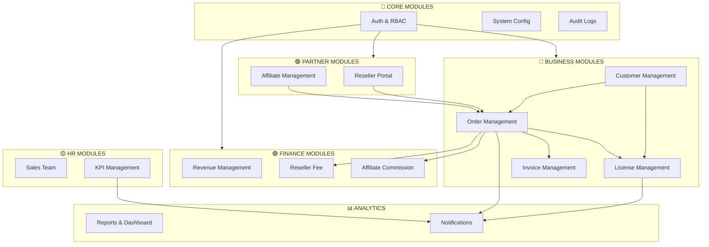
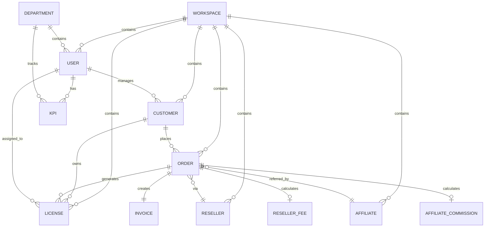
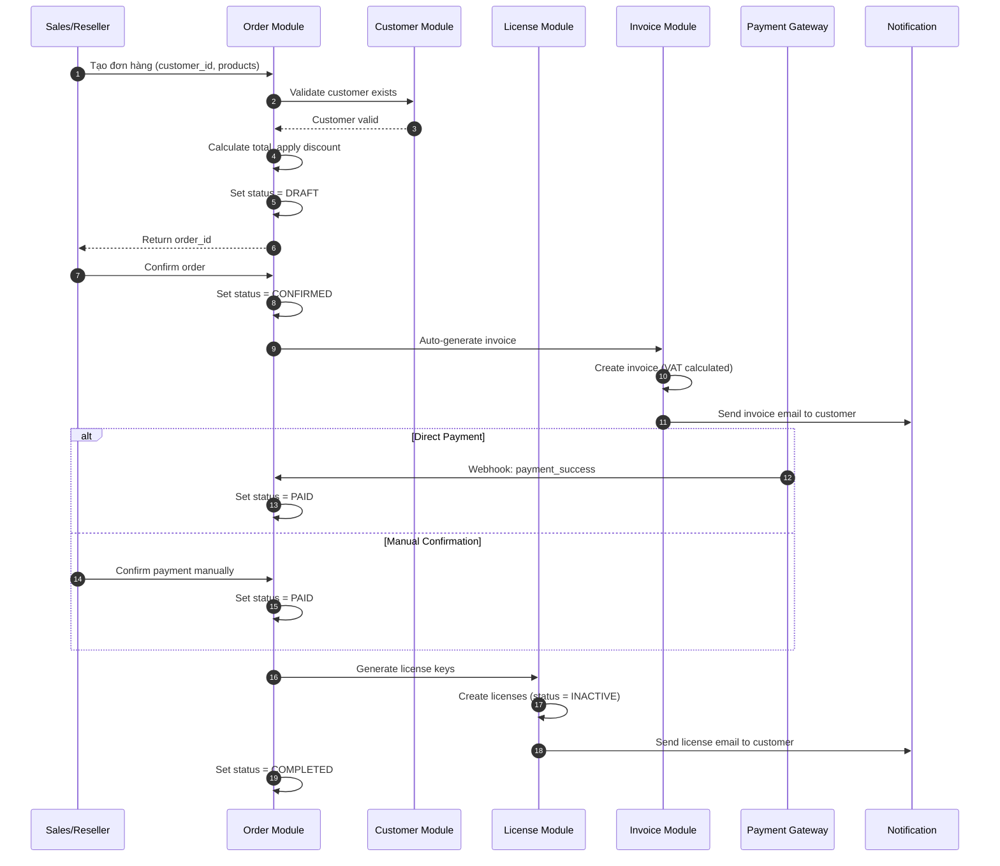
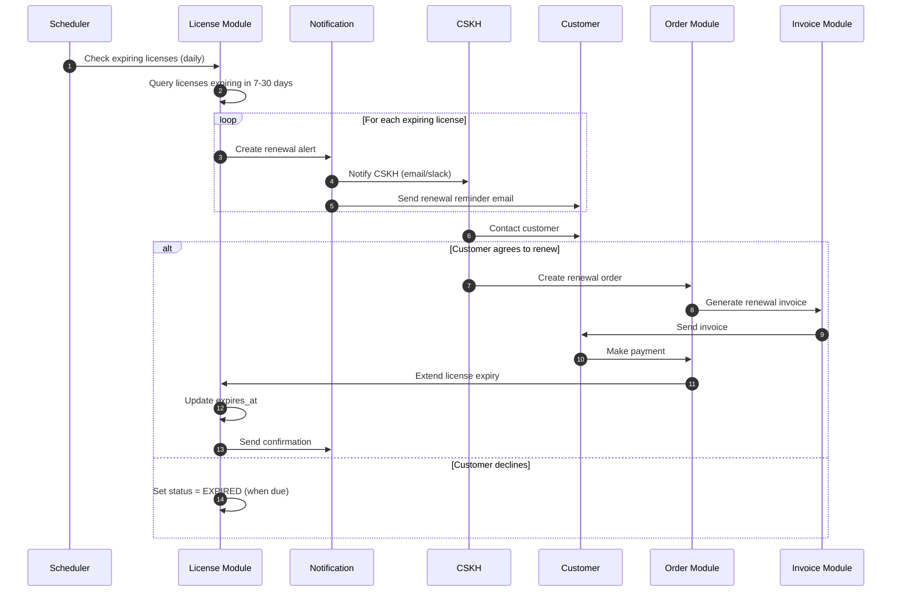
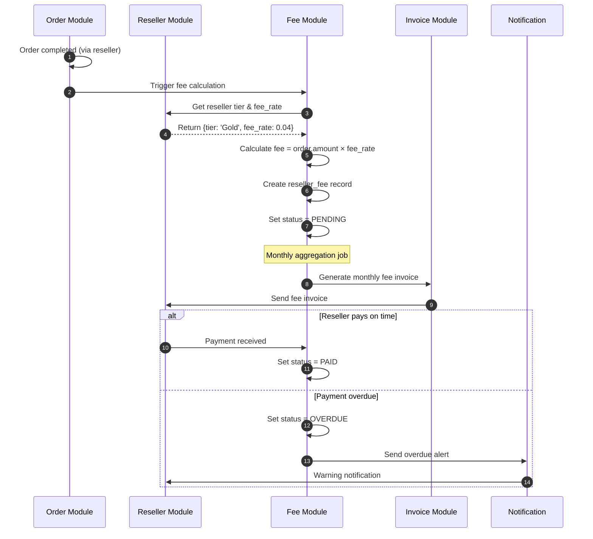
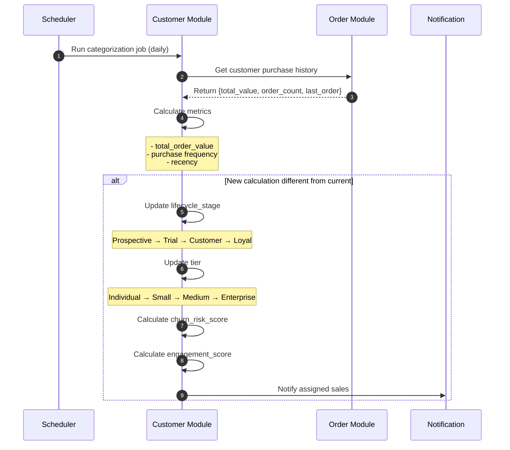
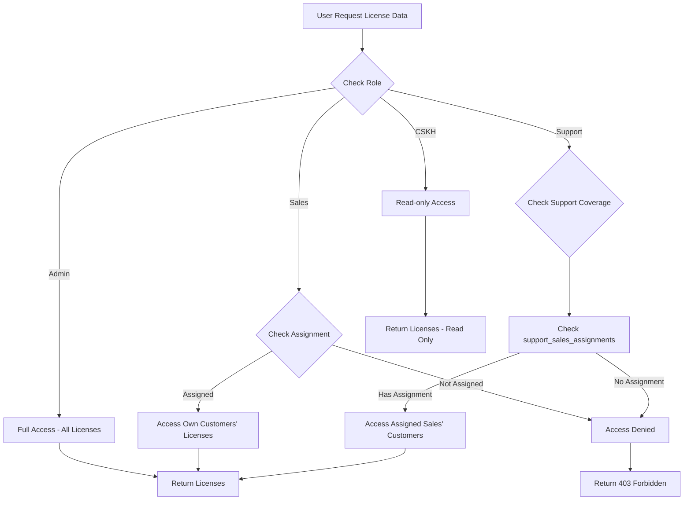
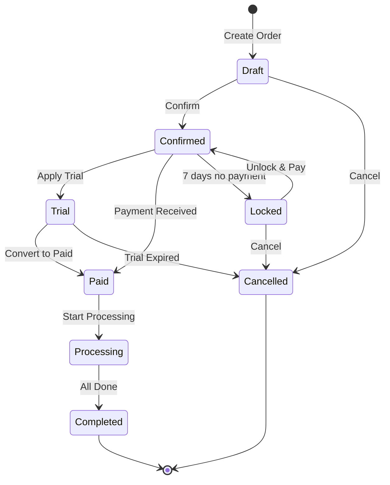
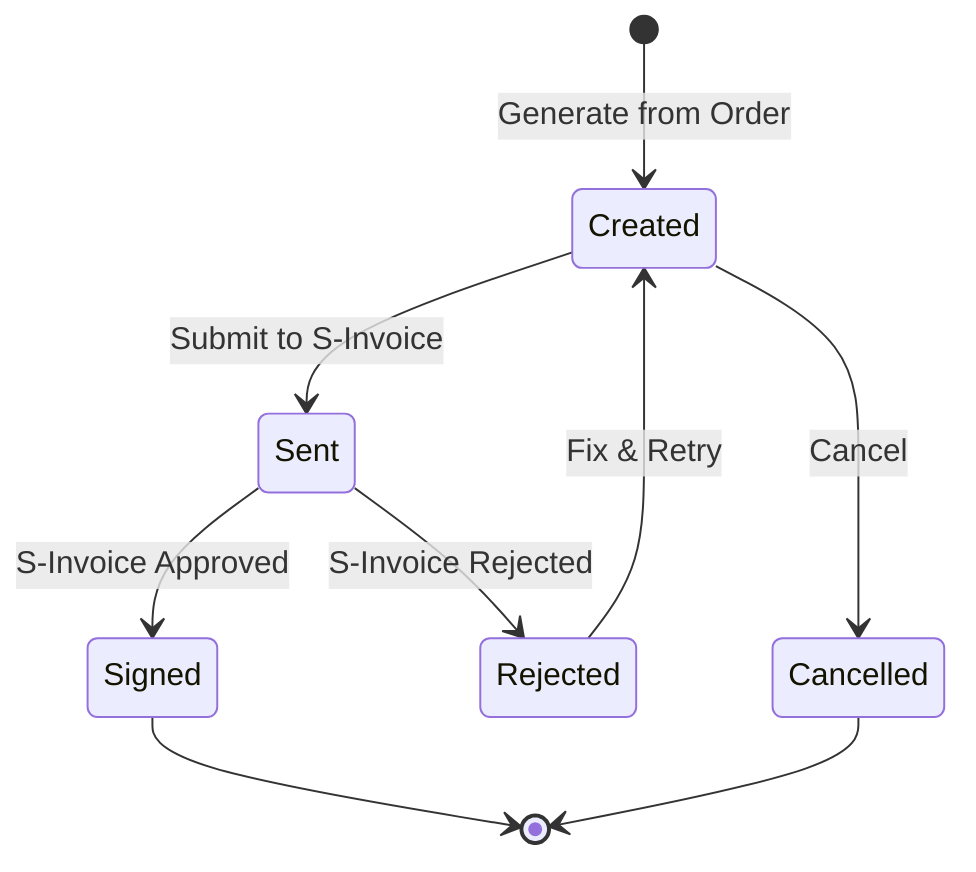

# Tài Liệu Nghiệp Vụ Triển Khai Backend - Hệ Thống CRM MKT

> **Phiên bản:** 1.0  
> **Ngày tạo:** 22/12/2025  
> **Đối tượng:** Backend Developer Team

---

## Mục Lục

1. [Tổng Quan Hệ Thống](#1-tổng-quan-hệ-thống)
2. [Kiến Trúc Module](#2-kiến-trúc-module)
3. [Mối Quan Hệ Giữa Các Module](#3-mối-quan-hệ-giữa-các-module)
4. [Flow Nghiệp Vụ Chính](#4-flow-nghiệp-vụ-chính)
5. [Business Rules & Validation](#5-business-rules--validation)
6. [Event-Driven Architecture](#6-event-driven-architecture)
7. [Checklist Triển Khai](#7-checklist-triển-khai)

---

## 1. Tổng Quan Hệ Thống

### 1.1 Mô Tả

MKT Admin System là nền tảng SaaS sử dụng kiến trúc **monorepo** và **multi-tenant**, quản lý toàn diện vòng đời khách hàng từ lead đến loyal customer, bao gồm bản quyền, đơn hàng, tài chính, và đại lý.

### 1.2 Tech Stack Đề Xuất

```
Backend:       NestJS + TypeORM
Database:      PostgreSQL
Cache:         Redis
Queue:         BullMQ
API:           RESTful + GraphQL
Auth:          JWT + 2FA (OTP)
File Storage:  AWS S3
```

### 1.3 Nguyên Tắc Multi-Tenant

```
┌─────────────────────────────────────────────────────────┐
│                    WORKSPACES                           │
├─────────────────────────────────────────────────────────┤
│  workspace_id là khóa chính cho mọi truy vấn dữ liệu    │
│  Mỗi tenant (MKT hoặc Đại lý) có workspace riêng        │
│  Dữ liệu được cô lập hoàn toàn giữa các workspace       │
└─────────────────────────────────────────────────────────┘
```

---

## 2. Kiến Trúc Module

### 2.1 Sơ Đồ Tổng Quan Module



### 2.2 Phân Lớp Module

| Layer | Module | Responsibility |
|-------|--------|----------------|
| **Core** | Auth, Config, Audit | Xác thực, cấu hình, logging |
| **Domain** | License, Customer, Order, Invoice | Logic nghiệp vụ chính |
| **Finance** | Revenue, Fee, Commission | Quản lý tài chính |
| **Partner** | Reseller, Affiliate | Quản lý đối tác |
| **HR** | Sales, KPI | Quản lý nhân sự |
| **Analytics** | Report, Notification | Báo cáo, thông báo |

---

## 3. Mối Quan Hệ Giữa Các Module

### 3.1 Entity Relationship Overview



### 3.2 Module Dependency Matrix

```
                 │ Auth │ Customer │ License │ Order │ Invoice │ Reseller │ Affiliate │
─────────────────┼──────┼──────────┼─────────┼───────┼─────────┼──────────┼───────────┤
Auth             │  -   │    ←     │    ←    │   ←   │    ←    │    ←     │     ←     │
Customer         │  →   │    -     │    ↔    │   ↔   │    →    │    →     │     →     │
License          │  →   │    ↔     │    -    │   ←   │    →    │    -     │     →     │
Order            │  →   │    ↔     │    →    │   -   │    →    │    ↔     │     ↔     │
Invoice          │  →   │    ←     │    ←    │   ←   │    -    │    -     │     -     │
Reseller         │  →   │    ←     │    -    │   ↔   │    -    │    -     │     -     │
Affiliate        │  →   │    ←     │    ←    │   ↔   │    -    │    -     │     -     │

Legend: → depends on | ← depended by | ↔ bidirectional | - no dependency
```

### 3.3 Data Flow Direction

```
┌──────────────────────────────────────────────────────────────────────┐
│                          DATA FLOW OVERVIEW                          │
├──────────────────────────────────────────────────────────────────────┤
│                                                                      │
│   [Lead/Prospect]                                                    │
│         │                                                            │
│         ▼                                                            │
│   ┌─────────────┐    Auto-assign     ┌─────────────┐                │
│   │  CUSTOMER   │ ◄──────────────────│    SALES    │                │
│   │  Module     │    by rules        │   Module    │                │
│   └──────┬──────┘                    └─────────────┘                │
│          │                                                           │
│          │ places                                                    │
│          ▼                                                           │
│   ┌─────────────┐    generates       ┌─────────────┐                │
│   │   ORDER     │ ──────────────────►│   LICENSE   │                │
│   │   Module    │                    │   Module    │                │
│   └──────┬──────┘                    └─────────────┘                │
│          │                                                           │
│          │ creates                                                   │
│          ▼                                                           │
│   ┌─────────────┐    syncs with      ┌─────────────┐                │
│   │  INVOICE    │ ──────────────────►│  S-INVOICE  │                │
│   │  Module     │                    │  (External) │                │
│   └──────┬──────┘                    └─────────────┘                │
│          │                                                           │
│          │ triggers                                                  │
│          ▼                                                           │
│   ┌─────────────┐                    ┌─────────────┐                │
│   │   REVENUE   │ ◄──────────────────│   PAYMENT   │                │
│   │   Module    │    confirms        │  (External) │                │
│   └─────────────┘                    └─────────────┘                │
│                                                                      │
└──────────────────────────────────────────────────────────────────────┘
```

---

## 4. Flow Nghiệp Vụ Chính

### 4.1 Flow Tạo Đơn Hàng & License



### 4.2 Flow Gia Hạn License



### 4.3 Flow Tính Phí Đại Lý



### 4.4 Flow Phân Loại Khách Hàng Tự Động



### 4.5 Flow Phân Quyền Truy Cập License



### 4.6 Order State Machine



### 4.7 Invoice State Machine



---

## 5. Business Rules & Validation

### 5.1 ID Format Generation

| Entity | Format | Example |
|--------|--------|---------|
| License | LIC-YYYY-NNNNNN | LIC-2025-000001 |
| Customer | CUS-YYYY-NNNNNN | CUS-2025-000001 |
| Order | ORD-YYYY-NNNNNN | ORD-2025-000001 |
| Invoice | INV-YYYY-NNNNNN | INV-2025-000001 |

### 5.2 Validation Rules

| Entity | Field | Rule |
|--------|-------|------|
| Customer | email | Valid email format, unique per workspace |
| Customer | tax_code | 10 or 13 digits, unique if provided |
| Order | amount | Must be >= 0 |
| Order | payment_deadline | Max 7 days from created_at |
| Invoice | total_amount | = amount + (amount × vat_rate) |
| License | expires_at | Must be > activated_at |
| KPI | target_value | Must be > 0 |

### 5.3 Reseller Tier & Fee Structure

| Tier | Fee Rate | Discount Offered | Requirements |
|------|----------|------------------|--------------|
| Bronze (Đồng) | 8% | 5% | Default |
| Silver (Bạc) | 6% | 8% | 50M+ monthly |
| Gold (Vàng) | 4% | 12% | 100M+ monthly |
| Diamond (Kim Cương) | 3% | 15% | 200M+ monthly |

### 5.4 Access Control Matrix

| Resource | Admin | Sales | Support | CSKH | Accountant |
|----------|-------|-------|---------|------|------------|
| All Licenses | CRUD | R (assigned) | R (covered) | R | R |
| All Customers | CRUD | CRUD (assigned) | R (covered) | R | R |
| All Orders | CRUD | CRUD (assigned) | R | R | R |
| All Invoices | CRUD | R | - | - | CRUD |
| Reseller Fees | CRUD | - | - | - | CRUD |
| System Config | CRUD | - | - | - | - |
| Audit Logs | R | - | - | - | - |

### 5.5 KPI Targets by Role

| KPI Type | Sales Rep | Senior Sales | Team Leader | Unit |
|----------|-----------|--------------|-------------|------|
| Revenue | 50M | 100M | 200M | VND/month |
| NewCustomers | 8 | 12 | 20 | count/month |
| ConversionRate | 15% | 20% | 25% | percentage |
| Calls | 100 | 80 | 50 | count/month |
| Demos | 20 | 25 | 15 | count/month |

---

## 6. Event-Driven Architecture

### 6.1 Event Bus Design

```
┌─────────────────────────────────────────────────────────────────┐
│                      EVENT BUS (Redis/BullMQ)                   │
├─────────────────────────────────────────────────────────────────┤
│                                                                 │
│  Producers                          Consumers                   │
│  ─────────                          ─────────                   │
│  Order Module ───┐                  ┌─── Notification Service   │
│  License Module ─┼── EVENTS ────────┼─── Analytics Service      │
│  Customer Module ┤                  ├─── Sync Service           │
│  Payment Gateway ┘                  └─── Email Service          │
│                                                                 │
└─────────────────────────────────────────────────────────────────┘
```

### 6.2 Event Catalog

| Event | Payload | Consumers |
|-------|---------|-----------|
| `order.created` | order_id, customer_id | Analytics, CRM Sync |
| `order.paid` | order_id, amount | License Generator, Invoice |
| `order.completed` | order_id | Fee Calculator, Commission |
| `license.created` | license_id, customer_id | Email (send key) |
| `license.expiring` | license_id, days | Notification (CSKH alert) |
| `license.expired` | license_id | Analytics, Status Update |
| `customer.created` | customer_id | Auto-assign Sales |
| `customer.upgraded` | customer_id, old_tier, new_tier | Notification |
| `invoice.signed` | invoice_id | Email (send PDF) |
| `payment.received` | order_id, amount | Order Status Update |

### 6.3 Scheduled Jobs (CRON)

| Job | Schedule | Description |
|-----|----------|-------------|
| `check-expiring-licenses` | Daily 8:00 | Find licenses expiring in 7-30 days |
| `lock-unpaid-orders` | Hourly | Lock orders unpaid after 7 days |
| `auto-categorize-customers` | Daily 2:00 | Update customer tiers |
| `calculate-kpi-progress` | Daily 23:00 | Update KPI actual values |
| `sync-s-invoice` | Every 30 min | Retry failed invoice submissions |
| `generate-monthly-reports` | 1st of month | Create monthly reports |
| `calculate-reseller-fees` | 1st of month | Generate monthly fee invoices |

---

## 7. Checklist Triển Khai

### 7.1 Phase 1: Foundation (Weeks 1-4)

- [ ] Setup monorepo structure
- [ ] Configure PostgreSQL with multi-tenant schema
- [ ] Implement Auth module (JWT + 2FA)
- [ ] Implement RBAC system
- [ ] Setup Redis + BullMQ
- [ ] Create base entities (Workspace, User, Role)
- [ ] Implement Audit logging

### 7.2 Phase 2: Core Business (Weeks 5-10)

- [ ] Customer module (CRUD, merge, auto-categorize)
- [ ] License module (CRUD, sync, status management)
- [ ] Order module (state machine, calculations)
- [ ] Invoice module (generation, S-Invoice integration)
- [ ] Payment integration (Sepay, PayPal)

### 7.3 Phase 3: Partners & Finance (Weeks 11-14)

- [ ] Reseller module (subdomain routing, white-label)
- [ ] Affiliate module (tracking, commission)
- [ ] Fee calculation system
- [ ] Revenue reporting

### 7.4 Phase 4: HR & Analytics (Weeks 15-18)

- [ ] Sales team management
- [ ] KPI tracking system
- [ ] Dashboard APIs
- [ ] Custom report builder
- [ ] Notification system (email, Slack, push)

### 7.5 Phase 5: Polish & Launch (Weeks 19-24)

- [ ] Performance optimization
- [ ] Security audit
- [ ] Load testing (1000 concurrent users)
- [ ] Documentation
- [ ] UAT & bug fixes
- [ ] Production deployment

---

## Appendix A: Database Index Recommendations

```sql
-- High-frequency queries
CREATE INDEX idx_licenses_workspace_status ON licenses(workspace_id, status);
CREATE INDEX idx_licenses_customer ON licenses(customer_id);
CREATE INDEX idx_licenses_expires ON licenses(expires_at) WHERE status = 'Active';
CREATE INDEX idx_licenses_sales ON licenses(sales_id);

CREATE INDEX idx_customers_workspace_email ON customers(workspace_id, email);
CREATE INDEX idx_customers_sales ON customers(sales_id);
CREATE INDEX idx_customers_stage ON customers(lifecycle_stage);

CREATE INDEX idx_orders_workspace_status ON orders(workspace_id, status);
CREATE INDEX idx_orders_customer ON orders(customer_id);
CREATE INDEX idx_orders_reseller ON orders(reseller_id);

CREATE INDEX idx_audit_entity ON audit_logs(entity_type, entity_id);
CREATE INDEX idx_audit_user ON audit_logs(user_id, created_at);
```

---

> **Ghi chú:** Tài liệu này là baseline để team backend triển khai. Các chi tiết API request/response schema sẽ được bổ sung trong OpenAPI Specification riêng.
