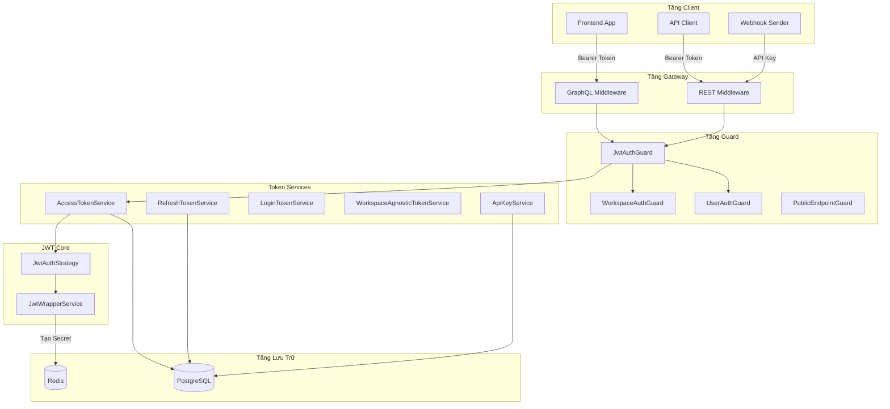
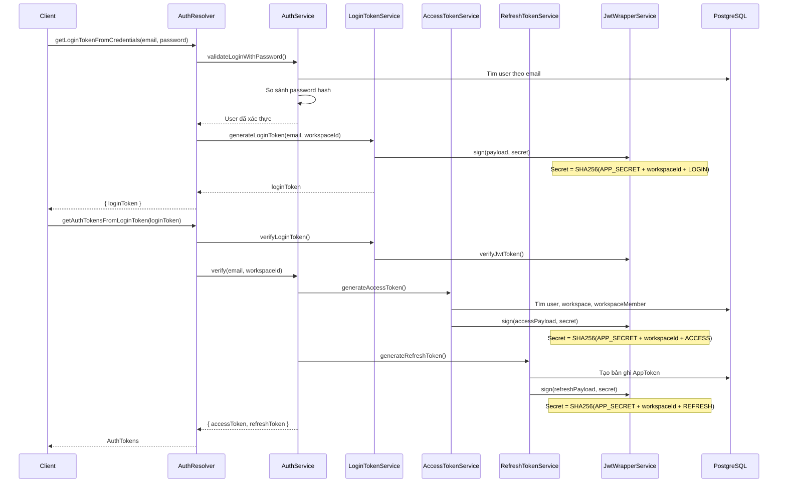
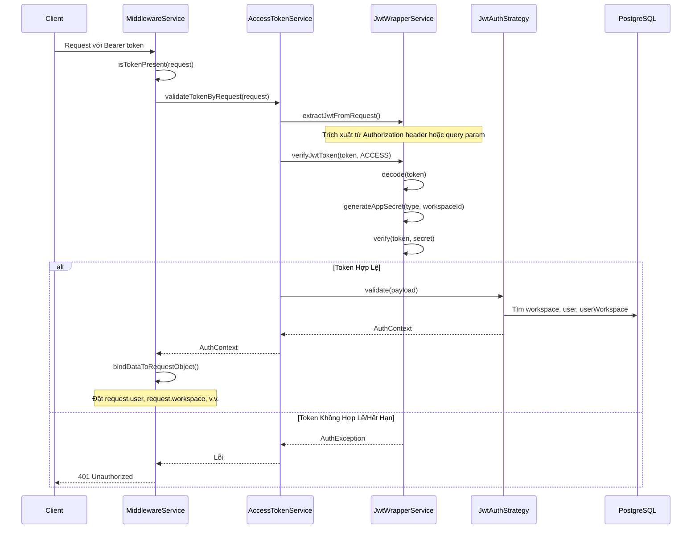
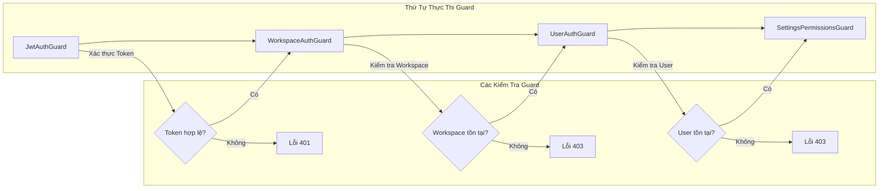
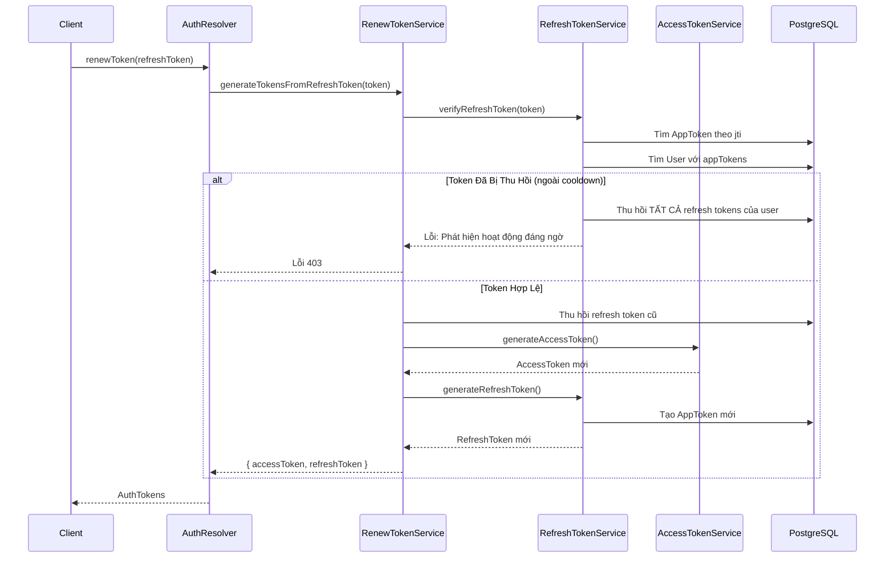
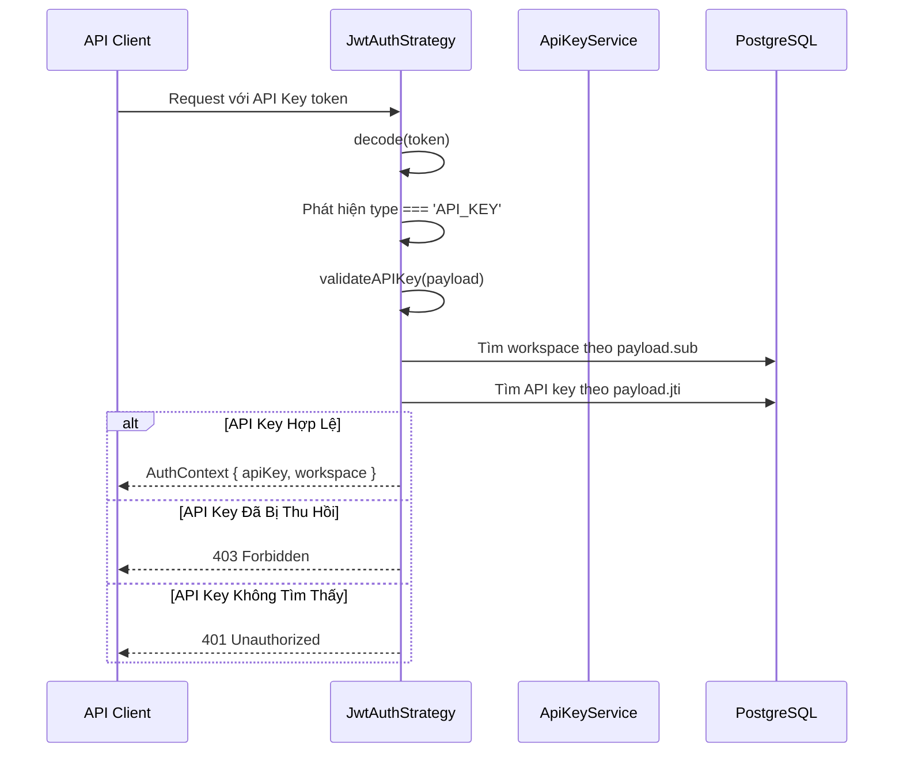
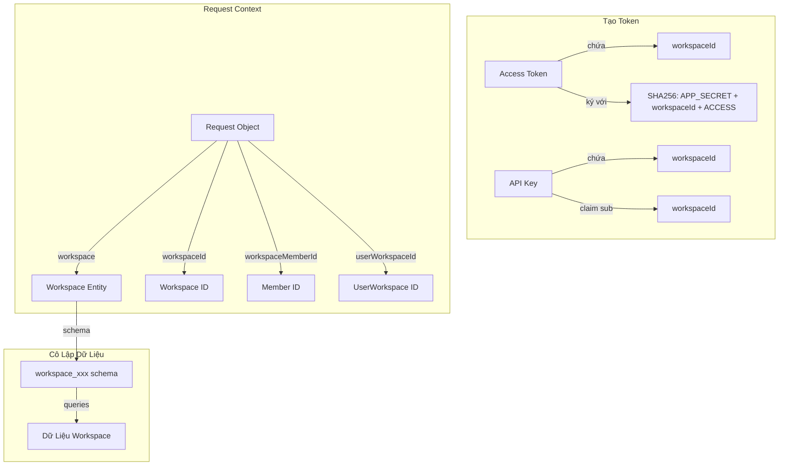
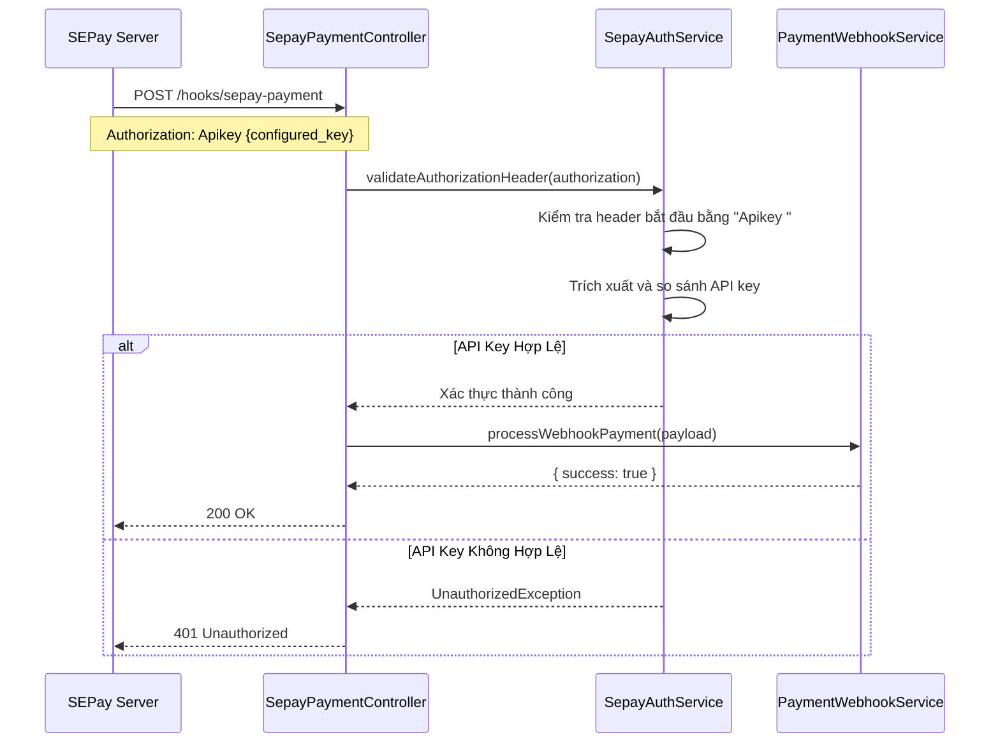
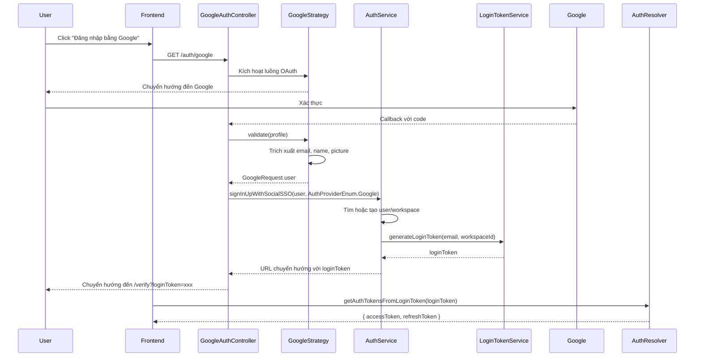

# Token Authentication Architecture - Twenty CRM

## 1. Tóm Tắt

- **Vấn đề**: Twenty CRM cần một hệ thống authentication đa dạng, hỗ trợ nhiều loại token khác nhau để phục vụ các use cases: user login, API access, workspace switching, và webhook authentication.
- **Giải pháp**: Sử dụng JWT-based authentication với workspace-specific secrets, multi-token strategy (Access, Refresh, Login, API Key, Workspace Agnostic), và layered guards system.
- **Tác động**: Hệ thống linh hoạt, bảo mật cao với token isolation theo workspace, hỗ trợ multi-tenancy tốt.

## 2. Tổng Quan Các Loại Token

### 2.1 Bảng Tóm Tắt Các Loại Token

| Loại Token | Mục đích | TTL (Mặc định) | Lưu trữ | Phạm vi |
|------------|----------|----------------|---------|---------|
| `ACCESS` | Xác thực truy cập API | 30 phút | Client-side | Theo Workspace |
| `REFRESH` | Làm mới access token | 60 ngày | Database (AppToken) | Theo Workspace |
| `LOGIN` | Xác minh ngắn hạn sau password/OAuth | 15 phút | Memory | Theo Workspace |
| `WORKSPACE_AGNOSTIC` | Xác thực user không cần workspace context | 30 phút | Client-side | Cấp User |
| `API_KEY` | Truy cập API lập trình | 100 năm (có thể cấu hình) | Database (ApiKey) | Theo Workspace `|`
| `FILE` | Token truy cập file | 1 ngày | Memory | Theo Workspace |

### 2.2 Cấu Trúc JWT Payload

```typescript
// File: packages/twenty-server/src/engine/core-modules/auth/types/auth-context.type.ts
// Dòng: 78-84

// Access Token Payload
type AccessTokenJwtPayload = {
  sub: string;           // User ID
  type: 'ACCESS';
  workspaceId: string;
  userId: string;
  workspaceMemberId?: string;
  userWorkspaceId: string;
  authProvider?: AuthProviderEnum;
};

// Refresh Token Payload
type RefreshTokenJwtPayload = {
  sub: string;           // User ID
  type: 'REFRESH';
  workspaceId?: string;
  userId: string;
  jti?: string;          // Token ID (lưu trong bảng AppToken)
  authProvider?: AuthProviderEnum;
  targetedTokenType: JwtTokenTypeEnum;
};

// API Key Token Payload
type ApiKeyTokenJwtPayload = {
  sub: string;           // Workspace ID
  type: 'API_KEY';
  workspaceId: string;
  workspaceMemberId?: string;
  jti?: string;          // API Key ID
};

// Workspace Agnostic Token Payload
type WorkspaceAgnosticTokenJwtPayload = {
  sub: string;           // User ID
  type: 'WORKSPACE_AGNOSTIC';
  userId: string;
  authProvider: AuthProviderEnum;
};

// Login Token Payload
type LoginTokenJwtPayload = {
  sub: string;           // Email
  type: 'LOGIN';
  workspaceId: string;
  authProvider?: AuthProviderEnum;
};
```

## 3. Tổng Quan Kiến Trúc

### 3.1 Sơ Đồ Kiến Trúc Tổng Thể



### 3.2 Bảng Mô Tả Các Component

| Component | Đường dẫn File | Trách nhiệm |
|-----------|----------------|-------------|
| `JwtWrapperService` | `packages/twenty-server/src/engine/core-modules/jwt/services/jwt-wrapper.service.ts` | Ký/xác minh JWT, tạo secret |
| `JwtAuthStrategy` | `packages/twenty-server/src/engine/core-modules/auth/strategies/jwt.auth.strategy.ts` | Passport strategy, xác thực token |
| `AccessTokenService` | `packages/twenty-server/src/engine/core-modules/auth/token/services/access-token.service.ts` | Tạo/xác thực access token |
| `RefreshTokenService` | `packages/twenty-server/src/engine/core-modules/auth/token/services/refresh-token.service.ts` | Quản lý refresh token |
| `LoginTokenService` | `packages/twenty-server/src/engine/core-modules/auth/token/services/login-token.service.ts` | Tạo login token |
| `ApiKeyService` | `packages/twenty-server/src/engine/core-modules/api-key/api-key.service.ts` | CRUD API key và tạo token |
| `MiddlewareService` | `packages/twenty-server/src/engine/middlewares/middleware.service.ts` | Hydrate request từ token |

## 4. Luồng Tạo Token

### 4.1 Luồng Đăng Nhập User (Password)



### 4.2 Chi Tiết Tạo Access Token

```typescript
// File: packages/twenty-server/src/engine/core-modules/auth/token/services/access-token.service.ts
// Dòng: 47-127

async generateAccessToken({
  userId,
  workspaceId,
  authProvider,
}): Promise<AuthToken> {
  // 1. Lấy cấu hình expiration (mặc định: 30 phút)
  const expiresIn = this.twentyConfigService.get('ACCESS_TOKEN_EXPIRES_IN');
  const expiresAt = addMilliseconds(new Date().getTime(), ms(expiresIn));

  // 2. Xác thực user tồn tại
  const user = await this.userRepository.findOne({ where: { id: userId } });
  userValidator.assertIsDefinedOrThrow(user);

  // 3. Lấy workspace và xác thực user membership
  const workspace = await this.workspaceRepository.findOne({ where: { id: workspaceId } });
  const workspaceMember = await workspaceMemberRepository.findOne({
    where: { userId: user.id },
  });

  // 4. Xây dựng JWT payload
  const jwtPayload: AccessTokenJwtPayload = {
    sub: user.id,
    userId: user.id,
    workspaceId,
    workspaceMemberId: workspaceMember.id,
    userWorkspaceId: userWorkspace.id,
    type: JwtTokenTypeEnum.ACCESS,
    authProvider,
  };

  // 5. Tạo workspace-specific secret và ký
  return {
    token: this.jwtWrapperService.sign(jwtPayload, {
      secret: this.jwtWrapperService.generateAppSecret(
        JwtTokenTypeEnum.ACCESS,
        workspaceId,  // Cô lập theo Workspace
      ),
      expiresIn,
    }),
    expiresAt,
  };
}
```

### 4.3 Cơ Chế Tạo Secret

```typescript
// File: packages/twenty-server/src/engine/core-modules/jwt/services/jwt-wrapper.service.ts
// Dòng: 127-137

generateAppSecret(type: JwtTokenTypeEnum, appSecretBody: string): string {
  const appSecret = this.twentyConfigService.get('APP_SECRET');

  // Secret tổng hợp = SHA256(APP_SECRET + workspaceId/userId + tokenType)
  return createHash('sha256')
    .update(`${appSecret}${appSecretBody}${type}`)
    .digest('hex');
}
```

**Lợi ích Bảo mật**:
- Mỗi workspace có signing secret riêng biệt
- Token type được bao gồm trong secret ngăn chặn việc sử dụng chéo loại token
- Xâm phạm một workspace không ảnh hưởng đến các workspace khác

## 5. Luồng Xác Thực Token

### 5.1 Xác Thực Dựa Trên Middleware



### 5.2 Logic Xác Thực JWT Strategy

```typescript
// File: packages/twenty-server/src/engine/core-modules/auth/strategies/jwt.auth.strategy.ts
// Dòng: 190-209

async validate(payload: JwtPayload): Promise<AuthContext> {
  // Xử lý API Key tokens
  if (payload.type === 'API_KEY' || this.isLegacyApiKeyPayload(payload)) {
    return await this.validateAPIKey(payload);
  }

  // Xử lý Workspace Agnostic tokens
  if (payload.type === 'WORKSPACE_AGNOSTIC') {
    return await this.validateWorkspaceAgnosticToken(payload);
  }

  // Xử lý Access tokens (mặc định)
  if (payload.type === 'ACCESS' || !payload.type) {
    return await this.validateAccessToken(payload);
  }

  throw new AuthException('Token không hợp lệ', AuthExceptionCode.INVALID_JWT_TOKEN_TYPE);
}
```

### 5.3 Chuỗi Guards



## 6. Cơ Chế Làm Mới Token

### 6.1 Luồng Refresh Token



### 6.2 Tính Năng Bảo Mật Refresh Token

```typescript
// File: packages/twenty-server/src/engine/core-modules/auth/token/services/refresh-token.service.ts
// Dòng: 36-107

async verifyRefreshToken(refreshToken: string) {
  const coolDown = this.twentyConfigService.get('REFRESH_TOKEN_COOL_DOWN'); // 1 phút

  // Xác minh chữ ký JWT và thời hạn
  await this.jwtWrapperService.verifyJwtToken(refreshToken, JwtTokenTypeEnum.REFRESH);
  const jwtPayload = this.jwtWrapperService.decode<RefreshTokenJwtPayload>(refreshToken);

  // Kiểm tra token tồn tại trong database
  const token = await this.appTokenRepository.findOneBy({ id: jwtPayload.jti });
  if (!token) {
    throw new AuthException("Refresh token này không tồn tại");
  }

  // BẢO MẬT: Phát hiện tấn công tái sử dụng token
  // Nếu token đã bị thu hồi nhưng được sử dụng lại sau thời gian cooldown,
  // giả định là tấn công và thu hồi TẤT CẢ tokens của user
  if (token.revokedAt && token.revokedAt.getTime() <= Date.now() - ms(coolDown)) {
    // Thu hồi tất cả refresh tokens của user
    await Promise.all(
      user.appTokens.map(async ({ id, type }) => {
        if (type === AppTokenType.RefreshToken) {
          await this.appTokenRepository.update({ id }, { revokedAt: new Date() });
        }
      }),
    );
    throw new AuthException('Phát hiện hoạt động đáng ngờ, tất cả tokens đã bị thu hồi');
  }

  return { user, token, authProvider, targetedTokenType };
}
```

## 7. Xác Thực API Key

### 7.1 Entity API Key

```typescript
// File: packages/twenty-server/src/engine/core-modules/api-key/api-key.entity.ts

@Entity({ name: 'apiKey', schema: 'core' })
export class ApiKey {
  @PrimaryGeneratedColumn('uuid')
  id: string;

  @Column()
  name: string;

  @Column({ type: 'timestamptz' })
  expiresAt: Date;

  @Column({ type: 'timestamptz', nullable: true })
  revokedAt?: Date | null;

  @Column('uuid')
  workspaceId: string;

  @ManyToOne(() => Workspace, (workspace) => workspace.apiKeys)
  workspace: Relation<Workspace>;
}
```

### 7.2 Tạo Token API Key

```typescript
// File: packages/twenty-server/src/engine/core-modules/api-key/api-key.service.ts
// Dòng: 112-152

async generateApiKeyToken(
  workspaceId: string,
  apiKeyId?: string,
  expiresAt?: Date | string,
): Promise<Pick<ApiKeyToken, 'token'> | undefined> {
  // Xác thực API key tồn tại và chưa bị thu hồi/hết hạn
  await this.validateApiKey(apiKeyId, workspaceId);

  const secret = this.jwtWrapperService.generateAppSecret(
    JwtTokenTypeEnum.ACCESS,  // Sử dụng loại ACCESS cho secret
    workspaceId,
  );

  // Tính toán thời hạn (mặc định: 100 năm)
  let expiresIn = expiresAt
    ? Math.floor((new Date(expiresAt).getTime() - Date.now()) / 1000)
    : '100y';

  const token = this.jwtWrapperService.sign(
    {
      sub: workspaceId,      // Lưu ý: sub là workspaceId, không phải userId
      type: JwtTokenTypeEnum.API_KEY,
      workspaceId,
    },
    {
      secret,
      expiresIn,
      jwtid: apiKeyId,       // API Key ID được lưu trong claim jti
    },
  );

  return { token };
}
```

### 7.3 Xác Thực API Key



## 8. Workspace & Multi-tenancy

### 8.1 Workspace Context Trong Token



### 8.2 Hydrate Request Object

```typescript
// File: packages/twenty-server/src/engine/middlewares/middleware.service.ts
// Dòng: 152-171

private bindDataToRequestObject(
  data: AuthContext,
  request: Request,
  metadataVersion: number | undefined,
) {
  request.user = data.user;
  request.apiKey = data.apiKey;
  request.userWorkspace = data.userWorkspace;
  request.workspace = data.workspace;
  request.workspaceId = data.workspace?.id;
  request.workspaceMetadataVersion = metadataVersion;
  request.workspaceMemberId = data.workspaceMemberId;
  request.userWorkspaceId = data.userWorkspaceId;
  request.authProvider = data.authProvider;
  request.locale = data.userWorkspace?.locale ??
    request.headers['x-locale'] ?? SOURCE_LOCALE;
}
```

## 9. Các Trường Hợp Đặc Biệt

### 9.1 Public Endpoints

```typescript
// File: packages/twenty-server/src/engine/guards/public-endpoint.guard.ts

@Injectable()
export class PublicEndpointGuard implements CanActivate {
  canActivate(_context: ExecutionContext): boolean {
    // Luôn cho phép truy cập - đánh dấu rõ ràng cho public endpoints
    return true;
  }
}

// Sử dụng trong resolver
@UseGuards(PublicEndpointGuard)
@Query(() => CheckUserExistOutput)
async checkUserExists(@Args() input: EmailAndCaptchaInput) {
  return await this.authService.checkUserExists(input.email);
}
```

### 9.2 Xác Thực Webhook (SEPay)



```typescript
// File: packages/twenty-server/src/mkt-core/payment/services/sepay/sepay-auth.service.ts
// Dòng: 61-88

validateAuthorizationHeader(authorization: string | undefined): void {
  if (!authorization) {
    throw new UnauthorizedException('Header Authorization là bắt buộc');
  }

  if (!authorization.startsWith('Apikey ')) {
    throw new UnauthorizedException('Header Authorization phải bắt đầu bằng "Apikey "');
  }

  const apiKey = authorization.substring('Apikey '.length).trim();

  if (!this.isValidApiKey(apiKey)) {
    throw new UnauthorizedException('API key không hợp lệ');
  }
}

private isValidApiKey(apiKey: string): boolean {
  const validApiKey = this.config.sepay.webhookApiKey;
  return apiKey === validApiKey;
}
```

### 9.3 Luồng OAuth2 (Google/Microsoft)



## 10. Các Cân Nhắc Bảo Mật

### 10.1 Tính Năng Bảo Mật Token

| Tính năng | Triển khai | Tham chiếu File |
|-----------|------------|-----------------|
| Workspace-scoped secrets | `SHA256(APP_SECRET + workspaceId + tokenType)` | jwt-wrapper.service.ts:127-137 |
| Token type trong secret | Ngăn chặn sử dụng chéo loại token | jwt-wrapper.service.ts:135 |
| Xoay vòng refresh token | Token cũ bị thu hồi khi refresh | renew-token.service.ts:46-54 |
| Phát hiện tái sử dụng token | Thu hồi tất cả tokens nếu phát hiện tái sử dụng | refresh-token.service.ts:77-99 |
| Mã hóa password | bcrypt với salt rounds | auth.util.ts |
| Login tokens ngắn hạn | Mặc định 15 phút | config-variables.ts:265 |

### 10.2 Lỗi Xác Thực

```typescript
// File: packages/twenty-server/src/engine/core-modules/auth/auth.exception.ts

export enum AuthExceptionCode {
  USER_NOT_FOUND = 'USER_NOT_FOUND',
  WORKSPACE_NOT_FOUND = 'WORKSPACE_NOT_FOUND',
  USER_WORKSPACE_NOT_FOUND = 'USER_WORKSPACE_NOT_FOUND',
  INVALID_INPUT = 'INVALID_INPUT',
  FORBIDDEN_EXCEPTION = 'FORBIDDEN_EXCEPTION',
  UNAUTHENTICATED = 'UNAUTHENTICATED',
  INVALID_JWT_TOKEN_TYPE = 'INVALID_JWT_TOKEN_TYPE',
  EMAIL_NOT_VERIFIED = 'EMAIL_NOT_VERIFIED',
  CLIENT_NOT_FOUND = 'CLIENT_NOT_FOUND',
  INTERNAL_SERVER_ERROR = 'INTERNAL_SERVER_ERROR',
}
```

### 10.3 Các Thực Hành Tốt Đã Triển Khai

1. **Cô Lập Token**: Mỗi workspace có signing secret riêng
2. **Token Ngắn Hạn**: Access tokens hết hạn sau 30 phút theo mặc định
3. **Theo Dõi Refresh Token**: Lưu trữ trong database để có khả năng thu hồi
4. **Phát Hiện Hoạt Động Đáng Ngờ**: Tự động thu hồi token khi phát hiện tái sử dụng
5. **Xác Thực Password**: Kiểm tra độ mạnh dựa trên regex
6. **Hỗ Trợ 2FA**: Xác thực hai yếu tố dựa trên OTP

## 11. Các Biến Cấu Hình

```typescript
// File: packages/twenty-server/src/engine/core-modules/twenty-config/config-variables.ts

// Cài Đặt Thời Hạn Token
ACCESS_TOKEN_EXPIRES_IN = '30m';
REFRESH_TOKEN_EXPIRES_IN = '60d';
LOGIN_TOKEN_EXPIRES_IN = '15m';
WORKSPACE_AGNOSTIC_TOKEN_EXPIRES_IN = '30m';
FILE_TOKEN_EXPIRES_IN = '1d';
INVITATION_TOKEN_EXPIRES_IN = '30d';
SHORT_TERM_TOKEN_EXPIRES_IN = '5m';

// Cài Đặt Bảo Mật
REFRESH_TOKEN_COOL_DOWN = '1m';
APP_SECRET = // Bắt buộc, dùng để tạo secret
ACCESS_TOKEN_SECRET = // Cũ, đã deprecated
```

## 12. Schema Database

### 12.1 Entity AppToken

```typescript
// File: packages/twenty-server/src/engine/core-modules/app-token/app-token.entity.ts

@Entity({ name: 'appToken', schema: 'core' })
export class AppToken {
  id: string;           // UUID
  userId: string | null;
  workspaceId: string;
  type: AppTokenType;   // REFRESH_TOKEN, INVITATION_TOKEN, v.v.
  value: string;        // Giá trị token cho non-JWT tokens
  expiresAt: Date;
  deletedAt: Date | null;
  revokedAt: Date | null;
  context: { email: string } | null;
}

export enum AppTokenType {
  RefreshToken = 'REFRESH_TOKEN',
  CodeChallenge = 'CODE_CHALLENGE',
  AuthorizationCode = 'AUTHORIZATION_CODE',
  PasswordResetToken = 'PASSWORD_RESET_TOKEN',
  InvitationToken = 'INVITATION_TOKEN',
  EmailVerificationToken = 'EMAIL_VERIFICATION_TOKEN',
}
```

### 12.2 Entity ApiKey

```typescript
// File: packages/twenty-server/src/engine/core-modules/api-key/api-key.entity.ts

@Entity({ name: 'apiKey', schema: 'core' })
export class ApiKey {
  id: string;
  name: string;
  expiresAt: Date;
  revokedAt?: Date | null;
  workspaceId: string;
  createdAt: Date;
  updatedAt: Date;
}
```

## 13. Xử Lý Lỗi

### 13.1 Xử Lý Lỗi JWT

```typescript
// File: packages/twenty-server/src/engine/core-modules/jwt/services/jwt-wrapper.service.ts
// Dòng: 107-124

try {
  return this.jwtService.verify(token, { secret });
} catch (error) {
  if (error instanceof jwt.TokenExpiredError) {
    throw new AuthException('Token đã hết hạn.', AuthExceptionCode.UNAUTHENTICATED);
  } else if (error instanceof jwt.JsonWebTokenError) {
    throw new AuthException('Token không hợp lệ.', AuthExceptionCode.UNAUTHENTICATED);
  } else {
    throw new AuthException('Lỗi token không xác định.', AuthExceptionCode.INVALID_INPUT);
  }
}
```

## 14. Tham Chiếu File

| Component | Đường dẫn File |
|-----------|----------------|
| JWT Wrapper Service | `packages/twenty-server/src/engine/core-modules/jwt/services/jwt-wrapper.service.ts` |
| JWT Auth Strategy | `packages/twenty-server/src/engine/core-modules/auth/strategies/jwt.auth.strategy.ts` |
| Access Token Service | `packages/twenty-server/src/engine/core-modules/auth/token/services/access-token.service.ts` |
| Refresh Token Service | `packages/twenty-server/src/engine/core-modules/auth/token/services/refresh-token.service.ts` |
| Login Token Service | `packages/twenty-server/src/engine/core-modules/auth/token/services/login-token.service.ts` |
| Renew Token Service | `packages/twenty-server/src/engine/core-modules/auth/token/services/renew-token.service.ts` |
| Workspace Agnostic Token Service | `packages/twenty-server/src/engine/core-modules/auth/token/services/workspace-agnostic-token.service.ts` |
| API Key Service | `packages/twenty-server/src/engine/core-modules/api-key/api-key.service.ts` |
| API Key Entity | `packages/twenty-server/src/engine/core-modules/api-key/api-key.entity.ts` |
| AppToken Entity | `packages/twenty-server/src/engine/core-modules/app-token/app-token.entity.ts` |
| Auth Service | `packages/twenty-server/src/engine/core-modules/auth/services/auth.service.ts` |
| Auth Resolver | `packages/twenty-server/src/engine/core-modules/auth/auth.resolver.ts` |
| Middleware Service | `packages/twenty-server/src/engine/middlewares/middleware.service.ts` |
| JwtAuthGuard | `packages/twenty-server/src/engine/guards/jwt-auth.guard.ts` |
| WorkspaceAuthGuard | `packages/twenty-server/src/engine/guards/workspace-auth.guard.ts` |
| UserAuthGuard | `packages/twenty-server/src/engine/guards/user-auth.guard.ts` |
| PublicEndpointGuard | `packages/twenty-server/src/engine/guards/public-endpoint.guard.ts` |
| Auth Context Types | `packages/twenty-server/src/engine/core-modules/auth/types/auth-context.type.ts` |
| Config Variables | `packages/twenty-server/src/engine/core-modules/twenty-config/config-variables.ts` |
| SEPay Auth Service | `packages/twenty-server/src/mkt-core/payment/services/sepay/sepay-auth.service.ts` |
| SEPay Controller | `packages/twenty-server/src/mkt-core/payment/sepay-payment/sepay-payment.controller.ts` |
| Google Auth Controller | `packages/twenty-server/src/engine/core-modules/auth/controllers/google-auth.controller.ts` |
| Google Auth Strategy | `packages/twenty-server/src/engine/core-modules/auth/strategies/google.auth.strategy.ts` |

## 15. Tổng Kết

Twenty CRM triển khai một hệ thống xác thực mạnh mẽ, hỗ trợ multi-tenant với:

1. **Nhiều Loại Token**: Access, Refresh, Login, API Key, Workspace Agnostic tokens cho các use cases khác nhau
2. **Cô Lập Workspace**: Mỗi workspace có signing secrets riêng thông qua composite hash
3. **Bảo Mật Refresh Token**: Tokens được theo dõi trong database với phát hiện tái sử dụng và thu hồi tự động
4. **Chuỗi Guards Đa Tầng**: JwtAuthGuard → WorkspaceAuthGuard → UserAuthGuard
5. **Hỗ Trợ OAuth2**: Tích hợp Google, Microsoft, và SSO
6. **Xác Thực Webhook**: Xác thực dựa trên API key cho các dịch vụ bên ngoài như SEPay
7. **Thời Hạn Có Thể Cấu Hình**: Tất cả TTL của token có thể cấu hình qua biến môi trường
