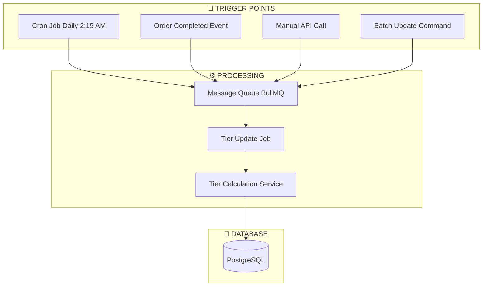
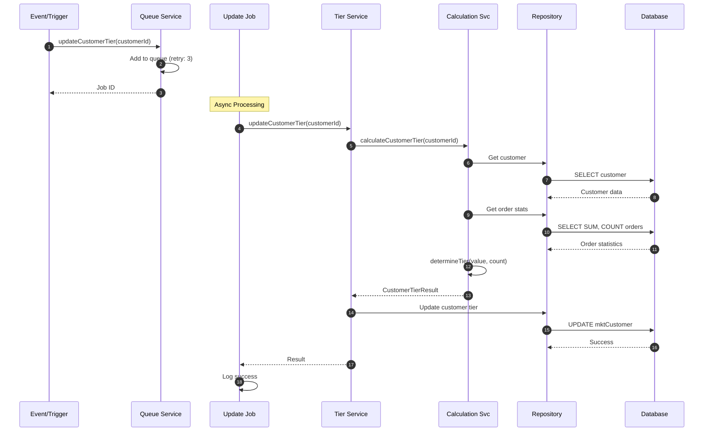
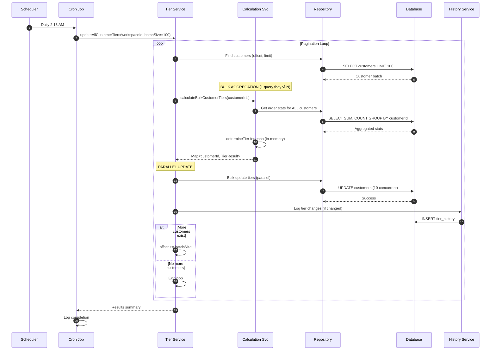
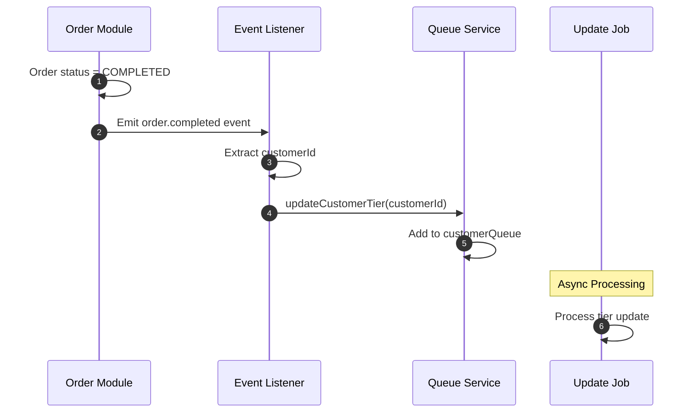
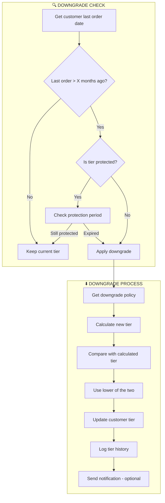

# Thiết Kế Hệ Thống Cập Nhật Customer Tier

> **Phiên bản:** 2.0
> **Ngày tạo:** 23/12/2024
> **Cập nhật:** 23/12/2024
> **Module:** `mkt-core/customer`

---

## Mục Lục

1. [Tổng Quan](#1-tổng-quan)
2. [Kiến Trúc Hệ Thống](#2-kiến-trúc-hệ-thống)
3. [Thiết Kế Chi Tiết](#3-thiết-kế-chi-tiết)
4. [Flow Cập Nhật Tier](#4-flow-cập-nhật-tier)
5. [Tier History & Audit](#5-tier-history--audit)
6. [Tier Downgrade Policy](#6-tier-downgrade-policy)
7. [Performance Optimization](#7-performance-optimization)
8. [Best Practices](#8-best-practices)
9. [Hướng Dẫn Triển Khai](#9-hướng-dẫn-triển-khai)
10. [Monitoring & Alerts](#10-monitoring--alerts)

---

## 1. Tổng Quan

### 1.1 Mục Đích

Hệ thống Customer Tier tự động phân loại khách hàng dựa trên:
- **Tổng giá trị đơn hàng** (totalOrderValue)
- **Số lượng đơn hàng hoàn thành** (totalOrderCount)

### 1.2 Các Tier Khách Hàng

| Tier | Min Spending (VND) | Min Orders | Mô Tả |
|------|-------------------|------------|-------|
| DIAMOND | 10,000,000 | 20 | Khách hàng VIP cao cấp nhất |
| GOLD | 5,000,000 | 10 | Khách hàng trung thành cao |
| SILVER | 2,000,000 | 5 | Khách hàng ổn định |
| BRONZE | 500,000 | 1 | Khách hàng mới/cơ bản |
| DORMANT | N/A | N/A | Khách hàng không hoạt động |
| CHURNED | N/A | N/A | Khách hàng đã rời bỏ |

### 1.3 Lifecycle Stage (Vòng Đời)

| Stage | Điều Kiện | Mô Tả |
|-------|-----------|-------|
| PROSPECTIVE | Chưa có đơn hàng | Khách hàng tiềm năng |
| TRIAL | Có đơn chưa hoàn thành | Đang dùng thử |
| CUSTOMER | Có đơn hoàn thành | Khách hàng thực |
| LOYAL | ≥5 đơn AND ≥5M VND | Khách hàng trung thành |
| RETENTION | 90-180 ngày không mua | Cần giữ chân |
| CHURNED | >180 ngày không mua | Đã rời bỏ |

---

## 2. Kiến Trúc Hệ Thống

### 2.1 Cấu Trúc File

```
packages/twenty-server/src/mkt-core/customer/
├── constants/
│   ├── mkt-customer.constant.ts              # Tier definitions, thresholds
│   ├── mkt-customer-tier.constants.ts        # Cron pattern, downgrade policy
│   └── mkt-customer-categorization.constants.ts
│
├── services/
│   └── tier/
│       ├── mkt-customer-tier-calculation.service.ts  # Core calculation logic
│       ├── mkt-customer-tier.service.ts              # Update operations
│       ├── mkt-customer-tier-history.service.ts      # Tier change history (NEW)
│       ├── mkt-customer-queue.service.ts             # Queue management
│       └── mkt-customer-tier-registration.service.ts # Job registration
│
├── jobs/
│   └── mkt-customer-tier-update.job.ts       # Async job processor
│
├── commands/
│   ├── mkt-customer-tier.cron.job.ts         # Scheduled tier update
│   └── mkt-customer-categorization.cron.job.ts
│
├── listeners/
│   └── mkt-customer-event.listener.ts        # Event-driven triggers
│
├── objects/
│   └── mkt-customer-tier-history.workspace-entity.ts  # Tier history (NEW)
│
└── repositories/
    ├── mkt-customer.repository.ts
    └── mkt-customer-tier-history.repository.ts        # History repo (NEW)
```

### 2.2 Service Layer Architecture

```
┌─────────────────────────────────────────────────────────────────┐
│                    TIER UPDATE ARCHITECTURE                      │
├─────────────────────────────────────────────────────────────────┤
│                                                                  │
│  ┌───────────────────┐      ┌───────────────────┐               │
│  │  Cron Job         │      │  Event Listener   │               │
│  │  (Daily 2:15 AM)  │      │  (Order Complete) │               │
│  └────────┬──────────┘      └────────┬──────────┘               │
│           │                          │                           │
│           └──────────┬───────────────┘                          │
│                      ▼                                           │
│           ┌───────────────────┐                                  │
│           │  Queue Service    │  ◄── Retry Logic (3 attempts)   │
│           │  (BullMQ)         │                                  │
│           └────────┬──────────┘                                  │
│                    ▼                                             │
│           ┌───────────────────┐                                  │
│           │  Tier Update Job  │                                  │
│           │  (Async Worker)   │                                  │
│           └────────┬──────────┘                                  │
│                    ▼                                             │
│           ┌───────────────────┐                                  │
│           │  Tier Service     │                                  │
│           │  (Orchestrator)   │                                  │
│           └────────┬──────────┘                                  │
│                    ▼                                             │
│           ┌───────────────────┐                                  │
│           │  Calculation Svc  │  ◄── MoneyUtils, Order Stats    │
│           │  (Pure Logic)     │                                  │
│           └────────┬──────────┘                                  │
│                    ▼                                             │
│           ┌───────────────────┐                                  │
│           │  Repository       │  ◄── Database Operations        │
│           └───────────────────┘                                  │
│                                                                  │
└─────────────────────────────────────────────────────────────────┘
```

### 2.3 Key Components

| Component | File | Responsibility |
|-----------|------|----------------|
| **MktCustomerTierCalculationService** | `mkt-customer-tier-calculation.service.ts` | Pure calculation logic, không có side effects |
| **MktCustomerTierService** | `mkt-customer-tier.service.ts` | Orchestrate update, batch processing |
| **MktCustomerTierHistoryService** | `mkt-customer-tier-history.service.ts` | Audit trail cho tier changes **(NEW)** |
| **MktCustomerQueueService** | `mkt-customer-queue.service.ts` | Enqueue jobs với retry logic |
| **MktCustomerTierUpdateJob** | `mkt-customer-tier-update.job.ts` | Async job processor |
| **MktCustomerTierCronJob** | `mkt-customer-tier.cron.job.ts` | Scheduled batch update |

---

## 3. Thiết Kế Chi Tiết

### 3.1 Tier Calculation Logic

```typescript
// mkt-customer-tier-calculation.service.ts

determineTier(totalOrderValue: number, totalOrderCount: number): MKT_CUSTOMER_TIER {
  const { DIAMOND, GOLD, SILVER, BRONZE } = MKT_CUSTOMER_TIER_THRESHOLDS;

  // DIAMOND: >= 10M VND AND >= 20 orders
  if (
    MoneyUtils.greaterThanOrEqual(totalOrderValue, DIAMOND.minSpending) &&
    totalOrderCount >= DIAMOND.minOrders
  ) {
    return MKT_CUSTOMER_TIER.DIAMOND;
  }

  // GOLD: >= 5M VND AND >= 10 orders
  if (
    MoneyUtils.greaterThanOrEqual(totalOrderValue, GOLD.minSpending) &&
    totalOrderCount >= GOLD.minOrders
  ) {
    return MKT_CUSTOMER_TIER.GOLD;
  }

  // SILVER: >= 2M VND AND >= 5 orders
  if (
    MoneyUtils.greaterThanOrEqual(totalOrderValue, SILVER.minSpending) &&
    totalOrderCount >= SILVER.minOrders
  ) {
    return MKT_CUSTOMER_TIER.SILVER;
  }

  // BRONZE: >= 500K VND AND >= 1 order (default)
  return MKT_CUSTOMER_TIER.BRONZE;
}

/**
 * Determine tier với downgrade logic dựa trên thời gian không hoạt động
 */
determineTierWithDowngrade(
  totalOrderValue: number,
  totalOrderCount: number,
  lastOrderDate: Date | null,
  currentTier: MKT_CUSTOMER_TIER,
): MKT_CUSTOMER_TIER {
  const calculatedTier = this.determineTier(totalOrderValue, totalOrderCount);
  
  // Check for downgrade nếu không hoạt động quá lâu
  if (lastOrderDate) {
    const monthsSinceLastOrder = DateTimeUtils.diffInMonths(
      DateTimeUtils.fromDate(lastOrderDate),
      DateTimeUtils.now(),
    );
    
    const downgradePolicy = TIER_DOWNGRADE_POLICY[currentTier];
    if (downgradePolicy && monthsSinceLastOrder >= downgradePolicy.downgradeAfterMonths) {
      // Return tier thấp hơn giữa calculated và downgrade target
      return this.getLowerTier(calculatedTier, downgradePolicy.downgradeTo);
    }
  }
  
  return calculatedTier;
}
```

### 3.2 Order Status Filter

Chỉ tính các đơn hàng đã hoàn thành:

```typescript
const COMPLETED_ORDER_STATUSES = [
  'COMPLETED',
  'DELIVERED',
  'PAID',
  'FINISHED',
  'SUCCESS',
];
```

### 3.3 Lifecycle Stage Thresholds

```typescript
export const MKT_CUSTOMER_CATEGORIZATION_THRESHOLDS = {
  /** Days since last order to consider customer as churned */
  CHURNED_DAYS: 180,

  /** Days since last order to consider customer at risk (retention target) */
  RETENTION_DAYS: 90,

  /** Minimum orders to be considered loyal */
  LOYAL_MIN_ORDERS: 5,

  /** Minimum total value to be considered loyal (VND) */
  LOYAL_MIN_VALUE: 5_000_000,

  /** Days since first order to be considered trial */
  TRIAL_MAX_DAYS: 30,
};
```

---

## 4. Flow Cập Nhật Tier

### 4.1 Trigger Points



### 4.2 Single Customer Update Flow



### 4.3 Batch Update Flow (Cron Job) - Optimized



**Tối ưu so với version cũ:**
- 1 query aggregation thay vì N queries
- Parallel updates thay vì sequential
- Lưu tier history khi có thay đổi

### 4.4 Event-Driven Update (Order Completed)



---

## 5. Tier History & Audit

### 5.1 Tier History Entity

```typescript
// mkt-customer-tier-history.workspace-entity.ts
@WorkspaceEntity({
  standardId: MKT_OBJECT_IDS.mktCustomerTierHistory,
  namePlural: 'mktCustomerTierHistories',
  labelSingular: 'Tier History',
  labelPlural: 'Tier Histories',
  icon: 'IconHistory',
})
export class MktCustomerTierHistoryWorkspaceEntity extends BaseWorkspaceEntity {
  @WorkspaceField({
    standardId: MKT_FIELD_IDS.tierHistory.customerId,
    type: FieldMetadataType.UUID,
    label: 'Customer ID',
  })
  customerId: string;

  @WorkspaceField({
    standardId: MKT_FIELD_IDS.tierHistory.previousTier,
    type: FieldMetadataType.SELECT,
    label: 'Previous Tier',
    options: MKT_CUSTOMER_TIER_SELECT_OPTIONS,
  })
  previousTier: MKT_CUSTOMER_TIER | null;

  @WorkspaceField({
    standardId: MKT_FIELD_IDS.tierHistory.newTier,
    type: FieldMetadataType.SELECT,
    label: 'New Tier',
    options: MKT_CUSTOMER_TIER_SELECT_OPTIONS,
  })
  newTier: MKT_CUSTOMER_TIER;

  @WorkspaceField({
    standardId: MKT_FIELD_IDS.tierHistory.reason,
    type: FieldMetadataType.SELECT,
    label: 'Change Reason',
    options: TIER_CHANGE_REASON_OPTIONS,
  })
  reason: TierChangeReason;

  @WorkspaceField({
    standardId: MKT_FIELD_IDS.tierHistory.orderValue,
    type: FieldMetadataType.NUMBER,
    label: 'Order Value at Change',
  })
  orderValueAtChange: number;

  @WorkspaceField({
    standardId: MKT_FIELD_IDS.tierHistory.orderCount,
    type: FieldMetadataType.NUMBER,
    label: 'Order Count at Change',
  })
  orderCountAtChange: number;

  @WorkspaceRelation({
    standardId: MKT_FIELD_IDS.tierHistory.customer,
    type: RelationMetadataType.MANY_TO_ONE,
    label: 'Customer',
    inverseSideTarget: () => MktCustomerWorkspaceEntity,
  })
  customer: Relation<MktCustomerWorkspaceEntity>;
}
```

### 5.2 Tier Change Reasons

```typescript
export const TIER_CHANGE_REASON = {
  ORDER_COMPLETED: 'ORDER_COMPLETED',       // Tier thay đổi do hoàn thành order
  CRON_RECALCULATION: 'CRON_RECALCULATION', // Tier thay đổi do cron job
  MANUAL_UPDATE: 'MANUAL_UPDATE',           // Admin thay đổi thủ công
  INACTIVITY_DOWNGRADE: 'INACTIVITY_DOWNGRADE', // Downgrade do không hoạt động
  INITIAL_ASSIGNMENT: 'INITIAL_ASSIGNMENT', // Gán tier lần đầu
} as const;

export type TierChangeReason = typeof TIER_CHANGE_REASON[keyof typeof TIER_CHANGE_REASON];

export const TIER_CHANGE_REASON_OPTIONS: FieldMetadataComplexOption[] = [
  { value: TIER_CHANGE_REASON.ORDER_COMPLETED, label: 'Order Completed', color: 'green', position: 0 },
  { value: TIER_CHANGE_REASON.CRON_RECALCULATION, label: 'Cron Recalculation', color: 'blue', position: 1 },
  { value: TIER_CHANGE_REASON.MANUAL_UPDATE, label: 'Manual Update', color: 'yellow', position: 2 },
  { value: TIER_CHANGE_REASON.INACTIVITY_DOWNGRADE, label: 'Inactivity Downgrade', color: 'red', position: 3 },
  { value: TIER_CHANGE_REASON.INITIAL_ASSIGNMENT, label: 'Initial Assignment', color: 'gray', position: 4 },
];
```

### 5.3 Tier History Service

```typescript
// mkt-customer-tier-history.service.ts
@Injectable()
export class MktCustomerTierHistoryService {
  constructor(
    private readonly historyRepository: MktCustomerTierHistoryRepository,
  ) {}

  async logTierChange(
    customerId: string,
    previousTier: MKT_CUSTOMER_TIER | null,
    newTier: MKT_CUSTOMER_TIER,
    reason: TierChangeReason,
    metadata?: { orderValue: number; orderCount: number },
  ): Promise<void> {
    // Chỉ log khi tier thực sự thay đổi
    if (previousTier === newTier) {
      return;
    }

    await this.historyRepository.create({
      customerId,
      previousTier,
      newTier,
      reason,
      orderValueAtChange: metadata?.orderValue ?? 0,
      orderCountAtChange: metadata?.orderCount ?? 0,
    });
  }

  async getTierHistory(
    customerId: string,
    options?: { limit?: number; offset?: number },
  ): Promise<MktCustomerTierHistoryWorkspaceEntity[]> {
    return this.historyRepository.findByCustomer(customerId, {
      take: options?.limit ?? 50,
      skip: options?.offset ?? 0,
      order: { createdAt: 'DESC' },
    });
  }

  async getTierChangeStats(workspaceId: string): Promise<TierChangeStats> {
    return this.historyRepository.getChangeStatistics(workspaceId);
  }
}
```

### 5.4 GraphQL Queries cho Tier History

```graphql
# Get tier history for a customer
query GetCustomerTierHistory($customerId: ID!, $limit: Int, $offset: Int) {
  customerTierHistory(customerId: $customerId, limit: $limit, offset: $offset) {
    id
    previousTier
    newTier
    reason
    orderValueAtChange
    orderCountAtChange
    createdAt
  }
}

# Get tier change statistics
query GetTierChangeStats($workspaceId: ID!) {
  tierChangeStatistics(workspaceId: $workspaceId) {
    totalChanges
    upgradeCount
    downgradeCount
    changesByReason {
      reason
      count
    }
    changesByTier {
      fromTier
      toTier
      count
    }
  }
}
```

---

## 6. Tier Downgrade Policy

### 6.1 Downgrade Configuration

```typescript
// mkt-customer-tier.constants.ts

/**
 * Tier Downgrade Policy
 * Định nghĩa quy tắc downgrade tier khi customer không hoạt động
 */
export const TIER_DOWNGRADE_POLICY = {
  [MKT_CUSTOMER_TIER.DIAMOND]: {
    /** Số tháng không hoạt động để bị downgrade */
    downgradeAfterMonths: 6,
    /** Tier sẽ bị downgrade xuống */
    downgradeTo: MKT_CUSTOMER_TIER.GOLD,
    /** Có thể bảo vệ tier với VIP protection */
    canBeProtected: true,
  },
  [MKT_CUSTOMER_TIER.GOLD]: {
    downgradeAfterMonths: 6,
    downgradeTo: MKT_CUSTOMER_TIER.SILVER,
    canBeProtected: true,
  },
  [MKT_CUSTOMER_TIER.SILVER]: {
    downgradeAfterMonths: 6,
    downgradeTo: MKT_CUSTOMER_TIER.BRONZE,
    canBeProtected: false,
  },
  [MKT_CUSTOMER_TIER.BRONZE]: {
    downgradeAfterMonths: 12,
    downgradeTo: MKT_CUSTOMER_TIER.DORMANT,
    canBeProtected: false,
  },
} as const;

/**
 * Tier Protection Period (Grace Period)
 * Cho phép customer mới upgrade được bảo vệ trong X ngày
 */
export const TIER_PROTECTION_PERIOD_DAYS = 30;
```

### 6.2 Downgrade Flow



### 6.3 Downgrade Implementation

```typescript
// mkt-customer-tier-calculation.service.ts

/**
 * Check và apply downgrade nếu cần
 */
async checkAndApplyDowngrade(
  customer: MktCustomerWorkspaceEntity,
  calculatedTier: MKT_CUSTOMER_TIER,
): Promise<{
  finalTier: MKT_CUSTOMER_TIER;
  wasDowngraded: boolean;
  downgradeReason?: string;
}> {
  const currentTier = customer.tier as MKT_CUSTOMER_TIER;
  const policy = TIER_DOWNGRADE_POLICY[currentTier];
  
  // Không có policy (DORMANT, CHURNED) → không downgrade
  if (!policy) {
    return { finalTier: calculatedTier, wasDowngraded: false };
  }

  // Check protection period (nếu mới upgrade)
  if (policy.canBeProtected && customer.lastTierChangeAt) {
    const daysSinceUpgrade = DateTimeUtils.diffInDays(
      DateTimeUtils.fromDate(customer.lastTierChangeAt),
      DateTimeUtils.now(),
    );
    if (daysSinceUpgrade < TIER_PROTECTION_PERIOD_DAYS) {
      return { finalTier: calculatedTier, wasDowngraded: false };
    }
  }

  // Check inactivity period
  if (!customer.lastOrderAt) {
    return { finalTier: calculatedTier, wasDowngraded: false };
  }

  const monthsSinceLastOrder = DateTimeUtils.diffInMonths(
    DateTimeUtils.fromDate(customer.lastOrderAt),
    DateTimeUtils.now(),
  );

  if (monthsSinceLastOrder >= policy.downgradeAfterMonths) {
    const downgradedTier = this.getLowerTier(calculatedTier, policy.downgradeTo);
    return {
      finalTier: downgradedTier,
      wasDowngraded: downgradedTier !== currentTier,
      downgradeReason: `Không hoạt động trong ${monthsSinceLastOrder} tháng`,
    };
  }

  return { finalTier: calculatedTier, wasDowngraded: false };
}

/**
 * Helper: Get tier có level thấp hơn
 */
private getLowerTier(tier1: MKT_CUSTOMER_TIER, tier2: MKT_CUSTOMER_TIER): MKT_CUSTOMER_TIER {
  const tierOrder = [
    MKT_CUSTOMER_TIER.CHURNED,
    MKT_CUSTOMER_TIER.DORMANT,
    MKT_CUSTOMER_TIER.BRONZE,
    MKT_CUSTOMER_TIER.SILVER,
    MKT_CUSTOMER_TIER.GOLD,
    MKT_CUSTOMER_TIER.DIAMOND,
  ];
  
  const index1 = tierOrder.indexOf(tier1);
  const index2 = tierOrder.indexOf(tier2);
  
  return index1 < index2 ? tier1 : tier2;
}
```

---

## 7. Performance Optimization

### 7.1 Bulk Aggregation Query (Recommended)

**Vấn đề cũ:** N+1 queries - mỗi customer 1 query để lấy order stats.

**Giải pháp:** 1 query aggregation cho tất cả customers.

```typescript
// mkt-customer-tier-calculation.service.ts

/**
 * Calculate tier cho nhiều customers với 1 query
 * Performance: O(1) query thay vì O(N)
 */
async calculateBulkCustomerTiers(
  customerIds: string[],
): Promise<Map<string, CustomerTierResult>> {
  if (customerIds.length === 0) {
    return new Map();
  }

  const orderRepo = await this.mktRepo.getRepository(MktOrderWorkspaceEntity);
  
  // Single aggregation query
  const orderStats = await orderRepo
    .createQueryBuilder('order')
    .select('order.mktCustomerId', 'customerId')
    .addSelect('COUNT(order.id)', 'totalOrderCount')
    .addSelect('COALESCE(SUM(order.totalAmount), 0)', 'totalOrderValue')
    .addSelect('MAX(order.createdAt)', 'lastOrderAt')
    .where('order.mktCustomerId IN (:...customerIds)', { customerIds })
    .andWhere('order.status IN (:...statuses)', { 
      statuses: this.getCompletedOrderStatuses() 
    })
    .groupBy('order.mktCustomerId')
    .getRawMany();

  // Build result map
  const results = new Map<string, CustomerTierResult>();
  const statsMap = keyBy(orderStats, 'customerId');

  for (const customerId of customerIds) {
    const stats = statsMap[customerId];
    const totalOrderValue = parseFloat(stats?.totalOrderValue) || 0;
    const totalOrderCount = parseInt(stats?.totalOrderCount) || 0;
    
    const tier = this.determineTier(totalOrderValue, totalOrderCount);
    
    results.set(customerId, {
      customerTier: tier,
      totalOrderValue,
      totalOrderCount,
      customerId,
      lastOrderAt: stats?.lastOrderAt ? new Date(stats.lastOrderAt) : null,
    });
  }

  return results;
}
```

### 7.2 Parallel Updates

```typescript
// mkt-customer-tier.service.ts

/**
 * Update tiers với parallel processing
 * Tránh sequential bottleneck
 */
async bulkUpdateTiers(
  tierResults: Map<string, CustomerTierResult>,
  concurrency = 10,
): Promise<BulkUpdateResult> {
  const updates = Array.from(tierResults.entries());
  const chunks = _.chunk(updates, concurrency);
  
  const results: BulkUpdateResult = {
    success: 0,
    failed: 0,
    unchanged: 0,
    errors: [],
  };

  for (const chunk of chunks) {
    const promises = chunk.map(async ([customerId, tierResult]) => {
      try {
        const customer = await this.customerRepository.findOne(customerId);
        
        if (!customer) {
          results.failed++;
          results.errors.push({ customerId, error: 'Customer not found' });
          return;
        }

        // Check if tier changed
        if (customer.tier === tierResult.customerTier) {
          results.unchanged++;
          return;
        }

        // Update customer
        await this.customerRepository.update(customerId, {
          tier: tierResult.customerTier,
          totalOrderValue: tierResult.totalOrderValue,
          lastTierChangeAt: new Date(),
        });

        // Log history
        await this.historyService.logTierChange(
          customerId,
          customer.tier as MKT_CUSTOMER_TIER,
          tierResult.customerTier,
          TIER_CHANGE_REASON.CRON_RECALCULATION,
          {
            orderValue: tierResult.totalOrderValue,
            orderCount: tierResult.totalOrderCount,
          },
        );

        results.success++;
      } catch (error) {
        results.failed++;
        results.errors.push({ 
          customerId, 
          error: error instanceof Error ? error.message : String(error),
        });
      }
    });

    await Promise.all(promises);
  }

  return results;
}
```

### 7.3 Denormalized Counters (Real-time Updates)

**Cho trường hợp cần real-time tier calculation:**

```typescript
// Thêm fields vào Customer entity
@WorkspaceField({ type: FieldMetadataType.NUMBER })
totalCompletedOrderValue: number;

@WorkspaceField({ type: FieldMetadataType.NUMBER })
totalCompletedOrderCount: number;

@WorkspaceField({ type: FieldMetadataType.DATE_TIME })
lastOrderAt: Date;

@WorkspaceField({ type: FieldMetadataType.DATE_TIME })
lastTierChangeAt: Date;
```

```typescript
// mkt-order-event.listener.ts

@OnDatabaseBatchEvent('mktOrder', DatabaseEventAction.UPDATED)
async handleOrderStatusChange(payload: WorkspaceEventBatch) {
  for (const event of payload.events) {
    const order = event.properties.after;
    const previousOrder = event.properties.before;
    
    // Chỉ xử lý khi order chuyển sang COMPLETED
    if (
      order.status === 'COMPLETED' && 
      previousOrder.status !== 'COMPLETED'
    ) {
      // Atomic increment counters
      await this.customerRepository.increment(
        { id: order.mktCustomerId },
        'totalCompletedOrderCount',
        1,
      );
      await this.customerRepository.increment(
        { id: order.mktCustomerId },
        'totalCompletedOrderValue',
        order.totalAmount,
      );
      
      // Update last order date
      await this.customerRepository.update(order.mktCustomerId, {
        lastOrderAt: new Date(),
      });

      // Recalculate tier (instant - no query needed)
      const customer = await this.customerRepository.findOne(order.mktCustomerId);
      const newTier = this.tierCalculationService.determineTier(
        customer.totalCompletedOrderValue,
        customer.totalCompletedOrderCount,
      );

      if (newTier !== customer.tier) {
        await this.customerRepository.update(customer.id, { 
          tier: newTier,
          lastTierChangeAt: new Date(),
        });
        
        await this.historyService.logTierChange(
          customer.id,
          customer.tier,
          newTier,
          TIER_CHANGE_REASON.ORDER_COMPLETED,
        );
      }
    }
  }
}
```

### 7.4 Materialized View (Optional - Large Scale)

```sql
-- Cho datasets >100k customers
CREATE MATERIALIZED VIEW mv_customer_tier_stats AS
SELECT 
  c.id AS customer_id,
  c."workspaceId" AS workspace_id,
  COUNT(o.id) AS total_order_count,
  COALESCE(SUM(o."totalAmount"), 0) AS total_order_value,
  MAX(o."createdAt") AS last_order_date
FROM "mktCustomer" c
LEFT JOIN "mktOrder" o ON c.id = o."mktCustomerId" 
  AND o.status IN ('COMPLETED', 'DELIVERED', 'PAID', 'FINISHED', 'SUCCESS')
GROUP BY c.id, c."workspaceId";

-- Unique index for fast lookups
CREATE UNIQUE INDEX idx_mv_customer_stats_id ON mv_customer_tier_stats(customer_id);
CREATE INDEX idx_mv_customer_stats_workspace ON mv_customer_tier_stats(workspace_id);

-- Refresh hàng ngày (non-blocking)
REFRESH MATERIALIZED VIEW CONCURRENTLY mv_customer_tier_stats;
```

### 7.5 Performance Comparison

| Approach | Query Count | Time (10k customers) | Complexity | Use Case |
|----------|-------------|----------------------|------------|----------|
| **N+1 (cũ)** | 10,000 | ~60 seconds | O(N) | ❌ Không khuyến khích |
| **Bulk Aggregation** | 1 | ~2 seconds | O(1) | ✅ Mặc định |
| **Parallel Updates** | 10 concurrent | ~5 seconds | O(N/10) | ✅ Kết hợp với Bulk |
| **Denormalized** | 0 (read) | ~0.1 seconds | O(1) | ✅ Real-time |
| **Materialized View** | 1 (pre-computed) | ~0.5 seconds | O(1) | ✅ >100k customers |

---

## 8. Best Practices

### 8.1 Separation of Concerns

| Layer | Responsibility | Side Effects |
|-------|----------------|--------------|
| **Calculation Service** | Pure business logic | None |
| **Tier Service** | Orchestration, DB updates | Database writes |
| **History Service** | Audit trail | History table writes |
| **Queue Service** | Job management | Queue operations |
| **Cron Job** | Scheduling | Time-based triggers |

### 8.2 Thread Safety

```typescript
// CORRECT: Use TwentyORMGlobalManager for workspace-specific repos
const customerRepo = await this.twentyORMGlobalManager.getRepositoryForWorkspace(
  workspaceId,
  MktCustomerWorkspaceEntity,
  { shouldBypassPermissionChecks: true },
);

// INCORRECT: Setting shared service property (race condition)
// this.mktRepo.workspaceId = workspaceId; // DON'T DO THIS
```

### 8.3 Financial Calculations

```typescript
import { MoneyUtils } from 'src/mkt-core/utils/money.utils';

// CORRECT: Use MoneyUtils for all financial operations
const total = MoneyUtils.sumBy(orders, 'totalAmount').toNumber();
const isEligible = MoneyUtils.greaterThanOrEqual(total, threshold);

// INCORRECT: Direct arithmetic
// const total = orders.reduce((sum, o) => sum + o.totalAmount, 0); // DON'T
```

### 8.4 DateTime Operations

```typescript
import { DateTimeUtils } from 'src/mkt-core/utils/date-time.utils';

// CORRECT: Use DateTimeUtils
const now = DateTimeUtils.now();
const daysSince = DateTimeUtils.diffInDays(lastOrder, now);

// INCORRECT: Direct Date usage
// const now = new Date(); // DON'T
```

### 8.5 Batch Processing

```typescript
// CORRECT: Pagination with batch size
async updateAllCustomerTiers(batchSize = 100): Promise<CustomerTierResult[]> {
  let offset = 0;
  let hasMore = true;

  while (hasMore) {
    const customers = await this.repository.find({
      take: batchSize,
      skip: offset,
      order: { createdAt: 'ASC' },
    });

    if (customers.length === 0) {
      hasMore = false;
      break;
    }

    // Process batch...
    offset += batchSize;

    if (customers.length < batchSize) {
      hasMore = false;
    }
  }
}
```

### 8.6 Error Handling

```typescript
// CORRECT: Individual error handling in batch
for (const customer of customers) {
  try {
    const result = await this.calculateAndUpdate(customer.id);
    results.push(result);
  } catch (error) {
    this.logger.error(
      `Failed to update tier for customer ${customer.id}`,
      error instanceof Error ? error.stack : String(error),
    );
    // Continue with next customer, don't fail entire batch
  }
}
```

### 8.7 Retry Logic

```typescript
// Queue service với retry
await this.messageQueueService.add<MktCustomerTierUpdateJobData>(
  MktCustomerTierUpdateJob.name,
  { customerId },
  { retryLimit: 3 },  // Retry 3 times on failure
);
```

---

## 9. Hướng Dẫn Triển Khai

### 9.1 Thêm Tier Mới

1. **Cập nhật constants**:
```typescript
// mkt-customer.constant.ts
export enum MKT_CUSTOMER_TIER {
  PLATINUM = 'PLATINUM',  // New tier
  DIAMOND = 'DIAMOND',
  // ...
}

export const MKT_CUSTOMER_TIER_THRESHOLDS = {
  [MKT_CUSTOMER_TIER.PLATINUM]: {
    minSpending: 20_000_000,
    minOrders: 50,
  },
  // ...
};
```

2. **Cập nhật SELECT options**:
```typescript
export const MKT_CUSTOMER_TIER_SELECT_OPTIONS = [
  {
    value: MKT_CUSTOMER_TIER.PLATINUM,
    label: 'Bạch Kim',
    color: 'platinum',
    position: 0,
  },
  // ...
];
```

3. **Cập nhật calculation logic** (if needed):
```typescript
// mkt-customer-tier-calculation.service.ts
determineTier(totalOrderValue: number, totalOrderCount: number) {
  // Add PLATINUM check first (highest tier)
  if (
    MoneyUtils.greaterThanOrEqual(totalOrderValue, PLATINUM.minSpending) &&
    totalOrderCount >= PLATINUM.minOrders
  ) {
    return MKT_CUSTOMER_TIER.PLATINUM;
  }
  // ...existing logic
}
```

### 9.2 Thay Đổi Cron Schedule

```typescript
// mkt-customer-tier.constants.ts
export const MKT_CUSTOMER_TIER_UPDATE_CRON_PATTERN = '15 2 * * *';
// Format: minute hour day month weekday
// Ví dụ:
// '0 */6 * * *'  = Every 6 hours
// '30 1 * * 0'   = Every Sunday at 1:30 AM
// '0 3 1 * *'    = First day of month at 3:00 AM
```

### 9.3 Trigger Manual Update

```typescript
// Via GraphQL mutation
mutation {
  updateCustomerTier(customerId: "xxx-xxx-xxx") {
    customerTier
    totalOrderValue
    totalOrderCount
  }
}

// Via Command
npx nx command twenty-server -- mkt:customer:update-tiers
```

### 9.4 Environment Variables

```env
# Optional: Disable cron jobs in development
MKT_CUSTOMER_TIER_CRON_ENABLED=true

# Optional: Batch size for large datasets
MKT_CUSTOMER_TIER_BATCH_SIZE=100

# Optional: Retry configuration
MKT_CUSTOMER_TIER_RETRY_LIMIT=3
```

---

## 10. Monitoring & Alerts

### 10.1 Sentry Integration

```typescript
@SentryCronMonitor(
  MktCustomerTierCronJob.name,
  MKT_CUSTOMER_TIER_UPDATE_CRON_PATTERN,
)
async handle(data: { workspaceId: string }): Promise<void> {
  // Job execution tracked by Sentry
}
```

### 10.2 Log Messages

| Event | Log Level | Message |
|-------|-----------|---------|
| Job Start | INFO | `🔥 Processing customer tier updates` |
| Batch Start | INFO | `Processing batch X with Y customers` |
| Success | INFO | `✅ Successfully updated N customer tiers` |
| Individual Error | ERROR | `Failed to update tier for customer XXX` |
| Job Failure | ERROR | `Failed to process customer tier updates` |

### 10.3 Metrics to Track

```typescript
// Suggested metrics for monitoring dashboard
type TierUpdateMetrics = {
  totalCustomersProcessed: number;
  tiersUpdated: number;
  errors: number;
  processingTimeMs: number;
  batchesProcessed: number;
};
```

### 10.4 Alert Conditions

| Condition | Threshold | Action |
|-----------|-----------|--------|
| Error rate > 5% | 5% of batch | Alert to Slack |
| Processing time > 30 min | 30 minutes | Investigate performance |
| Job failed | Any failure | PagerDuty alert |
| Queue backlog > 1000 | 1000 jobs | Scale workers |

---

## Appendix A: Database Indexes

```sql
-- Recommended indexes for tier queries
CREATE INDEX idx_customers_tier ON mktCustomer(tier);
CREATE INDEX idx_customers_workspace_tier ON mktCustomer(workspaceId, tier);
CREATE INDEX idx_orders_customer_status ON mktOrder(mktCustomerId, status);
CREATE INDEX idx_orders_customer_created ON mktOrder(mktCustomerId, createdAt);

-- NEW: Indexes for tier history
CREATE INDEX idx_tier_history_customer ON mktCustomerTierHistory(customerId);
CREATE INDEX idx_tier_history_created ON mktCustomerTierHistory(createdAt);
CREATE INDEX idx_tier_history_workspace ON mktCustomerTierHistory(workspaceId);

-- NEW: Composite index for aggregation query
CREATE INDEX idx_orders_customer_status_amount 
  ON mktOrder(mktCustomerId, status) 
  INCLUDE (totalAmount, createdAt);
```

## Appendix B: API Reference

### Update Single Customer Tier

```graphql
mutation UpdateCustomerTier($customerId: ID!) {
  updateCustomerTier(customerId: $customerId) {
    customerTier
    totalOrderValue
    totalOrderCount
    customerId
    customerName
  }
}
```

### Get Tier Statistics

```graphql
query GetTierStatistics($workspaceId: ID!) {
  customerTierStatistics(workspaceId: $workspaceId) {
    tierDistribution {
      DIAMOND
      GOLD
      SILVER
      BRONZE
      DORMANT
      CHURNED
    }
    totalCustomers
    averageOrderValue
    averageOrderCount
  }
}
```

### Check Upgrade Eligibility

```graphql
query CheckUpgradeEligibility($customerId: ID!) {
  customerUpgradeEligibility(customerId: $customerId) {
    currentTier
    canUpgrade
    nextTier
    requirements
  }
}
```

### Get Customer Tier History (NEW)

```graphql
query GetCustomerTierHistory($customerId: ID!, $limit: Int, $offset: Int) {
  customerTierHistory(customerId: $customerId, limit: $limit, offset: $offset) {
    id
    previousTier
    newTier
    reason
    orderValueAtChange
    orderCountAtChange
    createdAt
  }
}
```

### Get Tier Change Statistics (NEW)

```graphql
query GetTierChangeStats($workspaceId: ID!) {
  tierChangeStatistics(workspaceId: $workspaceId) {
    totalChanges
    upgradeCount
    downgradeCount
    changesByReason {
      reason
      count
    }
  }
}
```

---

## Appendix C: Migration Checklist

### Phase 1: Quick Wins (1-2 ngày)
- [ ] Implement bulk aggregation query trong `calculateBulkCustomerTiers()`
- [ ] Add parallel processing cho batch updates
- [ ] Fix workspaceId usage trong cron job

### Phase 2: History & Audit (3-5 ngày)
- [ ] Tạo `MktCustomerTierHistoryWorkspaceEntity`
- [ ] Implement `MktCustomerTierHistoryService`
- [ ] Add GraphQL queries cho tier history
- [ ] Add `lastTierChangeAt` field vào Customer entity

### Phase 3: Downgrade Policy (3-5 ngày)
- [ ] Define `TIER_DOWNGRADE_POLICY` constants
- [ ] Implement `determineTierWithDowngrade()` method
- [ ] Add tier protection period logic
- [ ] Test downgrade scenarios

### Phase 4: Performance Optimization (1 tuần)
- [ ] Add denormalized counters (`totalCompletedOrderValue`, `totalCompletedOrderCount`)
- [ ] Implement real-time tier updates on order completed
- [ ] Add reconciliation cron job
- [ ] Stress test với 100k customers

---

> **Lưu ý:** Document này mô tả thiết kế hệ thống Customer Tier Update theo best practices.
> 
> **Changelog v2.0 (23/12/2024):**
> - Thêm Tier History & Audit (Section 5)
> - Thêm Tier Downgrade Policy (Section 6)
> - Thêm Performance Optimization với bulk queries (Section 7)
> - Cập nhật Batch Update Flow với parallel processing
> - Thêm Migration Checklist (Appendix C)
