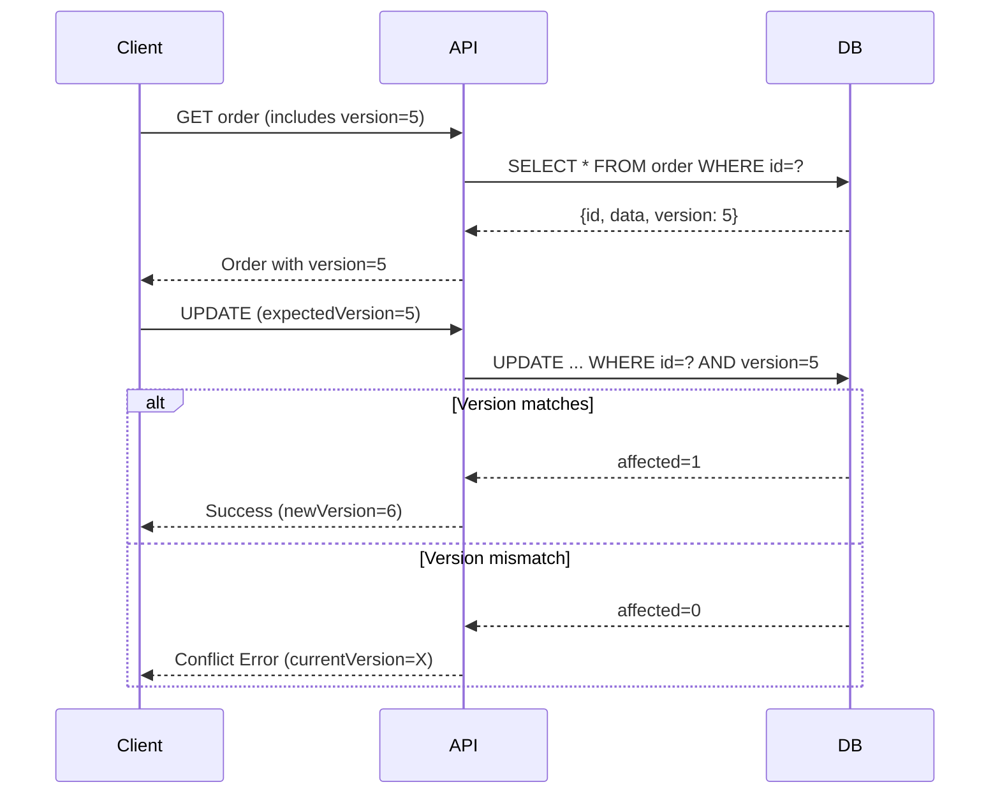

# Optimistic Locking Testing Guide

**Tài liệu hướng dẫn setup và test Optimistic Locking cho CRM-MKT**

**Last Updated**: 2026-01-23
**Author**: Claude Code

---

## Mục lục

1. [Tổng quan](#1-tổng-quan)
2. [Cấu hình Environment](#2-cấu-hình-environment)
3. [GraphQL API](#3-graphql-api)
4. [Test Cases cơ bản](#4-test-cases-cơ-bản)
5. [Test Race Condition](#5-test-race-condition)
6. [Troubleshooting](#6-troubleshooting)

---

## 1. Tổng quan

### 1.1. Optimistic Locking là gì?

Optimistic Locking là kỹ thuật kiểm soát đồng thời (concurrency control) sử dụng version number để detect conflicts khi nhiều users/processes cùng update một record.

```
User A: Read order (version=1) → Modify → Save với expectedVersion=1 → ✅ Success (version=2)
User B: Read order (version=1) → Modify → Save với expectedVersion=1 → ❌ Conflict (current=2)
```

### 1.2. Flow hoạt động



### 1.3. Entities đã hỗ trợ

| Entity | Version Field | Atomic Update |
|--------|---------------|---------------|
| `mktOrder` | ✅ | ✅ |
| `mktGenericCombo` | ✅ | ❌ |
| `mktPermissionTemplate` | ✅ | ❌ |
| `mktPolicyVersion` | ✅ | ❌ |
| `mktTemplate` | ✅ | ❌ |

---

## 2. Cấu hình Environment

### 2.1. Environment Variables

Thêm vào file `.env` của twenty-server:

```env
# Optimistic Locking Configuration
ORDER_OPTIMISTIC_LOCKING_ENABLED=true
```

### 2.2. Config Module

File: `packages/twenty-server/src/mkt-core/order/config/order-config.types.ts`

```typescript
export type OrderFeatureConfig = {
  /** Whether optimistic locking is enabled for order items */
  optimisticLockingEnabled: boolean;
};
```

### 2.3. Kiểm tra config

```bash
# Trong application logs khi start server
grep -i "optimistic" logs/twenty-server.log
```

---

## 3. GraphQL API

### 3.1. Lấy thông tin Order (bao gồm version)

**Query:**

```graphql
query GetOrderById($orderId: String!) {
  getOrderById(orderId: $orderId) {
    id
    orderCode
    status
    version
    totalAmount
    paidAmount
    paymentStatus
    updatedAt
  }
}
```

**Variables:**

```json
{
  "orderId": "your-order-id"
}
```

**Response:**

```json
{
  "data": {
    "getOrderById": {
      "id": "abc-123",
      "orderCode": "DEV20260123001",
      "status": "PENDING_PAYMENT",
      "version": 5,
      "totalAmount": 1000000,
      "paidAmount": 0,
      "paymentStatus": "PENDING",
      "updatedAt": "2026-01-23T10:30:00.000Z"
    }
  }
}
```

### 3.2. Update Order với Optimistic Locking

**Mutation:**

```graphql
mutation UpdateOrderStatus($input: UpdateOrderStatusInput!) {
  updateOrderStatus(input: $input) {
    success
    orderId
    previousStatus
    newStatus
    message
    error
  }
}
```

**Variables (với expectedVersion):**

```json
{
  "input": {
    "orderId": "your-order-id",
    "newStatus": "CONFIRMED",
    "expectedVersion": 5
  }
}
```

### 3.3. Response khi Conflict

```json
{
  "data": {
    "updateOrderStatus": {
      "success": false,
      "orderId": "abc-123",
      "error": "Version conflict: Entity was modified by another user. Expected version 5, current version is 6. Please refresh and try again."
    }
  }
}
```

### 3.4. Các Mutations hỗ trợ Optimistic Locking

| Mutation | Input Field | Description |
|----------|-------------|-------------|
| `updateOrderStatus` | `expectedVersion` | Update order status |
| `confirmOrder` | `expectedVersion` | Confirm order |
| `publishDraftOrder` | `expectedVersion` | Publish draft → pending |
| `refundOrder` | `expectedVersion` | Refund order |

---

## 4. Test Cases cơ bản

### 4.1. Prerequisites

```bash
# 1. Lấy Bearer Token (từ login hoặc API key)
TOKEN="eyJhbGciOiJIUzI1NiIs..."

# 2. Tạo hoặc lấy order ID để test
ORDER_ID="your-test-order-id"

# 3. Endpoint
ENDPOINT="http://localhost:3000/graphql"
```

### 4.2. Test Case 1: Update thành công với đúng version

```bash
# Step 1: Lấy current version
curl -X POST $ENDPOINT \
  -H "Authorization: Bearer $TOKEN" \
  -H "Content-Type: application/json" \
  -d '{
    "query": "query { getOrderById(orderId: \"'$ORDER_ID'\") { version status } }"
  }' | jq

# Output: {"data": {"getOrderById": {"version": 5, "status": "PENDING_PAYMENT"}}}

# Step 2: Update với đúng version
curl -X POST $ENDPOINT \
  -H "Authorization: Bearer $TOKEN" \
  -H "Content-Type: application/json" \
  -d '{
    "query": "mutation { updateOrderStatus(input: {orderId: \"'$ORDER_ID'\", newStatus: CONFIRMED, expectedVersion: 5}) { success newStatus error } }"
  }' | jq

# Expected: {"data": {"updateOrderStatus": {"success": true, "newStatus": "CONFIRMED", "error": null}}}
```

### 4.3. Test Case 2: Update thất bại với sai version

```bash
# Update với version cũ (stale)
curl -X POST $ENDPOINT \
  -H "Authorization: Bearer $TOKEN" \
  -H "Content-Type: application/json" \
  -d '{
    "query": "mutation { updateOrderStatus(input: {orderId: \"'$ORDER_ID'\", newStatus: COMPLETED, expectedVersion: 3}) { success error } }"
  }' | jq

# Expected: {"data": {"updateOrderStatus": {"success": false, "error": "Version conflict: ..."}}}
```

### 4.4. Test Case 3: Update không có version (bypass locking)

```bash
# Không truyền expectedVersion → bypass optimistic locking
curl -X POST $ENDPOINT \
  -H "Authorization: Bearer $TOKEN" \
  -H "Content-Type: application/json" \
  -d '{
    "query": "mutation { updateOrderStatus(input: {orderId: \"'$ORDER_ID'\", newStatus: COMPLETED}) { success error } }"
  }' | jq

# Expected: Success (no version check)
```

---

## 5. Test Race Condition

### 5.1. Parallel Requests với xargs

**Script test với 10 concurrent requests:**

```bash
#!/bin/bash

TOKEN="your-bearer-token"
ORDER_ID="your-order-id"
ENDPOINT="http://localhost:3000/graphql"

# Lấy current version
VERSION=$(curl -s -X POST $ENDPOINT \
  -H "Authorization: Bearer $TOKEN" \
  -H "Content-Type: application/json" \
  -d '{"query": "query { getOrderById(orderId: \"'$ORDER_ID'\") { version } }"}' \
  | jq -r '.data.getOrderById.version')

echo "Current version: $VERSION"
echo "Sending 10 parallel requests with expectedVersion=$VERSION..."

# Cleanup
rm -f /tmp/race_result_*.json

# Run 10 parallel requests
seq 1 10 | xargs -P 10 -I {} bash -c "
  curl -s -X POST '$ENDPOINT' \
    -H 'Authorization: Bearer $TOKEN' \
    -H 'Content-Type: application/json' \
    -d '{\"query\": \"mutation { updateOrderStatus(input: {orderId: \\\"$ORDER_ID\\\", newStatus: PENDING_PAYMENT, expectedVersion: $VERSION}) { success error } }\"}' \
    > /tmp/race_result_{}.json
"

echo ""
echo "=== Results ==="
echo "Success count: $(grep -l '"success":true' /tmp/race_result_*.json 2>/dev/null | wc -l)"
echo "Failure count: $(grep -l '"success":false' /tmp/race_result_*.json 2>/dev/null | wc -l)"
echo ""
echo "=== Individual Results ==="
for f in /tmp/race_result_*.json; do
  echo "$(basename $f): $(cat $f | jq -c '{success: .data.updateOrderStatus.success, error: .data.updateOrderStatus.error}')"
done
```

### 5.2. Expected Results

| Test | Expected Outcome |
|------|-----------------|
| 10 concurrent với cùng version | **1 success**, 9 conflict |
| 10 sequential với đúng version | **10 success** (mỗi request nhận version mới) |
| 10 concurrent không có version | **10 success** (không check, có thể data inconsistent) |

### 5.3. Verify Database

```sql
-- Check version sau race condition test
SELECT id, "orderCode", version, status, "updatedAt"
FROM "mktOrder"
WHERE id = 'your-order-id';

-- Verify version chỉ tăng 1 (chứng tỏ chỉ 1 request thành công)
-- version trước: 5 → version sau: 6
```

### 5.4. Complete Test Script

```bash
#!/bin/bash
# File: test_optimistic_locking.sh

set -e

TOKEN="${1:-$TOKEN}"
ORDER_ID="${2:-$ORDER_ID}"
ENDPOINT="${3:-http://localhost:3000/graphql}"
PARALLEL_COUNT="${4:-10}"

if [ -z "$TOKEN" ] || [ -z "$ORDER_ID" ]; then
  echo "Usage: $0 <token> <order_id> [endpoint] [parallel_count]"
  exit 1
fi

echo "=========================================="
echo "Optimistic Locking Race Condition Test"
echo "=========================================="
echo "Order ID: $ORDER_ID"
echo "Parallel requests: $PARALLEL_COUNT"
echo ""

# Get current version
echo "Step 1: Getting current version..."
RESPONSE=$(curl -s -X POST "$ENDPOINT" \
  -H "Authorization: Bearer $TOKEN" \
  -H "Content-Type: application/json" \
  -d "{\"query\": \"query { getOrderById(orderId: \\\"$ORDER_ID\\\") { version status orderCode } }\"}")

VERSION=$(echo $RESPONSE | jq -r '.data.getOrderById.version')
STATUS=$(echo $RESPONSE | jq -r '.data.getOrderById.status')
CODE=$(echo $RESPONSE | jq -r '.data.getOrderById.orderCode')

echo "Order: $CODE"
echo "Current version: $VERSION"
echo "Current status: $STATUS"
echo ""

# Determine next status for cycling
if [ "$STATUS" == "PENDING_PAYMENT" ]; then
  NEW_STATUS="CONFIRMED"
elif [ "$STATUS" == "CONFIRMED" ]; then
  NEW_STATUS="PENDING_PAYMENT"
else
  NEW_STATUS="PENDING_PAYMENT"
fi

echo "Step 2: Sending $PARALLEL_COUNT parallel requests (version=$VERSION → status=$NEW_STATUS)..."

# Cleanup
rm -f /tmp/race_test_*.json

# Run parallel requests
START_TIME=$(date +%s.%N)

seq 1 $PARALLEL_COUNT | xargs -P $PARALLEL_COUNT -I {} bash -c "
  curl -s -X POST '$ENDPOINT' \
    -H 'Authorization: Bearer $TOKEN' \
    -H 'Content-Type: application/json' \
    -d '{\"query\": \"mutation { updateOrderStatus(input: {orderId: \\\"$ORDER_ID\\\", newStatus: $NEW_STATUS, expectedVersion: $VERSION}) { success previousStatus newStatus error } }\"}' \
    > /tmp/race_test_{}.json 2>/dev/null
"

END_TIME=$(date +%s.%N)
DURATION=$(echo "$END_TIME - $START_TIME" | bc)

echo "Completed in ${DURATION}s"
echo ""

# Count results
SUCCESS_COUNT=$(grep -l '"success":true' /tmp/race_test_*.json 2>/dev/null | wc -l | tr -d ' ')
FAILURE_COUNT=$(grep -l '"success":false' /tmp/race_test_*.json 2>/dev/null | wc -l | tr -d ' ')

echo "=========================================="
echo "Results"
echo "=========================================="
echo "✅ Success: $SUCCESS_COUNT"
echo "❌ Conflict: $FAILURE_COUNT"
echo ""

# Validation
if [ "$SUCCESS_COUNT" -eq "1" ] && [ "$FAILURE_COUNT" -eq "$((PARALLEL_COUNT - 1))" ]; then
  echo "🎉 TEST PASSED: Optimistic locking working correctly!"
  echo "   Only 1 request succeeded out of $PARALLEL_COUNT concurrent requests."
else
  echo "⚠️  TEST WARNING: Unexpected results"
  echo "   Expected: 1 success, $((PARALLEL_COUNT - 1)) failures"
  echo "   Got: $SUCCESS_COUNT success, $FAILURE_COUNT failures"
fi

echo ""
echo "Step 3: Verifying final state..."

FINAL=$(curl -s -X POST "$ENDPOINT" \
  -H "Authorization: Bearer $TOKEN" \
  -H "Content-Type: application/json" \
  -d "{\"query\": \"query { getOrderById(orderId: \\\"$ORDER_ID\\\") { version status } }\"}")

FINAL_VERSION=$(echo $FINAL | jq -r '.data.getOrderById.version')
FINAL_STATUS=$(echo $FINAL | jq -r '.data.getOrderById.status')

echo "Final version: $FINAL_VERSION (was $VERSION)"
echo "Final status: $FINAL_STATUS"

if [ "$FINAL_VERSION" -eq "$((VERSION + 1))" ]; then
  echo "✅ Version incremented by exactly 1 (atomic update confirmed)"
else
  echo "⚠️  Version changed by more than 1 (possible race condition)"
fi

echo ""
echo "=========================================="
echo "Individual Results"
echo "=========================================="
for f in /tmp/race_test_*.json; do
  RESULT=$(cat $f | jq -c '{success: .data.updateOrderStatus.success}' 2>/dev/null)
  FILENAME=$(basename $f .json | sed 's/race_test_/Request /')
  if echo $f | xargs grep -q '"success":true'; then
    echo "$FILENAME: ✅ SUCCESS"
  else
    echo "$FILENAME: ❌ CONFLICT"
  fi
done
```

**Cách sử dụng:**

```bash
chmod +x test_optimistic_locking.sh
./test_optimistic_locking.sh "your-token" "order-id"
```

---

## 6. Troubleshooting

### 6.1. Lỗi thường gặp

#### 6.1.1. "Version conflict" nhưng version đúng

**Nguyên nhân**: Có process khác đã update trước.

**Giải pháp**:
```bash
# Refresh version trước khi update
VERSION=$(curl -s ... | jq -r '.data.getOrderById.version')
# Sử dụng $VERSION mới nhất
```

#### 6.1.2. Tất cả requests đều success (race condition không hoạt động)

**Nguyên nhân**:
- Feature flag bị disable
- Sử dụng read-then-write thay vì atomic update

**Kiểm tra**:
```bash
# Check config
grep -r "optimisticLockingEnabled" packages/twenty-server/src/mkt-core/

# Check implementation
grep -r "updateWithOptimisticLock" packages/twenty-server/src/mkt-core/
```

#### 6.1.3. Version không tăng sau update

**Nguyên nhân**: Update không đi qua atomic update method.

**Kiểm tra**:
```sql
-- Check triggers
SELECT * FROM pg_trigger WHERE tgrelid = 'mktOrder'::regclass;
```

### 6.2. Debug Mode

```typescript
// Thêm logging vào service
console.log('[OptimisticLock] Checking version:', {
  orderId,
  expectedVersion,
  featureEnabled: this.config.features.optimisticLockingEnabled,
});
```

### 6.3. Disable Optimistic Locking (Emergency)

```env
# .env
ORDER_OPTIMISTIC_LOCKING_ENABLED=false
```

Hoặc bypass trong request:
```json
{
  "input": {
    "orderId": "...",
    "newStatus": "CONFIRMED"
    // Không truyền expectedVersion
  }
}
```

---

## 7. Best Practices

### 7.1. Client-side Integration

```typescript
// React/Frontend example
async function updateOrder(orderId: string, newStatus: string) {
  // 1. Get current version
  const { data } = await getOrderById(orderId);
  const currentVersion = data.version;

  try {
    // 2. Update with version
    const result = await updateOrderStatus({
      orderId,
      newStatus,
      expectedVersion: currentVersion,
    });
    return result;
  } catch (error) {
    if (error.message.includes('Version conflict')) {
      // 3. Handle conflict - refresh and retry or show message
      await refreshOrder(orderId);
      showNotification('Order was modified. Please review changes.');
    }
    throw error;
  }
}
```

### 7.2. Retry với Exponential Backoff

```typescript
async function updateWithRetry(
  orderId: string,
  updateFn: (version: number) => Promise<Result>,
  maxRetries = 3,
) {
  for (let attempt = 0; attempt < maxRetries; attempt++) {
    const order = await getOrderById(orderId);
    try {
      return await updateFn(order.version);
    } catch (error) {
      if (!error.message.includes('Version conflict')) throw error;
      if (attempt === maxRetries - 1) throw error;
      // Exponential backoff: 100ms, 200ms, 400ms
      await sleep(100 * Math.pow(2, attempt));
    }
  }
}
```

### 7.3. Khi nào KHÔNG dùng expectedVersion

- Batch operations (update nhiều records)
- Admin force update
- System background jobs
- Data migration

---

## 8. Appendix

### A. Curl Command Templates

```bash
# Get order with version
curl -X POST http://localhost:3000/graphql \
  -H "Authorization: Bearer $TOKEN" \
  -H "Content-Type: application/json" \
  -d '{"query": "query { getOrderById(orderId: \"ID\") { version status } }"}'

# Update with optimistic lock
curl -X POST http://localhost:3000/graphql \
  -H "Authorization: Bearer $TOKEN" \
  -H "Content-Type: application/json" \
  -d '{"query": "mutation { updateOrderStatus(input: {orderId: \"ID\", newStatus: CONFIRMED, expectedVersion: 5}) { success error } }"}'

# Confirm order with lock
curl -X POST http://localhost:3000/graphql \
  -H "Authorization: Bearer $TOKEN" \
  -H "Content-Type: application/json" \
  -d '{"query": "mutation { confirmOrder(input: {orderId: \"ID\", action: APPROVE, expectedVersion: 5}) { success error } }"}'
```

### B. Related Documentation

- [OPTIMISTIC_LOCKING_ANALYSIS.md](OPTIMISTIC_LOCKING_ANALYSIS.md) - Database analysis report
- Order module: `packages/twenty-server/src/mkt-core/order/`
- Repository: `packages/twenty-server/src/mkt-core/order/repositories/mkt-order.repository.ts`
- Config: `packages/twenty-server/src/mkt-core/order/config/order-config.types.ts`

### C. Version History

| Date | Version | Changes |
|------|---------|---------|
| 2026-01-23 | 1.0 | Initial document |

---

**Questions?** Contact: Development Team
