# Ma trận Phân quyền Theo Phòng Ban

## Mục Lục

1. [Tổng quan Hệ thống RBAC](#1-tổng-quan-hệ-thống-rbac)
2. [Cấu trúc Hierarchy và Access Levels](#2-cấu-trúc-hierarchy-và-access-levels)
3. [Phòng SALES - Phòng Kinh Doanh](#3-phòng-sales---phòng-kinh-doanh)
4. [Phòng SUPPORT - Phòng Hỗ trợ](#4-phòng-support---phòng-hỗ-trợ)
5. [Phòng ACCOUNTING - Phòng Kế toán](#5-phòng-accounting---phòng-kế-toán)
6. [Ma trận Quyền Tổng hợp](#6-ma-trận-quyền-tổng-hợp)
7. [Access Flow Diagrams](#7-access-flow-diagrams)
8. [Business Rules và Use Cases](#8-business-rules-và-use-cases)
9. [Cấu hình Kỹ thuật](#9-cấu-hình-kỹ-thuật)

---

## 1. Tổng quan Hệ thống RBAC

### 1.1 Kiến trúc Tổng thể

Hệ thống RBAC (Role-Based Access Control) của CRM được xây dựng trên 3 lớp chính:

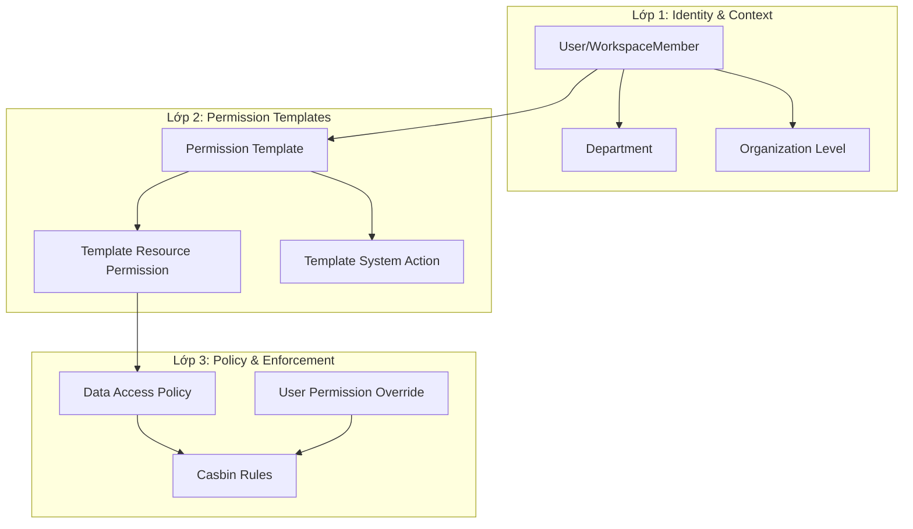

### 1.2 Nguyên tắc Phân quyền

| Nguyên tắc | Mô tả |
|------------|-------|
| **Least Privilege** | Chỉ cấp quyền tối thiểu cần thiết |
| **Deny Wins** | Nếu có xung đột, DENY sẽ thắng ALLOW |
| **Hierarchy Inheritance** | Cấp trên kế thừa quyền của cấp dưới |
| **Department Isolation** | Mặc định cách ly dữ liệu giữa các phòng ban |
| **Template Priority** | Template có priority cao hơn sẽ được ưu tiên |

### 1.3 Các Nguồn Cấp Quyền (Theo Thứ tự Ưu tiên)

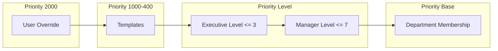

---

## 2. Cấu trúc Hierarchy và Access Levels

### 2.1 Hierarchy Levels

| Level | Code | Template Priority | Mô tả |
|-------|------|-------------------|-------|
| 1 | CEO | 1000 | Tổng Giám đốc - Full access |
| 2 | C_LEVEL | 900 | C-Suite (CFO, CTO, COO) |
| 3 | VP | 800 | Vice President |
| 4 | SENIOR_DIRECTOR | 750 | Senior Director |
| 5 | DIRECTOR | 800 | Director phòng ban |
| 6 | SENIOR_MANAGER | 700 | Senior Manager |
| 7 | MANAGER | 700 | Manager - Team lead |
| 8 | SENIOR_SPECIALIST | 600 | Senior Specialist |
| 9 | SPECIALIST | 500 | Specialist |
| 10 | JUNIOR_SPECIALIST | 400 | Junior Specialist |
| 11 | INTERN | 100 | Thực tập sinh |

### 2.2 Department Types

| Department Code | Type | Mô tả | Cross-Dept Access |
|-----------------|------|-------|-------------------|
| SALES | DEPARTMENT | Phòng Kinh Doanh | Limited |
| SUPPORT | DEPARTMENT | Phòng Hỗ trợ | Limited |
| ACCOUNTING | DEPARTMENT | Phòng Kế toán | Restricted |
| HR | DEPARTMENT | Phòng Nhân Sự | Restricted |
| TECH | DEPARTMENT | Phòng Công nghệ | Full |

### 2.3 Resource Categories

| Category | Resources | Mô tả |
|----------|-----------|-------|
| BUSINESS_DATA | Customer, Order, Invoice, License, Payment | Dữ liệu kinh doanh core |
| FINANCIAL | Invoice, Payment, Salary, Budget, Transaction | Dữ liệu tài chính nhạy cảm |
| SENSITIVE_DATA | Payment, Salary, ConfidentialInfo, AuditLog | Dữ liệu cần bảo mật cao |
| ORGANIZATION_DATA | Department, OrganizationLevel, WorkspaceMember | Dữ liệu tổ chức |
| REPORTING | Report, Analytics, Dashboard | Báo cáo và phân tích |

### 2.4 Actions

| Category | Actions | Risk Level |
|----------|---------|------------|
| BASIC_CRUD | READ, CREATE, UPDATE, DELETE | Low-High |
| DATA_TRANSFER | EXPORT, IMPORT, DOWNLOAD, UPLOAD | Medium-High |
| WORKFLOW | APPROVE, REJECT, SUBMIT, CANCEL, PROCESS | Medium |
| ADMIN | MANAGE, ASSIGN, CONFIGURE | High |

---

## 3. Phòng SALES - Phòng Kinh Doanh

### 3.1 Tổng quan

- **Department Code**: SALES
- **Mô tả**: Quản lý khách hàng, đơn hàng, báo giá
- **Teams Con**: SALES_DOMESTIC, SALES_INTERNATIONAL, SALES_PARTNER, SALES_ONLINE
- **Cross-Department Access**: Limited (chỉ xem Invoice liên quan)

### 3.2 Ma trận Quyền Theo Level

```mermaid
flowchart TB
    subgraph SALES_DEPT["Phòng SALES"]
        subgraph L7["Manager (Level 7)"]
            M_C[Customer: FULL]
            M_O[Order: FULL]
            M_L[License: READ/UPDATE]
            M_I[Invoice: READ]
            M_P[Payment: READ]
        end

        subgraph L9["Specialist (Level 9)"]
            S_C[Customer: CRU]
            S_O[Order: CRU]
            S_L[License: READ]
            S_I[Invoice: READ]
            S_P[Payment: VIEW ONLY]
        end

        subgraph L11["Intern (Level 11)"]
            I_C[Customer: READ]
            I_O[Order: READ]
            I_L[License: READ]
            I_I[Invoice: NONE]
            I_P[Payment: NONE]
        end
    end

    L7 --> L9 --> L11
```

### 3.3 Chi tiết Quyền Theo Resource

#### Customer (mktCustomer)

| Level | READ | CREATE | UPDATE | DELETE | EXPORT | ASSIGN |
|-------|------|--------|--------|--------|--------|--------|
| Director (5) | ALL | Yes | Yes | Yes | Yes | Yes |
| Manager (7) | TEAM | Yes | Yes | No | Yes | Yes |
| Senior (8) | TEAM | Yes | Yes | No | No | No |
| Specialist (9) | OWN | Yes | Yes | No | No | No |
| Junior (10) | OWN | Yes | Limited | No | No | No |
| Intern (11) | OWN | No | No | No | No | No |

**Data Scope:**
- `ALL`: Tất cả customers trong workspace
- `TEAM`: Customers của team members trong department tree
- `OWN`: Chỉ customers do mình sở hữu (accountOwnerId = userId)

#### Order (mktOrder)

| Level | READ | CREATE | UPDATE | DELETE | APPROVE | PROCESS |
|-------|------|--------|--------|--------|---------|---------|
| Director (5) | ALL | Yes | Yes | Yes | Yes | Yes |
| Manager (7) | TEAM | Yes | Yes | No | Yes | Yes |
| Senior (8) | TEAM | Yes | Yes | No | No | Yes |
| Specialist (9) | OWN | Yes | Yes | No | No | Yes |
| Junior (10) | OWN | Yes | Limited | No | No | No |
| Intern (11) | OWN | No | No | No | No | No |

#### License (mktLicense)

| Level | READ | CREATE | UPDATE | DELETE | SYNC |
|-------|------|--------|--------|--------|------|
| Director (5) | ALL | Yes | Yes | No | Yes |
| Manager (7) | TEAM | No | Yes | No | No |
| Senior (8) | TEAM | No | Limited | No | No |
| Specialist (9) | OWN | No | View Only | No | No |
| Junior (10) | OWN | No | No | No | No |
| Intern (11) | NONE | No | No | No | No |

#### Invoice (mktInvoice)

| Level | READ | CREATE | UPDATE | DELETE | EXPORT |
|-------|------|--------|--------|--------|--------|
| Director (5) | TEAM | No | No | No | Yes |
| Manager (7) | TEAM | No | No | No | Limited |
| Specialist (9) | OWN | No | No | No | No |
| Junior/Intern | NONE | No | No | No | No |

### 3.4 Business Rules

1. **Order Ownership**: Sales staff chỉ thấy orders do mình tạo hoặc được assign
2. **Customer Handover**: Khi chuyển customer, cần approval từ Manager
3. **License View**: Sales có thể xem license để tư vấn, không được update
4. **Invoice Access**: Chỉ xem invoice của đơn hàng mình xử lý
5. **Payment View**: Chỉ xem trạng thái thanh toán, không xem chi tiết giao dịch

---

## 4. Phòng SUPPORT - Phòng Hỗ trợ

### 4.1 Tổng quan

- **Department Code**: SUPPORT
- **Mô tả**: Xử lý ticket, hỗ trợ license, chăm sóc khách hàng
- **Teams Con**: SUPPORT_CUSTOMER, SUPPORT_TECHNICAL, SUPPORT_INTERNAL
- **Cross-Department Access**: Limited (cần xem Customer từ SALES)

### 4.2 Ma trận Quyền Theo Level

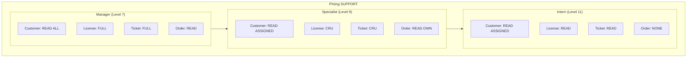

### 4.3 Chi tiết Quyền Theo Resource

#### Customer (mktCustomer)

| Level | READ | CREATE | UPDATE | DELETE | VIEW_HISTORY |
|-------|------|--------|--------|--------|--------------|
| Director (5) | ALL | No | Limited | No | Yes |
| Manager (7) | ALL | No | Contact Info | No | Yes |
| Senior (8) | ASSIGNED | No | Contact Info | No | Yes |
| Specialist (9) | ASSIGNED | No | Contact Info | No | Limited |
| Junior (10) | ASSIGNED | No | No | No | No |
| Intern (11) | ASSIGNED | No | No | No | No |

**Note**: Support không tạo Customer mới, chỉ cập nhật thông tin liên hệ

#### License (mktLicense)

| Level | READ | CREATE | UPDATE | DELETE | RENEW | SUSPEND | REACTIVATE |
|-------|------|--------|--------|--------|-------|---------|------------|
| Director (5) | ALL | Yes | Yes | No | Yes | Yes | Yes |
| Manager (7) | ALL | Yes | Yes | No | Yes | Yes | Yes |
| Senior (8) | TEAM | Yes | Yes | No | Yes | No | No |
| Specialist (9) | OWN | Yes | Yes | No | Yes | No | No |
| Junior (10) | OWN | No | Limited | No | No | No | No |
| Intern (11) | READ | No | No | No | No | No | No |

**License Actions Chi tiết:**
- `RENEW`: Gia hạn license hết hạn
- `SUSPEND`: Tạm dừng license (lỗi thanh toán)
- `REACTIVATE`: Kích hoạt lại license bị suspend

#### Order (mktOrder) - READ ONLY

| Level | READ | VIEW_DETAILS |
|-------|------|--------------|
| Director (5) | ALL | Yes |
| Manager (7) | ALL | Yes |
| Specialist (9) | ASSIGNED | Limited |
| Junior/Intern | NONE | No |

**Note**: Support không tạo/sửa Order, chỉ xem để hỗ trợ khách hàng

### 4.4 Business Rules

1. **License Management**: Support là phòng chính quản lý lifecycle của license
2. **Customer Contact Update**: Có thể cập nhật email/phone khi khách hàng yêu cầu
3. **Order View Only**: Xem order để hiểu context, không can thiệp
4. **Ticket Integration**: Mỗi thao tác license phải link với ticket
5. **SLA Compliance**: Phải ghi nhận thời gian xử lý để đo KPI

---

## 5. Phòng ACCOUNTING - Phòng Kế toán

### 5.1 Tổng quan

- **Department Code**: ACCOUNTING
- **Mô tả**: Xử lý invoice, payment, báo cáo tài chính
- **Teams Con**: ACCOUNTING_PAYABLE, ACCOUNTING_RECEIVABLE, ACCOUNTING_AUDIT, ACCOUNTING_TAX
- **Cross-Department Access**: Restricted (dữ liệu tài chính nhạy cảm)

### 5.2 Ma trận Quyền Theo Level

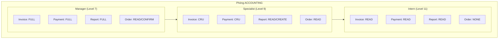

### 5.3 Chi tiết Quyền Theo Resource

#### Invoice (mktInvoice)

| Level | READ | CREATE | UPDATE | DELETE | EXPORT | APPROVE | VOID |
|-------|------|--------|--------|--------|--------|---------|------|
| Director (5) | ALL | Yes | Yes | Yes | Yes | Yes | Yes |
| Manager (7) | ALL | Yes | Yes | No | Yes | Yes | Yes |
| Senior (8) | ALL | Yes | Yes | No | Yes | No | No |
| Specialist (9) | ALL | Yes | Limited | No | Yes | No | No |
| Junior (10) | ALL | Yes | No | No | No | No | No |
| Intern (11) | READ | No | No | No | No | No | No |

**Invoice Actions Chi tiết:**
- `VOID`: Hủy invoice (phải có lý do và approval)
- `APPROVE`: Duyệt invoice trước khi gửi khách hàng

#### Payment (mktPayment)

| Level | READ | CREATE | UPDATE | DELETE | RECONCILE | REFUND |
|-------|------|--------|--------|--------|-----------|--------|
| Director (5) | ALL | Yes | Yes | No | Yes | Yes |
| Manager (7) | ALL | Yes | Yes | No | Yes | Yes |
| Senior (8) | ALL | Yes | Limited | No | Yes | No |
| Specialist (9) | ALL | Yes | No | No | Limited | No |
| Junior (10) | ALL | No | No | No | No | No |
| Intern (11) | READ | No | No | No | No | No |

**Payment Actions Chi tiết:**
- `RECONCILE`: Đối soát thanh toán với ngân hàng
- `REFUND`: Xử lý hoàn tiền (cần approval)

#### Order (mktOrder)

| Level | READ | CONFIRM_PAYMENT | VIEW_HISTORY |
|-------|------|-----------------|--------------|
| Director (5) | ALL | Yes | Yes |
| Manager (7) | ALL | Yes | Yes |
| Senior (8) | ALL | Yes | Yes |
| Specialist (9) | ALL | Yes | Limited |
| Junior (10) | ALL | No | No |
| Intern (11) | NONE | No | No |

**Note**: Accounting xác nhận thanh toán cho Order, không tạo/sửa Order

#### Report (mktReport) - Financial Reports

| Level | READ | CREATE | UPDATE | DELETE | EXPORT | SHARE |
|-------|------|--------|--------|--------|--------|-------|
| Director (5) | ALL | Yes | Yes | Yes | Yes | Yes |
| Manager (7) | ALL | Yes | Yes | No | Yes | Yes |
| Senior (8) | ALL | Yes | Limited | No | Yes | No |
| Specialist (9) | DEPT | Yes | No | No | Limited | No |
| Junior (10) | DEPT | No | No | No | No | No |
| Intern (11) | NONE | No | No | No | No | No |

### 5.4 Business Rules

1. **Payment Verification**: Mỗi payment phải được verify trước khi cập nhật trạng thái Order
2. **Invoice Approval Flow**: Invoice trên 10M VND phải có Manager approval
3. **Refund Approval**: Refund phải có Director approval và documentation
4. **Financial Report Access**: Chỉ Accounting mới truy cập báo cáo tài chính chi tiết
5. **Audit Trail**: Mỗi thay đổi payment/invoice phải ghi log đầy đủ
6. **Sensitive Data**: Không chia sẻ dữ liệu thanh toán ra ngoài phòng Kế toán

---

## 6. Ma trận Quyền Tổng hợp

### 6.1 Cross-Department Permission Matrix

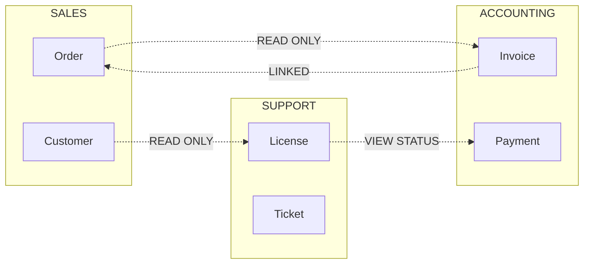

### 6.2 Entity Permission Summary

| Entity | SALES | SUPPORT | ACCOUNTING |
|--------|-------|---------|------------|
| **Customer** | FULL (Owner) | READ + Update Contact | READ ONLY |
| **Order** | FULL (Creator) | READ ONLY | READ + Confirm |
| **Invoice** | READ (Own Orders) | READ ONLY | FULL |
| **Payment** | VIEW Status | VIEW Status | FULL |
| **License** | READ ONLY | FULL | READ ONLY |
| **Product** | READ ONLY | READ ONLY | READ ONLY |
| **Report** | Sales Reports | Support Reports | Financial Reports |
| **Department** | READ Own | READ Own | READ Own |

### 6.3 Action Permission Matrix

| Action | SALES | SUPPORT | ACCOUNTING |
|--------|-------|---------|------------|
| READ | Own + Team | Assigned + Team | ALL Financial |
| CREATE | Customer, Order | License, Ticket | Invoice, Payment |
| UPDATE | Own Records | License, Contact | Invoice, Payment |
| DELETE | Manager Only | Director Only | Director Only |
| EXPORT | Manager Only | Manager Only | Specialist+ |
| APPROVE | Director Only | Manager Only | Manager Only |
| ASSIGN | Manager Only | Manager Only | N/A |

---

## 7. Access Flow Diagrams

### 7.1 Permission Check Flow

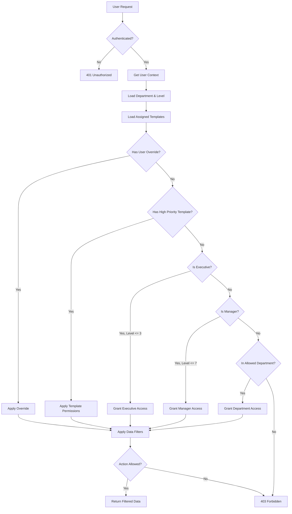

### 7.2 Department Authorization Flow

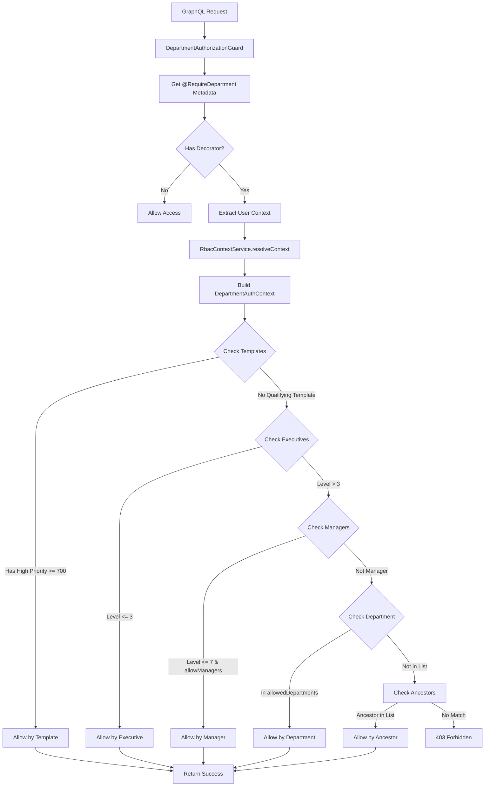

### 7.3 Order Access Flow cho SALES

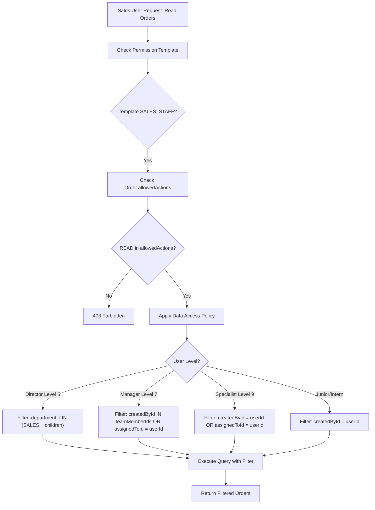

---

## 8. Business Rules và Use Cases

### 8.1 Use Case: Sales Tạo Order Mới

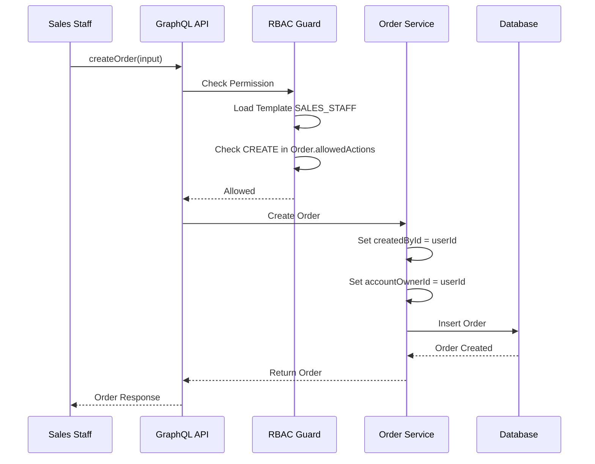

### 8.2 Use Case: Support Gia hạn License

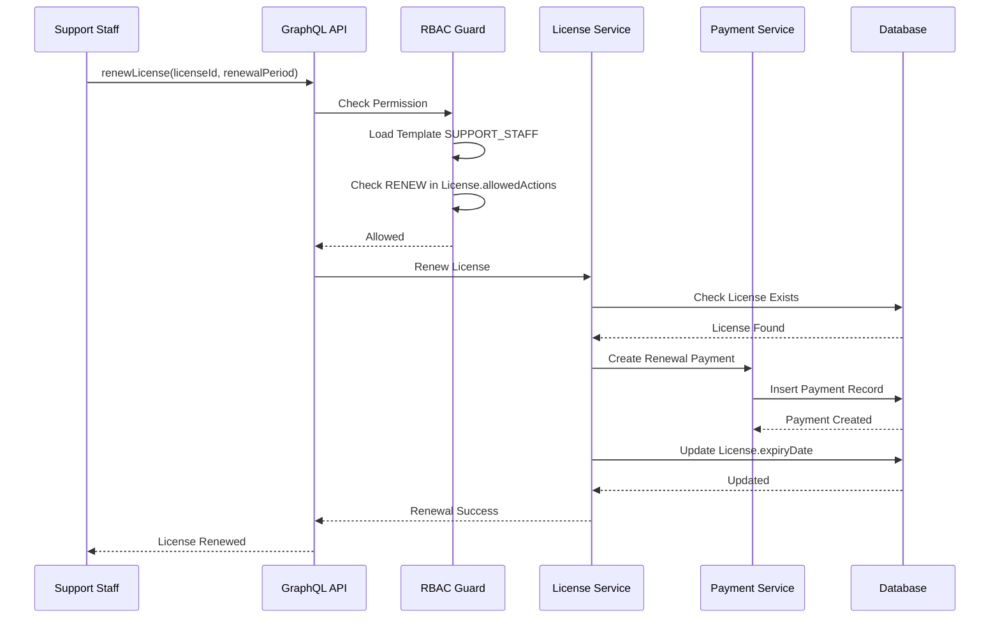

### 8.3 Use Case: Accounting Xác nhận Thanh toán

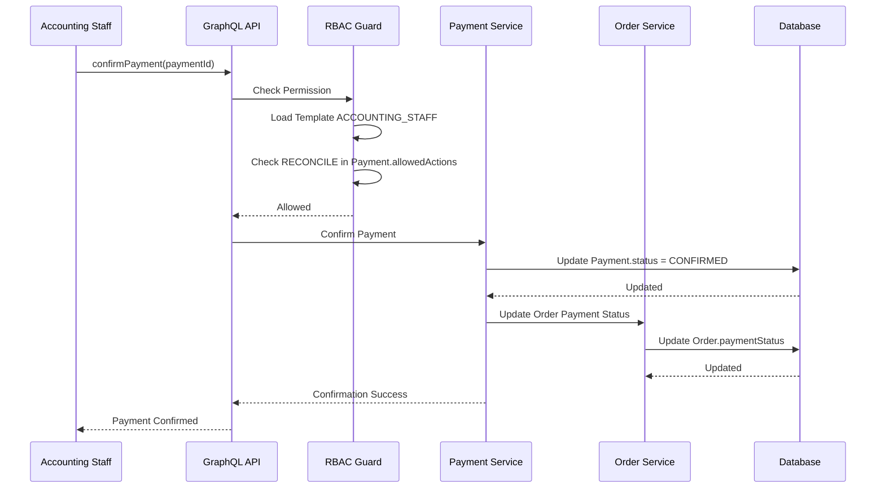

### 8.4 Use Case: Manager Xem Báo cáo Team

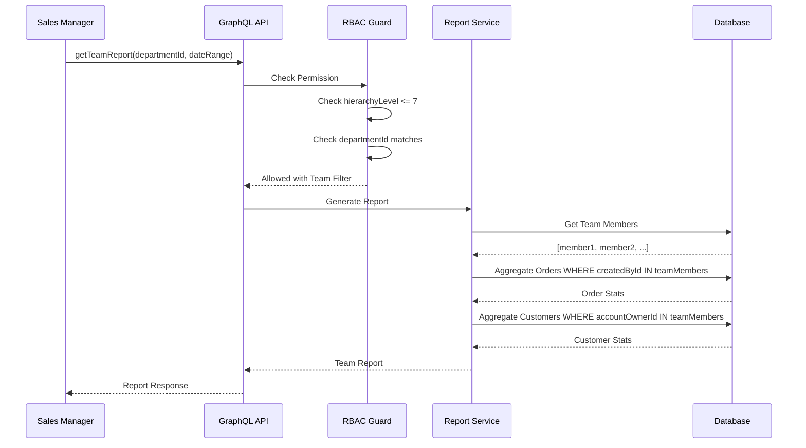

---

## 9. Cấu hình Kỹ thuật

### 9.1 Permission Template Seeds

#### SALES Department Templates

```typescript
// Template cho Sales Director
const SALES_DIRECTOR_TEMPLATE = {
  templateKey: 'SALES_DIRECTOR',
  templateName: 'Sales Director',
  templateType: 'HIERARCHY_BASED',
  departmentType: 'SALES',
  hierarchyLevel: 5,
  priority: 800,
  resourcePermissions: [
    {
      resourceKey: 'CUSTOMER',
      allowedActions: ['READ', 'CREATE', 'UPDATE', 'DELETE', 'EXPORT', 'ASSIGN'],
      conditions: { scope: 'DEPARTMENT' }
    },
    {
      resourceKey: 'ORDER',
      allowedActions: ['READ', 'CREATE', 'UPDATE', 'DELETE', 'APPROVE', 'PROCESS'],
      conditions: { scope: 'DEPARTMENT' }
    },
    {
      resourceKey: 'LICENSE',
      allowedActions: ['READ'],
      conditions: { scope: 'DEPARTMENT' }
    },
    {
      resourceKey: 'INVOICE',
      allowedActions: ['READ', 'EXPORT'],
      conditions: { scope: 'DEPARTMENT' }
    }
  ]
};

// Template cho Sales Staff
const SALES_STAFF_TEMPLATE = {
  templateKey: 'SALES_STAFF',
  templateName: 'Sales Staff',
  templateType: 'DEPARTMENT_BASED',
  departmentType: 'SALES',
  hierarchyLevel: 9,
  priority: 500,
  resourcePermissions: [
    {
      resourceKey: 'CUSTOMER',
      allowedActions: ['READ', 'CREATE', 'UPDATE'],
      deniedActions: ['DELETE', 'EXPORT'],
      conditions: { scope: 'OWN', filterBy: 'accountOwnerId' }
    },
    {
      resourceKey: 'ORDER',
      allowedActions: ['READ', 'CREATE', 'UPDATE', 'PROCESS'],
      deniedActions: ['DELETE', 'APPROVE'],
      conditions: { scope: 'OWN', filterBy: 'createdById' }
    },
    {
      resourceKey: 'INVOICE',
      allowedActions: ['READ'],
      conditions: { scope: 'OWN_ORDERS' }
    }
  ]
};
```

#### SUPPORT Department Templates

```typescript
// Template cho Support Manager
const SUPPORT_MANAGER_TEMPLATE = {
  templateKey: 'SUPPORT_MANAGER',
  templateName: 'Support Manager',
  templateType: 'HIERARCHY_BASED',
  departmentType: 'SUPPORT',
  hierarchyLevel: 7,
  priority: 700,
  resourcePermissions: [
    {
      resourceKey: 'CUSTOMER',
      allowedActions: ['READ', 'UPDATE'],
      deniedActions: ['DELETE', 'CREATE'],
      conditions: { scope: 'ALL', updateFields: ['phone', 'email', 'address'] }
    },
    {
      resourceKey: 'LICENSE',
      allowedActions: ['READ', 'CREATE', 'UPDATE', 'RENEW', 'SUSPEND', 'REACTIVATE'],
      deniedActions: ['DELETE'],
      conditions: { scope: 'ALL' }
    },
    {
      resourceKey: 'ORDER',
      allowedActions: ['READ'],
      conditions: { scope: 'ALL' }
    }
  ]
};

// Template cho Support Staff
const SUPPORT_STAFF_TEMPLATE = {
  templateKey: 'SUPPORT_STAFF',
  templateName: 'Support Staff',
  templateType: 'DEPARTMENT_BASED',
  departmentType: 'SUPPORT',
  hierarchyLevel: 9,
  priority: 500,
  resourcePermissions: [
    {
      resourceKey: 'CUSTOMER',
      allowedActions: ['READ', 'UPDATE'],
      deniedActions: ['DELETE', 'CREATE'],
      conditions: {
        scope: 'ASSIGNED',
        updateFields: ['phone', 'email']
      }
    },
    {
      resourceKey: 'LICENSE',
      allowedActions: ['READ', 'CREATE', 'UPDATE', 'RENEW'],
      deniedActions: ['DELETE', 'SUSPEND'],
      conditions: { scope: 'OWN' }
    }
  ]
};
```

#### ACCOUNTING Department Templates

```typescript
// Template cho Accounting Manager
const ACCOUNTING_MANAGER_TEMPLATE = {
  templateKey: 'ACCOUNTING_MANAGER',
  templateName: 'Accounting Manager',
  templateType: 'HIERARCHY_BASED',
  departmentType: 'FINANCE',
  hierarchyLevel: 7,
  priority: 700,
  resourcePermissions: [
    {
      resourceKey: 'INVOICE',
      allowedActions: ['READ', 'CREATE', 'UPDATE', 'APPROVE', 'VOID', 'EXPORT'],
      deniedActions: ['DELETE'],
      conditions: { scope: 'ALL' }
    },
    {
      resourceKey: 'PAYMENT',
      allowedActions: ['READ', 'CREATE', 'UPDATE', 'RECONCILE', 'REFUND'],
      conditions: { scope: 'ALL' }
    },
    {
      resourceKey: 'ORDER',
      allowedActions: ['READ', 'CONFIRM_PAYMENT'],
      conditions: { scope: 'ALL' }
    },
    {
      resourceKey: 'REPORT',
      allowedActions: ['READ', 'CREATE', 'EXPORT', 'SHARE'],
      conditions: { scope: 'FINANCIAL' }
    }
  ]
};

// Template cho Accounting Staff
const ACCOUNTING_STAFF_TEMPLATE = {
  templateKey: 'ACCOUNTING_STAFF',
  templateName: 'Accounting Staff',
  templateType: 'DEPARTMENT_BASED',
  departmentType: 'FINANCE',
  hierarchyLevel: 9,
  priority: 500,
  resourcePermissions: [
    {
      resourceKey: 'INVOICE',
      allowedActions: ['READ', 'CREATE', 'UPDATE', 'EXPORT'],
      deniedActions: ['DELETE', 'APPROVE', 'VOID'],
      conditions: { scope: 'ALL' }
    },
    {
      resourceKey: 'PAYMENT',
      allowedActions: ['READ', 'CREATE', 'RECONCILE'],
      deniedActions: ['DELETE', 'REFUND'],
      conditions: { scope: 'ALL' }
    },
    {
      resourceKey: 'ORDER',
      allowedActions: ['READ', 'CONFIRM_PAYMENT'],
      conditions: { scope: 'ALL' }
    }
  ]
};
```

### 9.2 Data Access Policy Configuration

```typescript
// Policy cho Sales - Customer Access
const SALES_CUSTOMER_POLICY = {
  name: 'Sales - Customer Ownership Access',
  objectName: 'mktCustomer',
  policyType: 'ROW_LEVEL',
  departmentCode: 'SALES',
  filterConditions: {
    type: 'OR',
    conditions: [
      { field: 'accountOwnerId', operator: '=', value: '${user.workspaceMemberId}' },
      { field: 'accountOwnerId', operator: 'IN', value: '${user.teamMemberIds}' }
    ]
  },
  priority: 100,
  evaluationMode: 'BALANCED',
  conflictResolution: 'DENY_WINS'
};

// Policy cho Support - License Access
const SUPPORT_LICENSE_POLICY = {
  name: 'Support - License Full Access',
  objectName: 'mktLicense',
  policyType: 'ROW_LEVEL',
  departmentCode: 'SUPPORT',
  filterConditions: {
    type: 'OR',
    conditions: [
      { field: '*', operator: 'ALL', value: true }
    ]
  },
  priority: 50,
  evaluationMode: 'PERMISSIVE'
};

// Policy cho Accounting - Financial Data Access
const ACCOUNTING_FINANCIAL_POLICY = {
  name: 'Accounting - Financial Full Access',
  objectName: 'mktInvoice',
  policyType: 'ROW_LEVEL',
  departmentCode: 'ACCOUNTING',
  filterConditions: {
    type: 'AND',
    conditions: [
      { field: '*', operator: 'ALL', value: true }
    ]
  },
  priority: 10,
  evaluationMode: 'BALANCED',
  sensitiveFields: ['bankAccount', 'taxCode']
};
```

### 9.3 Casbin Rules Generation

```sql
-- SALES Department Rules
INSERT INTO "mktCasbinRule" (ptype, v0, v1, v2, v3) VALUES
('p', 'role:SALES_DIRECTOR', 'mktCustomer', 'read', 'allow'),
('p', 'role:SALES_DIRECTOR', 'mktCustomer', 'create', 'allow'),
('p', 'role:SALES_DIRECTOR', 'mktCustomer', 'update', 'allow'),
('p', 'role:SALES_DIRECTOR', 'mktCustomer', 'delete', 'allow'),
('p', 'role:SALES_DIRECTOR', 'mktOrder', 'read', 'allow'),
('p', 'role:SALES_DIRECTOR', 'mktOrder', 'create', 'allow'),
('p', 'role:SALES_DIRECTOR', 'mktOrder', 'update', 'allow'),
('p', 'role:SALES_DIRECTOR', 'mktOrder', 'approve', 'allow'),

('p', 'role:SALES_STAFF', 'mktCustomer', 'read', 'allow'),
('p', 'role:SALES_STAFF', 'mktCustomer', 'create', 'allow'),
('p', 'role:SALES_STAFF', 'mktCustomer', 'update', 'allow'),
('p', 'role:SALES_STAFF', 'mktCustomer', 'delete', 'deny'),
('p', 'role:SALES_STAFF', 'mktOrder', 'read', 'allow'),
('p', 'role:SALES_STAFF', 'mktOrder', 'create', 'allow'),
('p', 'role:SALES_STAFF', 'mktOrder', 'approve', 'deny');

-- SUPPORT Department Rules
INSERT INTO "mktCasbinRule" (ptype, v0, v1, v2, v3) VALUES
('p', 'role:SUPPORT_MANAGER', 'mktLicense', 'read', 'allow'),
('p', 'role:SUPPORT_MANAGER', 'mktLicense', 'create', 'allow'),
('p', 'role:SUPPORT_MANAGER', 'mktLicense', 'update', 'allow'),
('p', 'role:SUPPORT_MANAGER', 'mktLicense', 'renew', 'allow'),
('p', 'role:SUPPORT_MANAGER', 'mktLicense', 'suspend', 'allow'),
('p', 'role:SUPPORT_MANAGER', 'mktCustomer', 'read', 'allow'),
('p', 'role:SUPPORT_MANAGER', 'mktCustomer', 'update', 'allow'),

('p', 'role:SUPPORT_STAFF', 'mktLicense', 'read', 'allow'),
('p', 'role:SUPPORT_STAFF', 'mktLicense', 'create', 'allow'),
('p', 'role:SUPPORT_STAFF', 'mktLicense', 'update', 'allow'),
('p', 'role:SUPPORT_STAFF', 'mktLicense', 'renew', 'allow'),
('p', 'role:SUPPORT_STAFF', 'mktLicense', 'suspend', 'deny');

-- ACCOUNTING Department Rules
INSERT INTO "mktCasbinRule" (ptype, v0, v1, v2, v3) VALUES
('p', 'role:ACCOUNTING_MANAGER', 'mktInvoice', 'read', 'allow'),
('p', 'role:ACCOUNTING_MANAGER', 'mktInvoice', 'create', 'allow'),
('p', 'role:ACCOUNTING_MANAGER', 'mktInvoice', 'update', 'allow'),
('p', 'role:ACCOUNTING_MANAGER', 'mktInvoice', 'approve', 'allow'),
('p', 'role:ACCOUNTING_MANAGER', 'mktInvoice', 'void', 'allow'),
('p', 'role:ACCOUNTING_MANAGER', 'mktPayment', 'read', 'allow'),
('p', 'role:ACCOUNTING_MANAGER', 'mktPayment', 'reconcile', 'allow'),
('p', 'role:ACCOUNTING_MANAGER', 'mktPayment', 'refund', 'allow'),

('p', 'role:ACCOUNTING_STAFF', 'mktInvoice', 'read', 'allow'),
('p', 'role:ACCOUNTING_STAFF', 'mktInvoice', 'create', 'allow'),
('p', 'role:ACCOUNTING_STAFF', 'mktInvoice', 'approve', 'deny'),
('p', 'role:ACCOUNTING_STAFF', 'mktPayment', 'read', 'allow'),
('p', 'role:ACCOUNTING_STAFF', 'mktPayment', 'reconcile', 'allow'),
('p', 'role:ACCOUNTING_STAFF', 'mktPayment', 'refund', 'deny');

-- Role Inheritance (g policies)
INSERT INTO "mktCasbinRule" (ptype, v0, v1) VALUES
('g', 'role:SALES_DIRECTOR', 'role:SALES_MANAGER'),
('g', 'role:SALES_MANAGER', 'role:SALES_STAFF'),
('g', 'role:SUPPORT_MANAGER', 'role:SUPPORT_STAFF'),
('g', 'role:ACCOUNTING_MANAGER', 'role:ACCOUNTING_STAFF');
```

### 9.4 Decorator Usage

```typescript
// Resolver cho Order - yêu cầu SALES department hoặc Manager+
@Query(() => [MktOrderWorkspaceEntity])
@RequireDepartment({
  allowedDepartments: [DEPARTMENT.SALES],
  allowManagers: true,
  allowExecutives: true,
  minTemplatePriority: TEMPLATE_PRIORITY.MANAGER
})
async findManyOrders(
  @Args('args', { type: () => FindManyOrderArgs }) args: FindManyOrderArgs,
  @AuthWorkspace() workspace: Workspace,
  @AuthUser() user: User
): Promise<MktOrderWorkspaceEntity[]> {
  // Implementation
}

// Resolver cho Invoice - yêu cầu ACCOUNTING department
@Query(() => [MktInvoiceWorkspaceEntity])
@RequireDepartment({
  allowedDepartments: [DEPARTMENT.ACCOUNTING],
  allowManagers: false,
  allowExecutives: true,
  deniedMessage: 'Chỉ phòng Kế toán mới được truy cập Invoice'
})
async findManyInvoices(
  @Args('args', { type: () => FindManyInvoiceArgs }) args: FindManyInvoiceArgs,
  @AuthWorkspace() workspace: Workspace
): Promise<MktInvoiceWorkspaceEntity[]> {
  // Implementation
}

// Resolver cho License - yêu cầu SUPPORT department
@Mutation(() => MktLicenseWorkspaceEntity)
@RequireDepartment({
  allowedDepartments: [DEPARTMENT.SUPPORT],
  allowManagers: true,
  minTemplatePriority: TEMPLATE_PRIORITY.SENIOR
})
async renewLicense(
  @Args('input') input: RenewLicenseInput,
  @AuthWorkspace() workspace: Workspace,
  @AuthUser() user: User
): Promise<MktLicenseWorkspaceEntity> {
  // Implementation
}
```

---

## Tổng kết

### Key Points

1. **3 Lớp Phân quyền**: Identity/Context → Templates → Policies
2. **Priority System**: User Override (2000) > Templates (400-1000) > Hierarchy > Department
3. **Department Isolation**: Mặc định cách ly, cần cấu hình để cho phép cross-access
4. **Action Granularity**: CRUD + Workflow + Admin actions
5. **Data Scope**: ALL → DEPARTMENT → TEAM → OWN

### Best Practices

- Sử dụng Templates cho quyền cơ bản, Override cho trường hợp đặc biệt
- Deny actions minh bạch thay vì chỉ định allow
- Log mỗi thay đổi permission
- Review permissions định kỳ
- Test kỹ các edge cases (cross-department, temporary access)

---

*Tài liệu này được tạo tự động dựa trên phân tích code RBAC trong mkt-core module.*
*Cập nhật lần cuối: 2026-01-14*
