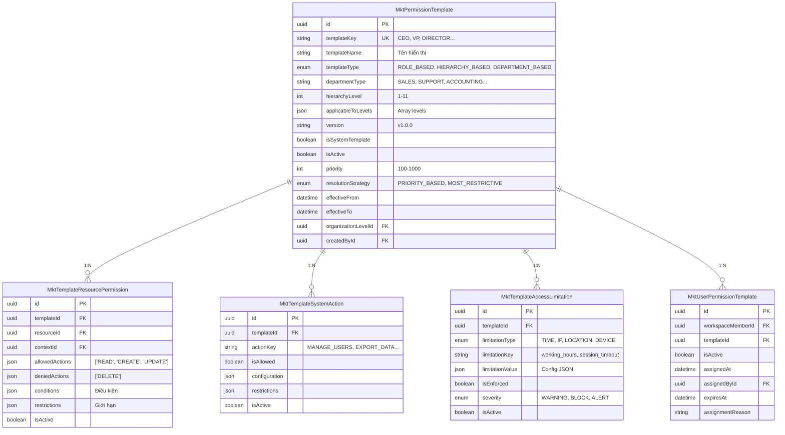
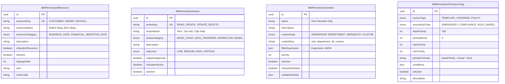
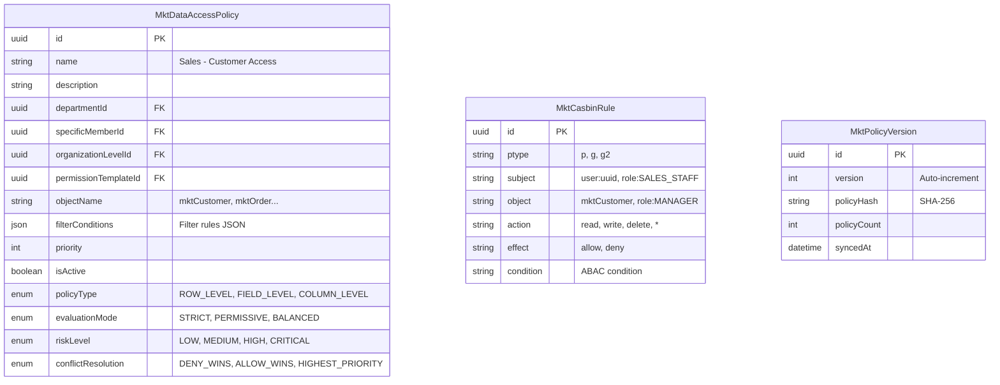
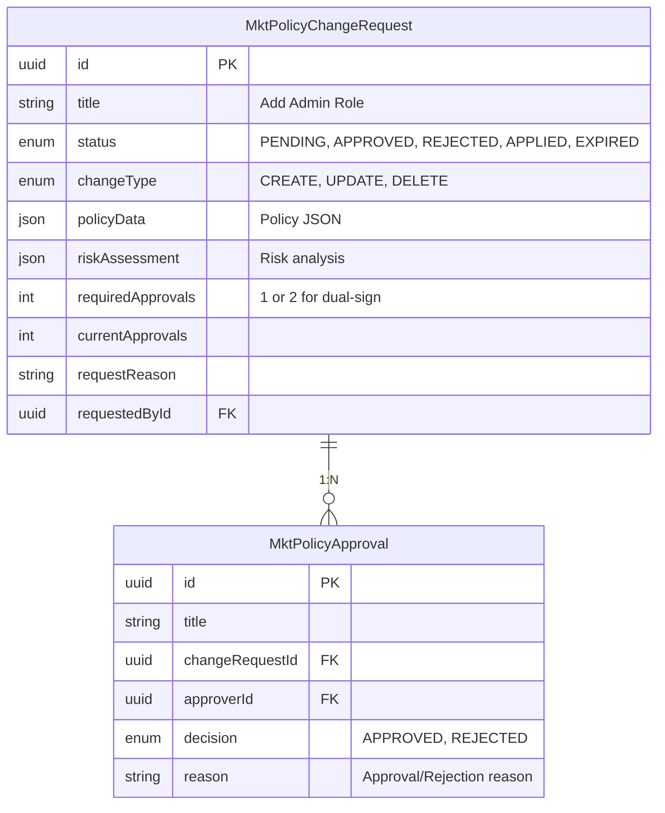
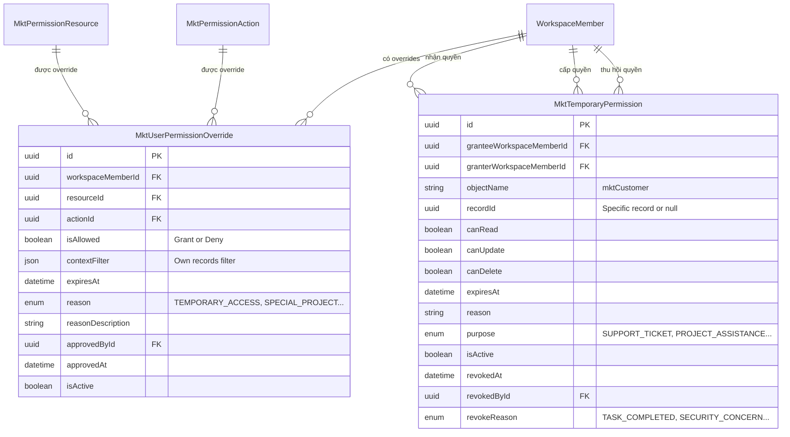
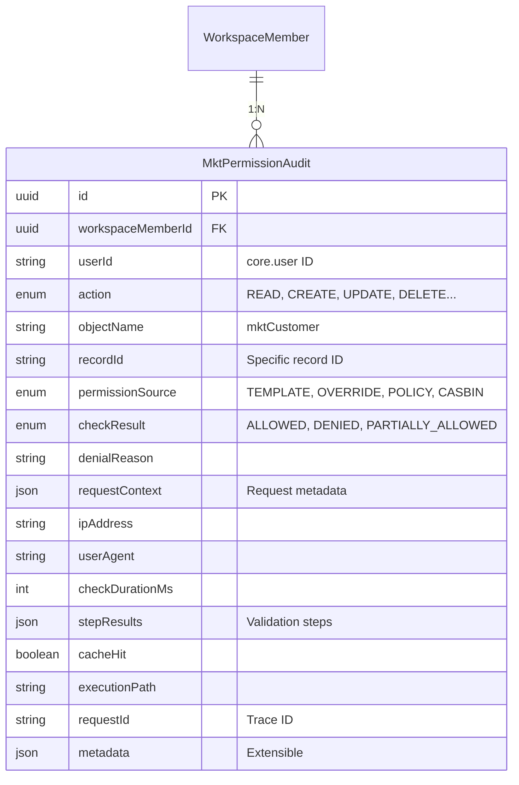
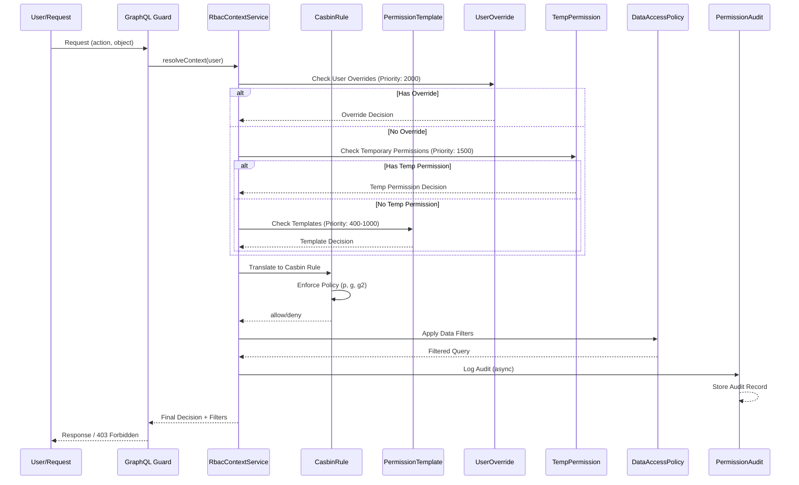
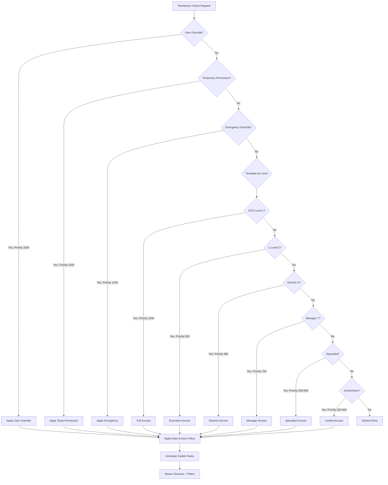

# Sơ đồ Mối quan hệ Entity trong Hệ thống RBAC

## Tổng quan

Tài liệu này mô tả mối quan hệ giữa các entity trong hệ thống phân quyền RBAC Enterprise Grade của CRM.

---

## 1. Entity Relationship Diagram - Tổng quan

```mermaid
erDiagram
    %% ==================== CORE ENTITIES ====================
    WorkspaceMember ||--o{ MktUserPermissionTemplate : "được gán"
    WorkspaceMember ||--o{ MktUserPermissionOverride : "có override"
    WorkspaceMember ||--o{ MktTemporaryPermission : "nhận quyền tạm"
    WorkspaceMember ||--o{ MktTemporaryPermission : "cấp quyền tạm"
    WorkspaceMember ||--o{ MktPermissionAudit : "tạo audit log"
    WorkspaceMember ||--o{ MktDataAccessPolicy : "áp dụng policy"

    %% ==================== TEMPLATE RELATIONSHIPS ====================
    MktPermissionTemplate ||--o{ MktTemplateResourcePermission : "chứa"
    MktPermissionTemplate ||--o{ MktTemplateSystemAction : "chứa"
    MktPermissionTemplate ||--o{ MktTemplateAccessLimitation : "chứa"
    MktPermissionTemplate ||--o{ MktUserPermissionTemplate : "được gán cho"
    MktPermissionTemplate ||--o{ MktDataAccessPolicy : "sinh ra"
    MktPermissionTemplate }o--|| MktOrganizationLevel : "thuộc về"

    %% ==================== RESOURCE & ACTION ====================
    MktPermissionResource ||--o{ MktTemplateResourcePermission : "được cấp quyền"
    MktPermissionResource ||--o{ MktUserPermissionOverride : "bị override"
    MktPermissionAction ||--o{ MktUserPermissionOverride : "bị override"
    MktPermissionContext ||--o{ MktTemplateResourcePermission : "áp dụng context"

    %% ==================== CASBIN POLICY ====================
    MktPolicyChangeRequest ||--o{ MktPolicyApproval : "cần approval"

    %% ==================== DEPARTMENT & ORG ====================
    MktDepartment ||--o{ MktDataAccessPolicy : "áp dụng"
    MktOrganizationLevel ||--o{ MktDataAccessPolicy : "áp dụng"
    MktOrganizationLevel ||--o{ MktPermissionTemplate : "có templates"
```

---

## 2. Chi tiết Entity theo Domain

### 2.1 Template Domain

### 2.2 Permission Domain

### 2.3 Policy Domain

### 2.4 Approval Workflow Domain

### 2.5 Override & Temporary Permission Domain

### 2.6 Audit Domain

---

## 3. Relationship với External Entities

```mermaid
flowchart TB
    subgraph "Core Entities"
        WM[WorkspaceMember]
        DEPT[MktDepartment]
        ORG[MktOrganizationLevel]
    end

    subgraph "Template Layer"
        PT[MktPermissionTemplate]
        TRP[MktTemplateResourcePermission]
        TSA[MktTemplateSystemAction]
        TAL[MktTemplateAccessLimitation]
        UPT[MktUserPermissionTemplate]
    end

    subgraph "Permission Layer"
        PR[MktPermissionResource]
        PA[MktPermissionAction]
        PC[MktPermissionContext]
        PPC[MktPermissionPriorityConfig]
    end

    subgraph "Policy Layer"
        DAP[MktDataAccessPolicy]
        CR[MktCasbinRule]
        PV[MktPolicyVersion]
    end

    subgraph "Override Layer"
        UPO[MktUserPermissionOverride]
        TP[MktTemporaryPermission]
    end

    subgraph "Approval Layer"
        PCR[MktPolicyChangeRequest]
        PAP[MktPolicyApproval]
    end

    subgraph "Audit Layer"
        PAU[MktPermissionAudit]
    end

    %% Core -> Template
    WM -->|được gán| UPT
    WM -->|tạo| PT
    ORG -->|có| PT

    %% Template -> Detail
    PT -->|chứa| TRP
    PT -->|chứa| TSA
    PT -->|chứa| TAL
    PT -->|gán cho| UPT
    PT -->|sinh ra| DAP

    %% Permission -> Template
    PR -->|trong| TRP
    PA -->|được override| UPO
    PC -->|áp dụng| TRP

    %% Core -> Policy
    DEPT -->|áp dụng| DAP
    ORG -->|áp dụng| DAP
    WM -->|áp dụng| DAP

    %% Override
    WM -->|có| UPO
    WM -->|nhận/cấp| TP
    PR -->|bị| UPO

    %% Approval
    PCR -->|cần| PAP
    WM -->|yêu cầu| PCR
    WM -->|phê duyệt| PAP

    %% Audit
    WM -->|tạo| PAU
```

---

## 4. Data Flow trong Hệ thống Phân quyền

---

## 5. Priority Resolution Flow

---

## 6. Bảng Tham chiếu Entity

| Entity | Domain | Mô tả | Priority |
|--------|--------|-------|----------|
| `MktPermissionTemplate` | Template | Template quyền theo hierarchy/department | 400-1000 |
| `MktTemplateResourcePermission` | Template | Quyền resource trong template | - |
| `MktTemplateSystemAction` | Template | System actions trong template | - |
| `MktTemplateAccessLimitation` | Template | Giới hạn truy cập | - |
| `MktUserPermissionTemplate` | Template | Gán template cho user | - |
| `MktPermissionResource` | Permission | Định nghĩa resources | - |
| `MktPermissionAction` | Permission | Định nghĩa actions | - |
| `MktPermissionContext` | Config | Context cho permissions | - |
| `MktPermissionPriorityConfig` | Config | Cấu hình priority động | - |
| `MktDataAccessPolicy` | Policy | Row/Field/Column level policy | - |
| `MktCasbinRule` | Casbin | Casbin authorization rules | - |
| `MktPolicyVersion` | Casbin | Version tracking for sync | - |
| `MktPolicyChangeRequest` | Approval | Yêu cầu thay đổi policy | - |
| `MktPolicyApproval` | Approval | Approval records | - |
| `MktUserPermissionOverride` | Override | Override quyền cho user | 2000 |
| `MktTemporaryPermission` | Override | Quyền tạm thời | 1500 |
| `MktPermissionAudit` | Audit | Audit log | - |

---

## 7. Cardinality Summary

| From Entity | Relationship | To Entity | Cardinality |
|-------------|--------------|-----------|-------------|
| WorkspaceMember | được gán | MktUserPermissionTemplate | 1:N |
| WorkspaceMember | có | MktUserPermissionOverride | 1:N |
| WorkspaceMember | nhận | MktTemporaryPermission | 1:N |
| WorkspaceMember | cấp | MktTemporaryPermission | 1:N |
| WorkspaceMember | tạo | MktPermissionAudit | 1:N |
| MktPermissionTemplate | chứa | MktTemplateResourcePermission | 1:N |
| MktPermissionTemplate | chứa | MktTemplateSystemAction | 1:N |
| MktPermissionTemplate | chứa | MktTemplateAccessLimitation | 1:N |
| MktPermissionTemplate | gán | MktUserPermissionTemplate | 1:N |
| MktPermissionTemplate | sinh ra | MktDataAccessPolicy | 1:N |
| MktPermissionTemplate | thuộc về | MktOrganizationLevel | N:1 |
| MktPermissionResource | trong | MktTemplateResourcePermission | 1:N |
| MktPermissionResource | bị override | MktUserPermissionOverride | 1:N |
| MktPermissionAction | bị override | MktUserPermissionOverride | 1:N |
| MktPermissionContext | áp dụng | MktTemplateResourcePermission | 1:N |
| MktPolicyChangeRequest | cần | MktPolicyApproval | 1:N |
| MktDepartment | áp dụng | MktDataAccessPolicy | 1:N |
| MktOrganizationLevel | áp dụng | MktDataAccessPolicy | 1:N |

---

*Tài liệu này được tạo tự động dựa trên phân tích code RBAC trong mkt-core module.*
*Cập nhật lần cuối: 2026-01-14*
