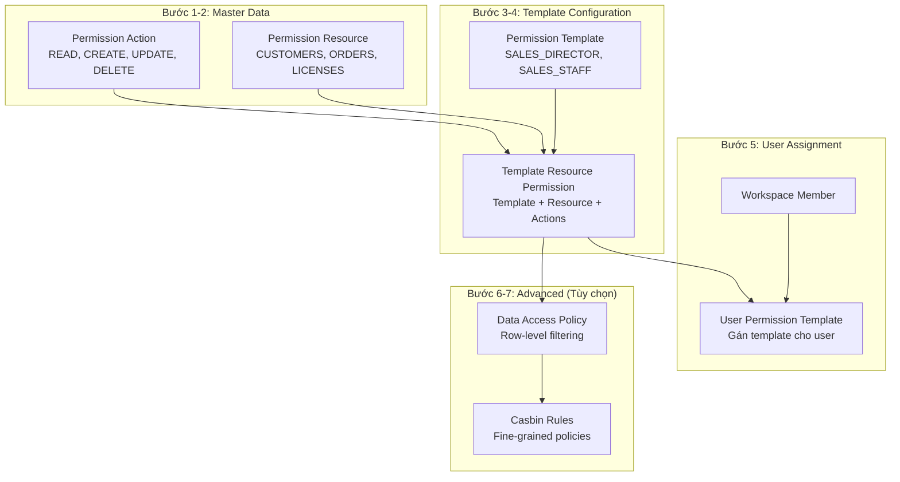
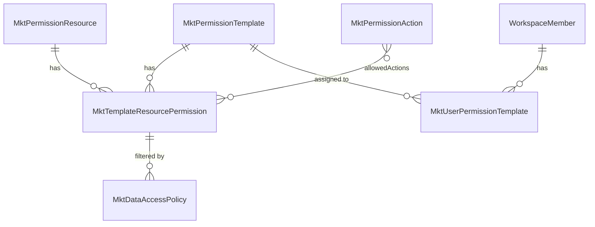
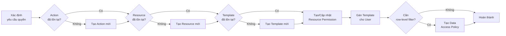
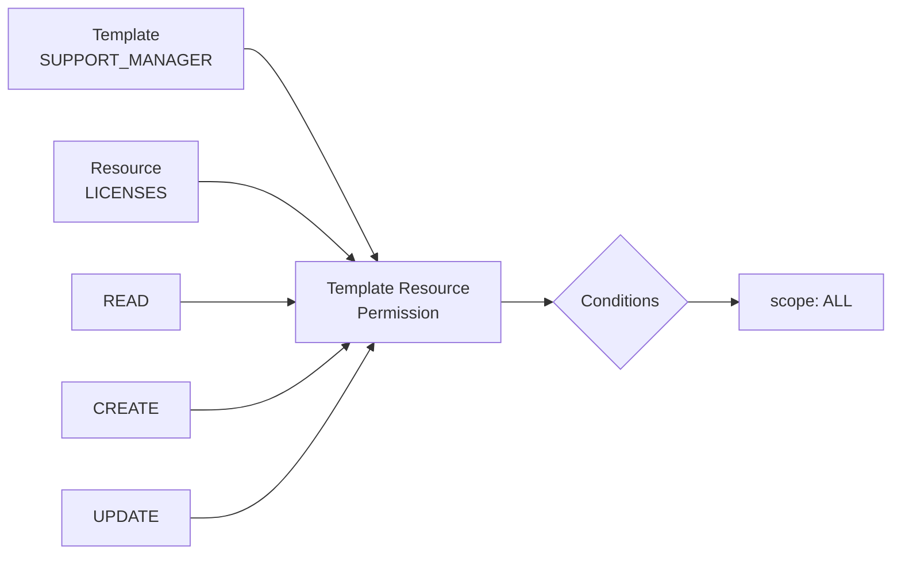
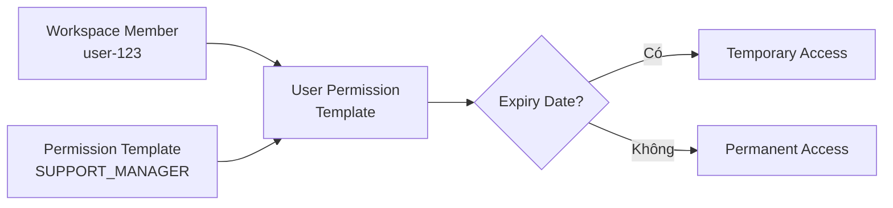

# Hướng Dẫn Thiết Lập Quyền Cho User

## Mục Lục

1. [Tổng Quan Kiến Trúc RBAC](#1-tổng-quan-kiến-trúc-rbac)
2. [Các Entity Liên Quan](#2-các-entity-liên-quan)
3. [Quy Trình Thiết Lập Quyền](#3-quy-trình-thiết-lập-quyền)
4. [Bước 1: Tạo Permission Actions](#4-bước-1-tạo-permission-actions)
5. [Bước 2: Tạo Permission Resources](#5-bước-2-tạo-permission-resources)
6. [Bước 3: Tạo Permission Template](#6-bước-3-tạo-permission-template)
7. [Bước 4: Tạo Template Resource Permissions](#7-bước-4-tạo-template-resource-permissions)
8. [Bước 5: Gán Template Cho User](#8-bước-5-gán-template-cho-user)
9. [Bước 6: Tạo Data Access Policy (Tùy Chọn)](#9-bước-6-tạo-data-access-policy-tùy-chọn)
10. [Bước 7: Tạo Casbin Rules (Tùy Chọn)](#10-bước-7-tạo-casbin-rules-tùy-chọn)
11. [Kiểm Tra Và Xác Minh](#11-kiểm-tra-và-xác-minh)
12. [Ví Dụ Hoàn Chỉnh](#12-ví-dụ-hoàn-chỉnh)
13. [Troubleshooting](#13-troubleshooting)

---

## 1. Tổng Quan Kiến Trúc RBAC

### 1.1 Sơ Đồ Luồng Phân Quyền



### 1.2 Thứ Tự Ưu Tiên Khi Kiểm Tra Quyền

| Thứ tự | Nguồn | Priority | Mô tả |
|--------|-------|----------|-------|
| 1 | User Override | 2000 | Quyền ghi đè cá nhân |
| 2 | Assigned Templates | 400-1000 | Templates được gán cho user |
| 3 | Executive Level | - | hierarchyLevel <= 3 |
| 4 | Manager Level | - | hierarchyLevel <= 7 |
| 5 | Department Membership | - | Thuộc department được phép |

---

## 2. Các Entity Liên Quan

### 2.1 Danh Sách Entity

| Entity | Bảng DB | Mô tả | Bắt buộc |
|--------|---------|-------|----------|
| `MktPermissionAction` | `mktPermissionAction` | Định nghĩa các action (READ, CREATE...) | Có |
| `MktPermissionResource` | `mktPermissionResource` | Định nghĩa các resource (CUSTOMERS...) | Có |
| `MktPermissionTemplate` | `mktPermissionTemplate` | Template quyền theo role/department | Có |
| `MktTemplateResourcePermission` | `mktTemplateResourcePermission` | Mapping template-resource-actions | Có |
| `MktUserPermissionTemplate` | `mktUserPermissionTemplate` | Gán template cho workspace member | Có |
| `MktDataAccessPolicy` | `mktDataAccessPolicy` | Row-level filtering | Không |
| `MktCasbinRule` | `mktCasbinRule` | Casbin policy rules | Không |

### 2.2 Quan Hệ Giữa Các Entity



---

## 3. Quy Trình Thiết Lập Quyền

### 3.1 Checklist Các Bước

```
□ Bước 1: Kiểm tra/Tạo Permission Actions (nếu cần action mới)
□ Bước 2: Kiểm tra/Tạo Permission Resources (nếu cần resource mới)
□ Bước 3: Tạo Permission Template cho role/department
□ Bước 4: Tạo Template Resource Permissions (mapping)
□ Bước 5: Gán Template cho User (workspace member)
□ Bước 6: Tạo Data Access Policy (nếu cần row-level filter)
□ Bước 7: Tạo Casbin Rules (nếu cần fine-grained control)
```

### 3.2 Sơ Đồ Quy Trình



---

## 4. Bước 1: Tạo Permission Actions

### 4.1 Kiểm Tra Actions Có Sẵn

Các actions mặc định đã được seed:

| Action Key | Mô tả | Risk Level |
|------------|-------|------------|
| `READ` | Xem dữ liệu | LOW |
| `CREATE` | Tạo mới | LOW |
| `UPDATE` | Cập nhật | MEDIUM |
| `DELETE` | Xóa | HIGH |
| `MANAGE` | Quản lý toàn bộ | HIGH |
| `EXPORT` | Xuất dữ liệu | MEDIUM |
| `IMPORT` | Nhập dữ liệu | HIGH |
| `APPROVE` | Duyệt | MEDIUM |
| `REJECT` | Từ chối | MEDIUM |
| `ARCHIVE` | Lưu trữ | MEDIUM |
| `RESTORE` | Khôi phục | HIGH |
| `ASSIGN` | Gán/Phân công | MEDIUM |

### 4.2 Tạo Action Mới (Nếu Cần)

**File:** `mkt-permission-action-data-seeds.constants.ts`

```typescript
// Thêm ID mới vào object
export const MKT_PERMISSION_ACTION_DATA_SEEDS_IDS = {
  // ... existing actions
  RENEW: 'your-uuid-here',  // Action mới
};

// Thêm data seed
export const MKT_PERMISSION_ACTION_DATA_SEEDS: MktPermissionActionDataSeed[] = [
  // ... existing actions
  {
    id: MKT_PERMISSION_ACTION_DATA_SEEDS_IDS.RENEW,
    actionKey: 'RENEW',
    actionName: 'Renew',
    actionCategory: PERMISSION_ACTION_CATEGORY.SYSTEM,
    description: 'Renew licenses or subscriptions',
    riskLevel: PERMISSION_RISK_LEVEL.MEDIUM,
    requiresApproval: false,
    isSystemAction: true,
    isActive: true,
    position: 13,
  },
];
```

### 4.3 Chạy Seeder

```bash
npx nx command twenty-server -- mkt-permission-action-data-seed-dev-workspace
```

---

## 5. Bước 2: Tạo Permission Resources

### 5.1 Kiểm Tra Resources Có Sẵn

| Resource Key | Category | Mô tả |
|--------------|----------|-------|
| `CUSTOMERS` | BUSINESS_DATA | Khách hàng |
| `ORDERS` | BUSINESS_DATA | Đơn hàng |
| `PRODUCTS` | BUSINESS_DATA | Sản phẩm |
| `LICENSES` | BUSINESS_DATA | License |
| `INVOICES` | FINANCIAL | Hóa đơn |
| `PAYMENTS` | FINANCIAL | Thanh toán |
| `DEPARTMENTS` | SYSTEM_CONFIG | Phòng ban |
| `USERS` | SYSTEM_CONFIG | Users |
| `REPORTS` | REPORTING | Báo cáo |
| `SETTINGS` | SYSTEM_CONFIG | Cài đặt |
| `CONTRACTS` | BUSINESS_DATA | Hợp đồng |
| `DASHBOARD` | REPORTING | Dashboard |

### 5.2 Tạo Resource Mới (Nếu Cần)

**File:** `mkt-permission-resource-data-seeds.constants.ts`

```typescript
// Thêm ID mới
export const MKT_PERMISSION_RESOURCE_DATA_SEEDS_IDS = {
  // ... existing resources
  TICKETS: 'your-uuid-here',  // Resource mới
};

// Thêm data seed
export const MKT_PERMISSION_RESOURCE_DATA_SEEDS: MktPermissionResourceDataSeed[] = [
  // ... existing resources
  {
    id: MKT_PERMISSION_RESOURCE_DATA_SEEDS_IDS.TICKETS,
    resourceKey: 'TICKETS',
    resourceName: 'Tickets',
    resourceCategory: PERMISSION_RESOURCE_CATEGORY.BUSINESS_DATA,
    description: 'Support tickets',
    isSystemResource: true,
    isActive: true,
    displayOrder: 13,
    icon: 'IconTicket',
    colorCode: '#FF6B6B',
    position: 13,
  },
];
```

### 5.3 Chạy Seeder

```bash
npx nx command twenty-server -- mkt-permission-resource-data-seed-dev-workspace
```

---

## 6. Bước 3: Tạo Permission Template

### 6.1 Các Loại Template

| Template Type | Mô tả | Use Case |
|---------------|-------|----------|
| `ROLE_BASED` | Theo vai trò | SENIOR, JUNIOR |
| `HIERARCHY_BASED` | Theo cấp bậc | CEO, VP, DIRECTOR, MANAGER |
| `DEPARTMENT_BASED` | Theo phòng ban | SALES_DIRECTOR, SUPPORT_STAFF |
| `CUSTOM` | Tùy chỉnh | Trường hợp đặc biệt |

### 6.2 Priority Guidelines

| Range | Mô tả | Ví dụ |
|-------|-------|-------|
| 900-1000 | Executive | CEO (1000), C_LEVEL (900) |
| 700-800 | Management | DIRECTOR (800), MANAGER (700) |
| 500-600 | Senior Staff | SENIOR (600), TEAM_LEAD (550) |
| 300-400 | Junior Staff | JUNIOR (400), SPECIALIST (350) |
| 100-200 | Entry Level | INTERN (100) |

### 6.3 Tạo Template Mới

**File:** `mkt-permission-template-data-seeds.constants.ts`

```typescript
// Thêm ID mới
export const MKT_PERMISSION_TEMPLATE_DATA_SEEDS_IDS = {
  // ... existing templates
  SUPPORT_MANAGER: 'your-uuid-here',
};

// Thêm data seed
export const MKT_PERMISSION_TEMPLATE_DATA_SEEDS: MktPermissionTemplateDataSeed[] = [
  // ... existing templates
  {
    id: MKT_PERMISSION_TEMPLATE_DATA_SEEDS_IDS.SUPPORT_MANAGER,
    templateKey: 'SUPPORT_MANAGER',
    templateName: 'Support Manager',
    description: 'Manager for support department with full license management',
    templateType: TEMPLATE_TYPE.DEPARTMENT_BASED,
    departmentType: 'SUPPORT',
    hierarchyLevel: 7,
    applicableToLevels: JSON.stringify([6, 7]),
    version: '1.0.0',
    isSystemTemplate: true,
    isActive: true,
    priority: 700,
    resolutionStrategy: RESOLUTION_STRATEGY.PRIORITY_BASED,
    createdBySource: CREATED_BY_SOURCE.SYSTEM,
    position: 12,
  },
];
```

### 6.4 Giải Thích Các Trường

| Trường | Mô tả | Ví dụ |
|--------|-------|-------|
| `templateKey` | Unique identifier | `SUPPORT_MANAGER` |
| `templateType` | Loại template | `DEPARTMENT_BASED` |
| `departmentType` | Phòng ban áp dụng | `SUPPORT`, `SALES`, `FINANCE` |
| `hierarchyLevel` | Level mặc định | 7 (Manager) |
| `applicableToLevels` | Các level có thể gán | `[6, 7]` |
| `priority` | Độ ưu tiên | 700 |
| `resolutionStrategy` | Cách xử lý conflict | `PRIORITY_BASED` |

### 6.5 Chạy Seeder

```bash
npx nx command twenty-server -- mkt-permission-template-data-seed-dev-workspace
```

---

## 7. Bước 4: Tạo Template Resource Permissions

### 7.1 Cấu Trúc Permission Mapping



### 7.2 Các Loại Scope

| Scope | Mô tả | Filter Logic |
|-------|-------|--------------|
| `ALL` | Tất cả records | Không filter |
| `DEPARTMENT` | Records trong department | `departmentId IN (dept + children)` |
| `TEAM` | Records của team | `createdById IN teamMemberIds` |
| `OWN` | Records của chính mình | `createdById = userId` |
| `ASSIGNED` | Records được assign | `assignedToId = userId` |
| `OWN_ORDERS` | Invoice của đơn hàng mình | `orderId IN (own orders)` |

### 7.3 Tạo Resource Permission

**File:** `mkt-template-resource-permission-data-seeds.constants.ts`

```typescript
// Thêm IDs
export const MKT_TEMPLATE_RESOURCE_PERMISSION_DATA_SEEDS_IDS = {
  // ... existing IDs
  SUPPORT_MANAGER_LICENSES: 'your-uuid-here',
  SUPPORT_MANAGER_CUSTOMERS: 'your-uuid-here-2',
};

// Thêm data seeds
export const MKT_TEMPLATE_RESOURCE_PERMISSION_DATA_SEEDS: MktTemplateResourcePermissionDataSeed[] = [
  // ... existing permissions

  // Support Manager - Full License access
  {
    id: MKT_TEMPLATE_RESOURCE_PERMISSION_DATA_SEEDS_IDS.SUPPORT_MANAGER_LICENSES,
    templateId: MKT_PERMISSION_TEMPLATE_DATA_SEEDS_IDS.SUPPORT_MANAGER,
    resourceId: MKT_PERMISSION_RESOURCE_DATA_SEEDS_IDS.LICENSES,
    allowedActions: JSON.stringify([
      MKT_PERMISSION_ACTION_DATA_SEEDS_IDS.READ,
      MKT_PERMISSION_ACTION_DATA_SEEDS_IDS.CREATE,
      MKT_PERMISSION_ACTION_DATA_SEEDS_IDS.UPDATE,
    ]),
    deniedActions: JSON.stringify([
      MKT_PERMISSION_ACTION_DATA_SEEDS_IDS.DELETE,
    ]),
    conditions: JSON.stringify({
      scope: 'ALL',
    }),
    restrictions: null,
    isActive: true,
  },

  // Support Manager - Read-only Customer with contact update
  {
    id: MKT_TEMPLATE_RESOURCE_PERMISSION_DATA_SEEDS_IDS.SUPPORT_MANAGER_CUSTOMERS,
    templateId: MKT_PERMISSION_TEMPLATE_DATA_SEEDS_IDS.SUPPORT_MANAGER,
    resourceId: MKT_PERMISSION_RESOURCE_DATA_SEEDS_IDS.CUSTOMERS,
    allowedActions: JSON.stringify([
      MKT_PERMISSION_ACTION_DATA_SEEDS_IDS.READ,
      MKT_PERMISSION_ACTION_DATA_SEEDS_IDS.UPDATE,
    ]),
    deniedActions: JSON.stringify([
      MKT_PERMISSION_ACTION_DATA_SEEDS_IDS.CREATE,
      MKT_PERMISSION_ACTION_DATA_SEEDS_IDS.DELETE,
    ]),
    conditions: JSON.stringify({
      scope: 'ALL',
      updateFields: ['phone', 'email', 'address'],  // Chỉ cho update các field này
    }),
    restrictions: null,
    isActive: true,
  },
];
```

### 7.4 Conditions Nâng Cao

```typescript
// Ví dụ conditions phức tạp
conditions: JSON.stringify({
  scope: 'TEAM',
  filterBy: 'accountOwnerId',          // Field dùng để filter
  updateFields: ['status', 'notes'],   // Các field được phép update
  viewStatusOnly: true,                // Chỉ xem status, không xem chi tiết
  requireApprovalForAmount: 10000000,  // Yêu cầu approval nếu vượt ngưỡng
})
```

### 7.5 Chạy Seeder

```bash
npx nx command twenty-server -- mkt-template-resource-permission-data-seed-dev-workspace
```

---

## 8. Bước 5: Gán Template Cho User

### 8.1 Cấu Trúc User Permission Template



### 8.2 Tạo Qua Seeder (Development)

**File:** `mkt-user-permission-template-data-seeds.constants.ts`

```typescript
type MktUserPermissionTemplateDataSeed = {
  id: string;
  workspaceMemberId: string;
  templateId: string;
  assignedByMemberId: string | null;
  expiresAt: string | null;  // ISO date string hoặc null
  isActive: boolean;
  priority: number;
  notes: string | null;
  position: number;
};

export const MKT_USER_PERMISSION_TEMPLATE_DATA_SEEDS: MktUserPermissionTemplateDataSeed[] = [
  {
    id: 'uuid-here',
    workspaceMemberId: 'workspace-member-uuid',  // ID của user trong workspace
    templateId: MKT_PERMISSION_TEMPLATE_DATA_SEEDS_IDS.SUPPORT_MANAGER,
    assignedByMemberId: 'admin-member-uuid',  // Người gán quyền
    expiresAt: null,  // null = permanent, hoặc '2024-12-31T23:59:59Z'
    isActive: true,
    priority: 700,  // Override priority nếu cần
    notes: 'Assigned for support department management',
    position: 1,
  },
];
```

### 8.3 Tạo Qua GraphQL API (Production)

```graphql
mutation AssignTemplateToUser {
  createMktUserPermissionTemplate(
    data: {
      workspaceMember: { connect: { id: "workspace-member-uuid" } }
      template: { connect: { id: "template-uuid" } }
      assignedByMember: { connect: { id: "admin-member-uuid" } }
      expiresAt: null
      isActive: true
      priority: 700
      notes: "Assigned via admin panel"
    }
  ) {
    id
    workspaceMember {
      id
      name {
        firstName
        lastName
      }
    }
    template {
      templateKey
      templateName
    }
    isActive
    expiresAt
  }
}
```

### 8.4 Tạo Qua Service (Backend Code)

```typescript
// Trong service
async assignTemplateToUser(
  workspaceMemberId: string,
  templateKey: string,
  assignedByMemberId: string,
  options?: {
    expiresAt?: Date;
    priority?: number;
    notes?: string;
  }
): Promise<MktUserPermissionTemplateWorkspaceEntity> {
  const repository = await this.twentyORMManager.getRepository(
    MktUserPermissionTemplateWorkspaceEntity,
  );

  // Tìm template
  const templateRepo = await this.twentyORMManager.getRepository(
    MktPermissionTemplateWorkspaceEntity,
  );
  const template = await templateRepo.findOne({
    where: { templateKey },
  });

  if (!template) {
    throw new NotFoundException(`Template ${templateKey} not found`);
  }

  // Kiểm tra đã assign chưa
  const existing = await repository.findOne({
    where: {
      workspaceMemberId,
      templateId: template.id,
      isActive: true,
    },
  });

  if (existing) {
    throw new ConflictException('Template already assigned to user');
  }

  // Tạo assignment mới
  const assignment = repository.create({
    workspaceMemberId,
    templateId: template.id,
    assignedByMemberId,
    expiresAt: options?.expiresAt ?? null,
    priority: options?.priority ?? template.priority,
    notes: options?.notes ?? null,
    isActive: true,
  });

  return repository.save(assignment);
}
```

### 8.5 Chạy Seeder

```bash
npx nx command twenty-server -- mkt-user-permission-template-data-seed-dev-workspace
```

---

## 9. Bước 6: Tạo Data Access Policy (Tùy Chọn)

### 9.1 Khi Nào Cần Data Access Policy

- Cần filter data theo row-level (chỉ xem records thuộc về mình)
- Cần ẩn/hiển thị columns theo role
- Cần áp dụng business rules phức tạp

### 9.2 Các Loại Policy

| Policy Type | Mô tả | Use Case |
|-------------|-------|----------|
| `ROW_LEVEL` | Filter theo row | Chỉ xem customers của mình |
| `FIELD_LEVEL` | Ẩn/hiện fields | Ẩn salary cho non-HR |
| `COLUMN_LEVEL` | Filter columns | Chỉ xem subset columns |

### 9.3 Ví Dụ Data Access Policy

```typescript
// Policy cho Sales - chỉ xem customers của mình
const SALES_CUSTOMER_ROW_POLICY = {
  name: 'Sales - Own Customer Access',
  objectName: 'mktCustomer',
  policyType: 'ROW_LEVEL',
  departmentCode: 'SALES',
  filterConditions: {
    type: 'OR',
    conditions: [
      {
        field: 'accountOwnerId',
        operator: '=',
        value: '${user.workspaceMemberId}'
      },
      {
        field: 'assignedToId',
        operator: '=',
        value: '${user.workspaceMemberId}'
      },
    ],
  },
  priority: 100,
  evaluationMode: 'BALANCED',
  conflictResolution: 'DENY_WINS',
  isActive: true,
};
```

### 9.4 Variables Có Thể Sử Dụng

| Variable | Mô tả |
|----------|-------|
| `${user.id}` | Core user ID |
| `${user.workspaceMemberId}` | Workspace member ID |
| `${user.departmentId}` | Department ID của user |
| `${user.departmentCode}` | Department code |
| `${user.hierarchyLevel}` | Hierarchy level |
| `${user.teamMemberIds}` | Array of team member IDs |

---

## 10. Bước 7: Tạo Casbin Rules (Tùy Chọn)

### 10.1 Khi Nào Cần Casbin Rules

- Cần fine-grained access control
- Cần policy inheritance
- Cần deny rules explicit

### 10.2 Casbin Rule Types

| PType | Mô tả | Format |
|-------|-------|--------|
| `p` | Policy rule | `p, role, resource, action, effect` |
| `g` | Role inheritance | `g, child_role, parent_role` |
| `g2` | Resource grouping | `g2, resource, group` |

### 10.3 Ví Dụ Casbin Rules

```sql
-- Policy rules (p)
INSERT INTO "mktCasbinRule" (ptype, v0, v1, v2, v3) VALUES
('p', 'role:SUPPORT_MANAGER', 'mktLicense', 'read', 'allow'),
('p', 'role:SUPPORT_MANAGER', 'mktLicense', 'create', 'allow'),
('p', 'role:SUPPORT_MANAGER', 'mktLicense', 'update', 'allow'),
('p', 'role:SUPPORT_MANAGER', 'mktLicense', 'delete', 'deny'),
('p', 'role:SUPPORT_MANAGER', 'mktCustomer', 'read', 'allow'),
('p', 'role:SUPPORT_MANAGER', 'mktCustomer', 'update', 'allow');

-- Role inheritance (g)
INSERT INTO "mktCasbinRule" (ptype, v0, v1) VALUES
('g', 'role:SUPPORT_MANAGER', 'role:SUPPORT_STAFF'),  -- Manager kế thừa Staff
('g', 'user:member-123', 'role:SUPPORT_MANAGER');     -- User có role Manager
```

---

## 11. Kiểm Tra Và Xác Minh

### 11.1 Query Kiểm Tra Quyền User

```sql
-- Lấy tất cả templates được gán cho user
SELECT
  upt.id,
  wm."userId",
  pt."templateKey",
  pt."templateName",
  pt.priority,
  upt."isActive",
  upt."expiresAt"
FROM "mktUserPermissionTemplate" upt
JOIN "workspaceMember" wm ON upt."workspaceMemberId" = wm.id
JOIN "mktPermissionTemplate" pt ON upt."templateId" = pt.id
WHERE wm.id = 'workspace-member-uuid'
  AND upt."isActive" = true
  AND (upt."expiresAt" IS NULL OR upt."expiresAt" > NOW())
ORDER BY upt.priority DESC;
```

### 11.2 Query Kiểm Tra Resource Permissions

```sql
-- Lấy chi tiết quyền trên từng resource
SELECT
  pt."templateKey",
  pr."resourceKey",
  trp."allowedActions",
  trp."deniedActions",
  trp.conditions
FROM "mktUserPermissionTemplate" upt
JOIN "mktPermissionTemplate" pt ON upt."templateId" = pt.id
JOIN "mktTemplateResourcePermission" trp ON trp."templateId" = pt.id
JOIN "mktPermissionResource" pr ON trp."resourceId" = pr.id
WHERE upt."workspaceMemberId" = 'workspace-member-uuid'
  AND upt."isActive" = true
  AND trp."isActive" = true
ORDER BY pt.priority DESC, pr."displayOrder";
```

### 11.3 GraphQL Query Kiểm Tra

```graphql
query GetUserPermissions {
  mktUserPermissionTemplates(
    filter: {
      workspaceMemberId: { eq: "workspace-member-uuid" }
      isActive: { eq: true }
    }
  ) {
    edges {
      node {
        id
        template {
          templateKey
          templateName
          priority
          templateResourcePermissions {
            edges {
              node {
                resource {
                  resourceKey
                  resourceName
                }
                allowedActions
                deniedActions
                conditions
              }
            }
          }
        }
        isActive
        expiresAt
      }
    }
  }
}
```

### 11.4 Sử Dụng RbacContextService

```typescript
// Trong resolver hoặc service
const userContext = await this.rbacContextService.resolveContext(
  userId,
  workspaceId,
);

console.log('User Context:', {
  departmentCode: userContext.departmentCode,
  hierarchyLevel: userContext.hierarchyLevel,
  templates: userContext.templates,
  templateKeys: userContext.templateKeys,
});
```

---

## 12. Ví Dụ Hoàn Chỉnh

### 12.1 Scenario: Thêm Quyền Cho Support Staff Mới

**Yêu cầu:**
- User: Nguyễn Văn A (Support Specialist)
- Quyền: Quản lý license, xem customers

**Bước 1: Kiểm tra Actions** - Đã có (READ, CREATE, UPDATE)

**Bước 2: Kiểm tra Resources** - Đã có (LICENSES, CUSTOMERS)

**Bước 3: Kiểm tra Template** - Đã có SUPPORT_STAFF hoặc tạo mới

**Bước 4: Kiểm tra Resource Permissions** - Đã mapping

**Bước 5: Gán Template**

```graphql
mutation {
  createMktUserPermissionTemplate(
    data: {
      workspaceMember: { connect: { id: "nguyen-van-a-member-id" } }
      template: { connect: { templateKey: "SUPPORT_STAFF" } }
      assignedByMember: { connect: { id: "admin-id" } }
      isActive: true
      notes: "Onboarding - Support Specialist position"
    }
  ) {
    id
    template {
      templateKey
    }
  }
}
```

### 12.2 Scenario: Tạo Template Mới Cho Marketing

**Bước 1-2:** Actions và Resources đã có

**Bước 3: Tạo Template**

```typescript
{
  id: 'marketing-manager-uuid',
  templateKey: 'MARKETING_MANAGER',
  templateName: 'Marketing Manager',
  description: 'Marketing department manager with campaign and analytics access',
  templateType: TEMPLATE_TYPE.DEPARTMENT_BASED,
  departmentType: 'MARKETING',
  hierarchyLevel: 7,
  applicableToLevels: JSON.stringify([6, 7]),
  version: '1.0.0',
  isSystemTemplate: true,
  isActive: true,
  priority: 700,
  resolutionStrategy: RESOLUTION_STRATEGY.PRIORITY_BASED,
  createdBySource: CREATED_BY_SOURCE.SYSTEM,
  position: 15,
}
```

**Bước 4: Tạo Resource Permissions**

```typescript
// Marketing Manager - Customer READ access
{
  id: 'mm-customers-uuid',
  templateId: 'marketing-manager-uuid',
  resourceId: MKT_PERMISSION_RESOURCE_DATA_SEEDS_IDS.CUSTOMERS,
  allowedActions: JSON.stringify([
    MKT_PERMISSION_ACTION_DATA_SEEDS_IDS.READ,
    MKT_PERMISSION_ACTION_DATA_SEEDS_IDS.EXPORT,
  ]),
  deniedActions: JSON.stringify([
    MKT_PERMISSION_ACTION_DATA_SEEDS_IDS.CREATE,
    MKT_PERMISSION_ACTION_DATA_SEEDS_IDS.UPDATE,
    MKT_PERMISSION_ACTION_DATA_SEEDS_IDS.DELETE,
  ]),
  conditions: JSON.stringify({ scope: 'ALL' }),
  restrictions: null,
  isActive: true,
},
// Marketing Manager - Reports FULL access
{
  id: 'mm-reports-uuid',
  templateId: 'marketing-manager-uuid',
  resourceId: MKT_PERMISSION_RESOURCE_DATA_SEEDS_IDS.REPORTS,
  allowedActions: JSON.stringify([
    MKT_PERMISSION_ACTION_DATA_SEEDS_IDS.READ,
    MKT_PERMISSION_ACTION_DATA_SEEDS_IDS.CREATE,
    MKT_PERMISSION_ACTION_DATA_SEEDS_IDS.UPDATE,
    MKT_PERMISSION_ACTION_DATA_SEEDS_IDS.EXPORT,
  ]),
  deniedActions: JSON.stringify([
    MKT_PERMISSION_ACTION_DATA_SEEDS_IDS.DELETE,
  ]),
  conditions: JSON.stringify({ scope: 'DEPARTMENT' }),
  restrictions: null,
  isActive: true,
},
```

**Bước 5: Gán cho Users**

```bash
# Chạy seeders
npx nx command twenty-server -- mkt-permission-template-data-seed-dev-workspace
npx nx command twenty-server -- mkt-template-resource-permission-data-seed-dev-workspace
npx nx command twenty-server -- mkt-user-permission-template-data-seed-dev-workspace
```

---

## 13. Troubleshooting

### 13.1 User Không Có Quyền Mặc Dù Đã Gán Template

**Kiểm tra:**

1. Template có `isActive: true` không?
2. User Permission Template có `isActive: true` không?
3. Template Resource Permission có `isActive: true` không?
4. `expiresAt` đã qua chưa?
5. Action có trong `allowedActions` không?
6. Action có trong `deniedActions` không (deny wins)?

```sql
-- Debug query
SELECT
  'Template' as check_type,
  pt.id,
  pt."templateKey",
  pt."isActive"
FROM "mktPermissionTemplate" pt
WHERE pt."templateKey" = 'SUPPORT_STAFF'

UNION ALL

SELECT
  'UserAssignment' as check_type,
  upt.id,
  pt."templateKey",
  upt."isActive"
FROM "mktUserPermissionTemplate" upt
JOIN "mktPermissionTemplate" pt ON upt."templateId" = pt.id
WHERE upt."workspaceMemberId" = 'user-member-id'

UNION ALL

SELECT
  'ResourcePermission' as check_type,
  trp.id,
  pr."resourceKey",
  trp."isActive"
FROM "mktTemplateResourcePermission" trp
JOIN "mktPermissionResource" pr ON trp."resourceId" = pr.id
JOIN "mktPermissionTemplate" pt ON trp."templateId" = pt.id
WHERE pt."templateKey" = 'SUPPORT_STAFF';
```

### 13.2 Permission Cache Không Update

```typescript
// Invalidate cache sau khi thay đổi permission
await this.rbacCacheService.invalidateUserPermissions(
  workspaceId,
  workspaceMemberId,
);

// Hoặc invalidate toàn bộ workspace
await this.rbacCacheService.invalidateWorkspacePermissions(workspaceId);
```

### 13.3 Priority Conflict

Khi user có nhiều templates với các quyền conflict:

1. Template có `priority` cao hơn sẽ thắng
2. Nếu cùng priority, `DENY` thắng `ALLOW`
3. Kiểm tra `resolutionStrategy` của template

### 13.4 Scope Filter Không Hoạt Động

Kiểm tra:
1. `conditions.scope` có đúng format không
2. `conditions.filterBy` trỏ đến đúng field không
3. Data Access Policy có được tạo không

---

## Phụ Lục

### A. Danh Sách Seeder Commands

```bash
# Permission Actions
npx nx command twenty-server -- mkt-permission-action-data-seed-dev-workspace

# Permission Resources
npx nx command twenty-server -- mkt-permission-resource-data-seed-dev-workspace

# Permission Templates
npx nx command twenty-server -- mkt-permission-template-data-seed-dev-workspace

# Template Resource Permissions
npx nx command twenty-server -- mkt-template-resource-permission-data-seed-dev-workspace

# User Permission Templates
npx nx command twenty-server -- mkt-user-permission-template-data-seed-dev-workspace

# Casbin Rules
npx nx command twenty-server -- mkt-casbin-rule-data-seed-dev-workspace
```

### B. File Locations

```
packages/twenty-server/src/mkt-core/seeder/rbac-seeder/
├── mkt-permission-template-seeder/
│   ├── mkt-permission-action/
│   │   └── mkt-permission-action-data-seeds.constants.ts
│   ├── mkt-permission-resource/
│   │   └── mkt-permission-resource-data-seeds.constants.ts
│   ├── mkt-permission-template/
│   │   └── mkt-permission-template-data-seeds.constants.ts
│   ├── mkt-template-resource-permission/
│   │   └── mkt-template-resource-permission-data-seeds.constants.ts
│   └── mkt-user-permission-template/
│       └── mkt-user-permission-template-data-seeds.constants.ts
└── casbin-seeder/
    └── mkt-casbin-rule/
        └── mkt-casbin-rule-data-seeds.constants.ts
```

### C. UUID Generation

Sử dụng online tool hoặc command:

```bash
# Linux/Mac
uuidgen

# Node.js
node -e "console.log(require('crypto').randomUUID())"
```

---

*Tài liệu được tạo: 2026-01-15*
*Phiên bản: 1.0.0*
