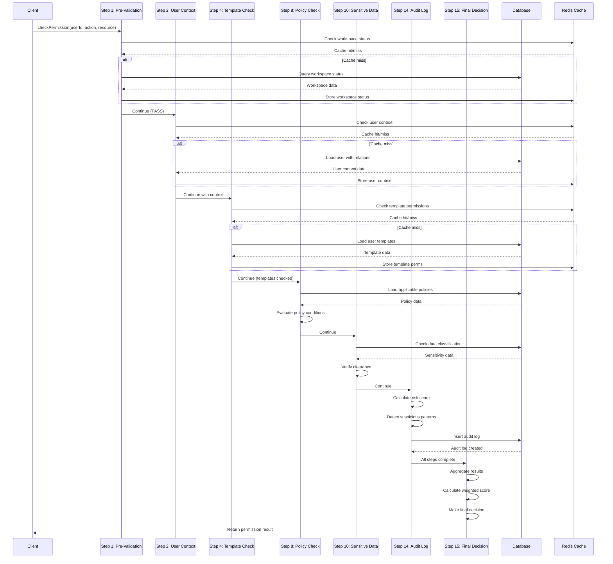

# Hướng Dẫn Toàn Diện: Hệ Thống RBAC 15 Bước Xác Thực Enterprise-Grade

## Tổng Quan (Overview)

Hệ thống RBAC (Role-Based Access Control) 15 bước là một giải pháp phân quyền cấp doanh nghiệp (enterprise-grade) được thiết kế để đảm bảo bảo mật, tuân thủ (compliance) và hiệu suất cao. Mỗi request kiểm tra quyền sẽ đi qua 15 bước validation độc lập, tạo thành một chuỗi kiểm tra toàn diện.

### Đặc Điểm Chính (Key Features)

- **15 bước validation độc lập**: Mỗi bước có trách nhiệm riêng, có thể skip hoặc bắt buộc
- **Weighted scoring system**: Mỗi bước có trọng số khác nhau, ảnh hưởng đến quyết định cuối cùng
- **Comprehensive audit logging**: Ghi lại mọi hoạt động để tuân thủ GDPR, SOX, PCI-DSS
- **Performance optimization**: Caching thông minh, lazy loading, batch processing
- **Risk-based decision making**: Tính toán risk score để đưa ra quyết định thông minh
- **Multi-level hierarchy support**: Hỗ trợ cấu trúc tổ chức phân cấp (organizational hierarchy)
- **Dynamic policy engine**: Áp dụng policies dựa trên context động

### Kiến Trúc Tổng Thể (High-Level Architecture)

```mermaid
flowchart TD
    Start[Permission Check Request] --> Step1[Step 1: Pre-Validation]
    Step1 --> Step2[Step 2: User Context Resolution]
    Step2 --> Step3[Step 3: Resource Identification]
    Step3 --> Step4[Step 4: Permission Template Check]
    Step4 --> Step5[Step 5: Action Permission Validation]
    Step5 --> Step6[Step 6: Resource Permission Check]
    Step6 --> Step7[Step 7: Hierarchy Validation]
    Step7 --> Step8[Step 8: Data Access Policy Check]
    Step8 --> Step9[Step 9: Special Permissions]
    Step9 --> Step10[Step 10: Sensitive Data Checks]
    Step10 --> Step11[Step 11: Department Restrictions]
    Step11 --> Step12[Step 12: Dynamic Conditions]
    Step12 --> Step13[Step 13: Cache & Performance]
    Step13 --> Step14[Step 14: Audit Logging]
    Step14 --> Step15[Step 15: Final Decision]
    Step15 --> End[Permission Result]

    style Step1 fill:#ff6b6b
    style Step2 fill:#ee5a6f
    style Step3 fill:#c44569
    style Step4 fill:#f8b500
    style Step5 fill:#f39c12
    style Step6 fill:#e67e22
    style Step7 fill:#3498db
    style Step8 fill:#2980b9
    style Step9 fill:#9b59b6
    style Step10 fill:#e74c3c
    style Step11 fill:#1abc9c
    style Step12 fill:#16a085
    style Step13 fill:#95a5a6
    style Step14 fill:#34495e
    style Step15 fill:#2c3e50
```



---

## Database Schema Overview

### 1. mktPermissionTemplate (Permission Templates)

Bảng lưu trữ các template quyền (permission templates) - các bộ quyền được định nghĩa trước.

```sql
CREATE TABLE mktPermissionTemplate (
    id UUID PRIMARY KEY DEFAULT uuid_generate_v4(),
    templateKey TEXT NOT NULL,              -- Unique identifier (e.g., 'SALES_MANAGER')
    templateName TEXT NOT NULL,             -- Display name
    description TEXT,
    hierarchyLevel DOUBLE PRECISION NOT NULL, -- Level in organization (1-10)
    applicableToLevels JSONB NOT NULL,      -- Which levels can use this template
    version TEXT NOT NULL,                  -- Template version
    isSystemTemplate BOOLEAN NOT NULL DEFAULT false,
    isActive BOOLEAN NOT NULL DEFAULT true,
    priority DOUBLE PRECISION NOT NULL DEFAULT 100,
    createdBySource TEXT NOT NULL,
    lastModifiedBy TEXT,
    lastModifiedAt TIMESTAMP WITH TIME ZONE,
    createdAt TIMESTAMP WITH TIME ZONE NOT NULL DEFAULT now(),
    updatedAt TIMESTAMP WITH TIME ZONE NOT NULL DEFAULT now(),
    deletedAt TIMESTAMP WITH TIME ZONE
);
```

**Ý nghĩa các trường quan trọng:**
- `templateKey`: Khóa duy nhất định danh template (VD: 'CEO', 'SALES_MANAGER', 'STAFF')
- `hierarchyLevel`: Cấp bậc trong tổ chức (1 = cao nhất, 10 = thấp nhất)
- `applicableToLevels`: JSON object chứa các level có thể áp dụng template này
- `priority`: Độ ưu tiên khi có nhiều templates conflict

### 2. mktUserPermissionTemplate (User-Template Assignments)

Bảng gán user với permission templates.

```sql
CREATE TABLE mktUserPermissionTemplate (
    id UUID PRIMARY KEY DEFAULT uuid_generate_v4(),
    workspaceMemberId UUID,                 -- FK to workspaceMember
    templateId UUID,                        -- FK to mktPermissionTemplate
    assignedById UUID,                      -- Who assigned this
    isActive BOOLEAN NOT NULL DEFAULT true,
    assignedAt TIMESTAMP WITH TIME ZONE NOT NULL,
    expiresAt TIMESTAMP WITH TIME ZONE,     -- Optional expiration
    assignmentReason TEXT NOT NULL DEFAULT '',
    createdAt TIMESTAMP WITH TIME ZONE NOT NULL DEFAULT now(),
    updatedAt TIMESTAMP WITH TIME ZONE NOT NULL DEFAULT now(),
    deletedAt TIMESTAMP WITH TIME ZONE
);
```

**Quan hệ:**
- Một user có thể có nhiều templates (N-N relationship)
- Mỗi assignment có thời hạn (expiresAt) và lý do (assignmentReason)
- Hỗ trợ soft delete (deletedAt)

### 3. mktUserPermissionOverride (Permission Overrides)

Bảng lưu trữ các override quyền - cho phép hoặc từ chối quyền cụ thể.

```sql
CREATE TABLE mktUserPermissionOverride (
    id UUID PRIMARY KEY DEFAULT uuid_generate_v4(),
    workspaceMemberId UUID,                 -- FK to workspaceMember
    actionId UUID,                          -- FK to mktPermissionAction
    resourceId UUID,                        -- FK to mktPermissionResource
    approvedById UUID,                      -- Who approved this override
    isAllowed BOOLEAN NOT NULL DEFAULT false, -- Grant or deny
    contextFilter JSONB NOT NULL,           -- Additional conditions
    expiresAt TIMESTAMP WITH TIME ZONE NOT NULL,
    reason TEXT NOT NULL,                   -- Enum: EMERGENCY, TEMPORARY, AUDIT, etc.
    reasonDescription TEXT NOT NULL DEFAULT '',
    approvedAt TIMESTAMP WITH TIME ZONE NOT NULL,
    isActive BOOLEAN NOT NULL DEFAULT true,
    createdAt TIMESTAMP WITH TIME ZONE NOT NULL DEFAULT now(),
    updatedAt TIMESTAMP WITH TIME ZONE NOT NULL DEFAULT now(),
    deletedAt TIMESTAMP WITH TIME ZONE
);
```

**Use cases:**
- Emergency access: Cấp quyền tạm thời trong tình huống khẩn cấp
- Temporary assignments: Quyền tạm thời cho dự án đặc biệt
- Explicit denials: Từ chối quyền cụ thể ngay cả khi template cho phép

### 4. mktDataAccessPolicy (Data Access Policies)

Bảng định nghĩa các chính sách truy cập dữ liệu dựa trên điều kiện.

```sql
CREATE TABLE mktDataAccessPolicy (
    id UUID PRIMARY KEY DEFAULT uuid_generate_v4(),
    name TEXT NOT NULL,
    description TEXT,
    objectName TEXT NOT NULL,               -- Target object (table/entity)
    minHierarchyLevel DOUBLE PRECISION,     -- Minimum hierarchy level
    maxHierarchyLevel DOUBLE PRECISION,     -- Maximum hierarchy level
    filterConditions JSONB NOT NULL,        -- Dynamic filter conditions
    priority DOUBLE PRECISION DEFAULT 0,    -- Policy priority
    isActive BOOLEAN DEFAULT true,
    departmentId UUID,                      -- Restrict to department
    organizationLevelId UUID,               -- Restrict to org level
    permissionTemplateId UUID,              -- Link to template
    specificMemberId UUID,                  -- Individual user policy
    createdAt TIMESTAMP WITH TIME ZONE NOT NULL DEFAULT now(),
    updatedAt TIMESTAMP WITH TIME ZONE NOT NULL DEFAULT now(),
    deletedAt TIMESTAMP WITH TIME ZONE
);
```

**Filter conditions example:**
```json
{
  "ownedBy": "${userId}",
  "department": "${userDepartment}",
  "createdAt": { "$gte": "2024-01-01" },
  "status": { "$in": ["ACTIVE", "PENDING"] }
}
```

### 5. mktPermissionAudit (Audit Logs)

Bảng ghi lại mọi permission check để audit và compliance.

```sql
CREATE TABLE mktPermissionAudit (
    id UUID PRIMARY KEY DEFAULT uuid_generate_v4(),
    workspaceMemberId UUID,
    userId TEXT,
    action TEXT NOT NULL,                   -- READ, CREATE, UPDATE, DELETE, etc.
    objectName TEXT NOT NULL,               -- Target object/resource
    recordId TEXT,                          -- Specific record ID
    permissionSource TEXT,                  -- How permission was granted
    checkResult TEXT NOT NULL,              -- PASS, FAIL, WARNING, ERROR
    denialReason TEXT,
    requestContext JSONB,                   -- Full context including risk score
    ipAddress TEXT,
    userAgent TEXT,
    checkDurationMs DOUBLE PRECISION,       -- Performance tracking
    createdAt TIMESTAMP WITH TIME ZONE NOT NULL DEFAULT now(),
    updatedAt TIMESTAMP WITH TIME ZONE NOT NULL DEFAULT now(),
    deletedAt TIMESTAMP WITH TIME ZONE
);
```

**requestContext structure:**
```json
{
  "requestId": "uuid",
  "sessionId": "uuid",
  "resourceType": "Invoice",
  "riskScore": 45,
  "severity": "MEDIUM",
  "eventType": "PERMISSION_CHECK",
  "eventCategory": "PERMISSION",
  "involvesSensitiveData": false,
  "involvesPersonalData": true,
  "involvesFinancialData": false,
  "complianceFrameworks": ["GDPR", "ISO_27001"],
  "validationSteps": ["Step1", "Step2", ...],
  "failedSteps": [],
  "metadata": { ... },
  "securityAlert": { ... }  // If high risk detected
}
```

### 6. workspaceMember (User Information)

Bảng lưu trữ thông tin user trong workspace.

```sql
CREATE TABLE workspaceMember (
    id UUID PRIMARY KEY DEFAULT uuid_generate_v4(),
    userId UUID NOT NULL,
    userEmail TEXT NOT NULL,
    nameFirstName TEXT,
    nameLastName TEXT,
    departmentId UUID,                      -- FK to mktDepartment
    organizationLevelId UUID,               -- FK to mktOrganizationLevel
    employmentStatusId UUID,                -- FK to mktEmploymentStatus
    avatarUrl TEXT,
    locale TEXT DEFAULT 'en',
    timeZone TEXT DEFAULT 'system',
    createdAt TIMESTAMP WITH TIME ZONE NOT NULL DEFAULT now(),
    updatedAt TIMESTAMP WITH TIME ZONE NOT NULL DEFAULT now(),
    deletedAt TIMESTAMP WITH TIME ZONE
);
```

---

## Chi Tiết 15 Bước Validation

### Step 1: Pre-Validation (Tiền Xác Thực)

**File:** `step1-pre-validation.service.ts`

**Mục đích:** Kiểm tra các điều kiện cơ bản trước khi bắt đầu validation chính thức.

**Logic:**
1. Validate input parameters (userId, action, resource)
2. Check workspace status (active/inactive)
3. Verify user exists and is active
4. Check for system maintenance mode
5. Validate request context integrity

**Database Queries:**
```typescript
// Check workspace member exists and is active
const member = await workspaceMemberRepo.findOne({
  where: { id: workspaceMemberId, deletedAt: IsNull() }
});

// Check if user has any active templates
const activeTemplates = await userTemplateRepo.count({
  where: {
    workspaceMemberId,
    isActive: true,
    deletedAt: IsNull()
  }
});
```

**Performance:**
- Execution time: ~20-50ms
- Cacheable: Workspace status (TTL: 5 minutes)
- Critical: Yes - blocks all subsequent steps if fails

**Caching Strategy:**
```typescript
// Cache workspace status
cacheKey: `workspace:${workspaceId}:status`
TTL: 300000 // 5 minutes

// Cache user existence
cacheKey: `user:${userId}:exists`
TTL: 60000 // 1 minute
```

**Exit Conditions:**
- FAIL: User không tồn tại, workspace inactive, invalid parameters
- PASS: Tất cả điều kiện cơ bản thỏa mãn
- Weight: 100 (Critical - highest priority)

---

### Step 2: User Context Resolution (Phân Giải Context Người Dùng)

**File:** `step2-user-context-resolution.service.ts`

**Mục đích:** Thu thập và xây dựng full context của user (department, hierarchy, role, etc.)

**Logic:**
1. Load workspaceMember with all relationships
2. Resolve department hierarchy
3. Get organization level
4. Fetch user's permission templates
5. Build enhanced user context object

**Database Queries:**
```typescript
// Get workspace member with relations
const member = await workspaceMemberRepo.findOne({
  where: { id: workspaceMemberId },
  relations: ['department', 'organizationLevel', 'employmentStatus']
});

// Get all active permission templates for user
const userTemplates = await userTemplateRepo.find({
  where: {
    workspaceMemberId,
    isActive: true,
    OR: [
      { expiresAt: IsNull() },
      { expiresAt: MoreThan(new Date()) }
    ]
  },
  relations: ['template']
});

// Get department hierarchy
const departmentHierarchy = await departmentHierarchyRepo.find({
  where: { descendantId: member.departmentId }
});
```

**EnhancedUserContext Structure:**
```typescript
{
  userId: string;
  workspaceMemberId: string;
  workspaceId: string;
  departmentId: string;
  departmentName: string;
  departmentPath: string[];  // Full hierarchy path
  organizationLevelId: string;
  hierarchyLevel: number;    // 1-10
  isActive: boolean;
  permissionTemplates: PermissionTemplate[];
  metadata: {
    employmentStatus: string;
    hireDate: Date;
    lastLogin: Date;
  }
}
```

**Performance:**
- Execution time: ~30-80ms
- Cacheable: User context (TTL: 10 minutes)
- Critical: Yes

**Caching Strategy:**
```typescript
cacheKey: `user:${userId}:context`
TTL: 600000 // 10 minutes
invalidateOn: ['user:update', 'department:change', 'template:assign']
```

**Exit Conditions:**
- FAIL: Không tìm thấy user context
- PASS: Context được build thành công
- Weight: 90

---

### Step 3: Resource Identification (Nhận Diện Tài Nguyên)

**File:** `step3-resource-identification.service.ts`

**Mục đích:** Xác định chính xác resource đang được truy cập và metadata của nó.

**Logic:**
1. Parse resource type từ request
2. Validate resource exists trong hệ thống
3. Load resource metadata (owner, department, sensitivity level)
4. Check resource status (active/archived/deleted)
5. Build resource context

**Database Queries:**
```typescript
// Check if resource type is registered
const resource = await permissionResourceRepo.findOne({
  where: {
    resourceKey: resourceType,
    isActive: true
  }
});

// If recordId provided, load record metadata
if (recordId) {
  const recordRepo = await twentyORM.getRepositoryForWorkspace(
    workspaceId,
    resourceType
  );

  const record = await recordRepo.findOne({
    where: { id: recordId }
  });
}
```

**ResourceContext Structure:**
```typescript
{
  resourceType: string;        // 'Invoice', 'Customer', etc.
  resourceId: string;
  recordId?: string;           // Specific record ID
  objectName: string;
  ownerId?: string;
  ownerDepartmentId?: string;
  isSensitive: boolean;
  isFinancialData: boolean;
  isPersonalData: boolean;
  classification: 'PUBLIC' | 'INTERNAL' | 'CONFIDENTIAL' | 'RESTRICTED';
  metadata: {
    createdAt: Date;
    createdBy: string;
    status: string;
  }
}
```

**Performance:**
- Execution time: ~25-60ms
- Cacheable: Resource metadata (TTL: 30 minutes)
- Critical: Yes

**Caching Strategy:**
```typescript
// Cache resource type info
cacheKey: `resource:${resourceType}:metadata`
TTL: 1800000 // 30 minutes

// Cache specific record metadata
cacheKey: `record:${resourceType}:${recordId}:metadata`
TTL: 300000 // 5 minutes
```

**Exit Conditions:**
- FAIL: Resource không tồn tại hoặc không hợp lệ
- PASS: Resource được identify thành công
- Weight: 85

---

### Step 4: Permission Template Check (Kiểm Tra Template Quyền)

**File:** `step4-permission-template-check.service.ts`

**Mục đích:** Kiểm tra xem user có templates nào cho phép action trên resource.

**Logic:**
1. Load all active templates assigned to user
2. For each template, check if it grants permission for (action, resource)
3. Evaluate template conditions and constraints
4. Calculate aggregate permission từ multiple templates
5. Return highest permission level found

**Database Queries:**
```typescript
// Get user's active templates with full details
const userTemplates = await userTemplateRepo.find({
  where: {
    workspaceMemberId,
    isActive: true,
    expiresAt: MoreThan(new Date())
  },
  relations: ['template', 'template.resourcePermissions', 'template.systemActions']
});

// For each template, check resource permissions
for (const userTemplate of userTemplates) {
  const resourcePerms = await templateResourcePermRepo.find({
    where: {
      templateId: userTemplate.templateId,
      resourceId: resource.id
    }
  });

  // Check if action is allowed
  const actionAllowed = resourcePerms.some(perm =>
    perm.allowedActions.includes(action)
  );
}
```

**Template Evaluation:**
```typescript
// Example template structure
{
  templateKey: 'SALES_MANAGER',
  hierarchyLevel: 3,
  resourcePermissions: [
    {
      resourceType: 'Invoice',
      allowedActions: ['READ', 'CREATE', 'UPDATE'],
      conditions: {
        ownDepartment: true,    // Only own department's invoices
        maxAmount: 100000       // Up to 100k
      }
    }
  ]
}
```

**Performance:**
- Execution time: ~40-100ms
- Cacheable: Template permissions (TTL: 1 hour)
- Critical: Yes

**Caching Strategy:**
```typescript
// Cache user's effective permissions from templates
cacheKey: `user:${userId}:template:permissions:${resourceType}:${action}`
TTL: 3600000 // 1 hour
invalidateOn: ['template:update', 'user:template:assign']
```

**Exit Conditions:**
- PASS: Ít nhất 1 template grants permission
- FAIL: Không có template nào grants permission
- WARNING: Templates conflict or có conditions cần verify
- Weight: 80

---

### Step 5: Action Permission Validation (Xác Thực Quyền Hành Động)

**File:** `step5-action-permission-validation.service.ts`

**Mục đích:** Validate chi tiết action cụ thể (READ, CREATE, UPDATE, DELETE, etc.)

**Logic:**
1. Check if action is registered trong hệ thống
2. Validate action requirements (e.g., DELETE requires UPDATE first)
3. Check action-specific constraints
4. Verify prerequisite actions completed
5. Check for bulk operation limits

**Database Queries:**
```typescript
// Verify action exists and is active
const action = await permissionActionRepo.findOne({
  where: {
    actionKey: requestedAction,
    isActive: true
  }
});

// Check if user has explicit override for this action
const override = await userPermissionOverrideRepo.findOne({
  where: {
    workspaceMemberId,
    actionId: action.id,
    resourceId: resource.id,
    isActive: true,
    expiresAt: MoreThan(new Date())
  }
});
```

**Action Types & Requirements:**
```typescript
const ACTION_REQUIREMENTS = {
  READ: { prerequisite: null, riskLevel: 'LOW' },
  CREATE: { prerequisite: null, riskLevel: 'MEDIUM' },
  UPDATE: { prerequisite: 'READ', riskLevel: 'MEDIUM' },
  DELETE: { prerequisite: 'UPDATE', riskLevel: 'HIGH' },
  EXPORT: { prerequisite: 'READ', riskLevel: 'HIGH' },
  BULK_DELETE: { prerequisite: 'DELETE', riskLevel: 'CRITICAL' },
  ADMIN_OVERRIDE: { prerequisite: null, riskLevel: 'CRITICAL' }
};
```

**Performance:**
- Execution time: ~20-50ms
- Cacheable: Action metadata (TTL: 1 hour)
- Critical: Yes

**Caching Strategy:**
```typescript
cacheKey: `action:${actionKey}:metadata`
TTL: 3600000 // 1 hour

// Cache user's action permissions
cacheKey: `user:${userId}:action:${actionKey}:allowed`
TTL: 600000 // 10 minutes
```

**Exit Conditions:**
- PASS: Action is allowed and requirements met
- FAIL: Action không được phép hoặc missing prerequisites
- WARNING: Action có high risk level
- Weight: 80

---

### Step 6: Resource Permission Check (Kiểm Tra Quyền Tài Nguyên)

**File:** `step6-resource-permission-check.service.ts`

**Mục đích:** Kiểm tra quyền cụ thể trên resource/record đang được truy cập.

**Logic:**
1. Check ownership (user owns the record?)
2. Check department ownership (user's department owns record?)
3. Verify resource-specific permissions
4. Check record status (can modify archived records?)
5. Validate field-level permissions

**Database Queries:**
```typescript
// Load record with ownership info
const record = await resourceRepo.findOne({
  where: { id: recordId },
  select: ['id', 'createdById', 'departmentId', 'status', 'isArchived']
});

// Check if user owns the record
const isOwner = record.createdById === userId;

// Check if user's department owns the record
const isDepartmentOwner = record.departmentId === userDepartment;

// Get template resource permissions
const resourcePerms = await templateResourcePermRepo.find({
  where: {
    templateId: In(userTemplateIds),
    resourceId: resource.id
  }
});
```

**Ownership Logic:**
```typescript
// Permission levels based on ownership
if (isOwner) {
  // Full permissions on own records
  return { allowed: true, level: 'OWNER' };
} else if (isDepartmentOwner) {
  // Limited permissions on department records
  return { allowed: checkDepartmentPermissions(), level: 'DEPARTMENT' };
} else {
  // Very limited permissions on others' records
  return { allowed: checkCrossDepartmentPermissions(), level: 'CROSS_DEPARTMENT' };
}
```

**Performance:**
- Execution time: ~30-70ms
- Cacheable: Record ownership (TTL: 5 minutes)
- Critical: Yes

**Caching Strategy:**
```typescript
// Cache record ownership
cacheKey: `record:${resourceType}:${recordId}:ownership`
TTL: 300000 // 5 minutes
invalidateOn: ['record:update', 'record:transfer']
```

**Exit Conditions:**
- PASS: User có quyền trên resource
- FAIL: User không có quyền
- WARNING: Quyền bị hạn chế hoặc conditional
- Weight: 75

---

### Step 7: Hierarchy Validation (Xác Thực Phân Cấp)

**File:** `step7-hierarchy-validation.service.ts`

**Mục đích:** Validate permissions dựa trên organizational hierarchy.

**Logic:**
1. Load user's position trong hierarchy
2. Load resource owner's position
3. Check if user can access resources owned by subordinates
4. Check if user can access resources owned by superiors
5. Validate cross-department hierarchy rules

**Database Queries:**
```typescript
// Get user's hierarchy level
const userLevel = await organizationLevelRepo.findOne({
  where: { id: userContext.organizationLevelId }
});

// Get resource owner's hierarchy
const recordOwner = await workspaceMemberRepo.findOne({
  where: { id: record.createdById },
  relations: ['organizationLevel']
});

// Check hierarchy relationship
const isSubordinate = recordOwner.organizationLevel.level > userLevel.level;
const isSuperior = recordOwner.organizationLevel.level < userLevel.level;
```

**Hierarchy Rules:**
```typescript
const HIERARCHY_RULES = {
  // CEO (level 1) can access everything
  1: { canAccessLevels: [1,2,3,4,5,6,7,8,9,10], crossDepartment: true },

  // Director (level 2-3) can access subordinates
  2: { canAccessLevels: [2,3,4,5,6,7,8,9,10], crossDepartment: true },
  3: { canAccessLevels: [3,4,5,6,7,8,9,10], crossDepartment: false },

  // Manager (level 4-5) limited cross-dept access
  4: { canAccessLevels: [4,5,6,7,8,9,10], crossDepartment: false },
  5: { canAccessLevels: [5,6,7,8,9,10], crossDepartment: false },

  // Staff (level 6-10) own records only
  6: { canAccessLevels: [6], crossDepartment: false },
  // ... etc
};
```

**Performance:**
- Execution time: ~35-80ms
- Cacheable: Hierarchy relationships (TTL: 1 hour)
- Critical: Yes

**Caching Strategy:**
```typescript
// Cache user's hierarchy position
cacheKey: `user:${userId}:hierarchy:position`
TTL: 3600000 // 1 hour

// Cache hierarchy relationships
cacheKey: `hierarchy:${userLevel}:canAccess:${targetLevel}`
TTL: 7200000 // 2 hours
```

**Exit Conditions:**
- PASS: Hierarchy rules allow access
- FAIL: Hierarchy rules block access
- WARNING: Cross-department access detected
- Weight: 70

---

### Step 8: Data Access Policy Check (Kiểm Tra Chính Sách Truy Cập Dữ Liệu)

**File:** `step8-data-access-policy-check.service.ts`

**Mục đích:** Áp dụng dynamic data access policies dựa trên điều kiện.

**Logic:**
1. Load all applicable policies cho resource type
2. Filter policies dựa trên user's hierarchy/department
3. Evaluate policy conditions với current context
4. Apply policy filters to data access
5. Aggregate results từ multiple policies

**Database Queries:**
```typescript
// Get all active policies for resource type
const policies = await dataAccessPolicyRepo.find({
  where: {
    objectName: resourceType,
    isActive: true,
    OR: [
      // Policies for user's hierarchy level
      {
        minHierarchyLevel: LessThanOrEqual(userHierarchy),
        maxHierarchyLevel: MoreThanOrEqual(userHierarchy)
      },
      // Policies for user's department
      { departmentId: userDepartment },
      // Policies for user's template
      { permissionTemplateId: In(userTemplateIds) },
      // Individual user policies
      { specificMemberId: workspaceMemberId }
    ]
  },
  order: { priority: 'DESC' }
});
```

**Policy Evaluation:**
```typescript
// Example policy
{
  name: "Sales - Own Department Only",
  objectName: "Invoice",
  minHierarchyLevel: 5,
  maxHierarchyLevel: 8,
  filterConditions: {
    "departmentId": "${userDepartment}",
    "status": { "$ne": "CANCELLED" },
    "amount": { "$lte": 50000 }
  }
}

// Evaluation result
const evaluatedFilter = {
  departmentId: "dept-123-abc",  // Replaced ${userDepartment}
  status: { $ne: "CANCELLED" },
  amount: { $lte: 50000 }
};
```

**Performance:**
- Execution time: ~40-90ms
- Cacheable: Applicable policies (TTL: 30 minutes)
- Critical: Yes

**Caching Strategy:**
```typescript
// Cache applicable policies for user
cacheKey: `user:${userId}:policies:${resourceType}`
TTL: 1800000 // 30 minutes
invalidateOn: ['policy:update', 'policy:create']
```

**Exit Conditions:**
- PASS: Policies allow access
- FAIL: Policies block access
- WARNING: Conditional access with filters
- Weight: 65

---

### Step 9: Special Permissions (Quyền Đặc Biệt)

**File:** `step9-special-permissions.service.ts`

**Mục đích:** Kiểm tra các quyền đặc biệt như emergency access, admin override, audit override.

**Logic:**
1. Check for active emergency access grants
2. Verify admin override permissions
3. Check maintenance mode special access
4. Validate time-limited special grants
5. Verify approval workflows for special access

**Database Queries:**
```typescript
// Check for emergency access override
const emergencyAccess = await userPermissionOverrideRepo.findOne({
  where: {
    workspaceMemberId,
    reason: 'EMERGENCY',
    isActive: true,
    expiresAt: MoreThan(new Date()),
    isAllowed: true
  }
});

// Check for admin override
const adminOverride = await userPermissionOverrideRepo.findOne({
  where: {
    workspaceMemberId,
    reason: 'ADMIN_OVERRIDE',
    isActive: true
  }
});

// Check user has special permission flag
const specialPerms = await workspaceMemberRepo.findOne({
  where: { id: workspaceMemberId },
  select: ['hasEmergencyAccess', 'hasAdminOverride', 'hasAuditOverride']
});
```

**Special Permission Types:**
```typescript
enum SpecialPermissionType {
  EMERGENCY_ACCESS = 'EMERGENCY_ACCESS',      // Time-limited emergency access
  ADMIN_OVERRIDE = 'ADMIN_OVERRIDE',          // Admin can override any restriction
  AUDIT_OVERRIDE = 'AUDIT_OVERRIDE',          // Auditor special access
  SYSTEM_MAINTENANCE = 'SYSTEM_MAINTENANCE',  // System maintenance access
  SECURITY_INCIDENT = 'SECURITY_INCIDENT',    // Security team access
  COMPLIANCE_REVIEW = 'COMPLIANCE_REVIEW',    // Compliance officer access
  LEGAL_HOLD = 'LEGAL_HOLD'                   // Legal team access
}
```

**Approval Workflow:**
```typescript
// Emergency access requires approval
if (type === 'EMERGENCY_ACCESS') {
  const approval = await approvalRepo.findOne({
    where: {
      overrideId: emergencyAccess.id,
      status: 'APPROVED',
      approvedAt: MoreThan(subHours(new Date(), 24)) // Within 24h
    }
  });

  if (!approval) {
    return { allowed: false, reason: 'Emergency access requires approval' };
  }
}
```

**Performance:**
- Execution time: ~25-60ms
- Cacheable: Special permissions status (TTL: 2 minutes)
- Critical: No (optional enhancement)

**Caching Strategy:**
```typescript
// Cache special permissions (short TTL for security)
cacheKey: `user:${userId}:special:permissions`
TTL: 120000 // 2 minutes only
```

**Exit Conditions:**
- PASS: Special permission grants access
- SKIP: No special permissions needed
- WARNING: Special permission used (requires audit)
- Weight: 60

---

### Step 10: Sensitive Data Checks (Kiểm Tra Dữ Liệu Nhạy Cảm)

**File:** `step10-sensitive-data-checks.service.ts`

**Mục đích:** Kiểm tra và bảo vệ dữ liệu nhạy cảm (sensitive, personal, financial data).

**Logic:**
1. Classify data sensitivity level
2. Check if user has clearance for sensitive data
3. Verify compliance requirements (GDPR, PCI-DSS, etc.)
4. Check for data masking requirements
5. Validate field-level access for sensitive fields

**Database Queries:**
```typescript
// Check if resource contains sensitive data
const resourceMetadata = await permissionResourceRepo.findOne({
  where: { resourceKey: resourceType },
  select: ['isSensitive', 'isPersonalData', 'isFinancialData', 'sensitiveFields']
});

// Check user's sensitive data clearance
const userClearance = await workspaceMemberRepo.findOne({
  where: { id: workspaceMemberId },
  select: ['hasSensitiveDataAccess', 'hasFinancialDataAccess', 'clearanceLevel']
});

// Check for data access agreements
const dataAgreement = await userDataAgreementRepo.findOne({
  where: {
    workspaceMemberId,
    agreementType: 'SENSITIVE_DATA_ACCESS',
    isActive: true,
    expiresAt: MoreThan(new Date())
  }
});
```

**Data Classification:**
```typescript
enum DataClassification {
  PUBLIC = 'PUBLIC',                  // Anyone can access
  INTERNAL = 'INTERNAL',              // Internal employees only
  CONFIDENTIAL = 'CONFIDENTIAL',      // Limited access, requires clearance
  RESTRICTED = 'RESTRICTED',          // Highly restricted, high-level approval
  TOP_SECRET = 'TOP_SECRET'           // Maximum security
}

// Resource classification rules
const CLASSIFICATION_RULES = {
  Invoice: {
    baseLevel: 'CONFIDENTIAL',
    sensitiveFields: ['totalAmount', 'taxId', 'bankAccount'],
    personalFields: ['customerName', 'customerEmail', 'customerPhone'],
    financialFields: ['totalAmount', 'paymentDetails', 'bankAccount']
  },
  Employee: {
    baseLevel: 'RESTRICTED',
    sensitiveFields: ['salary', 'ssn', 'bankAccount', 'healthInfo'],
    personalFields: ['email', 'phone', 'address', 'dateOfBirth']
  }
};
```

**Compliance Checks:**
```typescript
// GDPR compliance
if (resourceMetadata.isPersonalData) {
  // Check user has GDPR training
  const gdprTraining = await trainingRepo.findOne({
    where: {
      userId,
      trainingType: 'GDPR_COMPLIANCE',
      completedAt: MoreThan(subMonths(new Date(), 12)) // Within 1 year
    }
  });

  if (!gdprTraining) {
    return {
      allowed: false,
      reason: 'GDPR training required for personal data access'
    };
  }
}

// PCI-DSS compliance for financial data
if (resourceMetadata.isFinancialData) {
  // Check for PCI-DSS certification
  const pciCompliant = await certificationRepo.findOne({
    where: {
      userId,
      certificationType: 'PCI_DSS',
      isActive: true
    }
  });
}
```

**Performance:**
- Execution time: ~35-85ms
- Cacheable: Resource classification (TTL: 1 hour)
- Critical: Yes (for sensitive data)

**Caching Strategy:**
```typescript
// Cache resource sensitivity metadata
cacheKey: `resource:${resourceType}:sensitivity`
TTL: 3600000 // 1 hour

// Cache user clearance (short TTL)
cacheKey: `user:${userId}:clearance`
TTL: 300000 // 5 minutes
```

**Exit Conditions:**
- PASS: User has clearance for data sensitivity level
- FAIL: User lacks required clearance
- WARNING: Access granted with masking/redaction
- Weight: 85 (High priority for compliance)

---

### Step 11: Department Restrictions (Hạn Chế Phòng Ban)

**File:** `step11-department-restrictions.service.ts`

**Mục đích:** Enforce department-level access restrictions và boundaries.

**Logic:**
1. Check if cross-department access is allowed
2. Verify department-specific policies
3. Check department access agreements
4. Validate subdepartment access rules
5. Apply department hierarchy restrictions

**Database Queries:**
```typescript
// Get department hierarchy
const departmentPath = await departmentHierarchyRepo.find({
  where: { descendantId: userDepartment }
});

// Check if target department is in user's accessible path
const targetDepartment = record.departmentId;
const isInHierarchy = departmentPath.some(d => d.ancestorId === targetDepartment);

// Check cross-department access policy
const crossDeptPolicy = await dataAccessPolicyRepo.findOne({
  where: {
    objectName: resourceType,
    departmentId: userDepartment,
    filterConditions: Contains({ allowCrossDepartment: true })
  }
});
```

**Department Access Rules:**
```typescript
// Department boundaries
const DEPARTMENT_ACCESS_RULES = {
  // Finance can access all financial data across departments
  FINANCE: {
    allowCrossDepartment: true,
    restrictedDepartments: [],
    allowedResourceTypes: ['Invoice', 'Payment', 'Budget']
  },

  // HR can access employee data across departments
  HR: {
    allowCrossDepartment: true,
    restrictedDepartments: ['EXECUTIVE'],
    allowedResourceTypes: ['Employee', 'Salary', 'Performance']
  },

  // Sales restricted to own department
  SALES: {
    allowCrossDepartment: false,
    restrictedDepartments: [],
    allowedResourceTypes: ['Customer', 'Order', 'Quote']
  }
};
```

**Performance:**
- Execution time: ~30-75ms
- Cacheable: Department hierarchy (TTL: 2 hours)
- Critical: Yes

**Caching Strategy:**
```typescript
// Cache department hierarchy
cacheKey: `department:${deptId}:hierarchy`
TTL: 7200000 // 2 hours

// Cache cross-department rules
cacheKey: `department:${deptId}:crossaccess:${resourceType}`
TTL: 3600000 // 1 hour
```

**Exit Conditions:**
- PASS: Department rules allow access
- FAIL: Cross-department access denied
- WARNING: Conditional cross-department access
- Weight: 55

---

### Step 12: Dynamic Conditions (Điều Kiện Động)

**File:** `step12-dynamic-conditions.service.ts`

**Mục đích:** Evaluate dynamic runtime conditions (time-based, location-based, context-based).

**Logic:**
1. Evaluate time-based conditions (business hours, weekends)
2. Check location-based restrictions (IP whitelist, geofencing)
3. Validate device/browser requirements
4. Check concurrent session limits
5. Evaluate custom business rules

**Dynamic Conditions:**
```typescript
// Time-based conditions
const TIME_RESTRICTIONS = {
  // Financial transactions only during business hours
  financialData: {
    allowedDays: [1,2,3,4,5], // Mon-Fri
    allowedHours: { start: 8, end: 18 }, // 8 AM - 6 PM
    timezone: 'Asia/Ho_Chi_Minh'
  },

  // Sensitive data access requires special hours
  sensitiveData: {
    allowedDays: [1,2,3,4,5],
    allowedHours: { start: 9, end: 17 },
    requiresApproval: 'OUTSIDE_HOURS'
  }
};

// Location-based conditions
const LOCATION_RESTRICTIONS = {
  // Admin access from office IP only
  adminAccess: {
    allowedIPs: ['192.168.1.0/24', '10.0.0.0/8'],
    allowedCountries: ['VN'],
    blockVPN: true
  },

  // Sensitive data access from Vietnam only
  sensitiveData: {
    allowedCountries: ['VN'],
    blockVPN: true,
    requireMFA: true
  }
};
```

**Evaluation Logic:**
```typescript
// Check time-based conditions
const now = DateTime.now().setZone('Asia/Ho_Chi_Minh');
const isBusinessHours =
  TIME_RESTRICTIONS.financialData.allowedDays.includes(now.weekday) &&
  now.hour >= TIME_RESTRICTIONS.financialData.allowedHours.start &&
  now.hour < TIME_RESTRICTIONS.financialData.allowedHours.end;

if (!isBusinessHours && resourceMetadata.isFinancialData) {
  return {
    allowed: false,
    reason: 'Financial data access restricted outside business hours'
  };
}

// Check IP restrictions
const requestIP = context.request?.ip;
const isAllowedIP = LOCATION_RESTRICTIONS.adminAccess.allowedIPs.some(
  range => ipInRange(requestIP, range)
);

// Check geolocation
const geoData = await geolocateIP(requestIP);
if (!LOCATION_RESTRICTIONS.sensitiveData.allowedCountries.includes(geoData.country)) {
  return {
    allowed: false,
    reason: 'Access denied from restricted location'
  };
}
```

**Performance:**
- Execution time: ~20-50ms
- Cacheable: Geolocation data (TTL: 1 hour)
- Critical: No (can be bypassed with special permissions)

**Caching Strategy:**
```typescript
// Cache IP geolocation
cacheKey: `geo:${ipAddress}`
TTL: 3600000 // 1 hour

// Cache business hours calculation
cacheKey: `time:businessHours:${resourceType}:${date}`
TTL: 3600000 // 1 hour
```

**Exit Conditions:**
- PASS: All dynamic conditions met
- FAIL: Critical condition not met
- WARNING: Non-critical condition failed
- Weight: 50

---

### Step 13: Cache & Performance (Bộ Nhớ Đệm & Hiệu Suất)

**File:** `step13-cache-performance.service.ts`

**Mục đích:** Optimize performance through caching và performance monitoring.

**Logic:**
1. Evaluate cache effectiveness (hit rate, response time)
2. Identify performance bottlenecks
3. Apply caching strategies based on performance analysis
4. Monitor and track performance metrics
5. Generate performance optimization recommendations

**Performance Metrics:**
```typescript
interface PerformanceMetrics {
  cacheHitRate: number;           // 0-100%
  averageResponseTime: number;    // milliseconds
  totalRequests: number;
  cacheSize: number;              // number of entries
  memoryUsage: number;            // percentage
  errorRate: number;              // 0-100%
  optimizationScore: number;      // 0-100
  lastOptimizedAt: Date;
  hotKeys: string[];              // Most accessed cache keys
  slowQueries: string[];          // Slow database queries
}
```

**Caching Strategies:**
```typescript
enum PerformanceStrategy {
  BASIC = 'BASIC',                // Basic caching with default TTLs
  OPTIMIZED = 'OPTIMIZED',        // Selective caching for hot paths
  AGGRESSIVE = 'AGGRESSIVE',       // Aggressive caching with long TTLs
  ADAPTIVE = 'ADAPTIVE'           // Dynamic TTL based on usage patterns
}

// Cache configuration per strategy
const CACHE_CONFIGS = {
  BASIC: {
    permissionResultTTL: 300000,   // 5 minutes
    userContextTTL: 1200000,       // 20 minutes
    resourceInfoTTL: 300000,       // 5 minutes
    templateInfoTTL: 3600000,      // 1 hour
  },
  AGGRESSIVE: {
    permissionResultTTL: 86400000, // 24 hours
    userContextTTL: 86400000,      // 24 hours
    resourceInfoTTL: 7200000,      // 2 hours
    templateInfoTTL: 86400000,     // 24 hours
  }
};
```

**Bottleneck Detection:**
```typescript
// Identify slow queries
const slowQueries = await this.detectSlowQueries(workspaceId);
// Example: ['mktUserPermissionTemplate lookup: 250ms', 'Policy evaluation: 180ms']

// Identify hot cache keys
const hotKeys = await this.getHotKeys(workspaceId);
// Example: ['user:123:context', 'template:456:permissions']

// Detect memory pressure
const memoryPressure = await this.getMemoryPressure();
if (memoryPressure > 80) {
  // Apply cache eviction strategy
}
```

**Performance:**
- Execution time: ~50-150ms
- Cacheable: Performance metrics (TTL: 1 minute)
- Critical: No (optimization step)

**Cache Invalidation:**
```typescript
// Invalidate caches on data changes
const CACHE_INVALIDATION_RULES = {
  'template:update': [
    'user:*:template:permissions:*',
    'template:*:permissions'
  ],
  'user:department:change': [
    'user:*:context',
    'department:*:hierarchy'
  ],
  'policy:update': [
    'user:*:policies:*',
    'policy:*:evaluation'
  ]
};
```

**Exit Conditions:**
- PASS: Performance metrics are good
- WARNING: Performance needs optimization
- Weight: 20 (Low - non-blocking)

---

### Step 14: Audit Logging (Ghi Nhật Ký Kiểm Toán)

**File:** `step14-audit-logging.service.ts`

**Mục đích:** Comprehensive audit logging cho compliance và security monitoring.

**Logic:**
1. Create comprehensive audit log entry
2. Calculate risk score for the operation
3. Detect suspicious patterns (excessive requests, failed attempts)
4. Generate security alerts for high-risk operations
5. Store audit log với full context

**Audit Log Entry Structure:**
```typescript
interface AuditLogEntry {
  // Basic info
  id: string;
  workspaceMemberId: string;
  userId: string;
  action: string;              // READ, CREATE, UPDATE, DELETE
  objectName: string;          // Resource type
  recordId?: string;

  // Result
  checkResult: 'PASS' | 'FAIL' | 'WARNING' | 'ERROR';
  denialReason?: string;
  checkDurationMs: number;

  // Context
  requestContext: {
    requestId: string;
    sessionId: string;
    resourceType: string;
    riskScore: number;         // 0-100
    severity: 'LOW' | 'MEDIUM' | 'HIGH' | 'CRITICAL';
    eventType: string;
    eventCategory: string;

    // Data sensitivity
    involvesSensitiveData: boolean;
    involvesPersonalData: boolean;
    involvesFinancialData: boolean;

    // Compliance
    complianceFrameworks: string[]; // ['GDPR', 'SOX', 'PCI_DSS']

    // Validation details
    validationSteps: string[];
    failedSteps: string[];

    // Security alert (if generated)
    securityAlert?: {
      id: string;
      alertType: string;
      severity: string;
      title: string;
      recommendation: string;
      riskScore: number;
    };
  };

  // Network info
  ipAddress: string;
  userAgent: string;

  // Timestamps
  createdAt: Date;
}
```

**Risk Score Calculation:**
```typescript
// Calculate risk score (0-100)
const calculateRiskScore = (context) => {
  let riskScore = 0;

  // Action risk (0-45)
  const ACTION_RISKS = {
    DELETE: 30,
    BULK_DELETE: 40,
    EXPORT: 25,
    ADMIN_OVERRIDE: 45,
    UPDATE: 15,
    CREATE: 10,
    READ: 5
  };
  riskScore += ACTION_RISKS[action] || 10;

  // Resource sensitivity risk (0-30)
  if (resourceType.includes('invoice') || resourceType.includes('payment')) {
    riskScore += 30;
  } else if (resourceType.includes('employee') || resourceType.includes('salary')) {
    riskScore += 25;
  }

  // Time-based risk (0-15)
  const hour = new Date().getHours();
  if (hour < 6 || hour > 22) riskScore += 15; // Off-hours

  // User hierarchy risk (0-20)
  if (userContext.hierarchyLevel < 3) riskScore += 15; // Low-level user

  return Math.min(riskScore, 100);
};
```

**Suspicious Pattern Detection:**
```typescript
// Detect excessive requests (potential attack)
const recentLogs = await auditRepo.find({
  where: {
    userId,
    createdAt: MoreThan(subMinutes(new Date(), 1))
  }
});

if (recentLogs.length >= 10) {
  // Generate security alert
  await generateSecurityAlert({
    type: 'EXCESSIVE_REQUESTS',
    severity: 'HIGH',
    description: `${recentLogs.length} requests in 1 minute from user ${userId}`
  });
}

// Detect multiple failed attempts
const failedAttempts = recentLogs.filter(log => log.checkResult === 'FAIL');
if (failedAttempts.length >= 5) {
  // Generate security alert
  await generateSecurityAlert({
    type: 'MULTIPLE_FAILED_ATTEMPTS',
    severity: 'HIGH',
    description: 'Possible brute force attack detected'
  });
}
```

**Compliance Framework Mapping:**
```typescript
// Determine applicable compliance frameworks
const getComplianceFrameworks = (context) => {
  const frameworks = ['ISO_27001']; // Always apply

  if (context.involvesPersonalData) {
    frameworks.push('GDPR', 'VIETNAM_LAW');
  }

  if (context.involvesFinancialData) {
    frameworks.push('SOX');
  }

  if (resourceType.includes('payment') || resourceType.includes('card')) {
    frameworks.push('PCI_DSS');
  }

  if (context.involvesSensitiveData) {
    frameworks.push('SOC_2');
  }

  return frameworks;
};
```

**Performance:**
- Execution time: ~100-200ms
- Cacheable: No (audit logs must be written)
- Critical: Yes (for compliance)

**Database Insert:**
```sql
INSERT INTO mktPermissionAudit (
  workspaceMemberId,
  userId,
  action,
  objectName,
  recordId,
  permissionSource,
  checkResult,
  denialReason,
  requestContext,
  ipAddress,
  userAgent,
  checkDurationMs
) VALUES (
  $1, $2, $3, $4, $5, $6, $7, $8, $9, $10, $11, $12
);
```

**Exit Conditions:**
- PASS: Audit log created successfully
- WARNING: Audit log failed but continue processing
- Weight: 30

---

### Step 15: Final Decision (Quyết Định Cuối Cùng)

**File:** `step15-final-decision.service.ts`

**Mục đích:** Tổng hợp kết quả từ tất cả các bước và đưa ra quyết định cuối cùng.

**Logic:**
1. Aggregate results from all 14 previous steps
2. Calculate weighted score dựa trên step weights
3. Identify critical failures và high-impact warnings
4. Apply decision rules to determine final outcome
5. Generate comprehensive decision rationale

**Step Weights:**
```typescript
const STEP_WEIGHTS = {
  PRE_VALIDATION: 100,              // Critical - blocks if fails
  USER_CONTEXT_RESOLUTION: 90,      // Essential
  RESOURCE_IDENTIFICATION: 85,      // Essential
  PERMISSION_TEMPLATE_CHECK: 80,    // Core logic
  ACTION_PERMISSION_VALIDATION: 80, // Core logic
  RESOURCE_PERMISSION_CHECK: 75,    // Important
  HIERARCHY_VALIDATION: 70,         // Important
  DATA_ACCESS_POLICY_CHECK: 65,     // Important
  SPECIAL_PERMISSIONS: 60,          // Optional enhancement
  SENSITIVE_DATA_CHECKS: 85,        // Critical for compliance
  DEPARTMENT_RESTRICTIONS: 55,      // Medium priority
  DYNAMIC_CONDITIONS: 50,           // Optional
  CACHE_PERFORMANCE: 20,            // Non-blocking
  AUDIT_LOGGING: 30                 // Important for compliance
};
```

**Weighted Score Calculation:**
```typescript
// Calculate weighted score
let totalScore = 0;
let totalWeight = 0;

for (const stepResult of stepResults) {
  const weight = STEP_WEIGHTS[stepResult.step];

  switch (stepResult.result) {
    case 'PASS':
      totalScore += weight;
      break;
    case 'FAIL':
      // No score added
      break;
    case 'SKIP':
      totalScore += weight * 0.5; // Half credit
      break;
    case 'WARNING':
      totalScore += weight * 0.8; // 80% credit
      break;
  }

  totalWeight += weight;
}

const weightedScore = (totalScore / totalWeight) * 100;
```

**Decision Rules:**
```typescript
enum FinalDecision {
  GRANT = 'GRANT',                      // Full access granted
  DENY = 'DENY',                        // Access denied
  CONDITIONAL_GRANT = 'CONDITIONAL_GRANT', // Access with conditions
  REQUIRE_APPROVAL = 'REQUIRE_APPROVAL',   // Needs manager approval
  ESCALATE = 'ESCALATE',                // Escalate to higher authority
  ERROR = 'ERROR'                       // Processing error
}

// Decision thresholds
const GRANT_THRESHOLD = 80;           // Score >= 80 = GRANT
const CONDITIONAL_THRESHOLD = 60;     // Score >= 60 = CONDITIONAL
const CRITICAL_FAILURE_THRESHOLD = 3; // Max critical failures

// Make final decision
const makeFinalDecision = (aggregated, context) => {
  // Critical failures block access
  if (aggregated.criticalFailures.length >= CRITICAL_FAILURE_THRESHOLD) {
    return FinalDecision.DENY;
  }

  // Check for blocking failures (Step 1, 2, 3)
  if (hasBlockingFailures(aggregated.criticalFailures)) {
    return FinalDecision.DENY;
  }

  // Processing errors
  if (aggregated.errorSteps > 0) {
    return FinalDecision.ERROR;
  }

  // High score = grant
  if (aggregated.weightedScore >= GRANT_THRESHOLD) {
    if (aggregated.highImpactWarnings.length > 0) {
      return requiresApproval(context)
        ? FinalDecision.REQUIRE_APPROVAL
        : FinalDecision.CONDITIONAL_GRANT;
    }
    return FinalDecision.GRANT;
  }

  // Medium score = conditional or approval
  if (aggregated.weightedScore >= CONDITIONAL_THRESHOLD) {
    return requiresApproval(context)
      ? FinalDecision.REQUIRE_APPROVAL
      : FinalDecision.CONDITIONAL_GRANT;
  }

  // Low score = deny or escalate
  if (shouldEscalate(context, aggregated)) {
    return FinalDecision.ESCALATE;
  }

  return FinalDecision.DENY;
};
```

**Confidence Level:**
```typescript
enum ConfidenceLevel {
  VERY_LOW = 'VERY_LOW',    // 0-20%
  LOW = 'LOW',              // 21-40%
  MEDIUM = 'MEDIUM',        // 41-60%
  HIGH = 'HIGH',            // 61-80%
  VERY_HIGH = 'VERY_HIGH'   // 81-100%
}

// Calculate confidence in decision
const calculateConfidence = (aggregated, decision) => {
  let confidenceScore = aggregated.weightedScore * 0.6;

  // Penalties
  confidenceScore -= aggregated.failedSteps * 10;
  confidenceScore -= aggregated.warningSteps * 5;
  confidenceScore -= aggregated.errorSteps * 15;

  // Bonus for complete processing
  if (aggregated.totalSteps >= 14) {
    confidenceScore += 10;
  }

  // Decision-specific adjustments
  if (decision === 'GRANT' && aggregated.weightedScore >= 90) {
    confidenceScore += 10;
  }

  return mapToConfidenceLevel(confidenceScore);
};
```

**Decision Rationale:**
```typescript
interface DecisionRationale {
  primaryReason: string;
  supportingReasons: string[];     // Why access should be granted
  blockingReasons: string[];       // Why access is blocked
  conditionalRequirements: string[]; // Conditions for access
  riskFactors: string[];           // Security/compliance risks
  complianceConsiderations: string[]; // Compliance requirements
}

// Example rationale
{
  primaryReason: "Access granted - passed 12/14 validation steps (score: 85.3%)",
  supportingReasons: [
    "Step 4: User has valid permission template 'SALES_MANAGER'",
    "Step 7: Hierarchy rules allow access to subordinate records",
    "Step 10: User has required clearance for sensitive data"
  ],
  blockingReasons: [],
  conditionalRequirements: [],
  riskFactors: [
    "Step 12: Access outside normal business hours"
  ],
  complianceConsiderations: [
    "Step 10: GDPR compliance verified",
    "Step 14: Audit log created for financial data access"
  ]
}
```

**Enhanced Permission Result:**
```typescript
interface EnhancedPermissionResult {
  result: 'PASS' | 'FAIL' | 'WARNING' | 'ERROR';
  source: PermissionSource;
  reason: string;
  confidence: number;           // 0-100
  stepResults: ValidationStepResult[];

  metadata: {
    totalDuration: number;      // Total processing time
    stepCount: number;
    validationPath: string;     // Visual path taken
    cacheHit: boolean;
    policiesApplied: string[];
    templatesUsed: string[];
  };

  // Optional approval info
  approvalInfo?: {
    required: boolean;
    estimatedDuration: number;  // minutes
    approvers: string[];
  };

  // Warnings and recommendations
  warnings?: Array<{
    type: string;
    message: string;
    severity: string;
  }>;
  recommendations?: string[];
}
```

**Performance:**
- Execution time: ~20-50ms
- Cacheable: No (requires all previous steps)
- Critical: Yes (final step)

**Exit Conditions:**
- Always returns a decision (GRANT, DENY, CONDITIONAL, etc.)
- Weight: N/A (final aggregation step)

---

## Validation Flow Diagram (Chi Tiết)



---

## Caching Strategy (Chi Tiết)

### Cache Layers

1. **L1 Cache (In-Memory)**: Node.js process memory
2. **L2 Cache (Redis)**: Shared cache across instances
3. **L3 Cache (Database Query Cache)**: PostgreSQL query cache

### Cache Keys Structure

```typescript
// User context
`user:${userId}:context` // TTL: 10 minutes

// Permission templates
`user:${userId}:templates` // TTL: 1 hour
`template:${templateId}:permissions:${resourceType}` // TTL: 1 hour

// Resource metadata
`resource:${resourceType}:metadata` // TTL: 30 minutes
`record:${resourceType}:${recordId}:ownership` // TTL: 5 minutes

// Policies
`user:${userId}:policies:${resourceType}` // TTL: 30 minutes
`policy:${policyId}:evaluation` // TTL: 30 minutes

// Department hierarchy
`department:${deptId}:hierarchy` // TTL: 2 hours

// Permission results (full request cache)
`permission:${userId}:${action}:${resourceType}:${recordId}` // TTL: 2 minutes
```

### Cache Invalidation Events

```typescript
const CACHE_INVALIDATION_MAP = {
  // User events
  'user:update': ['user:*:context', 'user:*:templates'],
  'user:department:change': ['user:*:context', 'department:*:hierarchy'],
  'user:template:assign': ['user:*:templates', 'user:*:permission:*'],

  // Template events
  'template:update': ['template:*:permissions:*', 'user:*:templates'],
  'template:delete': ['template:*:*', 'user:*:templates'],

  // Policy events
  'policy:create': ['user:*:policies:*'],
  'policy:update': ['policy:*:evaluation', 'user:*:policies:*'],
  'policy:delete': ['policy:*:*', 'user:*:policies:*'],

  // Resource events
  'resource:update': ['resource:*:metadata', 'record:*:*'],
  'resource:transfer': ['record:*:ownership'],

  // Department events
  'department:update': ['department:*:hierarchy', 'user:*:context']
};
```

### Cache Warming Strategy

```typescript
// Warm cache on application startup
const warmCaches = async () => {
  // 1. Load active users (last 24 hours)
  const activeUsers = await getActiveUsers(24);

  for (const user of activeUsers) {
    // Warm user context
    await loadUserContext(user.id);

    // Warm user templates
    await loadUserTemplates(user.id);

    // Warm common resources
    await loadCommonResourceMetadata(user);
  }

  // 2. Load all permission templates
  await loadAllTemplates();

  // 3. Load department hierarchies
  await loadAllDepartmentHierarchies();

  // 4. Load active policies
  await loadActivePolicies();
};
```

---

## Performance Optimization Recommendations

### 1. Database Optimization

#### Indexes Required

```sql
-- mktUserPermissionTemplate indexes
CREATE INDEX idx_user_perm_template_workspace_member
  ON mktUserPermissionTemplate(workspaceMemberId)
  WHERE deletedAt IS NULL AND isActive = true;

CREATE INDEX idx_user_perm_template_expires
  ON mktUserPermissionTemplate(expiresAt)
  WHERE deletedAt IS NULL AND isActive = true;

-- mktPermissionTemplate indexes
CREATE INDEX idx_perm_template_active
  ON mktPermissionTemplate(isActive, hierarchyLevel)
  WHERE deletedAt IS NULL;

CREATE INDEX idx_perm_template_key
  ON mktPermissionTemplate(templateKey)
  WHERE deletedAt IS NULL AND isActive = true;

-- mktDataAccessPolicy indexes
CREATE INDEX idx_data_access_policy_object
  ON mktDataAccessPolicy(objectName, isActive)
  WHERE deletedAt IS NULL;

CREATE INDEX idx_data_access_policy_hierarchy
  ON mktDataAccessPolicy(minHierarchyLevel, maxHierarchyLevel)
  WHERE deletedAt IS NULL AND isActive = true;

CREATE INDEX idx_data_access_policy_department
  ON mktDataAccessPolicy(departmentId)
  WHERE deletedAt IS NULL AND departmentId IS NOT NULL;

-- mktPermissionAudit indexes (for analytics)
CREATE INDEX idx_perm_audit_user_created
  ON mktPermissionAudit(userId, createdAt DESC)
  WHERE deletedAt IS NULL;

CREATE INDEX idx_perm_audit_workspace_member
  ON mktPermissionAudit(workspaceMemberId, createdAt DESC)
  WHERE deletedAt IS NULL;

CREATE INDEX idx_perm_audit_check_result
  ON mktPermissionAudit(checkResult, createdAt DESC)
  WHERE deletedAt IS NULL;

-- GIN index for JSONB requestContext
CREATE INDEX idx_perm_audit_request_context
  ON mktPermissionAudit USING GIN(requestContext);

-- workspaceMember indexes
CREATE INDEX idx_workspace_member_department
  ON workspaceMember(departmentId)
  WHERE deletedAt IS NULL;

CREATE INDEX idx_workspace_member_org_level
  ON workspaceMember(organizationLevelId)
  WHERE deletedAt IS NULL;
```

#### Query Optimization

```sql
-- BAD: N+1 queries
for each user {
  SELECT * FROM mktUserPermissionTemplate WHERE workspaceMemberId = $1;
  SELECT * FROM mktPermissionTemplate WHERE id = $2;
}

-- GOOD: Single query with JOIN
SELECT
  upt.*,
  pt.*
FROM mktUserPermissionTemplate upt
INNER JOIN mktPermissionTemplate pt ON upt.templateId = pt.id
WHERE upt.workspaceMemberId = $1
  AND upt.isActive = true
  AND upt.deletedAt IS NULL
  AND pt.isActive = true
  AND pt.deletedAt IS NULL
  AND (upt.expiresAt IS NULL OR upt.expiresAt > NOW());
```

### 2. Caching Tiers

| Data Type | L1 (Memory) | L2 (Redis) | TTL | Invalidation |
|-----------|-------------|------------|-----|--------------|
| User Context | Yes | Yes | 10 min | user:update |
| Permission Templates | Yes | Yes | 1 hour | template:update |
| Resource Metadata | No | Yes | 30 min | resource:update |
| Policies | Yes | Yes | 30 min | policy:update |
| Department Hierarchy | Yes | Yes | 2 hours | department:update |
| Permission Results | No | Yes | 2 min | Any relevant change |
| Audit Logs | No | No | N/A | Write-only |

### 3. Batch Processing

```typescript
// BAD: Check permissions one by one
for (const record of records) {
  const allowed = await checkPermission(userId, 'READ', 'Invoice', record.id);
}

// GOOD: Batch permission check
const allowedRecords = await batchCheckPermissions(
  userId,
  'READ',
  'Invoice',
  records.map(r => r.id)
);
```

### 4. Lazy Loading

```typescript
// Only load what's needed for the decision
const loadOnlyIfNeeded = async (step, context) => {
  // Step 9 (Special Permissions) - only load if user might have special perms
  if (step === 9 && !context.userContext.hasSpecialPermissions) {
    return { result: 'SKIP', reason: 'No special permissions' };
  }

  // Step 11 (Department Restrictions) - only if cross-department access
  if (step === 11 && isSameDepartment(context)) {
    return { result: 'SKIP', reason: 'Same department access' };
  }
};
```

### 5. Parallel Execution

```typescript
// Execute independent steps in parallel
const [step4Result, step5Result, step6Result] = await Promise.all([
  step4Service.validate(context),
  step5Service.validate(context),
  step6Service.validate(context)
]);
```

---

## Real-World Examples

### Example 1: Sales Manager truy cập Invoice của nhân viên

**Scenario:**
- User: Nguyễn Văn A (Sales Manager, hierarchy level 4)
- Action: READ
- Resource: Invoice #INV-2024-001
- Invoice owner: Trần Thị B (Sales Staff, hierarchy level 7, cùng department)

**Validation Flow:**

```typescript
// Step 1: Pre-Validation
✓ PASS - User exists, workspace active

// Step 2: User Context Resolution
✓ PASS - Context loaded:
{
  userId: "user-123",
  hierarchyLevel: 4,
  departmentId: "dept-sales",
  templates: ["SALES_MANAGER"]
}

// Step 3: Resource Identification
✓ PASS - Invoice identified:
{
  resourceType: "Invoice",
  recordId: "INV-2024-001",
  ownerId: "user-456",
  ownerDepartment: "dept-sales",
  isFinancialData: true
}

// Step 4: Permission Template Check
✓ PASS - Template "SALES_MANAGER" allows READ on Invoice

// Step 5: Action Permission Validation
✓ PASS - READ action is allowed

// Step 6: Resource Permission Check
✓ PASS - Same department ownership

// Step 7: Hierarchy Validation
✓ PASS - Manager (level 4) can access staff (level 7) records

// Step 8: Data Access Policy Check
✓ PASS - Policy allows access to own department's invoices

// Step 9: Special Permissions
⊘ SKIP - No special permissions needed

// Step 10: Sensitive Data Checks
⚠ WARNING - Financial data access logged for compliance

// Step 11: Department Restrictions
✓ PASS - Same department access allowed

// Step 12: Dynamic Conditions
✓ PASS - Business hours, allowed IP

// Step 13: Cache & Performance
✓ PASS - Performance metrics good (cache hit rate: 85%)

// Step 14: Audit Logging
✓ PASS - Audit log created:
{
  action: "READ",
  objectName: "Invoice",
  checkResult: "PASS",
  riskScore: 25,
  complianceFrameworks: ["GDPR", "SOX", "ISO_27001"]
}

// Step 15: Final Decision
✓ GRANT - Weighted score: 88.5%
Decision: Full access granted
Confidence: VERY_HIGH (92%)
```

**Database Queries Executed:**
1. `SELECT * FROM workspaceMember WHERE id = 'user-123'` (cached)
2. `SELECT * FROM mktUserPermissionTemplate WHERE workspaceMemberId = 'user-123'` (cached)
3. `SELECT * FROM Invoice WHERE id = 'INV-2024-001'` (not cached)
4. `SELECT * FROM mktDataAccessPolicy WHERE objectName = 'Invoice'` (cached)
5. `INSERT INTO mktPermissionAudit (...)` (audit log)

**Total Processing Time:** 145ms
**Cache Hit Rate:** 80%

---

### Example 2: Staff cố gắng DELETE Invoice của Manager (DENIED)

**Scenario:**
- User: Trần Thị B (Sales Staff, hierarchy level 7)
- Action: DELETE
- Resource: Invoice #INV-2024-050
- Invoice owner: Nguyễn Văn A (Sales Manager, hierarchy level 4)

**Validation Flow:**

```typescript
// Step 1: Pre-Validation
✓ PASS - User exists, workspace active

// Step 2: User Context Resolution
✓ PASS - Context loaded:
{
  userId: "user-456",
  hierarchyLevel: 7,
  departmentId: "dept-sales",
  templates: ["SALES_STAFF"]
}

// Step 3: Resource Identification
✓ PASS - Invoice identified:
{
  resourceType: "Invoice",
  ownerId: "user-123",  // Manager
  ownerHierarchy: 4,
  isFinancialData: true
}

// Step 4: Permission Template Check
✗ FAIL - Template "SALES_STAFF" does not allow DELETE

// Step 5: Action Permission Validation
✗ FAIL - DELETE action requires higher privileges

// Step 6: Resource Permission Check
✗ FAIL - Cannot delete superior's records

// Step 7: Hierarchy Validation
✗ FAIL - Staff (level 7) cannot modify manager (level 4) records

// ... remaining steps skipped due to critical failures ...

// Step 14: Audit Logging
✓ PASS - Audit log created:
{
  action: "DELETE",
  objectName: "Invoice",
  checkResult: "FAIL",
  denialReason: "Insufficient permissions - hierarchy violation",
  riskScore: 75,  // High risk - attempt to delete superior's record
  complianceFrameworks: ["GDPR", "SOX", "ISO_27001"],
  metadata: {
    suspiciousActivity: true
  }
}

// Step 15: Final Decision
✗ DENY - Weighted score: 15.2%
Decision: Access denied - 4 critical failures detected
Confidence: VERY_HIGH (95%)
Blocking reasons:
- Permission template does not allow DELETE
- Hierarchy rules violated (cannot modify superior's records)
- Action permission validation failed
```

**Security Alert Generated:**
```typescript
{
  alertId: "alert_1234567890",
  alertType: "UNAUTHORIZED_ACCESS_ATTEMPT",
  severity: "HIGH",
  title: "Staff attempted to delete manager's invoice",
  description: "User user-456 (level 7) attempted DELETE on record owned by user-123 (level 4)",
  recommendation: "Review user permissions and investigate potential security incident",
  riskScore: 75,
  status: "OPEN"
}
```

**Total Processing Time:** 98ms (early exit due to failures)

---

### Example 3: Emergency Access Override

**Scenario:**
- User: Phạm Văn C (Accountant, hierarchy level 6)
- Action: UPDATE
- Resource: Invoice #INV-2024-100 (owned by Finance Director)
- Context: Emergency - invoice needs urgent correction before deadline
- Override: Temporary emergency access granted by CFO

**Validation Flow:**

```typescript
// Steps 1-8: Normal validation
// ... multiple FAIL results ...

// Step 9: Special Permissions
✓ PASS - Emergency access override found:
{
  overrideId: "override-emergency-001",
  workspaceMemberId: "user-789",
  reason: "EMERGENCY",
  isAllowed: true,
  approvedById: "user-cfo",
  approvedAt: "2024-01-15 14:30:00",
  expiresAt: "2024-01-15 18:00:00",  // 4 hours only
  reasonDescription: "Urgent invoice correction required before tax deadline"
}

// Step 10: Sensitive Data Checks
⚠ WARNING - Financial data access with emergency override

// Step 14: Audit Logging
✓ PASS - Enhanced audit log created:
{
  action: "UPDATE",
  objectName: "Invoice",
  checkResult: "PASS",
  permissionSource: "EMERGENCY_OVERRIDE",
  riskScore: 85,  // Very high risk
  requestContext: {
    eventType: "ADMIN_OVERRIDE",
    severity: "CRITICAL",
    complianceFrameworks: ["SOX", "ISO_27001"],
    metadata: {
      overrideType: "EMERGENCY",
      approvedBy: "CFO",
      expiresIn: "3.5 hours",
      requiresFollowUp: true
    }
  }
}

// Step 15: Final Decision
⚠ CONDITIONAL_GRANT - Weighted score: 72.3%
Decision: Access granted with emergency override
Confidence: HIGH (78%)
Conditions:
- Access expires in 3.5 hours
- Enhanced monitoring required
- Post-action review mandatory
- Immediate notification to approver
```

**Notifications Sent:**
- Real-time alert to CFO: "Emergency override used by Phạm Văn C"
- Email to Compliance team: "High-risk emergency access granted"
- Slack notification to Finance channel

**Follow-up Actions:**
- Automatic review task created for CFO
- Compliance report scheduled
- Access automatically revoked after expiration

---

## Compliance & Security Considerations

### GDPR Compliance

- **Right to Access:** Audit logs cung cấp full history of personal data access
- **Right to Erasure:** Soft delete với tracking
- **Data Minimization:** Chỉ load data cần thiết cho decision
- **Consent Management:** Track user agreements trong database
- **Breach Notification:** Real-time alerts cho suspicious activities

### SOX Compliance (Financial Data)

- **Segregation of Duties:** Enforce qua hierarchy và department restrictions
- **Audit Trail:** Comprehensive logging với retention 7 years
- **Access Controls:** Multi-level permission checks
- **Change Management:** Version tracking cho permission templates

### PCI-DSS Compliance (Payment Data)

- **Access Restriction:** Sensitive data checks enforce clearance levels
- **Logging & Monitoring:** All payment data access logged
- **Strong Authentication:** MFA requirements cho payment operations
- **Regular Audits:** Automated compliance reports

---

## Troubleshooting Guide

### Common Issues

#### Issue 1: Slow Permission Checks (> 500ms)

**Symptoms:**
- Permission checks taking > 500ms
- High database query count
- Cache hit rate < 50%

**Diagnosis:**
```typescript
// Check performance metrics
const metrics = await step13Service.getCurrentPerformanceMetrics(workspaceId);
console.log('Cache hit rate:', metrics.cacheHitRate);
console.log('Avg response time:', metrics.averageResponseTime);
console.log('Slow queries:', metrics.slowQueries);
```

**Solutions:**
1. Enable aggressive caching strategy
2. Add missing database indexes
3. Implement batch processing
4. Use cache warming on startup

#### Issue 2: False Denials

**Symptoms:**
- Users being denied access they should have
- Weighted score unexpectedly low

**Diagnosis:**
```typescript
// Check step-by-step results
const results = await validateWithDetails(context);
for (const step of results.stepResults) {
  if (step.result === 'FAIL') {
    console.log(`Step ${step.step} failed:`, step.reason);
  }
}
```

**Solutions:**
1. Check permission template assignments
2. Verify hierarchy levels are correct
3. Review data access policies
4. Check for expired overrides

#### Issue 3: Memory Pressure

**Symptoms:**
- High memory usage
- Cache eviction rate high
- OOM errors

**Solutions:**
1. Reduce cache TTLs
2. Implement LRU eviction
3. Use cache compression
4. Increase server memory

---

## Migration Guide

### Migrating from Simple RBAC to 15-Step RBAC

**Phase 1: Setup (Week 1-2)**
1. Create new database tables
2. Migrate existing roles to permission templates
3. Set up Redis cache
4. Configure logging infrastructure

**Phase 2: Parallel Run (Week 3-4)**
1. Run both systems in parallel
2. Compare results
3. Adjust configurations
4. Fix discrepancies

**Phase 3: Cutover (Week 5)**
1. Enable 15-step for all users
2. Deprecate old system
3. Monitor performance
4. Fine-tune caching

---

## Kết Luận

Hệ thống RBAC 15 bước cung cấp một giải pháp toàn diện, enterprise-grade cho permission management với:

- **Bảo mật cao:** Multi-layer validation với risk-based decision making
- **Tuân thủ:** Built-in support cho GDPR, SOX, PCI-DSS
- **Hiệu suất:** Intelligent caching và optimization
- **Audit trail:** Comprehensive logging cho mọi operations
- **Linh hoạt:** Dynamic policies và conditions
- **Mở rộng:** Dễ dàng thêm steps hoặc customize logic

Với weighted scoring system và final decision aggregation, hệ thống có thể đưa ra quyết định thông minh dựa trên nhiều yếu tố, đồng thời maintain performance cao qua caching strategies.
