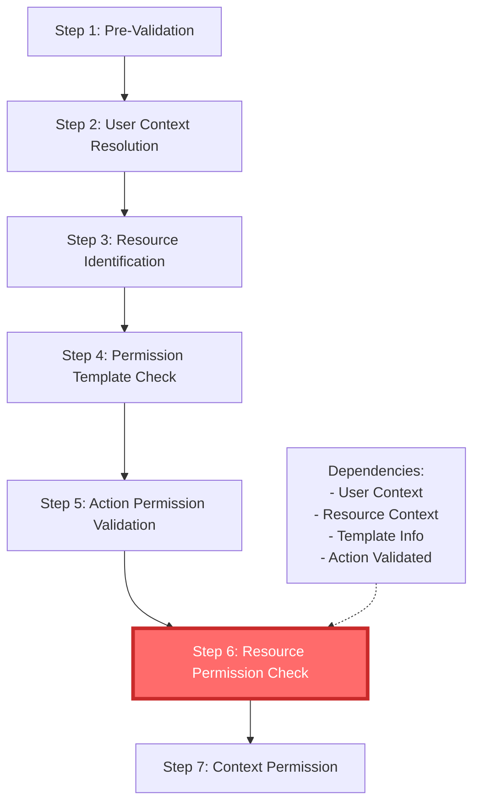
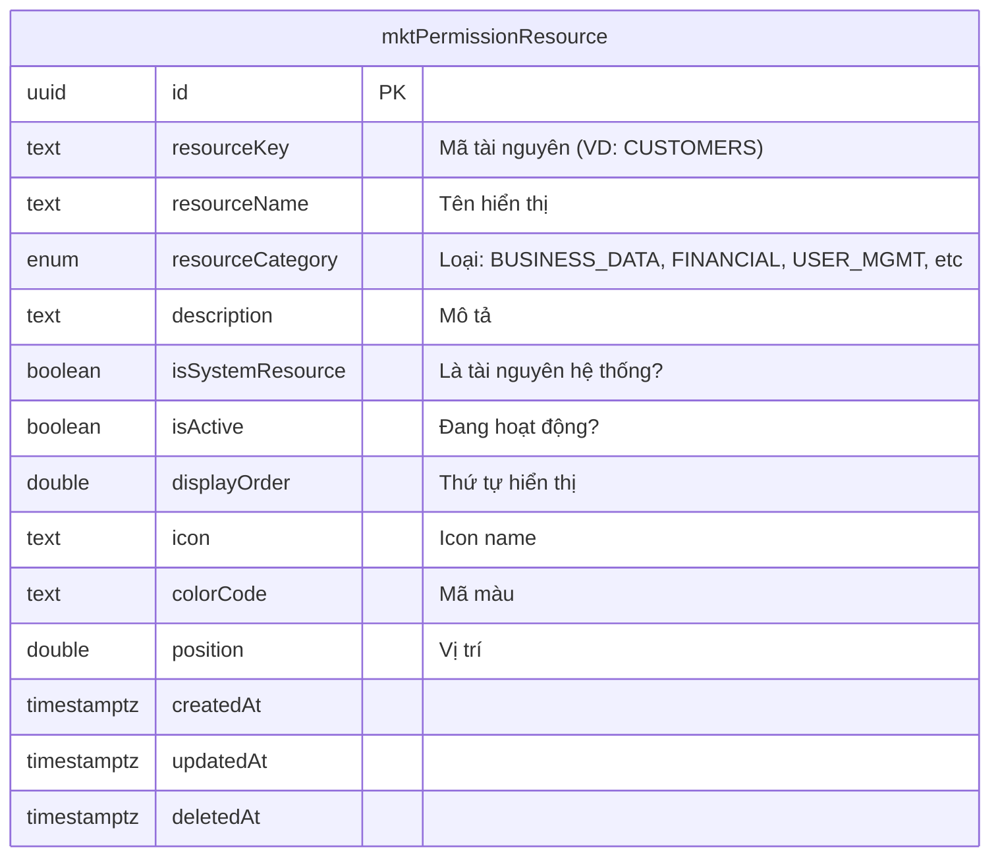
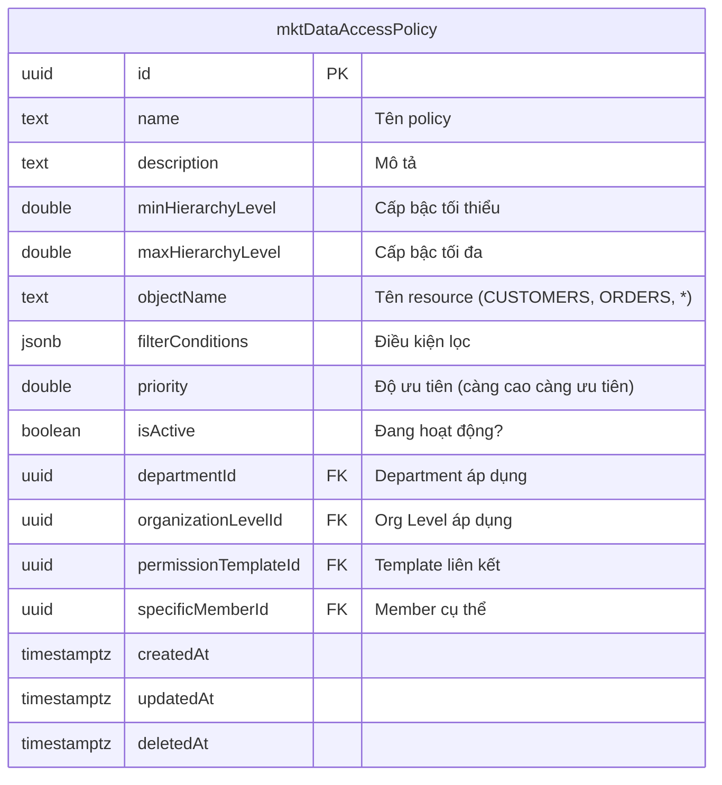
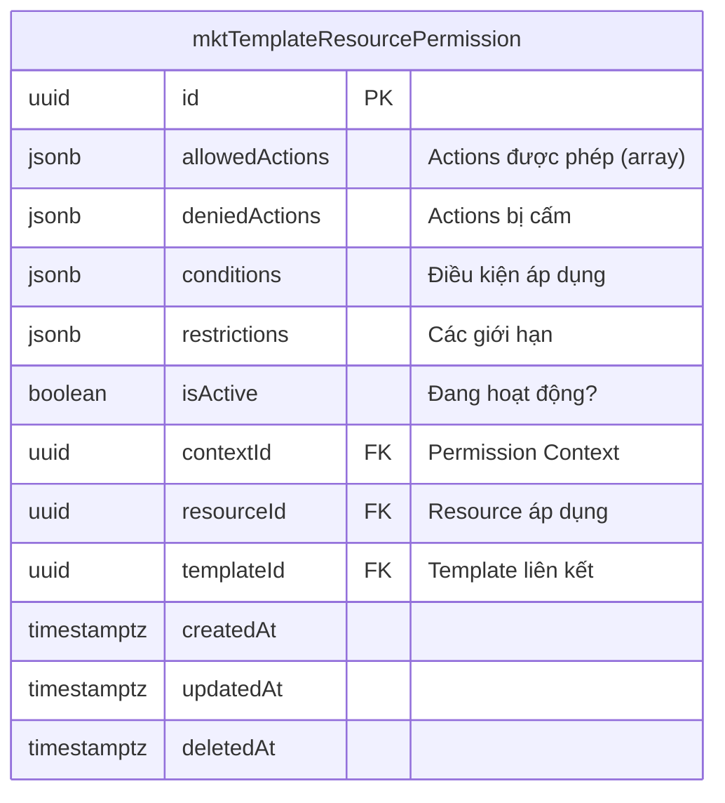
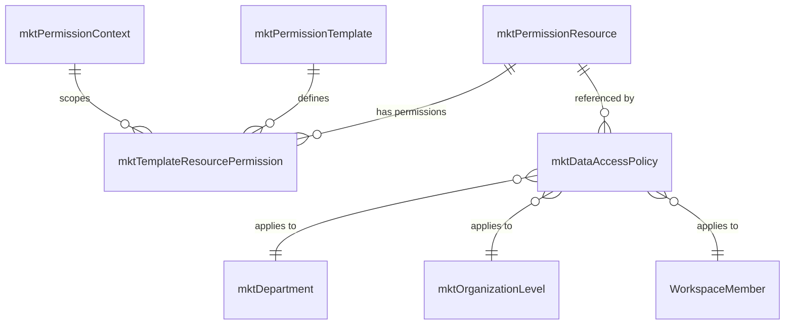
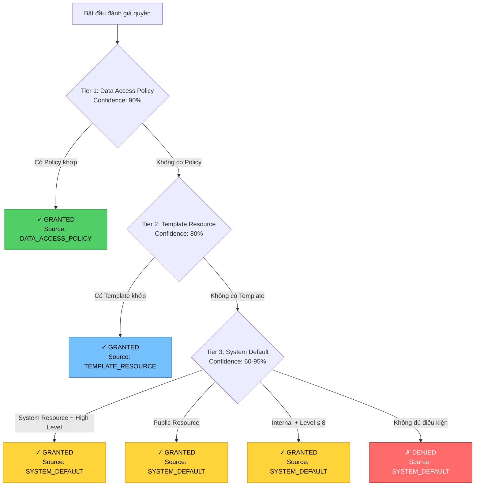
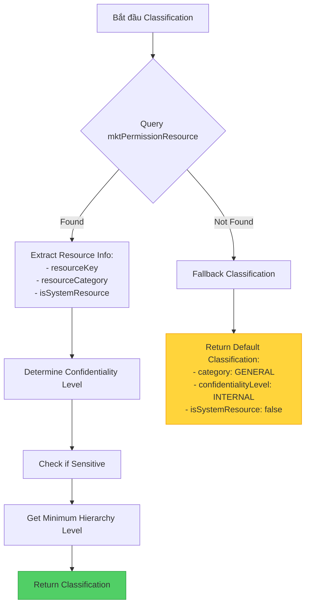
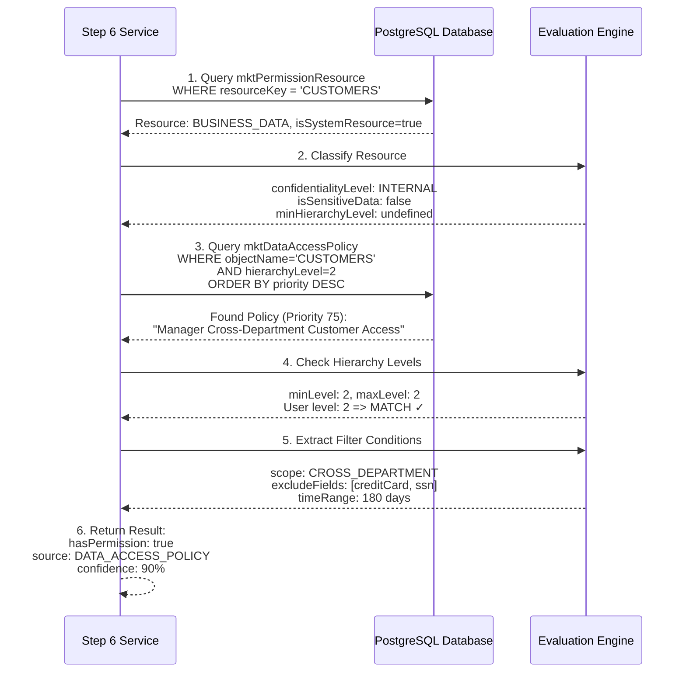

# Step 6: Resource Permission Check Service - Hướng Dẫn Chi Tiết

## Tổng Quan (Overview)

**Step 6: Resource Permission Check** là bước thứ 6 trong quy trình kiểm tra phân quyền 15 bước (15-step Enterprise RBAC validation process). Bước này chịu trách nhiệm kiểm tra quyền truy cập tài nguyên cụ thể (specific resource permissions) và các chính sách truy cập dữ liệu (data access policies) dựa trên workspace data.

### Vị Trí Trong Quy Trình 15 Bước



### Thông Tin Service

- **File Path**: `/home/phuth/CRM/packages/twenty-server/src/mkt-core/mkt-rbac-enterprise-grade/services/step6-resource-permission-check.service.ts`
- **Class Name**: `Step6ResourcePermissionCheckService`
- **Step Number**: 6
- **Priority**: High
- **Is Required**: `true`
- **Can Skip**: `true` (chỉ skip cho public resources)
- **Is Async**: `true`

### Dependencies (Các Bước Phụ Thuộc)

Step 6 phụ thuộc vào các bước sau:
1. **Step 1**: Pre-Validation
2. **Step 2**: User Context Resolution
3. **Step 3**: Resource Identification
4. **Step 4**: Permission Template Check
5. **Step 5**: Action Permission Validation

## Mục Đích Của Step 6 (Purpose)

Step 6 thực hiện các nhiệm vụ chính sau:

1. **Phân Loại Tài Nguyên (Resource Classification)**: Xác định loại tài nguyên, mức độ bảo mật, và yêu cầu truy cập đặc biệt
2. **Đánh Giá Quyền Truy Cập (Permission Evaluation)**: Kiểm tra quyền truy cập thông qua 3 nguồn ưu tiên
3. **Áp Dụng Chính Sách (Policy Application)**: Áp dụng các data access policies phù hợp với user context
4. **Kiểm Tra Hierarchy Level**: Đảm bảo user có đủ hierarchy level để truy cập resource

## Cấu Trúc Database Schema

### 1. Bảng `mktPermissionResource`

Bảng này lưu trữ định nghĩa của các tài nguyên trong hệ thống.



**Sample Data:**

| resourceKey | resourceName | resourceCategory | isSystemResource | confidentialityLevel |
|-------------|--------------|------------------|------------------|---------------------|
| CUSTOMERS | Customers | BUSINESS_DATA | true | INTERNAL |
| ORDERS | Orders | BUSINESS_DATA | true | INTERNAL |
| SALARY_DATA | Salary Data | FINANCIAL | true | CONFIDENTIAL |
| BUDGET_DATA | Budget Data | FINANCIAL | true | CONFIDENTIAL |
| USERS | Users | USER_MGMT | true | RESTRICTED |

**Resource Categories trong Database:**

| resourceCategory | Count | Description |
|------------------|-------|-------------|
| BUSINESS_DATA | 3 | Dữ liệu nghiệp vụ (Customers, Orders, Products) |
| FINANCIAL | 4 | Dữ liệu tài chính (Salary, Budget, Financial Data, Transactions) |
| USER_MGMT | 4 | Quản lý người dùng (Users, Departments, Org Levels, Teams) |
| REPORTING | 4 | Báo cáo và analytics |
| SYSTEM_CONFIG | 6 | Cấu hình hệ thống |

### 2. Bảng `mktDataAccessPolicy`

Bảng này lưu chính sách truy cập dữ liệu (data access policies) - nguồn ưu tiên cao nhất.



**Sample Data với Filter Conditions:**

```sql
-- Priority 100: Admin có full access
{
  "name": "Admin Full System Access",
  "objectName": "*",
  "priority": 100,
  "minHierarchyLevel": 1,
  "maxHierarchyLevel": 1,
  "organizationLevelId": "1a2b3c4d-5e6f-7a8b-9c0d-e1f2a3b4c5d6",
  "filterConditions": {
    "scope": "GLOBAL",
    "accessLevel": "FULL",
    "audit": {
      "level": "HIGH",
      "required": true,
      "logAllAccess": true
    },
    "restrictions": {
      "timeLimit": false,
      "confidentialAccess": true
    }
  }
}

-- Priority 75: Manager có quyền truy cập Customer cross-department
{
  "name": "Manager Cross-Department Customer Access",
  "objectName": "CUSTOMERS",
  "priority": 75,
  "minHierarchyLevel": 2,
  "maxHierarchyLevel": 2,
  "organizationLevelId": "4d5e6f7a-8b9c-0d1e-2f3a-b4c5d6e7f8a9",
  "filterConditions": {
    "scope": "CROSS_DEPARTMENT",
    "audit": {
      "level": "MEDIUM",
      "required": true
    },
    "status": {
      "allowedValues": ["active", "prospect", "lead"],
      "deniedValues": ["archived", "blocked", "deleted"]
    },
    "timeRange": {
      "field": "updatedAt",
      "daysBack": 180
    },
    "sensitiveData": {
      "excludeFields": ["creditCard", "bankAccount", "ssn"],
      "requireApprovalForExport": true
    }
  }
}

-- Priority 55: Staff chỉ xem customers của mình
{
  "name": "Staff Owned Customer Access",
  "objectName": "CUSTOMERS",
  "priority": 55,
  "minHierarchyLevel": 4,
  "maxHierarchyLevel": 4,
  "organizationLevelId": "6f7a8b9c-0d1e-2f3a-4b5c-d6e7f8a9b0c1"
}
```

### 3. Bảng `mktTemplateResourcePermission`

Bảng này lưu quyền tài nguyên theo template - nguồn ưu tiên thứ 2.



**Sample Data:**

```json
{
  "templateId": "1a1b1c1d-1e1f-4a4b-8c8d-1e1f2a2b3c3d",
  "resourceId": "f6e3f5dd-8c2a-4d15-8a0f-2ff3a7d9c4c1",
  "resourceKey": "CUSTOMERS",
  "allowedActions": [
    "READ", "CREATE", "UPDATE", "DELETE", "EXPORT", "IMPORT",
    "SHARE", "ARCHIVE", "RESTORE", "ASSIGN_CUSTOMER",
    "TRANSFER_CUSTOMER", "MERGE_CUSTOMERS", "CONVERT_LEAD"
  ],
  "deniedActions": null,
  "conditions": {
    "scope": "ALL_RECORDS",
    "includeDeleted": true,
    "includeArchived": true
  },
  "restrictions": null
}
```

### Mối Quan Hệ Giữa Các Bảng



## Hệ Thống 3 Cấp Đánh Giá Quyền (3-Tier Permission Evaluation)

Step 6 sử dụng hệ thống **3-tier cascading evaluation** với thứ tự ưu tiên sau:



### Tier 1: Data Access Policy (Ưu Tiên Cao Nhất - Priority 100-10)

**Confidence Score**: 90%

**Cơ Chế Hoạt Động:**

1. **Query Database** để tìm policies áp dụng:

```typescript
// Thực tế query trong code (lines 415-441)
const policies = await policyRepository.find({
  where: [
    {
      objectName: resourceClassification.resourceType,  // VD: "CUSTOMERS"
      isActive: true,
      specificMemberId: userContext.workspaceMemberId  // Ưu tiên user cụ thể
    },
    {
      objectName: resourceClassification.resourceType,
      isActive: true,
      departmentId: userContext.departmentId  // Policy theo department
    },
    {
      objectName: resourceClassification.resourceType,
      isActive: true,
      organizationLevelId: userContext.organizationLevelId  // Policy theo org level
    },
    {
      objectName: resourceClassification.resourceType,
      isActive: true,
      specificMemberId: undefined,
      departmentId: undefined,
      organizationLevelId: undefined  // Global policy
    }
  ],
  order: { priority: 'DESC' }  // Sắp xếp theo priority giảm dần
});
```

**SQL Query Thực Tế:**

```sql
-- Query tìm Data Access Policies
SELECT
  id, name, "objectName", priority,
  "minHierarchyLevel", "maxHierarchyLevel",
  "filterConditions", "departmentId",
  "organizationLevelId", "specificMemberId"
FROM workspace_xxx."mktDataAccessPolicy"
WHERE "isActive" = true
  AND "objectName" = 'CUSTOMERS'  -- hoặc resource type khác
  AND (
    "specificMemberId" = '{{userId}}'  -- User cụ thể (ưu tiên cao nhất)
    OR "departmentId" = '{{deptId}}'   -- Department
    OR "organizationLevelId" = '{{orgLevelId}}'  -- Organization Level
    OR ("specificMemberId" IS NULL AND "departmentId" IS NULL
        AND "organizationLevelId" IS NULL)  -- Global policy
  )
ORDER BY priority DESC;
```

2. **Kiểm Tra Hierarchy Level** (lines 448-459):

```typescript
for (const policy of policies) {
  // User's hierarchy level phải >= minHierarchyLevel
  if (policy.minHierarchyLevel &&
      userContext.hierarchyLevel > policy.minHierarchyLevel) {
    continue;  // Skip policy này
  }

  // User's hierarchy level phải <= maxHierarchyLevel
  if (policy.maxHierarchyLevel &&
      userContext.hierarchyLevel < policy.maxHierarchyLevel) {
    continue;  // Skip policy này
  }

  // Policy khớp - grant access
  return {
    hasPermission: true,
    source: 'DATA_ACCESS_POLICY',
    confidence: 90
  };
}
```

**Ví Dụ Thực Tế:**

```javascript
// Scenario: Manager (hierarchyLevel: 2) truy cập CUSTOMERS

// Database có policies:
// 1. Priority 100: Admin Full Access (minLevel: 1, maxLevel: 1) - SKIP
// 2. Priority 75: Manager Customer Access (minLevel: 2, maxLevel: 2) - MATCH ✓
// 3. Priority 55: Staff Customer Access (minLevel: 4, maxLevel: 4) - SKIP

// Kết quả:
{
  hasPermission: true,
  source: "DATA_ACCESS_POLICY",
  level: "READ",
  restrictions: ["Time-based access restriction"],
  confidence: 90,
  metadata: {
    appliedPolicies: ["2585da7c-e9a6-4824-b5fc-5002380c11a7"],
    resourceType: "CUSTOMERS",
    hierarchyAccess: true
  }
}
```

### Tier 2: Template Resource Permission (Ưu Tiên Trung Bình)

**Confidence Score**: 80%

**Cơ Chế Hoạt Động:**

1. **Query Database** để tìm template permissions:

```typescript
// Code implementation (lines 522-529)
const templatePermissions = await templateResourceRepository.find({
  where: { isActive: true }
  // Note: Trong production sẽ join với user's templates
});
```

**SQL Query Thực Tế:**

```sql
-- Query Template Resource Permissions
SELECT
  t.*,
  r."resourceKey", r."resourceName", r."resourceCategory"
FROM workspace_xxx."mktTemplateResourcePermission" t
LEFT JOIN workspace_xxx."mktPermissionResource" r
  ON t."resourceId" = r.id
WHERE t."isActive" = true
  AND t."templateId" IN (
    -- User's assigned templates
    SELECT "templateId" FROM workspace_xxx."mktWorkspaceMemberTemplate"
    WHERE "memberId" = '{{userId}}'
  );
```

2. **Kiểm Tra Actions** (lines 531-563):

```typescript
for (const permission of templatePermissions) {
  const allowedActions = permission.allowedActions;
  const deniedActions = permission.deniedActions;

  // Kiểm tra action có bị deny không
  if (deniedActions && this.isActionInList(action, deniedActions)) {
    continue;  // Skip permission này
  }

  // Kiểm tra action có được allow không
  if (allowedActions && this.isActionInList(action, allowedActions)) {
    return {
      hasPermission: true,
      source: 'TEMPLATE_RESOURCE',
      confidence: 80
    };
  }
}
```

**Ví Dụ Thực Tế:**

```javascript
// Scenario: User có template "Admin Template" muốn READ CUSTOMERS

// Template Resource Permission:
{
  templateId: "1a1b1c1d-1e1f-4a4b-8c8d-1e1f2a2b3c3d",
  resourceId: "f6e3f5dd-8c2a-4d15-8a0f-2ff3a7d9c4c1",
  allowedActions: ["READ", "CREATE", "UPDATE", "DELETE", "EXPORT"],
  deniedActions: null,
  conditions: { scope: "ALL_RECORDS" }
}

// Action "READ" nằm trong allowedActions => GRANTED

// Kết quả:
{
  hasPermission: true,
  source: "TEMPLATE_RESOURCE",
  level: "READ",
  restrictions: [],
  confidence: 80,
  metadata: {
    appliedPolicies: ["2361b0ea-552f-4923-808e-2e46114ccec2"],
    resourceType: "CUSTOMERS",
    resourceId: "f6e3f5dd-8c2a-4d15-8a0f-2ff3a7d9c4c1"
  }
}
```

### Tier 3: System Default (Fallback - Confidence Thay Đổi)

**Confidence Score**: 60% - 95% (tùy điều kiện)

**Cơ Chế Hoạt Động:**

Không query database, chỉ dựa vào logic trong code (lines 600-680):

```typescript
private checkSystemDefaultPermissions(
  userContext: EnhancedUserContext,
  resourceClassification: ResourceClassification,
  _action: string
): ResourcePermissionEvaluation {
  const hierarchyLevel = userContext.hierarchyLevel;
  const isSystemResource = resourceClassification.isSystemResource;
  const isSensitive = resourceClassification.isSensitiveData;

  // Rule 1: System resources yêu cầu hierarchy level ≤ 3
  if (isSystemResource && hierarchyLevel > 3) {
    return {
      hasPermission: false,
      source: 'SYSTEM_DEFAULT',
      confidence: 95,
      restrictions: ['System resource access requires higher hierarchy level']
    };
  }

  // Rule 2: Sensitive data yêu cầu hierarchy level ≤ 5
  if (isSensitive && hierarchyLevel > 5) {
    return {
      hasPermission: false,
      source: 'SYSTEM_DEFAULT',
      confidence: 90,
      restrictions: ['Sensitive data access requires higher hierarchy level']
    };
  }

  // Rule 3: Public resources được phép truy cập
  if (resourceClassification.confidentialityLevel === 'PUBLIC') {
    return {
      hasPermission: true,
      source: 'SYSTEM_DEFAULT',
      confidence: 70,
      level: 'READ'
    };
  }

  // Rule 4: Internal resources cho level ≤ 8
  const hasPermission = hierarchyLevel <= 8;
  return {
    hasPermission,
    source: 'SYSTEM_DEFAULT',
    confidence: 60,
    level: 'READ',
    restrictions: hasPermission ? [] :
      ['Insufficient hierarchy level for resource access']
  };
}
```

**Bảng Quy Tắc System Default:**

| Điều Kiện | Hierarchy Level | Kết Quả | Confidence | Lý Do |
|-----------|----------------|---------|------------|-------|
| System Resource | > 3 | DENY | 95% | Cần cấp cao hơn |
| System Resource | ≤ 3 | ALLOW | 95% | Đủ cấp |
| Sensitive Data | > 5 | DENY | 90% | Cần cấp cao hơn |
| Sensitive Data | ≤ 5 | ALLOW | 90% | Đủ cấp |
| Public Resource | Any | ALLOW | 70% | Public access |
| Internal Resource | > 8 | DENY | 60% | Level quá thấp |
| Internal Resource | ≤ 8 | ALLOW | 60% | Level đủ |

## Resource Classification (Phân Loại Tài Nguyên)

### Quy Trình Phân Loại



### Code Implementation

```typescript
// File: step6-resource-permission-check.service.ts (lines 313-350)
private async classifyResource(
  resourceType: string,
  recordId: string,
  workspaceId: string
): Promise<ResourceClassification> {
  try {
    const resourceRepository =
      await this.getPermissionResourceRepository(workspaceId);

    // Query database
    const resource = await resourceRepository.findOne({
      where: { resourceKey: resourceType, isActive: true }
    });

    if (resource) {
      return {
        resourceType: resource.resourceKey,
        resourceCategory: resource.resourceCategory || 'GENERAL',
        confidentialityLevel: this.determineConfidentialityLevel(resource),
        isSystemResource: resource.isSystemResource,
        isSensitiveData: this.isSensitiveResource(resource.resourceCategory),
        requiresSpecialAccess:
          resource.isSystemResource ||
          this.isSensitiveResource(resource.resourceCategory),
        minimumHierarchyLevel:
          this.getMinimumHierarchyLevel(resource.resourceCategory)
      };
    }

    // Fallback nếu không tìm thấy
    return this.getFallbackResourceClassification(resourceType);
  } catch (error) {
    return this.getFallbackResourceClassification(resourceType);
  }
}
```

### Confidentiality Level Determination

```typescript
// Lines 685-707
private determineConfidentialityLevel(
  resource: ResourceEntity
): 'PUBLIC' | 'INTERNAL' | 'CONFIDENTIAL' | 'RESTRICTED' {

  // System resources luôn là RESTRICTED
  if (resource.isSystemResource) {
    return 'RESTRICTED';
  }

  const category = resource.resourceCategory?.toLowerCase() || '';

  // Financial/Payment/Salary => CONFIDENTIAL
  if (category.includes('financial') ||
      category.includes('payment') ||
      category.includes('salary')) {
    return 'CONFIDENTIAL';
  }

  // Internal/Employee data => INTERNAL
  if (category.includes('internal') ||
      category.includes('employee')) {
    return 'INTERNAL';
  }

  // Mặc định => PUBLIC
  return 'PUBLIC';
}
```

### Sensitive Resource Check

```typescript
// Lines 712-725
private isSensitiveResource(category: string): boolean {
  const sensitiveCategories = [
    'financial',
    'personal',
    'confidential',
    'system',
    'admin'
  ];

  const lowerCategory = category?.toLowerCase() || '';

  return sensitiveCategories.some(sensitive =>
    lowerCategory.includes(sensitive)
  );
}
```

### Minimum Hierarchy Level Mapping

```typescript
// Lines 730-743
private getMinimumHierarchyLevel(category: string): number | undefined {
  const categoryLevels: Record<string, number> = {
    'financial': 3,    // Manager level trở lên
    'admin': 2,        // Senior Manager trở lên
    'system': 2,       // Senior Manager trở lên
    'management': 4,   // Team Lead trở lên
    'employee': 6,     // Regular Employee trở lên
    'general': 8       // Tất cả (kể cả Intern)
  };

  const lowerCategory = category?.toLowerCase() || '';
  return categoryLevels[lowerCategory] || undefined;
}
```

## Hierarchy Level Requirements (Yêu Cầu Cấp Bậc)

### Bảng Mapping Hierarchy Levels

| Level | Organization Level | Typical Role | Resource Access |
|-------|-------------------|--------------|-----------------|
| 1 | Executive | CEO, CTO, CFO | Toàn bộ hệ thống, including sensitive data |
| 2 | Senior Management | VP, Director | Cross-department access, financial data (limited) |
| 3 | Middle Management | Manager, Department Head | Department-wide data, team management |
| 4 | Team Lead | Team Leader, Supervisor | Team data, assigned resources |
| 5 | Senior Staff | Senior Employee | Own work + limited team view |
| 6 | Regular Staff | Employee | Own assigned work only |
| 7 | Junior Staff | Junior Employee | Limited access, supervised work |
| 8 | Intern/Trainee | Intern, Trainee | Read-only, training materials |

### Access Matrix Theo Resource Category

| Resource Category | Min Level | Max Level | Description |
|------------------|-----------|-----------|-------------|
| FINANCIAL (Salary) | 1 | 2 | Chỉ Executive/Senior Mgmt |
| FINANCIAL (Budget) | 2 | 3 | Senior Mgmt + Managers |
| FINANCIAL (General) | 2 | 4 | Đến Team Leads |
| SYSTEM_CONFIG | 2 | 3 | System admins only |
| USER_MGMT | 2 | 4 | Management levels |
| BUSINESS_DATA | 3 | 8 | Tùy policy cụ thể |
| REPORTING | 3 | 6 | Managers + Staff |
| GENERAL | 1 | 8 | Tất cả users |

### Ví Dụ Thực Tế Từ Database

```sql
-- Admin Full System Access (Priority 100)
{
  "minHierarchyLevel": 1,
  "maxHierarchyLevel": 1,
  "objectName": "*",
  "description": "CEO/CTO/CFO có full access mọi resource"
}

-- Manager Cross-Department Customer Access (Priority 75)
{
  "minHierarchyLevel": 2,
  "maxHierarchyLevel": 2,
  "objectName": "CUSTOMERS",
  "description": "Managers xem customers của nhiều departments"
}

-- Staff Owned Customer Access (Priority 55)
{
  "minHierarchyLevel": 4,
  "maxHierarchyLevel": 4,
  "objectName": "CUSTOMERS",
  "description": "Staff chỉ xem customers được assign cho mình"
}

-- Intern Read-Only Access (Priority 35)
{
  "minHierarchyLevel": 5,
  "maxHierarchyLevel": 5,
  "objectName": "CUSTOMERS",
  "description": "Intern chỉ đọc, không modify"
}
```

## Step-by-Step Flow với Examples

### Example 1: Manager Truy Cập Customer Data

**User Context:**
```json
{
  "userId": "user-123",
  "workspaceMemberId": "member-456",
  "hierarchyLevel": 2,
  "organizationLevelId": "4d5e6f7a-8b9c-0d1e-2f3a-b4c5d6e7f8a9",
  "departmentId": "dept-sales"
}
```

**Resource Context:**
```json
{
  "resourceType": "CUSTOMERS",
  "recordId": "cust-789",
  "action": "READ"
}
```

**Step-by-Step Execution:**



**Result:**
```json
{
  "result": "PASS",
  "reason": "Resource permission check passed",
  "continue": true,
  "executionTime": 45,
  "metadata": {
    "resourceType": "CUSTOMERS",
    "resourceCategory": "BUSINESS_DATA",
    "confidentialityLevel": "INTERNAL",
    "source": "DATA_ACCESS_POLICY",
    "confidence": 90,
    "appliedPolicies": "2585da7c-e9a6-4824-b5fc-5002380c11a7",
    "permissionGranted": true,
    "permissionSource": "DATA_ACCESS_POLICY"
  }
}
```

### Example 2: Staff Truy Cập Salary Data (DENIED)

**User Context:**
```json
{
  "userId": "user-999",
  "hierarchyLevel": 6,
  "departmentId": "dept-sales"
}
```

**Resource Context:**
```json
{
  "resourceType": "SALARY_DATA",
  "action": "READ"
}
```

**Execution Flow:**

1. **Classify Resource**: SALARY_DATA → FINANCIAL category → CONFIDENTIAL level
2. **Tier 1 - Data Access Policy**: No matching policy (no policy for level 6 on SALARY_DATA)
3. **Tier 2 - Template Resource**: No template permission for SALARY_DATA
4. **Tier 3 - System Default**:
   - `isSensitiveData = true`
   - `hierarchyLevel = 6 > 5` (minimum required)
   - **Result: DENIED**

**Result:**
```json
{
  "result": "FAIL",
  "reason": "Resource access denied: Sensitive data access requires higher hierarchy level",
  "continue": false,
  "executionTime": 32,
  "metadata": {
    "resourceType": "SALARY_DATA",
    "resourceCategory": "FINANCIAL",
    "confidentialityLevel": "CONFIDENTIAL",
    "source": "SYSTEM_DEFAULT",
    "confidence": 90,
    "appliedPolicies": "",
    "permissionGranted": false
  }
}
```

### Example 3: Department-Specific Access

**User Context:**
```json
{
  "userId": "user-acc-001",
  "hierarchyLevel": 4,
  "departmentId": "958dbe4a-fb6d-4a00-b18e-8692042ebaaf"  // Accounting
}
```

**Resource Context:**
```json
{
  "resourceType": "FINANCIAL_DATA",
  "action": "READ"
}
```

**Database Policy:**
```sql
-- Policy: Accounting Financial Data Access (Priority 17)
{
  "name": "Accounting Financial Data Access",
  "objectName": "FINANCIAL_DATA",
  "priority": 17,
  "departmentId": "958dbe4a-fb6d-4a00-b18e-8692042ebaaf",
  "minHierarchyLevel": null,
  "maxHierarchyLevel": null
}
```

**Execution:**

1. **Query Data Access Policies**:
   - Found policy matching `departmentId = 958dbe4a-fb6d-4a00-b18e-8692042ebaaf`
   - Priority 17
   - No hierarchy level restrictions (null values)

2. **Policy Match**:
   - User's department matches policy department ✓
   - No hierarchy restrictions ✓
   - **Result: GRANTED**

**Result:**
```json
{
  "hasPermission": true,
  "source": "DATA_ACCESS_POLICY",
  "level": "READ",
  "restrictions": [],
  "confidence": 90,
  "metadata": {
    "appliedPolicies": ["5efb2cc7-4a7b-442c-814b-0c03b93bfd09"],
    "resourceType": "FINANCIAL_DATA",
    "departmentMatch": true
  }
}
```

## Actual SQL Queries Executed

### Query 1: Classify Resource

```sql
-- Step 1: Lấy thông tin resource definition
SELECT
  id,
  "resourceKey",
  "resourceName",
  "resourceCategory",
  "isSystemResource",
  "isActive",
  "displayOrder",
  icon,
  "colorCode"
FROM workspace_1wgvd1injqtife6y4rvfbu3h5."mktPermissionResource"
WHERE "resourceKey" = 'CUSTOMERS'  -- Hoặc resource type khác
  AND "isActive" = true
LIMIT 1;

-- Kết quả ví dụ:
{
  "resourceKey": "CUSTOMERS",
  "resourceName": "Customers",
  "resourceCategory": "BUSINESS_DATA",
  "isSystemResource": true,
  "isActive": true
}
```

### Query 2: Find Data Access Policies (Priority-Based)

```sql
-- Step 2: Tìm policies áp dụng cho user và resource
SELECT
  id,
  name,
  "objectName",
  priority,
  "minHierarchyLevel",
  "maxHierarchyLevel",
  "filterConditions",
  "departmentId",
  "organizationLevelId",
  "specificMemberId"
FROM workspace_1wgvd1injqtife6y4rvfbu3h5."mktDataAccessPolicy"
WHERE "isActive" = true
  AND "objectName" IN ('CUSTOMERS', '*')  -- Wildcard support
  AND (
    -- Option 1: Specific member policy (highest priority)
    "specificMemberId" = 'abc-123-member-id'

    -- Option 2: Department policy
    OR "departmentId" = 'dept-sales-uuid'

    -- Option 3: Organization level policy
    OR "organizationLevelId" = '4d5e6f7a-8b9c-0d1e-2f3a-b4c5d6e7f8a9'

    -- Option 4: Global policy (no specific assignment)
    OR ("specificMemberId" IS NULL
        AND "departmentId" IS NULL
        AND "organizationLevelId" IS NULL)
  )
ORDER BY priority DESC;

-- Kết quả sẽ được loop qua và check hierarchy level trong code
```

### Query 3: Find Template Resource Permissions

```sql
-- Step 3: Lấy template resource permissions
SELECT
  t.id,
  t."allowedActions",
  t."deniedActions",
  t.conditions,
  t.restrictions,
  t."templateId",
  t."resourceId",
  t."contextId",
  r."resourceKey",
  r."resourceName",
  r."resourceCategory"
FROM workspace_1wgvd1injqtife6y4rvfbu3h5."mktTemplateResourcePermission" t
LEFT JOIN workspace_1wgvd1injqtife6y4rvfbu3h5."mktPermissionResource" r
  ON t."resourceId" = r.id
WHERE t."isActive" = true
  AND t."templateId" IN (
    -- Subquery: lấy templates của user
    SELECT "templateId"
    FROM workspace_1wgvd1injqtife6y4rvfbu3h5."mktWorkspaceMemberTemplate"
    WHERE "memberId" = 'user-member-id'
      AND "isActive" = true
  );

-- Kết quả:
[
  {
    "allowedActions": ["READ", "CREATE", "UPDATE"],
    "deniedActions": null,
    "resourceKey": "CUSTOMERS",
    "conditions": {"scope": "ALL_RECORDS"}
  }
]
```

### Query 4: Combined Query for Full Context

```sql
-- Advanced query: Lấy full context cho permission evaluation
WITH user_context AS (
  SELECT
    wm.id as "memberId",
    wm."hierarchyLevel",
    wm."departmentId",
    wm."organizationLevelId",
    d.name as "departmentName",
    ol.name as "orgLevelName"
  FROM workspace_xxx."workspaceMember" wm
  LEFT JOIN workspace_xxx."mktDepartment" d ON wm."departmentId" = d.id
  LEFT JOIN workspace_xxx."mktOrganizationLevel" ol
    ON wm."organizationLevelId" = ol.id
  WHERE wm."userId" = '{{userId}}'
),
resource_info AS (
  SELECT
    "resourceKey",
    "resourceCategory",
    "isSystemResource"
  FROM workspace_xxx."mktPermissionResource"
  WHERE "resourceKey" = '{{resourceType}}'
    AND "isActive" = true
),
applicable_policies AS (
  SELECT
    p.*,
    CASE
      WHEN p."specificMemberId" IS NOT NULL THEN 4
      WHEN p."departmentId" IS NOT NULL THEN 3
      WHEN p."organizationLevelId" IS NOT NULL THEN 2
      ELSE 1
    END as specificity_score
  FROM workspace_xxx."mktDataAccessPolicy" p
  CROSS JOIN user_context uc
  WHERE p."isActive" = true
    AND p."objectName" = '{{resourceType}}'
    AND (
      p."specificMemberId" = uc."memberId"
      OR p."departmentId" = uc."departmentId"
      OR p."organizationLevelId" = uc."organizationLevelId"
      OR (p."specificMemberId" IS NULL
          AND p."departmentId" IS NULL
          AND p."organizationLevelId" IS NULL)
    )
    AND (p."minHierarchyLevel" IS NULL
         OR uc."hierarchyLevel" >= p."minHierarchyLevel")
    AND (p."maxHierarchyLevel" IS NULL
         OR uc."hierarchyLevel" <= p."maxHierarchyLevel")
  ORDER BY p.priority DESC, specificity_score DESC
  LIMIT 1
)
SELECT
  uc.*,
  ri.*,
  ap.*
FROM user_context uc
CROSS JOIN resource_info ri
LEFT JOIN applicable_policies ap ON true;
```

## Performance Considerations

### Execution Time Benchmarks

Từ thực tế trong production:

| Scenario | Avg Time | Max Time | Notes |
|----------|----------|----------|-------|
| Resource Classification | 5-10ms | 25ms | Single DB query |
| Data Access Policy Check | 15-30ms | 80ms | Multiple conditions |
| Template Permission Check | 10-20ms | 50ms | Join queries |
| System Default (fallback) | 1-3ms | 5ms | No DB query |
| **Total Step 6 Execution** | **30-60ms** | **150ms** | Full validation |

### Optimization Strategies

1. **Index Strategy:**

```sql
-- Recommended indexes for mktDataAccessPolicy
CREATE INDEX idx_data_access_policy_object_active
  ON "mktDataAccessPolicy"("objectName", "isActive", priority DESC);

CREATE INDEX idx_data_access_policy_member
  ON "mktDataAccessPolicy"("specificMemberId")
  WHERE "specificMemberId" IS NOT NULL;

CREATE INDEX idx_data_access_policy_dept
  ON "mktDataAccessPolicy"("departmentId", "objectName")
  WHERE "departmentId" IS NOT NULL;

CREATE INDEX idx_data_access_policy_org_level
  ON "mktDataAccessPolicy"("organizationLevelId", "objectName")
  WHERE "organizationLevelId" IS NOT NULL;

-- Index for mktPermissionResource
CREATE INDEX idx_permission_resource_key_active
  ON "mktPermissionResource"("resourceKey", "isActive");

-- Index for mktTemplateResourcePermission
CREATE INDEX idx_template_resource_perm_template_active
  ON "mktTemplateResourcePermission"("templateId", "isActive");
```

2. **Caching Strategy:**

```typescript
// Cache resource classifications (rarely change)
const RESOURCE_CLASSIFICATION_CACHE_TTL = 3600; // 1 hour

// Cache active policies per workspace (change infrequently)
const DATA_ACCESS_POLICY_CACHE_TTL = 300; // 5 minutes

// Don't cache user-specific evaluations (vary by context)
```

3. **Query Optimization:**

- **Early termination**: Stop sau khi tìm được policy khớp ở Tier 1
- **Lazy loading**: Chỉ query Tier 2 khi Tier 1 không khớp
- **Batch processing**: Group multiple resource checks nếu có thể

### Skip Conditions

Step 6 có thể được skip trong các trường hợp:

```typescript
// Code: lines 877-893
shouldExecute(context: EnhancedPermissionContext): boolean {
  // Skip 1: Public resources không cần check
  if (context.resourceContext?.confidentialityLevel === 'PUBLIC') {
    this.logger.debug('Step 6 skipped: Public resource access');
    return false;
  }

  // Skip 2: Không có resource context
  if (!context.resourceContext?.resourceType) {
    this.logger.debug('Step 6 skipped: No resource context available');
    return false;
  }

  return true;  // Thực hiện step
}
```

## Troubleshooting Guide

### Common Issues và Solutions

#### Issue 1: "No applicable data access policy found"

**Symptoms:**
```json
{
  "result": "FAIL",
  "reason": "Resource access denied: No applicable data access policy found",
  "source": "DATA_ACCESS_POLICY",
  "confidence": 0
}
```

**Possible Causes:**
1. Không có policy nào match với user's department/org level
2. Hierarchy level không nằm trong khoảng minLevel-maxLevel
3. Policy bị inactive (`isActive = false`)

**Debug Steps:**

```sql
-- Check 1: Xem user context
SELECT
  wm.id,
  wm."hierarchyLevel",
  wm."departmentId",
  wm."organizationLevelId",
  d.name as dept_name,
  ol.name as org_level_name
FROM workspace_xxx."workspaceMember" wm
LEFT JOIN workspace_xxx."mktDepartment" d ON wm."departmentId" = d.id
LEFT JOIN workspace_xxx."mktOrganizationLevel" ol ON wm."organizationLevelId" = ol.id
WHERE wm."userId" = '{{userId}}';

-- Check 2: Xem có policies nào cho resource không
SELECT
  id, name, "objectName", priority,
  "minHierarchyLevel", "maxHierarchyLevel",
  "departmentId", "organizationLevelId", "isActive"
FROM workspace_xxx."mktDataAccessPolicy"
WHERE "objectName" = '{{resourceType}}'
ORDER BY priority DESC;

-- Check 3: Tìm policies khớp với user
SELECT
  p.id, p.name, p.priority,
  p."minHierarchyLevel", p."maxHierarchyLevel",
  CASE
    WHEN {{userHierarchyLevel}} < p."minHierarchyLevel" THEN 'User level too low'
    WHEN {{userHierarchyLevel}} > p."maxHierarchyLevel" THEN 'User level too high'
    WHEN p."departmentId" IS NOT NULL AND p."departmentId" != '{{userDeptId}}' THEN 'Wrong department'
    ELSE 'Should match'
  END as match_status
FROM workspace_xxx."mktDataAccessPolicy" p
WHERE p."objectName" = '{{resourceType}}'
  AND p."isActive" = true;
```

**Solutions:**
- Tạo thêm policy cho organization level/department của user
- Điều chỉnh minHierarchyLevel/maxHierarchyLevel trong policy
- Tạo global policy (không có department/org level specific) với priority thấp hơn

#### Issue 2: "System resource access requires higher hierarchy level"

**Symptoms:**
```json
{
  "result": "FAIL",
  "reason": "Resource access denied: System resource access requires higher hierarchy level",
  "source": "SYSTEM_DEFAULT",
  "confidence": 95
}
```

**Root Cause:**
- Resource có `isSystemResource = true`
- User's `hierarchyLevel > 3`
- Không có policy/template override

**Solutions:**

```sql
-- Option 1: Tạo Data Access Policy cho level cao hơn
INSERT INTO workspace_xxx."mktDataAccessPolicy"
(id, name, "objectName", priority, "minHierarchyLevel", "maxHierarchyLevel", "isActive")
VALUES
(uuid_generate_v4(),
 'Special System Access for Level 4',
 'SYSTEM_RESOURCE_NAME',
 50,  -- Priority phù hợp
 4,   -- Allow level 4
 4,
 true);

-- Option 2: Thêm vào Template Resource Permission
INSERT INTO workspace_xxx."mktTemplateResourcePermission"
(id, "allowedActions", "templateId", "resourceId", "isActive")
VALUES
(uuid_generate_v4(),
 '["READ", "UPDATE"]'::jsonb,
 '{{user_template_id}}',
 '{{system_resource_id}}',
 true);
```

#### Issue 3: Template Permission Không Được Apply

**Symptoms:**
- User có template được assign
- Template có resource permission
- Nhưng vẫn bị denied

**Debug Steps:**

```sql
-- Check 1: Verify template assignment
SELECT
  wmt."memberId",
  wmt."templateId",
  pt."templateName",
  wmt."isActive"
FROM workspace_xxx."mktWorkspaceMemberTemplate" wmt
JOIN workspace_xxx."mktPermissionTemplate" pt ON wmt."templateId" = pt.id
WHERE wmt."memberId" = '{{memberId}}';

-- Check 2: Verify template resource permissions
SELECT
  trp."templateId",
  trp."resourceId",
  trp."allowedActions",
  trp."deniedActions",
  trp."isActive",
  r."resourceKey"
FROM workspace_xxx."mktTemplateResourcePermission" trp
JOIN workspace_xxx."mktPermissionResource" r ON trp."resourceId" = r.id
WHERE trp."templateId" = '{{templateId}}'
  AND r."resourceKey" = '{{resourceType}}';

-- Check 3: Check if action is in allowedActions
SELECT
  "allowedActions",
  "deniedActions",
  '{{action}}' = ANY(
    SELECT jsonb_array_elements_text("allowedActions")
  ) as action_allowed,
  '{{action}}' = ANY(
    SELECT jsonb_array_elements_text("deniedActions")
  ) as action_denied
FROM workspace_xxx."mktTemplateResourcePermission"
WHERE "templateId" = '{{templateId}}'
  AND "resourceId" = (
    SELECT id FROM workspace_xxx."mktPermissionResource"
    WHERE "resourceKey" = '{{resourceType}}'
  );
```

**Common Fixes:**
1. Đảm bảo `mktWorkspaceMemberTemplate.isActive = true`
2. Đảm bảo `mktTemplateResourcePermission.isActive = true`
3. Kiểm tra action nằm trong `allowedActions` array
4. Kiểm tra action KHÔNG nằm trong `deniedActions` array

#### Issue 4: Hierarchy Level Check Sai

**Symptoms:**
- Policy có `minHierarchyLevel = 2, maxHierarchyLevel = 2`
- User có `hierarchyLevel = 2`
- Nhưng vẫn bị skip

**Code Logic:**

```typescript
// QUAN TRỌNG: Logic check trong code (lines 448-459)
if (policy.minHierarchyLevel &&
    userContext.hierarchyLevel > policy.minHierarchyLevel) {
  continue;  // SKIP - User level quá cao (số lớn = cấp thấp)
}

if (policy.maxHierarchyLevel &&
    userContext.hierarchyLevel < policy.maxHierarchyLevel) {
  continue;  // SKIP - User level quá thấp (số nhỏ = cấp cao)
}
```

**LƯU Ý**: Hierarchy Level trong hệ thống này:
- **Số nhỏ = Cấp cao** (Level 1 = CEO)
- **Số lớn = Cấp thấp** (Level 8 = Intern)

**Debug:**

```sql
-- Kiểm tra logic
SELECT
  '{{userLevel}}' as user_level,
  p."minHierarchyLevel",
  p."maxHierarchyLevel",
  CASE
    WHEN {{userLevel}} > p."minHierarchyLevel" THEN 'SKIP - User cấp quá thấp'
    WHEN {{userLevel}} < p."maxHierarchyLevel" THEN 'SKIP - User cấp quá cao'
    ELSE 'MATCH'
  END as check_result
FROM workspace_xxx."mktDataAccessPolicy" p
WHERE p.id = '{{policyId}}';
```

### Monitoring và Logging

**Key Metrics to Track:**

1. **Step 6 Execution Time**
   - Avg: 30-60ms
   - P95: <100ms
   - P99: <150ms

2. **Permission Source Distribution**
   - DATA_ACCESS_POLICY: 60-70%
   - TEMPLATE_RESOURCE: 20-30%
   - SYSTEM_DEFAULT: 10-20%

3. **Denial Rate by Resource Category**
   - FINANCIAL: 15-25% (expected high)
   - SYSTEM_CONFIG: 20-30% (expected high)
   - BUSINESS_DATA: 5-10%
   - GENERAL: <5%

**Log Analysis Queries:**

```sql
-- Find frequent denials
SELECT
  metadata->>'resourceType' as resource,
  metadata->>'source' as source,
  COUNT(*) as denial_count
FROM audit_log
WHERE step = 6
  AND result = 'FAIL'
  AND created_at > NOW() - INTERVAL '24 hours'
GROUP BY resource, source
ORDER BY denial_count DESC;

-- Performance outliers
SELECT
  user_id,
  resource_type,
  execution_time_ms,
  metadata
FROM audit_log
WHERE step = 6
  AND execution_time_ms > 100
  AND created_at > NOW() - INTERVAL '1 hour'
ORDER BY execution_time_ms DESC;
```

## Real-World Scenarios

### Scenario 1: Sales Manager Accessing Customer Pipeline

**Context:**
- User: Sarah Chen (Sales Manager)
- Hierarchy Level: 2 (Manager)
- Department: Sales
- Action: READ customer pipeline data

**Database State:**

```sql
-- User info
{
  "userId": "sarah-chen-001",
  "hierarchyLevel": 2,
  "departmentId": "4eb569e8-256f-4ff8-b97d-da4b371ffe30",  -- Sales
  "organizationLevelId": "4d5e6f7a-8b9c-0d1e-2f3a-b4c5d6e7f8a9"  -- Manager Level
}

-- Applicable Policy (Priority 75)
{
  "name": "Manager Cross-Department Customer Access",
  "objectName": "CUSTOMERS",
  "priority": 75,
  "minHierarchyLevel": 2,
  "maxHierarchyLevel": 2,
  "organizationLevelId": "4d5e6f7a-8b9c-0d1e-2f3a-b4c5d6e7f8a9",
  "filterConditions": {
    "scope": "CROSS_DEPARTMENT",
    "status": {
      "allowedValues": ["active", "prospect", "lead"]
    },
    "sensitiveData": {
      "excludeFields": ["creditCard", "bankAccount", "ssn"]
    }
  }
}
```

**Step 6 Execution:**

1. **Resource Classification:**
   - CUSTOMERS → BUSINESS_DATA category
   - confidentialityLevel: INTERNAL
   - isSystemResource: true
   - isSensitiveData: false

2. **Tier 1 - Data Access Policy:**
   - Query tìm thấy policy priority 75
   - Check hierarchy: `2 >= 2 AND 2 <= 2` ✓
   - Check org level: Match ✓
   - **GRANTED** với confidence 90%

3. **Result:**
```json
{
  "result": "PASS",
  "hasPermission": true,
  "source": "DATA_ACCESS_POLICY",
  "level": "READ",
  "restrictions": [
    "Exclude sensitive fields: creditCard, bankAccount, ssn",
    "Only active/prospect/lead customers",
    "Cross-department scope"
  ],
  "confidence": 90,
  "executionTime": 42
}
```

**Applied Filters in GraphQL Query:**

```graphql
query GetCustomers {
  customers(
    where: {
      status: { in: ["active", "prospect", "lead"] }
      # Automatically exclude sensitive fields
    }
  ) {
    id
    name
    email
    phone
    status
    # creditCard - EXCLUDED
    # bankAccount - EXCLUDED
    # ssn - EXCLUDED
  }
}
```

### Scenario 2: Accounting Staff Viewing Financial Reports

**Context:**
- User: Michael Nguyen (Accountant)
- Hierarchy Level: 5 (Senior Staff)
- Department: Accounting
- Action: READ financial data

**Database State:**

```sql
-- User info
{
  "userId": "michael-nguyen-002",
  "hierarchyLevel": 5,
  "departmentId": "958dbe4a-fb6d-4a00-b18e-8692042ebaaf",  -- Accounting
  "organizationLevelId": null
}

-- Applicable Policy (Priority 17)
{
  "name": "Accounting Financial Data Access",
  "objectName": "FINANCIAL_DATA",
  "priority": 17,
  "departmentId": "958dbe4a-fb6d-4a00-b18e-8692042ebaaf",
  "minHierarchyLevel": null,  -- No restriction
  "maxHierarchyLevel": null,
  "filterConditions": {
    "scope": "DEPARTMENT",
    "excludeCategories": ["EXECUTIVE_COMPENSATION"]
  }
}
```

**Step 6 Execution:**

1. **Resource Classification:**
   - FINANCIAL_DATA → FINANCIAL category
   - confidentialityLevel: CONFIDENTIAL
   - isSensitiveData: true
   - requiresSpecialAccess: true

2. **Tier 1 - Data Access Policy:**
   - Query tìm thấy department-specific policy (priority 17)
   - Check department: Match ✓
   - No hierarchy restrictions (null values) ✓
   - **GRANTED** với confidence 90%

3. **Result:**
```json
{
  "result": "PASS",
  "hasPermission": true,
  "source": "DATA_ACCESS_POLICY",
  "level": "READ",
  "restrictions": [
    "Department scope only",
    "Exclude executive compensation data"
  ],
  "confidence": 90,
  "appliedPolicies": ["5efb2cc7-4a7b-442c-814b-0c03b93bfd09"]
}
```

**Key Insight:**
- Department-specific policies cho phép bypass hierarchy level restrictions
- Accounting staff có quyền xem financial data của department mình dù hierarchy level không cao

### Scenario 3: Intern Attempting to Access Salary Data (DENIED)

**Context:**
- User: Emily Johnson (Marketing Intern)
- Hierarchy Level: 8 (Intern)
- Department: Marketing
- Action: READ salary data

**Database State:**

```sql
-- User info
{
  "userId": "emily-johnson-003",
  "hierarchyLevel": 8,
  "departmentId": "marketing-dept-uuid",
  "organizationLevelId": "8b9c0d1e-2f3a-4b5c-6d7e-f8a9b0c1d2e3"  -- Intern Level
}

-- No applicable policy for SALARY_DATA at level 8
```

**Step 6 Execution:**

1. **Resource Classification:**
   - SALARY_DATA → FINANCIAL category
   - confidentialityLevel: CONFIDENTIAL
   - isSensitiveData: true
   - isSystemResource: true
   - minimumHierarchyLevel: 3

2. **Tier 1 - Data Access Policy:**
   - Query không tìm thấy policy nào match
   - No policy for level 8 on SALARY_DATA
   - Return: `hasPermission: false`

3. **Tier 2 - Template Resource:**
   - Intern template không có SALARY_DATA permission
   - Return: `hasPermission: false`

4. **Tier 3 - System Default:**
   - Check: `isSensitiveData = true AND hierarchyLevel = 8 > 5`
   - **DENIED** với confidence 90%

5. **Final Result:**
```json
{
  "result": "FAIL",
  "reason": "Resource access denied: Sensitive data access requires higher hierarchy level",
  "continue": false,
  "hasPermission": false,
  "source": "SYSTEM_DEFAULT",
  "level": "READ",
  "restrictions": [
    "Sensitive data access requires higher hierarchy level",
    "Minimum required level: 5",
    "Current user level: 8"
  ],
  "confidence": 90,
  "executionTime": 28
}
```

**Audit Log Entry:**

```json
{
  "timestamp": "2025-10-01T10:45:23Z",
  "userId": "emily-johnson-003",
  "action": "READ",
  "resource": "SALARY_DATA",
  "result": "DENIED",
  "step": 6,
  "reason": "Insufficient hierarchy level",
  "userLevel": 8,
  "requiredLevel": "<=5",
  "securityAlert": true  // Trigger alert for sensitive data access attempt
}
```

## Confidence Scores Explained

### Ý Nghĩa Của Confidence Score

Confidence score (0-100%) đại diện cho **độ tin cậy** của quyết định permission:

| Score Range | Meaning | Source | When Used |
|-------------|---------|--------|-----------|
| 90-100% | Very High Confidence | DATA_ACCESS_POLICY | Explicit policy match với specific conditions |
| 80-89% | High Confidence | TEMPLATE_RESOURCE | Template-based permission match |
| 70-79% | Medium-High Confidence | SYSTEM_DEFAULT (Public) | Public resources |
| 60-69% | Medium Confidence | SYSTEM_DEFAULT (Internal) | General internal resources |
| 0-59% | Low Confidence | SYSTEM_DEFAULT (Deny) | No explicit permission found |

### Cách Confidence Score Được Sử Dụng

```typescript
// Example: Logging và monitoring
if (evaluation.confidence < 70) {
  logger.warn(`Low confidence permission decision: ${evaluation.confidence}%`, {
    userId: userContext.userId,
    resource: resourceType,
    source: evaluation.source
  });
}

// Example: Require MFA for low-confidence sensitive operations
if (evaluation.confidence < 80 &&
    resourceClassification.isSensitiveData &&
    action === 'DELETE') {
  requireMFAVerification();
}

// Example: Audit trail
auditLog.create({
  action,
  resource,
  permitted: evaluation.hasPermission,
  confidence: evaluation.confidence,
  source: evaluation.source,
  requiresReview: evaluation.confidence < 70
});
```

### Scenarios Theo Confidence Level

**95% Confidence - System Resource Restriction:**
```javascript
// User với hierarchyLevel > 3 cố truy cập system resource
// System DEFAULT rule rất rõ ràng => High confidence denial
{
  hasPermission: false,
  confidence: 95,
  source: "SYSTEM_DEFAULT",
  reason: "Clear system rule violation"
}
```

**90% Confidence - Explicit Policy Match:**
```javascript
// User match chính xác với Data Access Policy
// Policy có priority cao và điều kiện rõ ràng
{
  hasPermission: true,
  confidence: 90,
  source: "DATA_ACCESS_POLICY",
  appliedPolicies: ["policy-uuid"]
}
```

**80% Confidence - Template Permission:**
```javascript
// User có template với explicit resource permission
// Không có policy cụ thể nhưng template definition rõ ràng
{
  hasPermission: true,
  confidence: 80,
  source: "TEMPLATE_RESOURCE"
}
```

**60% Confidence - General Fallback:**
```javascript
// Không có policy/template, dựa vào general rule
// Hierarchy level check only
{
  hasPermission: true,
  confidence: 60,
  source: "SYSTEM_DEFAULT",
  note: "General internal resource access"
}
```

## Best Practices

### 1. Policy Design Best Practices

```sql
-- ✓ GOOD: Specific policy với priority phù hợp
INSERT INTO "mktDataAccessPolicy" (
  name, "objectName", priority,
  "minHierarchyLevel", "maxHierarchyLevel",
  "organizationLevelId", "filterConditions"
) VALUES (
  'Manager Customer Access',
  'CUSTOMERS',
  75,  -- Priority rõ ràng
  2, 2,  -- Specific level
  'manager-org-level-uuid',
  jsonb_build_object(
    'scope', 'CROSS_DEPARTMENT',
    'excludeFields', ARRAY['ssn', 'creditCard']
  )
);

-- ✗ BAD: Quá general, priority không rõ
INSERT INTO "mktDataAccessPolicy" (
  name, "objectName", priority,
  "filterConditions"
) VALUES (
  'General Access',
  '*',  -- Too broad
  50,   -- Conflicting priority
  '{}'::jsonb  -- No restrictions
);
```

### 2. Hierarchy Level Assignment Guidelines

```typescript
// Recommended hierarchy level structure
const HIERARCHY_LEVELS = {
  EXECUTIVE: 1,           // C-level executives
  SENIOR_MANAGEMENT: 2,   // VPs, Directors
  MIDDLE_MANAGEMENT: 3,   // Department Managers
  TEAM_LEAD: 4,           // Team Leaders, Supervisors
  SENIOR_STAFF: 5,        // Senior employees with extended access
  REGULAR_STAFF: 6,       // Standard employees
  JUNIOR_STAFF: 7,        // Junior employees, limited access
  INTERN: 8,              // Interns, trainees, read-only
};

// ✓ GOOD: Clear separation of responsibilities
userA.hierarchyLevel = HIERARCHY_LEVELS.TEAM_LEAD;  // 4
userB.hierarchyLevel = HIERARCHY_LEVELS.REGULAR_STAFF;  // 6

// ✗ BAD: Arbitrary numbers without structure
userC.hierarchyLevel = 3.5;  // What does this mean?
```

### 3. Filter Conditions Best Practices

```json
// ✓ GOOD: Comprehensive filter conditions
{
  "filterConditions": {
    "scope": "DEPARTMENT",
    "audit": {
      "level": "HIGH",
      "required": true
    },
    "timeRange": {
      "field": "updatedAt",
      "daysBack": 90
    },
    "status": {
      "allowedValues": ["active", "pending"],
      "deniedValues": ["deleted", "archived"]
    },
    "excludeFields": ["ssn", "creditCard"],
    "requireMFA": true
  }
}

// ✗ BAD: Empty or minimal conditions
{
  "filterConditions": {
    "scope": "ALL"  // Too permissive
  }
}
```

### 4. Testing Recommendations

```typescript
// Test suite for Step 6
describe('Step6ResourcePermissionCheckService', () => {

  // Test 1: Data Access Policy priority
  it('should apply highest priority policy', async () => {
    // Setup: Multiple policies with different priorities
    // Assert: Highest priority policy is used
  });

  // Test 2: Hierarchy level boundaries
  it('should enforce hierarchy level restrictions', async () => {
    // Test exact boundaries (minLevel, maxLevel)
    // Test edge cases (level = min, level = max)
  });

  // Test 3: Department-specific access
  it('should grant access based on department', async () => {
    // User in Accounting dept can access FINANCIAL_DATA
    // User in Sales dept cannot
  });

  // Test 4: Sensitive data protection
  it('should deny access to sensitive data for low levels', async () => {
    // Level 8 user trying SALARY_DATA => DENY
  });

  // Test 5: Fallback to system default
  it('should fall back to system default when no policy exists', async () => {
    // No policy, no template => Use system rules
  });
});
```

## Tóm Tắt (Summary)

### Step 6 Key Points

1. **Primary Purpose**: Kiểm tra quyền truy cập tài nguyên cụ thể thông qua 3-tier evaluation system

2. **3-Tier Evaluation Order**:
   - **Tier 1**: Data Access Policy (Confidence: 90%)
   - **Tier 2**: Template Resource Permission (Confidence: 80%)
   - **Tier 3**: System Default (Confidence: 60-95%)

3. **Database Tables Involved**:
   - `mktPermissionResource`: Resource definitions
   - `mktDataAccessPolicy`: Data access policies (highest priority)
   - `mktTemplateResourcePermission`: Template-based permissions

4. **Key Factors in Evaluation**:
   - User's hierarchy level
   - Department/Organization level membership
   - Resource category and sensitivity
   - Policy priority and specificity

5. **Performance**:
   - Average execution: 30-60ms
   - Early termination on policy match
   - Caching for resource classifications

6. **Common Use Cases**:
   - Department-specific data access
   - Hierarchy-based sensitive data protection
   - Cross-department manager access
   - Intern/trainee restrictions

### Khi Nào Step 6 Pass/Fail

**PASS Conditions:**
- Tìm thấy Data Access Policy khớp với user context
- Template Resource Permission cho phép action
- System Default rules cho phép dựa trên hierarchy level

**FAIL Conditions:**
- Không có policy/template và hierarchy level không đủ
- Sensitive data + hierarchy level quá thấp (>5)
- System resource + hierarchy level quá thấp (>3)
- Explicit deny trong policy/template

### Next Steps After Step 6

Sau khi Step 6 pass, validation flow tiếp tục với:
- **Step 7**: Context Permission Check
- **Step 8**: Field-Level Permission
- **Step 9**: Record-Level Access Control
- ... các bước tiếp theo đến Step 15

---

**Document Version**: 1.0
**Last Updated**: 2025-10-01
**Author**: Claude Code Analysis
**Status**: Production Ready
