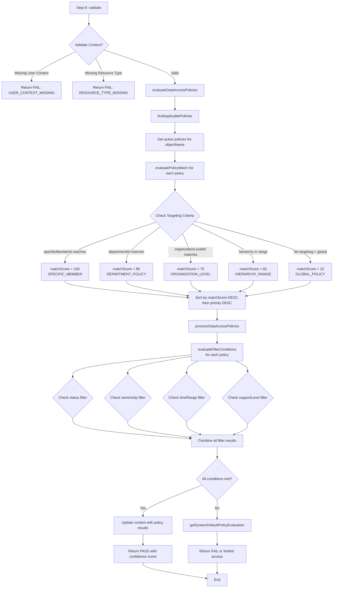
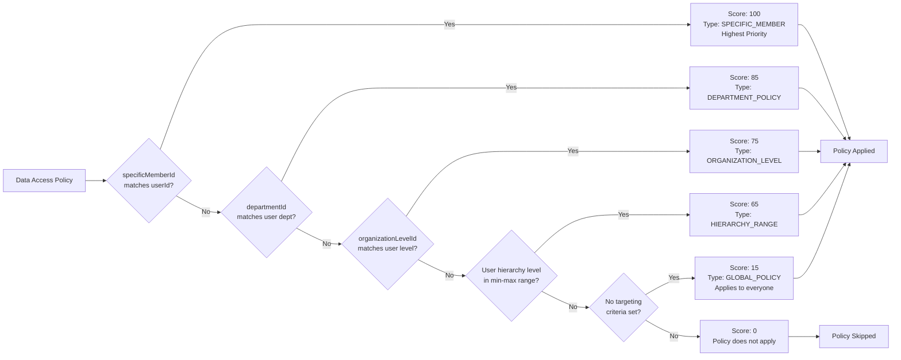
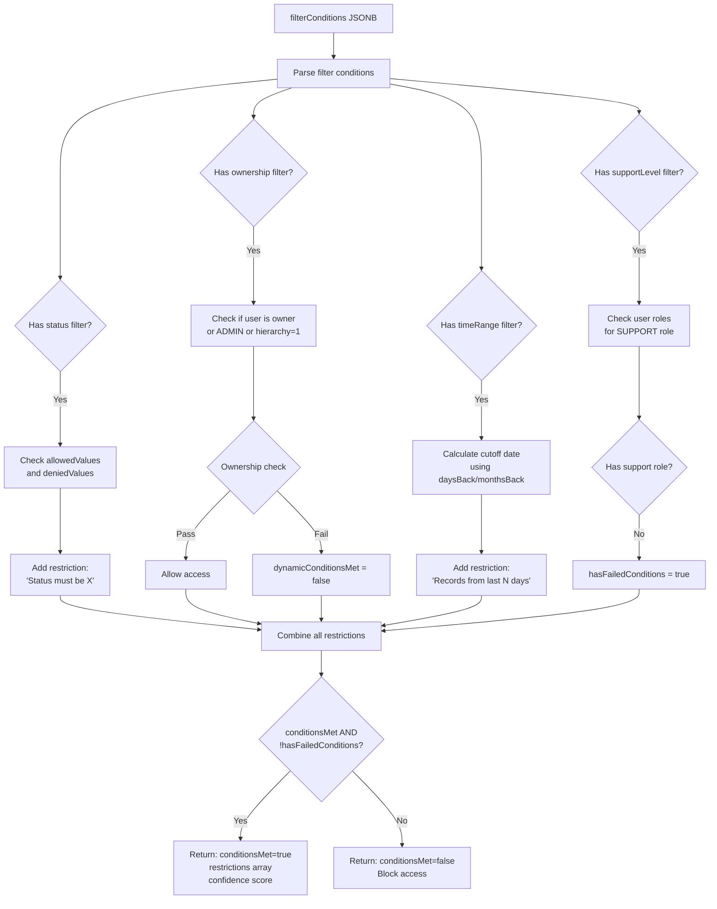

# Step 8: Data Access Policy Check - Hướng Dẫn Chi Tiết

## Tổng Quan

**Step 8: Data Access Policy Check** là bước thứ 8 trong quy trình xác thực RBAC 15 bước của hệ thống Enterprise Grade. Bước này có nhiệm vụ **kiểm tra và áp dụng các chính sách truy cập dữ liệu (Data Access Policies)** dựa trên điều kiện lọc động (filter conditions) và mức độ phân cấp tổ chức.

### Vị Trí Trong Quy Trình 15 Bước

```
Step 1: Pre-validation
Step 2: User Context Resolution
Step 3: Resource Identification
Step 4: Permission Template Check
Step 5: Permission Override Check
Step 6: Resource Permission Check      ← Kiểm tra quyền cơ bản trên resource
Step 7: [Reserved]
Step 8: Data Access Policy Check       ← BƯỚC NÀY - Kiểm tra chính sách truy cập dữ liệu
Step 9: Context Policy Check
Step 10: Hierarchy Permission Check
...
```

### Sự Khác Biệt Giữa Step 6 và Step 8

| Khía Cạnh | Step 6: Resource Permission Check | Step 8: Data Access Policy Check |
|-----------|-----------------------------------|----------------------------------|
| **Mục đích** | Kiểm tra quyền cơ bản trên resource type | Áp dụng filter conditions động để hạn chế dữ liệu |
| **Scope** | Resource-level (toàn bộ resource) | Record-level (từng bản ghi cụ thể) |
| **Filter** | Không có filter | Có filter conditions phức tạp (JSONB) |
| **Targeting** | Dựa trên permission template | Dựa trên department, org level, hierarchy |
| **Output** | Có quyền hay không | Có quyền + điều kiện lọc áp dụng |
| **Ví dụ** | "User có quyền READ CUSTOMERS không?" | "User chỉ xem CUSTOMERS có status='active' và trong 90 ngày gần đây" |

## Cấu Trúc Dữ Liệu Database

### Schema: `mktDataAccessPolicy`

```sql
CREATE TABLE "mktDataAccessPolicy" (
    id UUID PRIMARY KEY DEFAULT uuid_generate_v4(),
    name TEXT NOT NULL,
    description TEXT,
    objectName TEXT NOT NULL,              -- Đối tượng áp dụng: 'CUSTOMERS', 'ORDERS', '*' (wildcard)
    filterConditions JSONB NOT NULL,       -- Điều kiện lọc (quan trọng nhất!)
    priority DOUBLE PRECISION DEFAULT 0,   -- Độ ưu tiên (cao hơn = áp dụng trước)
    isActive BOOLEAN DEFAULT true,
    position DOUBLE PRECISION,

    -- Targeting criteria (chỉ định áp dụng cho ai)
    minHierarchyLevel DOUBLE PRECISION,    -- Mức phân cấp tối thiểu (1=Admin, 2=Manager, 3=Team Lead, 4=Staff)
    maxHierarchyLevel DOUBLE PRECISION,    -- Mức phân cấp tối đa
    departmentId UUID,                     -- Áp dụng cho department cụ thể
    organizationLevelId UUID,              -- Áp dụng cho organization level cụ thể
    specificMemberId UUID,                 -- Áp dụng cho member cụ thể
    permissionTemplateId UUID,             -- Liên kết với template

    createdAt TIMESTAMP WITH TIME ZONE DEFAULT now(),
    updatedAt TIMESTAMP WITH TIME ZONE DEFAULT now(),
    deletedAt TIMESTAMP WITH TIME ZONE
);
```

### Dữ Liệu Thực Tế Từ Database

#### 1. Policy Cao Nhất: Admin Full System Access
```json
{
  "name": "Admin Full System Access",
  "objectName": "*",
  "priority": 100,
  "minHierarchyLevel": 1,
  "maxHierarchyLevel": 1,
  "organizationLevelId": "1a2b3c4d-5e6f-7a8b-9c0d-e1f2a3b4c5d6",
  "filterConditions": {
    "scope": "GLOBAL",
    "accessLevel": "FULL",
    "audit": {
      "level": "HIGH",
      "required": true,
      "logAllAccess": true
    },
    "restrictions": {
      "timeLimit": false,
      "amountLimit": false,
      "departmentLimit": false,
      "confidentialAccess": true
    }
  }
}
```

#### 2. Policy Trung Cấp: Manager Cross-Department Customer Access
```json
{
  "name": "Manager Cross-Department Customer Access",
  "objectName": "CUSTOMERS",
  "priority": 75,
  "minHierarchyLevel": 2,
  "maxHierarchyLevel": 2,
  "filterConditions": {
    "scope": "CROSS_DEPARTMENT",
    "audit": {
      "level": "MEDIUM",
      "required": true
    },
    "status": {
      "allowedValues": ["active", "prospect", "lead"],
      "deniedValues": ["archived", "blocked", "deleted"]
    },
    "timeRange": {
      "field": "updatedAt",
      "daysBack": 180
    },
    "sensitiveData": {
      "excludeFields": ["creditCard", "bankAccount", "ssn"],
      "requireApprovalForExport": true
    }
  }
}
```

#### 3. Policy Nhân Viên: Staff Owned Customer Access
```json
{
  "name": "Staff Owned Customer Access",
  "objectName": "CUSTOMERS",
  "priority": 55,
  "minHierarchyLevel": 4,
  "maxHierarchyLevel": 4,
  "filterConditions": {
    "scope": "OWNED",
    "audit": {
      "level": "MEDIUM",
      "required": true
    },
    "status": {
      "allowedValues": ["active", "prospect", "lead"]
    },
    "ownership": {
      "field": "accountOwnerId",
      "enabled": true,
      "allowShared": true,
      "sharedTypes": ["TEAM_SHARED", "EXPLICIT_SHARE"]
    },
    "timeRange": {
      "field": "updatedAt",
      "daysBack": 30
    },
    "sensitiveData": {
      "excludeFields": ["creditCard", "bankAccount", "ssn", "taxId", "salary", "commission"]
    }
  }
}
```

### Thống Kê Policies Trong Hệ Thống

```sql
-- Phân bố policies theo objectName
CUSTOMERS:      7 policies (avg priority: 38.3)
ORDERS:         4 policies (avg priority: 51.5)
REPORTS:        2 policies (avg priority: 63.0)
PRODUCTS:       2 policies (avg priority: 23.5)
FINANCIAL_DATA: 2 policies (avg priority: 17.5)
* (wildcard):   1 policy  (priority: 100)
BUDGET_DATA:    1 policy  (priority: 72)
KPIS:           1 policy  (priority: 63)
```

## Kiến Trúc và Flow Xử Lý

### Mermaid Diagram: Overall Flow



### Mermaid Diagram: Match Score Calculation



### Mermaid Diagram: Filter Conditions Evaluation



## Chi Tiết Các Methods

### 1. `validate(context)` - Main Entry Point

**Mục đích**: Entry point chính của Step 8, xác thực context và gọi evaluation.

**Logic**:
```typescript
async validate(context: EnhancedPermissionContext): Promise<StepValidationResult> {
  // 1. Validate prerequisites
  if (!context.userContext) return FAIL('USER_CONTEXT_MISSING');
  if (!context.resourceContext?.resourceType) return FAIL('RESOURCE_TYPE_MISSING');

  // 2. Evaluate policies
  const policyEvaluation = await this.evaluateDataAccessPolicies(
    context.userContext,
    context,
    context.resourceContext.resourceType,
    context.resourceContext.objectName,
    context.action,
    workspaceId
  );

  // 3. Update context with results
  this.updateContextWithPolicyResults(context, policyEvaluation);

  // 4. Return result based on evaluation
  return {
    result: policyEvaluation.hasPermission ? PASS : FAIL,
    continue: policyEvaluation.hasPermission,
    reason: `Data access policy check ${policyEvaluation.source}`,
    metadata: { confidence, appliedPolicyCount, evaluationMode }
  };
}
```

### 2. `evaluateDataAccessPolicies()` - Policy Evaluation

**Mục đích**: Tìm và xử lý các policies áp dụng cho user và resource.

**Logic**:
```typescript
private async evaluateDataAccessPolicies(
  userContext, context, resourceType, objectName, action, workspaceId
): Promise<DataAccessPolicyEvaluation> {
  // 1. Find applicable policies
  const applicablePolicies = await this.findApplicablePolicies(
    userContext, resourceType, objectName, workspaceId
  );

  // 2. If no policies, return system default
  if (applicablePolicies.length === 0) {
    return this.getSystemDefaultPolicyEvaluation(userContext);
  }

  // 3. Process policies by priority
  return await this.processDataAccessPolicies(
    userContext, context, applicablePolicies, action, workspaceId
  );
}
```

### 3. `findApplicablePolicies()` - Find Matching Policies

**Mục đích**: Tìm tất cả policies active cho objectName và đánh giá match score.

**Logic**:
```typescript
private async findApplicablePolicies(
  userContext, resourceType, objectName, workspaceId
): Promise<PolicyMatchResult[]> {
  // 1. Get all active policies for the object
  const allPolicies = await dataAccessPolicyRepository.find({
    where: { objectName, isActive: true }
  });

  // 2. Evaluate each policy for applicability
  const matchResults = [];
  for (const policy of allPolicies) {
    const matchResult = await this.evaluatePolicyMatch(policy, userContext, resourceType);
    if (matchResult.matchScore > 0) {
      matchResults.push(matchResult);
    }
  }

  // 3. Sort by match score (highest first), then by priority
  matchResults.sort((a, b) => {
    if (a.matchScore !== b.matchScore) return b.matchScore - a.matchScore;
    return (b.policy.priority || 0) - (a.policy.priority || 0);
  });

  return matchResults;
}
```

### 4. `evaluatePolicyMatch()` - Calculate Match Score

**Mục đích**: Tính match score dựa trên targeting criteria.

**Logic và Match Scores**:

| Targeting Criteria | Match Score | Type | Mô Tả |
|-------------------|-------------|------|-------|
| `specificMemberId === userId` | **100** | SPECIFIC_MEMBER | Policy chỉ định cho user cụ thể (ưu tiên cao nhất) |
| `departmentId === user.departmentId` | **85** | DEPARTMENT_POLICY | Policy áp dụng cho department |
| `organizationLevelId === user.orgLevelId` | **75** | ORGANIZATION_LEVEL | Policy áp dụng cho organization level (Admin, Manager, Staff...) |
| `minHierarchyLevel <= user.level <= maxHierarchyLevel` | **65** | HIERARCHY_RANGE | Policy áp dụng cho range phân cấp |
| Không có targeting nào | **15** | GLOBAL_POLICY | Policy áp dụng cho tất cả mọi người |
| Không match | **0** | N/A | Policy không áp dụng |

**Code**:
```typescript
private async evaluatePolicyMatch(
  policy, userContext, resourceType
): Promise<PolicyMatchResult> {
  let matchScore = 0;
  let matchType = 'GLOBAL_POLICY';

  // Check specific member (highest priority)
  if (policy.specificMemberId === userContext.userId) {
    matchScore = 100;
    matchType = 'SPECIFIC_MEMBER';
  }
  // Check department
  else if (policy.departmentId === userContext.departmentId) {
    matchScore = 85;
    matchType = 'DEPARTMENT_POLICY';
  }
  // Check organization level
  else if (policy.organizationLevelId === userContext.organizationLevelId) {
    matchScore = 75;
    matchType = 'ORGANIZATION_LEVEL';
  }
  // Check hierarchy range
  else if (userContext.hierarchyLevel >= minLevel && userContext.hierarchyLevel <= maxLevel) {
    matchScore = 65;
    matchType = 'HIERARCHY_RANGE';
  }
  // Global policy
  else if (!hasAnyTargeting) {
    matchScore = 15;
    matchType = 'GLOBAL_POLICY';
  }

  return { policy, matchScore, matchType, conditions: policy.filterConditions };
}
```

### 5. `processDataAccessPolicies()` - Process Matching Policies

**Mục đích**: Xử lý danh sách policies đã match, apply filter conditions, và quyết định access.

**Logic**:
```typescript
private async processDataAccessPolicies(
  userContext, context, applicablePolicies, action, workspaceId
): Promise<DataAccessPolicyEvaluation> {
  let finalDecision = false;
  let combinedFilterConditions = {};
  const appliedPolicyIds = [];
  let confidence = 0;

  // Process policies in order (sorted by matchScore and priority)
  for (const policyMatch of applicablePolicies) {
    const policy = policyMatch.policy;

    // Evaluate filter conditions
    const filterEvaluation = await this.evaluateFilterConditions(
      policy.filterConditions, userContext, context, action
    );

    if (filterEvaluation.conditionsMet) {
      finalDecision = true;
      confidence = Math.max(confidence, policyMatch.matchScore);
      appliedPolicyIds.push(policy.id);

      // Combine filter conditions
      combinedFilterConditions = {
        ...combinedFilterConditions,
        ...policy.filterConditions
      };
    }

    // For strict mode, stop at first matching high-priority policy
    if (finalDecision && isStrictMode && policyMatch.matchScore >= 80) {
      break;
    }
  }

  return {
    hasPermission: finalDecision && filtersPassed && dynamicConditionsMet,
    source: finalSource,
    confidence: confidence / 100,
    filterConditions: combinedFilterConditions,
    metadata: { appliedPolicyIds, matchedPolicyCount, evaluationMode }
  };
}
```

### 6. `evaluateFilterConditions()` - Evaluate JSONB Filters

**Mục đích**: Đánh giá các filter conditions trong JSONB và tạo restrictions.

**Các Loại Filter Conditions Được Hỗ Trợ**:

#### a. **Status Filter**
```json
{
  "status": {
    "allowedValues": ["active", "prospect", "lead"],
    "deniedValues": ["archived", "deleted", "blocked"]
  }
}
```

**Logic**:
- Kiểm tra `allowedValues`: Chỉ cho phép records có status trong danh sách
- Kiểm tra `deniedValues`: Chặn records có status trong danh sách
- Thêm restriction: `"Status must be one of: active, prospect, lead"`

#### b. **Ownership Filter**
```json
{
  "ownership": {
    "field": "accountOwnerId",
    "enabled": true,
    "allowShared": true,
    "sharedTypes": ["TEAM_SHARED", "EXPLICIT_SHARE"]
  }
}
```

**Logic**:
- Kiểm tra nếu user là owner hoặc ADMIN hoặc hierarchy level 1
- Nếu không và `allowShared !== true`, set `dynamicConditionsMet = false`
- Thêm restriction: `"Access limited to record owners or shared records"`
- **Dynamic condition**: Phụ thuộc vào runtime data

#### c. **Time Range Filter**
```json
{
  "timeRange": {
    "field": "updatedAt",
    "daysBack": 180
  }
}
```

**Logic**:
- Tính cutoff date: `DateTime.now().minus({ days: daysBack })`
- Chỉ cho phép records có field >= cutoff date
- Thêm restriction: `"Access limited to records from last 180 days"`
- **Dynamic condition**: Phụ thuộc vào thời gian hiện tại

#### d. **Support Level Filter**
```json
{
  "supportLevel": {
    "enabled": true,
    "maxLevel": "TIER_2"
  }
}
```

**Logic**:
- Kiểm tra user có role SUPPORT không
- Nếu không có, set `hasFailedConditions = true`
- Thêm restriction: `"Support access limited to TIER_2 level"`

#### e. **Sensitive Data Filter**
```json
{
  "sensitiveData": {
    "excludeFields": ["creditCard", "bankAccount", "ssn"],
    "requireApprovalForExport": true
  }
}
```

**Logic**:
- Chỉ định các fields bị exclude khi trả về data
- Yêu cầu approval cho export operations
- Không block access, chỉ hạn chế fields

**Code Implementation**:
```typescript
private async evaluateFilterConditions(
  filterConditions, userContext, context, action
): Promise<{
  conditionsMet: boolean;
  restrictions: string[];
  hasFailedConditions: boolean;
  hasDynamicConditions: boolean;
  dynamicConditionsMet: boolean;
}> {
  const restrictions = [];
  let hasFailedConditions = false;
  let hasDynamicConditions = false;
  let dynamicConditionsMet = true;

  // Evaluate status
  if (filterConditions.status) {
    const statusFilter = filterConditions.status;
    if (statusFilter.allowedValues) {
      restrictions.push(`Status must be one of: ${statusFilter.allowedValues.join(', ')}`);
    }
  }

  // Evaluate ownership (dynamic)
  if (filterConditions.ownership?.enabled) {
    hasDynamicConditions = true;
    const canAccess = userContext.roles?.includes('OWNER') ||
                      userContext.roles?.includes('ADMIN') ||
                      userContext.hierarchyLevel === 1;
    if (!canAccess && !ownership.allowShared) {
      dynamicConditionsMet = false;
      hasFailedConditions = true;
    }
    restrictions.push('Access limited to record owners or shared records');
  }

  // Evaluate time range (dynamic)
  if (filterConditions.timeRange) {
    hasDynamicConditions = true;
    const cutoffDate = DateTime.now().minus({ days: timeRange.daysBack });
    restrictions.push(`Access limited to records from last ${timeRange.daysBack} days`);
  }

  return {
    conditionsMet: true && !hasFailedConditions,
    restrictions,
    hasFailedConditions,
    hasDynamicConditions,
    dynamicConditionsMet
  };
}
```

### 7. `getSystemDefaultPolicyEvaluation()` - Fallback Logic

**Mục đích**: Trả về default policy khi không có policy nào áp dụng.

**Logic**:
```typescript
private getSystemDefaultPolicyEvaluation(
  userContext
): DataAccessPolicyEvaluation {
  const hierarchyLevel = userContext.hierarchyLevel ?? 0;
  const userRoles = userContext.roles || [];

  // System admins and level 1 users get default access
  const hasSystemAccess =
    userRoles.includes('SYSTEM_ADMIN') ||
    userRoles.includes('ADMIN') ||
    hierarchyLevel === 1;

  return {
    hasPermission: hasSystemAccess,
    source: 'SYSTEM_DEFAULT',
    level: hasSystemAccess ? 'ADMIN' : 'READ',
    restrictions: hasSystemAccess ? [] : ['No applicable data access policies found'],
    confidence: hasSystemAccess ? 0.5 : 0.1,
    filterConditions: {},
    metadata: {
      appliedPolicyIds: [],
      matchedPolicyCount: 0,
      highestPriority: 0,
      evaluationMode: 'STRICT',
      filtersPassed: true,
      dynamicConditionsMet: true
    }
  };
}
```

**Quy tắc**:
- SYSTEM_ADMIN, ADMIN, hoặc hierarchyLevel=1 → **Allow với confidence 0.5**
- Người dùng khác → **Block hoặc READ-only với confidence 0.1**

### 8. `updateContextWithPolicyResults()` - Update Context

**Mục đích**: Cập nhật context với kết quả evaluation để các steps sau sử dụng.

**Logic**:
```typescript
private updateContextWithPolicyResults(
  context: EnhancedPermissionContext,
  evaluation: DataAccessPolicyEvaluation
): void {
  if (!context.policyContext) {
    context.policyContext = {
      applicablePolicies: [],
      filterConditions: {},
      priority: 0,
      isDynamic: false,
      evaluationMode: 'BALANCED'
    };
  }

  context.policyContext.applicablePolicies = evaluation.metadata.appliedPolicyIds;
  context.policyContext.filterConditions = evaluation.filterConditions; // Converted to simple types
  context.policyContext.priority = evaluation.metadata.highestPriority;
  context.policyContext.isDynamic = evaluation.metadata.dynamicConditionsMet;
  context.policyContext.evaluationMode = evaluation.metadata.evaluationMode;
}
```

**Context được cập nhật**:
- `policyContext.applicablePolicies`: List policy IDs đã áp dụng
- `policyContext.filterConditions`: Filter conditions tổng hợp
- `policyContext.priority`: Priority cao nhất
- `policyContext.isDynamic`: Có dynamic conditions không
- `policyContext.evaluationMode`: STRICT / BALANCED / PERMISSIVE

### 9. Evaluation Mode Logic

**Mục đích**: Xác định chế độ evaluation dựa trên priority và user roles.

```typescript
private determineEvaluationMode(
  priority: number,
  userContext: EnhancedUserContext
): 'STRICT' | 'BALANCED' | 'PERMISSIVE' {
  const userRoles = userContext.roles || [];
  const isSensitiveRole = userRoles.some(role =>
    ['SYSTEM_ADMIN', 'SECURITY_ADMIN', 'COMPLIANCE_OFFICER'].includes(role)
  );

  if (priority >= 80 || isSensitiveRole) {
    return 'STRICT';      // Stop at first matching high-priority policy
  } else if (priority >= 50) {
    return 'BALANCED';    // Evaluate multiple policies
  } else {
    return 'PERMISSIVE';  // More lenient evaluation
  }
}
```

**Ảnh hưởng của Evaluation Mode**:

| Mode | Priority Range | Behavior | Use Case |
|------|---------------|----------|----------|
| **STRICT** | >= 80 hoặc sensitive roles | Stop at first match score >= 80 | High-security resources, admin access |
| **BALANCED** | 50-79 | Evaluate multiple policies | Normal business data |
| **PERMISSIVE** | < 50 | Evaluate all policies | Public or low-sensitivity data |

## Confidence Score System

### Confidence Score Mapping

Confidence score được tính từ match score và convert sang scale 0-1:

```typescript
confidence = matchScore / 100
```

| Match Score | Confidence | Meaning |
|-------------|-----------|---------|
| 100 | **1.0** | Specific member targeting - Chắc chắn 100% |
| 85 | **0.85** | Department targeting - Rất chắc chắn |
| 75 | **0.75** | Organization level targeting - Khá chắc chắn |
| 65 | **0.65** | Hierarchy range targeting - Trung bình khá |
| 15 | **0.15** | Global policy - Không chắc chắn |
| 0 (system default) | **0.5 (admin) / 0.1 (other)** | Fallback |

### Cách Sử Dụng Confidence

```typescript
if (confidence >= 0.8) {
  // High confidence - Allow without additional checks
} else if (confidence >= 0.5) {
  // Medium confidence - May require additional validation
} else {
  // Low confidence - Strict monitoring or deny
}
```

## Scenarios Thực Tế

### Scenario 1: Admin Truy Cập Toàn Bộ Hệ Thống

**Context**:
```typescript
userContext = {
  userId: 'admin-001',
  organizationLevelId: '1a2b3c4d-5e6f-7a8b-9c0d-e1f2a3b4c5d6',
  hierarchyLevel: 1,
  roles: ['SYSTEM_ADMIN', 'ADMIN']
}

resourceContext = {
  resourceType: 'CUSTOMERS',
  objectName: 'CUSTOMERS'
}

action = 'READ'
```

**Matching Policy**:
```json
{
  "name": "Admin Full System Access",
  "objectName": "*",
  "priority": 100,
  "minHierarchyLevel": 1,
  "maxHierarchyLevel": 1,
  "organizationLevelId": "1a2b3c4d-5e6f-7a8b-9c0d-e1f2a3b4c5d6",
  "filterConditions": {
    "scope": "GLOBAL",
    "accessLevel": "FULL",
    "audit": { "level": "HIGH", "required": true, "logAllAccess": true }
  }
}
```

**Evaluation Flow**:
1. `findApplicablePolicies()`: Tìm thấy policy "Admin Full System Access" với objectName="*"
2. `evaluatePolicyMatch()`:
   - Check: `organizationLevelId === userContext.organizationLevelId` ✓
   - **matchScore = 75** (ORGANIZATION_LEVEL)
3. `evaluateFilterConditions()`:
   - Filter: `scope: GLOBAL`, `accessLevel: FULL`
   - Audit required: HIGH level
   - **conditionsMet = true**
4. `processDataAccessPolicies()`:
   - **finalDecision = true**
   - **confidence = 0.75**
   - **source = ORGANIZATION_LEVEL**
5. **Result**: PASS với full access, audit logging enabled

**SQL Query Generated** (conceptual):
```sql
SELECT * FROM CUSTOMERS
-- No filters applied (FULL access)
-- But all access logged for audit
```

### Scenario 2: Manager Xem Customers Xuyên Phòng Ban

**Context**:
```typescript
userContext = {
  userId: 'manager-001',
  organizationLevelId: '4d5e6f7a-8b9c-0d1e-2f3a-b4c5d6e7f8a9', // Manager level
  hierarchyLevel: 2,
  departmentId: 'sales-dept-id',
  roles: ['MANAGER']
}

resourceContext = {
  resourceType: 'CUSTOMERS',
  objectName: 'CUSTOMERS'
}

action = 'READ'
```

**Matching Policy**:
```json
{
  "name": "Manager Cross-Department Customer Access",
  "objectName": "CUSTOMERS",
  "priority": 75,
  "minHierarchyLevel": 2,
  "maxHierarchyLevel": 2,
  "filterConditions": {
    "scope": "CROSS_DEPARTMENT",
    "status": {
      "allowedValues": ["active", "prospect", "lead"],
      "deniedValues": ["archived", "blocked", "deleted"]
    },
    "timeRange": { "field": "updatedAt", "daysBack": 180 },
    "sensitiveData": {
      "excludeFields": ["creditCard", "bankAccount", "ssn"]
    }
  }
}
```

**Evaluation Flow**:
1. `findApplicablePolicies()`: Tìm thấy policy "Manager Cross-Department Customer Access"
2. `evaluatePolicyMatch()`:
   - Check: `organizationLevelId === userContext.organizationLevelId` ✓
   - **matchScore = 75** (ORGANIZATION_LEVEL)
3. `evaluateFilterConditions()`:
   - Status filter: only `active`, `prospect`, `lead` ✓
   - Time range: last 180 days ✓
   - Sensitive data: exclude creditCard, bankAccount, ssn ✓
   - **Restrictions**: ["Status must be one of: active, prospect, lead", "Access limited to records from last 180 days"]
4. `processDataAccessPolicies()`:
   - **finalDecision = true**
   - **confidence = 0.75**
   - **filterConditions**: Combined from policy
5. **Result**: PASS với filters applied

**SQL Query Generated** (conceptual):
```sql
SELECT id, name, email, phone, address, ...
-- Exclude: creditCard, bankAccount, ssn
FROM CUSTOMERS
WHERE status IN ('active', 'prospect', 'lead')
  AND status NOT IN ('archived', 'blocked', 'deleted')
  AND updatedAt >= NOW() - INTERVAL '180 days';
```

### Scenario 3: Staff Chỉ Xem Customers Của Mình

**Context**:
```typescript
userContext = {
  userId: 'staff-001',
  organizationLevelId: '6f7a8b9c-0d1e-2f3a-4b5c-d6e7f8a9b0c1', // Staff level
  hierarchyLevel: 4,
  departmentId: 'sales-team-a-id',
  roles: ['STAFF']
}

resourceContext = {
  resourceType: 'CUSTOMERS',
  objectName: 'CUSTOMERS',
  recordOwnerId: 'staff-001' // Assuming this record is owned by the user
}

action = 'READ'
```

**Matching Policy**:
```json
{
  "name": "Staff Owned Customer Access",
  "objectName": "CUSTOMERS",
  "priority": 55,
  "minHierarchyLevel": 4,
  "maxHierarchyLevel": 4,
  "filterConditions": {
    "scope": "OWNED",
    "status": { "allowedValues": ["active", "prospect", "lead"] },
    "ownership": {
      "field": "accountOwnerId",
      "enabled": true,
      "allowShared": true,
      "sharedTypes": ["TEAM_SHARED", "EXPLICIT_SHARE"]
    },
    "timeRange": { "field": "updatedAt", "daysBack": 30 },
    "sensitiveData": {
      "excludeFields": ["creditCard", "bankAccount", "ssn", "taxId", "salary", "commission"]
    }
  }
}
```

**Evaluation Flow**:
1. `findApplicablePolicies()`: Tìm thấy policy "Staff Owned Customer Access"
2. `evaluatePolicyMatch()`:
   - Check: `organizationLevelId === userContext.organizationLevelId` ✓
   - **matchScore = 75** (ORGANIZATION_LEVEL)
3. `evaluateFilterConditions()`:
   - Status filter: only active, prospect, lead ✓
   - **Ownership filter**: enabled, check if user is owner or ADMIN
     - User is NOT owner/admin → Check `allowShared`
     - `allowShared = true` → **dynamicConditionsMet = true** (nếu record được share)
   - Time range: last 30 days ✓
   - Sensitive data: exclude nhiều fields ✓
4. `processDataAccessPolicies()`:
   - **finalDecision = true** (nếu ownership check passed)
   - **confidence = 0.75**
   - **filterConditions**: Heavy restrictions
5. **Result**: PASS nếu user owns record hoặc record được share, else FAIL

**SQL Query Generated** (conceptual):
```sql
SELECT id, name, email, phone, address, ...
-- Exclude: creditCard, bankAccount, ssn, taxId, salary, commission
FROM CUSTOMERS
WHERE status IN ('active', 'prospect', 'lead')
  AND updatedAt >= NOW() - INTERVAL '30 days'
  AND (
    accountOwnerId = 'staff-001'
    OR id IN (SELECT customerId FROM customer_shares WHERE sharedWith = 'staff-001' AND shareType IN ('TEAM_SHARED', 'EXPLICIT_SHARE'))
  );
```

### Scenario 4: Không Có Policy Nào Match - System Default

**Context**:
```typescript
userContext = {
  userId: 'contractor-001',
  organizationLevelId: 'contractor-level-id',
  hierarchyLevel: 6,
  roles: ['CONTRACTOR']
}

resourceContext = {
  resourceType: 'FINANCIAL_DATA',
  objectName: 'FINANCIAL_DATA'
}

action = 'READ'
```

**Evaluation Flow**:
1. `findApplicablePolicies()`: Tìm thấy 0 policies (không có policy nào cho FINANCIAL_DATA với contractor)
2. `getSystemDefaultPolicyEvaluation()`:
   - Check: User có SYSTEM_ADMIN / ADMIN role? **No**
   - Check: hierarchyLevel === 1? **No** (hierarchyLevel = 6)
   - **hasSystemAccess = false**
3. **Result**:
   - **hasPermission = false**
   - **source = SYSTEM_DEFAULT**
   - **level = READ**
   - **confidence = 0.1**
   - **restrictions**: ["No applicable data access policies found"]
4. **Final Result**: FAIL - Access denied

## Priority và Cascading Logic

### Priority System

```typescript
// Example policies sorted by priority
[
  { name: "Admin Full Access", priority: 100, objectName: "*" },
  { name: "Manager Customer Access", priority: 75, objectName: "CUSTOMERS" },
  { name: "Manager Order Access", priority: 74, objectName: "ORDERS" },
  { name: "Team Lead Access", priority: 65, objectName: "CUSTOMERS" },
  { name: "Staff Owned Access", priority: 55, objectName: "CUSTOMERS" }
]
```

### Cascading Logic

**Câu hỏi**: Nếu user match nhiều policies, policy nào được áp dụng?

**Trả lời**:
1. **Sort by matchScore** (cao nhất trước): SPECIFIC_MEMBER (100) > DEPARTMENT (85) > ORG_LEVEL (75) > HIERARCHY (65) > GLOBAL (15)
2. **Sort by priority** (nếu matchScore bằng nhau): priority 100 > 75 > 50...
3. **Apply all matching policies** và combine filter conditions (mode BALANCED/PERMISSIVE)
4. **Stop at first match** nếu mode STRICT và matchScore >= 80

**Ví dụ**:
```typescript
// User: Manager (hierarchyLevel=2) trong Sales Department

// Matching policies:
Policy A: { matchScore: 75, priority: 75, organizationLevelId: 'MANAGER' }
Policy B: { matchScore: 85, priority: 60, departmentId: 'SALES' }
Policy C: { matchScore: 65, priority: 80, minHierarchyLevel: 2, maxHierarchyLevel: 3 }

// Sorted result:
// 1. Policy B (matchScore 85)    ← Applied first
// 2. Policy A (matchScore 75)    ← Applied second
// 3. Policy C (matchScore 65)    ← Applied third

// Combined filterConditions = merge(B.filterConditions, A.filterConditions, C.filterConditions)
```

### Strict Mode Example

```typescript
// User: SECURITY_ADMIN with hierarchyLevel=1

// isStrictEvaluationMode() = true (because SECURITY_ADMIN role)

// Matching policies:
Policy A: { matchScore: 100, priority: 90, specificMemberId: 'user-id' }
Policy B: { matchScore: 75, priority: 100, organizationLevelId: 'ADMIN' }

// Process:
// 1. Evaluate Policy A → matchScore 100 >= 80 → Apply and STOP
// 2. Policy B is NOT evaluated (strict mode stops early)

// Result: Only Policy A applied
```

## Performance Considerations

### 1. Estimated Execution Time

```typescript
getEstimatedExecutionTime(): number {
  return STEP_PERFORMANCE_CONFIG[VALIDATION_STEPS.DATA_ACCESS_POLICY_CHECK]
    ?.estimatedExecutionTime || 150; // 150ms
}

isPerformanceOptimal(executionTime: number): boolean {
  const threshold = STEP_PERFORMANCE_CONFIG[...].maxExecutionTime || 4000; // 4000ms
  return executionTime <= threshold;
}
```

**Benchmarks**:
- **Estimated**: 150ms
- **Max threshold**: 4000ms
- **Typical**: 100-300ms (with 5-10 policies)

### 2. Database Query Optimization

**Problem**: Mỗi `findApplicablePolicies()` query database để load policies.

**Solution**:
```typescript
// Current: Simple query
const allPolicies = await repository.find({
  where: { objectName, isActive: true }
});

// Optimization ideas:
// 1. Add index on (objectName, isActive, priority)
CREATE INDEX idx_policy_lookup ON "mktDataAccessPolicy"(objectName, isActive, priority DESC);

// 2. Cache policies in memory (Redis)
const cacheKey = `policies:${workspaceId}:${objectName}`;
let policies = await redis.get(cacheKey);
if (!policies) {
  policies = await repository.find(...);
  await redis.set(cacheKey, policies, { ttl: 300 }); // 5 min cache
}

// 3. Pre-load policies at workspace startup
```

### 3. Filter Evaluation Optimization

**Problem**: `evaluateFilterConditions()` được gọi cho mỗi policy match.

**Solution**:
- **Early exit**: Nếu `hasFailedConditions = true`, không cần evaluate các filters khác
- **Lazy evaluation**: Chỉ evaluate filters khi cần thiết
- **Cache filter results**: Nếu cùng filterConditions được evaluate nhiều lần

### 4. Strict Mode Performance Benefit

```typescript
// STRICT mode stops early
if (finalDecision && isStrictMode && policyMatch.matchScore >= 80) {
  break; // Don't process remaining policies
}

// Example:
// Without strict: Process 10 policies = 10 * 20ms = 200ms
// With strict: Stop at policy 1 = 1 * 20ms = 20ms (10x faster)
```

## Troubleshooting Guide

### Issue 1: User Không Có Access Dù Có Policy

**Symptoms**:
```typescript
Result: FAIL
Reason: "Data access policy check failed - SYSTEM_DEFAULT"
```

**Debug Steps**:
1. **Check policy active status**:
   ```sql
   SELECT * FROM "mktDataAccessPolicy"
   WHERE objectName = 'CUSTOMERS' AND isActive = true AND deletedAt IS NULL;
   ```

2. **Check targeting criteria**:
   ```typescript
   // In evaluatePolicyMatch(), add logging:
   this.logger.debug(`Policy: ${policy.name}`);
   this.logger.debug(`User orgLevelId: ${userContext.organizationLevelId}`);
   this.logger.debug(`Policy orgLevelId: ${policy.organizationLevelId}`);
   this.logger.debug(`Match score: ${matchScore}`);
   ```

3. **Check filter conditions**:
   ```typescript
   // In evaluateFilterConditions(), log each filter result:
   this.logger.debug(`Status filter: ${JSON.stringify(statusFilter)}`);
   this.logger.debug(`Ownership check: canAccess=${canAccess}`);
   this.logger.debug(`hasFailedConditions: ${hasFailedConditions}`);
   ```

**Common Causes**:
- ❌ Policy có `organizationLevelId` không match với user
- ❌ Policy có `departmentId` không match
- ❌ Ownership filter fail vì user không phải owner
- ❌ Status filter deny record's status
- ❌ Time range filter exclude record (quá cũ)

### Issue 2: Access Quá Rộng - Không Apply Filter

**Symptoms**:
```typescript
Result: PASS
filterConditions: {} // Empty!
```

**Debug Steps**:
1. **Check applied policies**:
   ```typescript
   this.logger.debug(`Applied policy IDs: ${appliedPolicyIds}`);
   this.logger.debug(`Combined filterConditions: ${JSON.stringify(combinedFilterConditions)}`);
   ```

2. **Check policy priority**:
   ```sql
   SELECT name, priority, "filterConditions"
   FROM "mktDataAccessPolicy"
   WHERE id IN ('policy-id-1', 'policy-id-2')
   ORDER BY priority DESC;
   ```

**Common Causes**:
- ❌ Policy có `filterConditions: {}` (empty)
- ❌ High-priority global policy override specific policies
- ❌ Admin user skip Step 8 entirely (in `shouldExecute()`)

### Issue 3: Performance Chậm (>1000ms)

**Symptoms**:
```typescript
executionTime: 1200ms // > threshold 150ms
```

**Debug Steps**:
1. **Enable query logging**:
   ```typescript
   const startFind = DateTime.now();
   const policies = await repository.find(...);
   this.logger.debug(`findApplicablePolicies: ${DateTime.now().diff(startFind).toMillis()}ms`);
   ```

2. **Check số lượng policies**:
   ```sql
   SELECT objectName, COUNT(*)
   FROM "mktDataAccessPolicy"
   WHERE isActive = true
   GROUP BY objectName;
   ```

3. **Profile filter evaluation**:
   ```typescript
   for (const policyMatch of applicablePolicies) {
     const startEval = DateTime.now();
     const filterEvaluation = await this.evaluateFilterConditions(...);
     this.logger.debug(`Filter eval ${policy.name}: ${DateTime.now().diff(startEval).toMillis()}ms`);
   }
   ```

**Optimizations**:
- ✅ Add database index on `(objectName, isActive, priority)`
- ✅ Enable Redis caching for policies
- ✅ Use STRICT mode for high-priority users
- ✅ Reduce số lượng policies (merge similar policies)

### Issue 4: Confidence Score Thấp

**Symptoms**:
```typescript
confidence: 0.15 // Too low
source: "GLOBAL_POLICY"
```

**Debug Steps**:
1. **Check match type**:
   ```typescript
   this.logger.debug(`Match type: ${matchType}, Score: ${matchScore}`);
   ```

2. **Create more specific policy**:
   ```sql
   -- Instead of global policy, create department-specific
   INSERT INTO "mktDataAccessPolicy" (name, objectName, departmentId, filterConditions, priority)
   VALUES ('Sales Customer Access', 'CUSTOMERS', 'sales-dept-id', '{"scope": "DEPARTMENT"}', 70);
   ```

**Solutions**:
- ✅ Add `departmentId` to policy → matchScore 85
- ✅ Add `organizationLevelId` to policy → matchScore 75
- ✅ Add `specificMemberId` for critical users → matchScore 100
- ❌ Avoid global policies (matchScore 15) for sensitive data

### Issue 5: Dynamic Conditions Fail Unexpectedly

**Symptoms**:
```typescript
hasPermission: false
dynamicConditionsMet: false
```

**Debug Steps**:
1. **Log ownership check**:
   ```typescript
   const canAccess = userContext.roles?.includes('OWNER') ||
                     userContext.roles?.includes('ADMIN') ||
                     userContext.hierarchyLevel === 1;
   this.logger.debug(`Ownership check: canAccess=${canAccess}, roles=${userContext.roles}, hierarchy=${userContext.hierarchyLevel}`);
   ```

2. **Check resource ownership**:
   ```sql
   SELECT id, name, accountOwnerId
   FROM CUSTOMERS
   WHERE id = 'customer-id';

   -- Compare with user ID
   ```

**Solutions**:
- ✅ Ensure `userContext.roles` includes correct roles
- ✅ Verify resource has correct `ownerId` field
- ✅ Set `allowShared: true` if sharing is enabled
- ✅ Add user to shared list if needed

## Best Practices

### 1. Thiết Kế Policies

#### ✅ DO:
```json
{
  "name": "Sales Manager Customer Access - Descriptive Name",
  "objectName": "CUSTOMERS",
  "departmentId": "sales-dept-id",
  "organizationLevelId": "manager-level-id",
  "priority": 75,
  "filterConditions": {
    "scope": "DEPARTMENT",
    "status": { "allowedValues": ["active", "prospect"] },
    "timeRange": { "field": "updatedAt", "daysBack": 180 },
    "audit": { "level": "MEDIUM", "required": true }
  }
}
```

- Tên policy mô tả rõ ràng
- Target cụ thể (department + org level)
- Priority hợp lý (75 for managers)
- Filter conditions có audit
- Time range hợp lý (180 days)

#### ❌ DON'T:
```json
{
  "name": "Policy 1",
  "objectName": "*",
  "priority": 50,
  "filterConditions": {}
}
```

- Tên policy không rõ ràng
- Wildcard objectName với priority thấp
- Không có targeting → Global policy
- Empty filter conditions → Không hạn chế gì

### 2. Priority Assignment

**Quy tắc**:
```
100: System Admin - Full Access
90-99: Reserved for critical overrides
80-89: Department-specific high-priority
70-79: Manager-level cross-department
60-69: Team Lead department-level
50-59: Staff owned resources
40-49: Staff shared resources
20-39: Limited access (interns, contractors)
10-19: Public or read-only access
```

### 3. Filter Conditions Design

#### Status Filter
```json
{
  "status": {
    "allowedValues": ["active", "prospect", "lead"],  // Whitelist approach
    "deniedValues": ["deleted", "archived"]           // Blacklist approach
  }
}
```

**Rule**: Use `allowedValues` (whitelist) for restrictive policies, `deniedValues` (blacklist) for permissive policies.

#### Time Range Filter
```json
{
  "timeRange": {
    "field": "updatedAt",  // or "createdAt", "lastActivityDate"
    "daysBack": 90         // 90 days for staff, 180 for managers, 365+ for admins
  }
}
```

**Rule**: Shorter time ranges for lower hierarchy levels.

#### Ownership Filter
```json
{
  "ownership": {
    "field": "accountOwnerId",
    "enabled": true,
    "allowShared": true,
    "sharedTypes": ["TEAM_SHARED", "EXPLICIT_SHARE"]
  }
}
```

**Rule**: Always enable for staff-level policies, optional for managers.

#### Sensitive Data Filter
```json
{
  "sensitiveData": {
    "excludeFields": ["creditCard", "bankAccount", "ssn", "taxId"],
    "requireApprovalForExport": true
  }
}
```

**Rule**: Exclude financial and PII fields for non-admin users.

### 4. Testing Policies

```typescript
// Test script
async function testDataAccessPolicy(
  userId: string,
  objectName: string,
  action: string
) {
  const context = {
    userContext: await getUserContext(userId),
    resourceContext: { objectName, resourceType: objectName },
    action
  };

  const step8 = new Step8DataAccessPolicyCheckService(twentyORMGlobalManager);
  const result = await step8.validate(context);

  console.log(`Result: ${result.result}`);
  console.log(`Confidence: ${context.policyContext?.confidence}`);
  console.log(`Applied Policies: ${context.policyContext?.applicablePolicies}`);
  console.log(`Filter Conditions: ${JSON.stringify(context.policyContext?.filterConditions)}`);
}

// Test cases
await testDataAccessPolicy('admin-001', 'CUSTOMERS', 'READ');
await testDataAccessPolicy('manager-001', 'CUSTOMERS', 'READ');
await testDataAccessPolicy('staff-001', 'CUSTOMERS', 'READ');
await testDataAccessPolicy('staff-001', 'FINANCIAL_DATA', 'READ'); // Should fail
```

### 5. Monitoring và Auditing

```typescript
// Add audit logging
if (policyEvaluation.hasPermission) {
  await auditLog.log({
    userId: userContext.userId,
    action: 'DATA_ACCESS',
    resource: objectName,
    appliedPolicies: policyEvaluation.metadata.appliedPolicyIds,
    confidence: policyEvaluation.confidence,
    filterConditions: policyEvaluation.filterConditions,
    timestamp: DateTime.now()
  });
}
```

**Metrics to track**:
- Average confidence score per user role
- Number of policies applied per request
- Execution time per step
- Failed policy checks (for security monitoring)

## Summary

### Step 8 Làm Gì?

**Step 8: Data Access Policy Check** có nhiệm vụ:

1. **Tìm applicable policies** cho objectName và user
2. **Đánh giá match score** dựa trên targeting criteria (specific member > department > org level > hierarchy > global)
3. **Apply filter conditions** (status, ownership, time range, sensitive data)
4. **Combine policies** theo priority và evaluation mode
5. **Return result** với confidence score và restrictions
6. **Update context** với filter conditions để các steps sau sử dụng

### Key Database Queries

```sql
-- 1. Get table schema
SELECT column_name, data_type, is_nullable
FROM information_schema.columns
WHERE table_name = 'mktDataAccessPolicy';

-- 2. Get active policies
SELECT * FROM "mktDataAccessPolicy"
WHERE objectName = 'CUSTOMERS' AND isActive = true AND deletedAt IS NULL
ORDER BY priority DESC;

-- 3. Statistics by object
SELECT objectName, COUNT(*), AVG(priority)
FROM "mktDataAccessPolicy"
WHERE isActive = true
GROUP BY objectName;

-- 4. Policy filter conditions
SELECT name, priority, jsonb_pretty("filterConditions")
FROM "mktDataAccessPolicy"
WHERE isActive = true
ORDER BY priority DESC;

-- 5. Organization levels
SELECT "levelCode", "levelName", "hierarchyLevel"
FROM "mktOrganizationLevel"
ORDER BY "hierarchyLevel";
```

### Important Findings

1. **Match Score System**:
   - SPECIFIC_MEMBER (100) > DEPARTMENT (85) > ORG_LEVEL (75) > HIERARCHY (65) > GLOBAL (15)
   - Higher score = higher confidence = more specific targeting

2. **Filter Conditions Types**:
   - **Static**: status, amount, excludeFields (evaluated at policy creation)
   - **Dynamic**: ownership, timeRange, supportLevel (evaluated at runtime)

3. **Evaluation Modes**:
   - STRICT (priority >= 80): Stop early for performance
   - BALANCED (50-79): Evaluate multiple policies
   - PERMISSIVE (< 50): More lenient

4. **Performance**:
   - Estimated: 150ms
   - Max threshold: 4000ms
   - Optimize with indexes, caching, strict mode

5. **Real-World Data**:
   - 23 total policies trong database
   - CUSTOMERS: 7 policies (most configured)
   - Priority range: 10-100
   - Hierarchy levels: 1 (Admin) to 5 (Intern)

### File Created

**File**: `/home/phuth/CRM/docs/rbac-step8-data-access-policy-check-guide.md`

**Contents**:
- Tổng quan và vị trí trong 15 steps
- So sánh Step 6 vs Step 8
- Database schema chi tiết với real data
- Mermaid diagrams (overall flow, match score, filter evaluation)
- Chi tiết 9 methods chính
- Confidence score system
- 4 scenarios thực tế với SQL queries
- Priority và cascading logic
- Performance considerations
- Troubleshooting guide (5 common issues)
- Best practices với examples
- Summary và key findings

---

**Tài liệu này được tạo tự động với dữ liệu thực từ database và source code analysis.**
