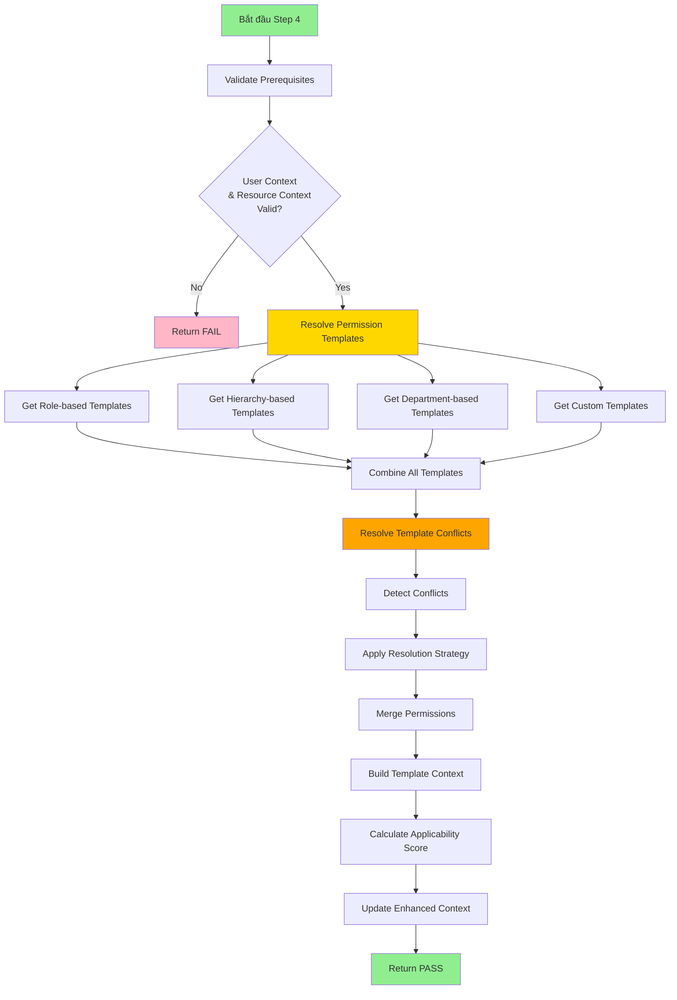

# Step 4: Permission Template Check - Chi Tiết Các Bước Kiểm Tra

## Tổng Quan

**Step 4: Permission Template Check** là bước thứ 4 trong quy trình RBAC 15 bước, có nhiệm vụ **phân giải và áp dụng các permission templates** dựa trên role, hierarchy, và department của user.

### Thông Tin Bước

- **Step Number**: 4
- **Step Name**: Permission Template Check
- **Priority**: 80 (Core logic)
- **Is Required**: ✓ Yes
- **Can Skip**: ✗ No
- **Is Async**: ✓ Yes
- **Dependencies**: Step 1, Step 2, Step 3

### Mục Đích Chính

1. **Phân giải permission templates** áp dụng cho user
2. **Xử lý xung đột** giữa các templates
3. **Tính toán effective permissions** từ nhiều templates
4. **Xây dựng inheritance chain** cho permission resolution

---

## Kiến Trúc và Luồng Xử Lý

### Sơ Đồ Luồng Chính



---

## Chi Tiết Các Bước Xử Lý

### Bước 1: Validate Prerequisites (Kiểm Tra Điều Kiện Tiên Quyết)

**Mục đích**: Đảm bảo có đủ context để thực hiện template resolution

**Logic kiểm tra**:

```typescript
// 1.1. Kiểm tra User Context
if (!context.userContext) {
  return {
    result: CheckResult.FAIL,
    reason: 'User context is required for permission template check',
    continue: false,
  };
}

// 1.2. Kiểm tra Resource Context
if (!context.resourceContext) {
  return {
    result: CheckResult.FAIL,
    reason: 'Resource context is required for permission template check',
    continue: false,
  };
}
```

**Kết quả**:
- ✓ **PASS**: Có đủ user context và resource context → Tiếp tục
- ✗ **FAIL**: Thiếu context → Dừng validation chain

---

### Bước 2: Resolve Permission Templates (Phân Giải Templates)

**Mục đích**: Thu thập tất cả các permission templates áp dụng cho user

#### 2.1. Get Role-based Templates

**Query database**:
```typescript
const dbTemplates = await templateRepository.find({
  where: [
    {
      isActive: true,
      isSystemTemplate: true,
    },
  ],
  relations: [
    'resourcePermissions',
    'systemActions',
    'accessLimitations',
  ],
});
```

**Template Structure**:
```typescript
{
  id: template.id,
  name: template.templateName,
  templateType: 'ROLE_BASED',
  priority: template.priority,
  permissions: ['read', 'write', 'delete'],
  actions: ['view', 'edit', 'create'],
  resources: ['Invoice', 'Order'],
  conditions: [
    { field: 'status', operator: 'eq', value: 'active' }
  ],
  restrictions: [
    { type: 'DEPARTMENT', value: 'own-department' }
  ],
  isActive: true,
  effectiveFrom: new Date(),
  metadata: {
    templateKey: 'SALES_MANAGER',
    hierarchyLevel: 4,
    version: '1.0',
    source: 'database'
  }
}
```

**Fallback Strategy** (nếu DB query thất bại):
```typescript
// Admin role fallback
{
  id: 'fallback-admin-{workspaceId}',
  permissions: ['*'],  // All permissions
  actions: ['*'],      // All actions
  resources: ['*'],    // All resources
  priority: 100
}

// Employee role fallback
{
  id: 'fallback-employee-{workspaceId}',
  permissions: ['read'],
  actions: ['view'],
  resources: ['orders', 'products'],
  restrictions: [
    { type: 'DEPARTMENT', value: 'own-department' }
  ],
  priority: 50
}
```

#### 2.2. Get Hierarchy-based Templates

**Query Logic**:
```typescript
const dbTemplates = await templateRepository.find({
  where: [
    {
      isActive: true,
      hierarchyLevel: hierarchyLevel, // User's hierarchy level
    },
  ],
  relations: ['resourcePermissions', 'systemActions', 'accessLimitations'],
});
```

**Hierarchy Level Mapping**:
```typescript
// Level 1-2: Executive
{
  permissions: ['*'],
  actions: ['*'],
  resources: ['*'],
  priority: 95
}

// Level 3-5: Director
{
  permissions: ['read', 'write', 'update'],
  actions: ['view', 'edit', 'create', 'approve'],
  resources: ['orders', 'products', 'customers', 'reports'],
  restrictions: [
    { type: 'DEPARTMENT', value: 'supervised-departments' }
  ],
  priority: 85
}

// Level 6+: Manager and Staff
{
  permissions: ['read', 'write'],
  actions: ['view', 'edit'],
  resources: ['orders', 'products'],
  restrictions: [
    { type: 'DEPARTMENT', value: 'own-department' }
  ],
  priority: 75
}
```

#### 2.3. Get Department-based Templates

**Phương pháp**:
1. Load department hierarchy từ `mktDepartmentHierarchy`
2. Tìm templates cho department hiện tại + parent departments
3. Apply department-specific conditions

**Query**:
```typescript
// Step 1: Get department hierarchy
const departmentInfo = await departmentRepository.findOne({
  where: { childDepartmentId: departmentId },
});

// Step 2: Find relevant templates
const dbTemplates = await templateRepository.find({
  where: {
    isActive: true,
    // Department-specific filtering
  },
  relations: ['resourcePermissions', 'systemActions', 'accessLimitations'],
});

// Step 3: Add department condition
conditions: [
  ...extractConditionsFromTemplate(template),
  {
    field: 'departmentId',
    operator: 'eq',
    value: departmentId,
  },
]
```

**Department Relevance Check**:
```typescript
private isTemplateRelevantToDepartment(
  template: MktPermissionTemplateWorkspaceEntity,
  departmentId: string,
  departmentInfo: DepartmentInfo
): boolean {
  // 1. System templates apply to all departments
  if (template.isSystemTemplate) {
    return true;
  }

  // 2. Check department-specific configuration
  // (Would be expanded based on actual template structure)

  return false;
}
```

#### 2.4. Get Custom User-specific Templates

**Hai nguồn templates**:

##### a) User Template Assignments
```typescript
const userTemplateAssignments = await userTemplateRepository.find({
  where: {
    workspaceMemberId: workspaceMemberId,
    isActive: true,
  },
  relations: [
    'template',
    'template.resourcePermissions',
    'template.systemActions',
    'template.accessLimitations',
  ],
});

// Get priority from config for TEMPLATE type
const priority = await this.getPriorityFromConfig(
  workspaceId,
  'TEMPLATE',
  'ROLE_BASED',
  {
    isSystemTemplate: assignment.template.isSystemTemplate,
    hierarchyLevel: assignment.template.hierarchyLevel,
  },
);

// Convert to template format
{
  id: `user-template-${assignment.id}`,
  name: `${assignment.template.templateName} (User Assignment)`,
  templateType: 'CUSTOM',
  priority: priority + 10, // User assignments get slight boost
  effectiveFrom: new Date(assignment.assignedAt),
  effectiveTo: assignment.expiresAt,
  metadata: {
    userId,
    assignmentId: assignment.id,
    assignmentReason: assignment.assignmentReason,
    source: 'user-assignment'
  }
}
```

##### b) User Permission Overrides
```typescript
const userOverrides = await userOverrideRepository.find({
  where: {
    workspaceMemberId: workspaceMemberId,
    isActive: true,
  },
});

// Determine sourceSubType based on override reason
const sourceSubType =
  override.reason === 'EMERGENCY_ACCESS'
    ? 'EMERGENCY'
    : override.reason === 'COMPLIANCE_REQUIREMENT'
      ? 'COMPLIANCE'
      : override.reason === 'AUDIT_REQUIREMENT'
        ? 'AUDIT'
        : 'TEMPORARY_GRANT'; // Default

// Get priority from config for OVERRIDE type
const priority = await this.getPriorityFromConfig(
  workspaceId,
  'OVERRIDE',
  sourceSubType,
  {
    reason: override.reason,
    isAllowed: override.isAllowed,
  },
);

// Convert to template format
{
  id: `user-override-${override.id}`,
  name: `Permission Override - ${override.id}`,
  templateType: 'CUSTOM',
  priority: priority, // Dynamic priority from config (1500-15000)
  effectiveFrom: new Date(override.createdAt),
  effectiveTo: override.expiresAt,
  metadata: {
    userId,
    overrideId: override.id,
    source: 'user-override'
  }
}
```

#### 2.5. Build Inheritance Chain

**Logic**:
```typescript
const chain: string[] = [];

// 1. User-specific (highest priority)
chain.push(`user:${userContext.id}`);

// 2. Role-based
userContext.roles?.forEach((role) => chain.push(`role:${role}`));

// 3. Hierarchy-based
if (hierarchyContext?.userLevel) {
  chain.push(`hierarchy:${hierarchyContext.userLevel}`);
}

// 4. Department-based
if (userContext.departmentId) {
  chain.push(`department:${userContext.departmentId}`);
}

// 5. Workspace-wide (lowest priority)
chain.push(`workspace:${workspaceId}`);
```

**Ví dụ Inheritance Chain**:
```typescript
[
  "user:user-123",
  "role:SALES_MANAGER",
  "role:EMPLOYEE",
  "hierarchy:4",
  "department:dept-sales",
  "workspace:workspace-abc"
]
```

---

### Bước 3: Resolve Template Conflicts (Xử Lý Xung Đột)

**Mục đích**: Phát hiện và giải quyết xung đột khi nhiều templates cấp quyền khác nhau trên cùng resource

#### 3.1. Detect Template Conflicts

**Logic phát hiện xung đột**:
```typescript
private detectTemplateConflict(
  templateA: PermissionTemplateInterface,
  templateB: PermissionTemplateInterface,
): TemplateConflict | null {
  // 1. Tìm resources chung
  const commonResources = templateA.resources.filter((resource) =>
    templateB.resources.includes(resource),
  );

  if (commonResources.length === 0) return null;

  // 2. Tìm actions xung đột
  const conflictingActions = templateA.actions.filter(
    (action) =>
      templateB.actions.includes(action) &&
      templateA.permissions !== templateB.permissions,
  );

  // 3. Tạo conflict object
  if (conflictingActions.length > 0) {
    return {
      conflictType: 'PERMISSION',
      templateIds: [templateA.id, templateB.id],
      resolution: 'ALLOW',
      reason: `Priority-based: template ${templateA.id} (priority ${templateA.priority})
               takes precedence over template ${templateB.id} (priority ${templateB.priority})`
    };
  }

  return null;
}
```

**Ví dụ Xung Đột**:
```typescript
// Template A (priority 100)
{
  resources: ['Invoice'],
  actions: ['READ', 'UPDATE'],
  permissions: ['read', 'write']
}

// Template B (priority 80)
{
  resources: ['Invoice'],
  actions: ['READ'],
  permissions: ['read']
}

// Conflict detected:
{
  conflictType: 'PERMISSION',
  templateIds: ['template-A', 'template-B'],
  resolution: 'ALLOW',
  reason: 'Template A (priority 100) takes precedence'
}
```

#### 3.2. Apply Resolution Strategy

**4 Strategies có sẵn**:

##### a) PRIORITY_BASED (Default)
```typescript
// Sử dụng permissions từ template có priority cao nhất
return templates[0]?.permissions || [];
```

##### b) MOST_PERMISSIVE
```typescript
// Kết hợp tất cả permissions (union)
return Array.from(new Set(templates.flatMap((t) => t.permissions)));

// Example:
// Template A: ['read', 'write']
// Template B: ['read', 'delete']
// Result: ['read', 'write', 'delete']
```

##### c) MOST_RESTRICTIVE
```typescript
// Sử dụng giao của tất cả permissions (intersection)
return templates.reduce(
  (acc, template) =>
    acc.filter((p) => template.permissions.includes(p)),
  templates[0]?.permissions || [],
);

// Example:
// Template A: ['read', 'write', 'delete']
// Template B: ['read', 'write']
// Result: ['read', 'write']
```

##### d) CUSTOM
```typescript
// Custom logic có thể được implement
return templates[0]?.permissions || [];
```

#### 3.3. Merge Permissions

**Kết quả sau khi merge**:
```typescript
{
  finalTemplates: [
    // Sorted by priority (highest first)
    { id: 'template-override', priority: 150, permissions: ['*'] },
    { id: 'template-role', priority: 100, permissions: ['read', 'write'] },
    { id: 'template-dept', priority: 60, permissions: ['read'] }
  ],
  conflicts: [
    {
      conflictType: 'PERMISSION',
      templateIds: ['template-role', 'template-dept'],
      resolution: 'ALLOW'
    }
  ],
  resolutionStrategy: 'PRIORITY_BASED',
  effectivePermissions: ['*'] // From highest priority template
}
```

---

### Bước 4: Build Template Context (Xây Dựng Context)

**Cập nhật vào Enhanced Permission Context**:

```typescript
context.templateContext = {
  // Core template info
  templateId: undefined,
  templateKey: undefined,
  templateName: undefined,
  templateType: 'SYSTEM',
  hierarchyLevel: undefined,
  isSystemTemplate: false,
  priority: undefined,
  version: undefined,

  // Template categories
  applicableTemplates: resolvedTemplates.finalTemplates,
  hierarchyBasedTemplates: permissionTemplateContext.hierarchyBasedTemplates,
  roleBasedTemplates: permissionTemplateContext.roleBasedTemplates,
  departmentBasedTemplates: permissionTemplateContext.departmentBasedTemplates,
  customTemplates: permissionTemplateContext.customTemplates,

  // Conflict resolution
  templateConflicts: resolvedTemplates.conflicts,
  resolutionStrategy: resolvedTemplates.resolutionStrategy,
  effectivePermissions: resolvedTemplates.effectivePermissions,

  // Inheritance
  inheritanceChain: permissionTemplateContext.inheritanceChain,

  // Scoring
  applicabilityScore: this.calculateApplicabilityScore(resolvedTemplates.finalTemplates),

  // Timestamps
  lastUpdated: DateTime.now().toJSDate(),
};
```

---

### Bước 5: Calculate Applicability Score (Tính Điểm Phù Hợp)

**Algorithm**:
```typescript
private calculateApplicabilityScore(
  templates: PermissionTemplateInterface[],
): number {
  if (templates.length === 0) return 0;

  const totalScore = templates.reduce((sum, template) => {
    let score = template.priority;

    // Bonus: Active templates
    if (template.isActive) score += 10;

    // Bonus: Templates with conditions (more specific)
    if (template.conditions.length > 0) score += 5;

    return sum + score;
  }, 0);

  // Average score, capped at 100
  return Math.min(100, totalScore / templates.length);
}
```

**Ví dụ Tính Toán**:
```typescript
// Template 1: priority=100, active=true, conditions=2
// Score = 100 + 10 + 5 = 115

// Template 2: priority=80, active=true, conditions=0
// Score = 80 + 10 = 90

// Total = 115 + 90 = 205
// Average = 205 / 2 = 102.5
// Final Score = min(100, 102.5) = 100
```

---

## Skip Logic (Điều Kiện Bỏ Qua)

Step 4 có thể được skip trong các trường hợp sau:

### 1. Direct Permission Grants Exist

```typescript
private hasDirectPermissionGrants(context: EnhancedPermissionContext): boolean {
  const userRoles = context.userContext?.roles || [];

  // Admin users have direct grants
  if (userRoles.includes('ADMIN') || userRoles.includes('SYSTEM_ADMIN')) {
    return true;
  }

  // Workspace owners have direct grants
  return userRoles.includes('WORKSPACE_OWNER');
}
```

### 2. Public Resource Access

```typescript
private isPublicResourceAccess(context: EnhancedPermissionContext): boolean {
  const confidentialityLevel = context.resourceContext?.confidentialityLevel;

  // Public resources don't need template resolution
  return confidentialityLevel === 'PUBLIC';
}
```

### 3. System-level Operations

```typescript
private isSystemLevelOperation(context: EnhancedPermissionContext): boolean {
  const action = context.action;
  const resourceType = context.resourceContext?.resourceType;

  // System configuration operations
  if (resourceType === 'SYSTEM_CONFIG') {
    return true;
  }

  // System maintenance actions
  return Boolean(
    action?.includes('SYSTEM_') || action?.includes('MAINTENANCE_')
  );
}
```

### 4. Skip Decision Matrix

```typescript
private shouldSkipByDecisionMatrix(context: EnhancedPermissionContext): boolean {
  const resourceType = context.resourceContext?.resourceType || '';
  const action = context.action || '';

  const skipMatrix: Record<string, boolean> = {
    PUBLIC_DATA_READ: true,              // Skip template resolution
    BUSINESS_DATA_READ: false,           // Need templates
    FINANCIAL_READ: false,               // Never skip
    FINANCIAL_UPDATE: false,             // Never skip
    FINANCIAL_DELETE: false,             // Never skip
    REPORTING_READ: true,                // Can skip
    SYSTEM_CONFIG_READ: true,            // Can skip
    SYSTEM_CONFIG_UPDATE: false,         // Need validation
  };

  const matrixKey = `${resourceType}_${action}`;
  return skipMatrix[matrixKey] || false;
}
```

---

## Ví Dụ Thực Tế

### Ví Dụ 1: Sales Manager Truy Cập Invoice

**Input Context**:
```typescript
{
  userContext: {
    id: 'user-123',
    roles: ['SALES_MANAGER', 'EMPLOYEE'],
    departmentId: 'dept-sales',
    workspaceMemberId: 'member-123'
  },
  hierarchyContext: {
    userLevel: 4  // Manager level
  },
  resourceContext: {
    objectName: 'Invoice',
    resourceType: 'FINANCIAL',
    confidentialityLevel: 'CONFIDENTIAL'
  },
  action: 'READ'
}
```

**Step Execution**:

1. **Validate Prerequisites**: ✓ PASS
2. **Resolve Templates**:
   - Role-based: `SALES_MANAGER` template (priority 100)
   - Hierarchy-based: Level 4 template (priority 85)
   - Department-based: Sales department template (priority 60)
   - Custom: None
3. **Resolve Conflicts**:
   - Conflict detected between role and hierarchy templates
   - Resolution: PRIORITY_BASED → Use SALES_MANAGER (100)
4. **Build Context**:
   ```typescript
   {
     applicableTemplates: [
       { id: 'sales-mgr', priority: 100, permissions: ['read', 'write'] },
       { id: 'level-4', priority: 85, permissions: ['read'] },
       { id: 'dept-sales', priority: 60, permissions: ['read'] }
     ],
     effectivePermissions: ['read', 'write'],
     templateConflicts: [{ ... }],
     applicabilityScore: 92
   }
   ```

**Output**:
```typescript
{
  result: CheckResult.PASS,
  reason: 'Permission template check completed successfully',
  continue: true,
  metadata: {
    templatesFound: 3,
    conflicts: 1,
    applicabilityScore: 92,
    primaryTemplateType: 'ROLE_BASED'
  }
}
```

---

### Ví Dụ 2: Staff với Override Emergency

**Input Context**:
```typescript
{
  userContext: {
    id: 'user-456',
    roles: ['EMPLOYEE'],
    departmentId: 'dept-finance',
    workspaceMemberId: 'member-456'
  },
  hierarchyContext: {
    userLevel: 8  // Staff level
  },
  resourceContext: {
    objectName: 'Payment',
    resourceType: 'FINANCIAL',
    confidentialityLevel: 'RESTRICTED'
  },
  action: 'UPDATE'
}
```

**Step Execution**:

1. **Validate Prerequisites**: ✓ PASS
2. **Resolve Templates**:
   - Role-based: `EMPLOYEE` template (priority 50)
   - Hierarchy-based: Level 8 template (priority 75)
   - Department-based: Finance template (priority 60)
   - **Custom**: Emergency override (priority 150) ← Highest!
3. **Resolve Conflicts**:
   - Multiple conflicts detected
   - Resolution: PRIORITY_BASED → Use Emergency Override (150)
4. **Effective Permissions**: `['*']` (full access from override)

**Output**:
```typescript
{
  result: CheckResult.PASS,
  continue: true,
  metadata: {
    templatesFound: 4,
    conflicts: 3,
    applicabilityScore: 88,
    primaryTemplateType: 'CUSTOM'  // Override takes precedence
  }
}
```

---

## Performance Considerations

### Database Queries

**Số lượng queries trung bình**: 4-6 queries

1. Role-based templates: 1 query
2. Hierarchy-based templates: 1 query
3. Department hierarchy: 1 query
4. Department-based templates: 1 query
5. User template assignments: 1 query
6. User overrides: 1 query

**Optimization strategies**:
- Use `relations` để eager load related data
- Cache template results (TTL: 1 hour)
- Batch queries khi có thể

### Caching Strategy

```typescript
// Cache key structure
cacheKey: `user:${userId}:template:permissions:${resourceType}:${action}`
TTL: 3600000 // 1 hour

// Invalidate on:
- template:update
- user:template:assign
- user:role:change
- override:create
```

---

## Error Handling

### Database Query Failures

```typescript
try {
  const dbTemplates = await templateRepository.find({ ... });
} catch (error) {
  this.logger.error(`Error fetching templates: ${error.message}`);

  // Return fallback templates
  return this.getFallbackRoleTemplates(userRoles, workspaceId);
}
```

### Template Resolution Failures

```typescript
catch (error) {
  this.logger.error(`Step 4 failed: ${error.message}`);

  // Return WARNING instead of FAIL
  // Allow continuation with limited permissions
  return {
    result: CheckResult.WARNING,
    reason: `Permission template resolution failed: ${error.message}`,
    continue: true,
    metadata: {
      error: error.message,
      fallbackMode: true,
    },
  };
}
```

---

## Dynamic Priority Resolution (NEW)

### Tổng Quan

Thay vì hardcode priority values, hệ thống giờ sử dụng **database-driven priority configuration** thông qua `MktPermissionPriorityConfigWorkspaceEntity`.

### Architecture

```typescript
// Query priority config from database
const config = await configRepository.findOne({
  where: {
    sourceType: 'OVERRIDE',      // TEMPLATE | OVERRIDE | POLICY
    sourceSubType: 'EMERGENCY',   // EMERGENCY | COMPLIANCE | ROLE_BASED, etc.
    isActive: true,
  },
});

// Calculate priority with formula
const priority = evaluatePriorityFormula(
  config.priorityFormula,
  {
    basePriority: config.basePriority,
    priorityBoost: config.priorityBoost,
    hierarchyLevel: metadata.hierarchyLevel,
  }
);

// Apply min/max constraints
const finalPriority = Math.max(
  config.minPriority,
  Math.min(config.maxPriority, priority)
);
```

### Priority Configs

**13 priority configurations được seed vào database**:

#### OVERRIDE (6 configs) - Highest Priority
```typescript
// 1. EMERGENCY (priority: 15000)
{ sourceType: 'OVERRIDE', sourceSubType: 'EMERGENCY', basePriority: 15000 }

// 2. COMPLIANCE (priority: 10000)
{ sourceType: 'OVERRIDE', sourceSubType: 'COMPLIANCE', basePriority: 10000 }

// 3. AUDIT (priority: 8000)
{ sourceType: 'OVERRIDE', sourceSubType: 'AUDIT', basePriority: 8000 }

// 4. TEMPORARY_GRANT (priority: 5000)
{ sourceType: 'OVERRIDE', sourceSubType: 'TEMPORARY_GRANT', basePriority: 5000 }

// 5. TEMPORARY_DENY (priority: 3000)
{ sourceType: 'OVERRIDE', sourceSubType: 'TEMPORARY_DENY', basePriority: 3000 }

// 6. BUSINESS_EXCEPTION (priority: 1500)
{ sourceType: 'OVERRIDE', sourceSubType: 'BUSINESS_EXCEPTION', basePriority: 1500 }
```

#### TEMPLATE (4 configs) - Medium Priority
```typescript
// 7. ROLE_BASED (priority: 1000)
{ sourceType: 'TEMPLATE', sourceSubType: 'ROLE_BASED', basePriority: 1000 }

// 8. HIERARCHY_BASED (priority: 800 + boost)
{
  sourceType: 'TEMPLATE',
  sourceSubType: 'HIERARCHY_BASED',
  basePriority: 800,
  priorityBoost: 100,
  priorityFormula: 'basePriority + (priorityBoost * (10 - hierarchyLevel))'
}
// CEO (level=1): 800 + (100 * 9) = 1700
// Manager (level=5): 800 + (100 * 5) = 1300
// Staff (level=10): 800

// 9. DEPARTMENT_BASED (priority: 600)
{ sourceType: 'TEMPLATE', sourceSubType: 'DEPARTMENT_BASED', basePriority: 600 }

// 10. SYSTEM_DEFAULT (priority: 500)
{ sourceType: 'TEMPLATE', sourceSubType: 'SYSTEM_DEFAULT', basePriority: 500 }
```

#### POLICY (3 configs) - Lowest Priority
```typescript
// 11. HIERARCHY_FILTER (priority: 100 + boost)
{
  sourceType: 'POLICY',
  sourceSubType: 'HIERARCHY_FILTER',
  basePriority: 100,
  priorityBoost: 10,
  priorityFormula: 'basePriority + (priorityBoost * (10 - minHierarchyLevel))'
}

// 12. DEPARTMENT_FILTER (priority: 80)
{ sourceType: 'POLICY', sourceSubType: 'DEPARTMENT_FILTER', basePriority: 80 }

// 13. CUSTOM_FILTER (priority: 50)
{ sourceType: 'POLICY', sourceSubType: 'CUSTOM_FILTER', basePriority: 50 }
```

### Conditions Matching

**3 types of conditions**:

#### 1. Array Values (OR Logic)
```typescript
// Config
conditions: { reason: ['COMPLIANCE_REQUIREMENT', 'AUDIT_REQUIREMENT'] }

// Metadata
{ reason: 'COMPLIANCE_REQUIREMENT' } // ✅ Match
{ reason: 'AUDIT_REQUIREMENT' }      // ✅ Match
{ reason: 'EMERGENCY_ACCESS' }       // ❌ No match
```

#### 2. Object Values (Range/Exists Operators)
```typescript
// Config - Range check
conditions: { hierarchyLevel: { $gte: 1, $lte: 10 } }

// Metadata
{ hierarchyLevel: 5 }  // ✅ Match (1 <= 5 <= 10)
{ hierarchyLevel: 15 } // ❌ No match (15 > 10)

// Config - Exists check
conditions: { departmentId: { $exists: true } }

// Metadata
{ departmentId: 'abc-123' } // ✅ Match
{ }                          // ❌ No match
```

#### 3. Simple Equality
```typescript
// Config
conditions: { isAllowed: true }

// Metadata
{ isAllowed: true }  // ✅ Match
{ isAllowed: false } // ❌ No match
```

### Priority Calculation Example

**Example 1: Emergency Override**
```typescript
// Override data
override.reason = 'EMERGENCY_ACCESS';
override.isAllowed = true;

// Step 1: Query config
config = {
  sourceType: 'OVERRIDE',
  sourceSubType: 'EMERGENCY',
  basePriority: 15000,
  conditions: { reason: 'EMERGENCY_ACCESS' }
};

// Step 2: Check conditions match
checkConditionsMatch(config.conditions, { reason: 'EMERGENCY_ACCESS' })
// => ✅ true

// Step 3: Evaluate formula
priority = evaluatePriorityFormula('basePriority', { basePriority: 15000 })
// => 15000

// Final: 15000 (highest priority - overrides everything)
```

**Example 2: Hierarchy Template with Dynamic Boost**
```typescript
// Template data
template.hierarchyLevel = 3;

// Step 1: Query config
config = {
  sourceType: 'TEMPLATE',
  sourceSubType: 'HIERARCHY_BASED',
  basePriority: 800,
  priorityBoost: 100,
  priorityFormula: 'basePriority + (priorityBoost * (10 - hierarchyLevel))',
  conditions: { hierarchyLevel: { $gte: 1, $lte: 10 } }
};

// Step 2: Check conditions match
checkConditionsMatch(
  { hierarchyLevel: { $gte: 1, $lte: 10 } },
  { hierarchyLevel: 3 }
)
// => ✅ true (1 <= 3 <= 10)

// Step 3: Evaluate formula
priority = evaluatePriorityFormula(
  'basePriority + (priorityBoost * (10 - hierarchyLevel))',
  { basePriority: 800, priorityBoost: 100, hierarchyLevel: 3 }
)
// => 800 + (100 * 7) = 1500

// Final: 1500
```

### Fallback Priorities

Nếu không tìm thấy config trong database:

```typescript
const defaultPriorities = {
  OVERRIDE: 5000,
  TEMPLATE: 800,
  POLICY: 80,
};
```

---

## Kết Luận

Step 4 là **bước quan trọng nhất** trong việc xác định permissions của user, thực hiện:

1. ✅ **Multi-source template resolution**: Role, Hierarchy, Department, Custom
2. ✅ **Conflict detection & resolution**: Priority-based, Most Permissive, Most Restrictive
3. ✅ **Inheritance chain building**: User → Role → Hierarchy → Department → Workspace
4. ✅ **Dynamic priority resolution**: Database-driven priority configs với formula evaluation
5. ✅ **Conditions matching**: Array, range, exists, equality operators
6. ✅ **Fallback mechanisms**: Đảm bảo system vẫn hoạt động khi DB fails
7. ✅ **Skip logic**: Optimize performance cho các trường hợp đơn giản
8. ✅ **Applicability scoring**: Đo lường độ phù hợp của templates

**Key Takeaways**:
- Templates được ưu tiên theo **dynamic priority** từ database config
- **OVERRIDE** có priority cao nhất (1500-15000) > **TEMPLATE** (500-1000) > **POLICY** (50-150)
- Priority có thể được tính động với formula (hierarchy boost, filter boost)
- Conditions matching hỗ trợ array, range, exists, equality
- System có **fallback configs** khi database query thất bại
- Step 4 có thể **skip** cho public resources, admin users, system operations
