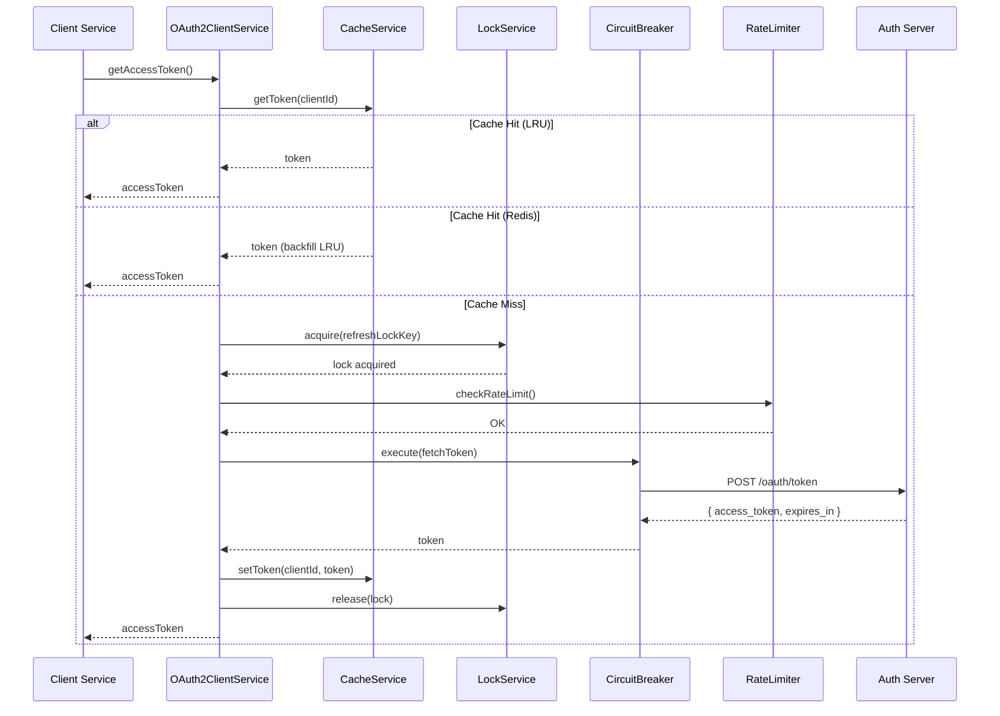
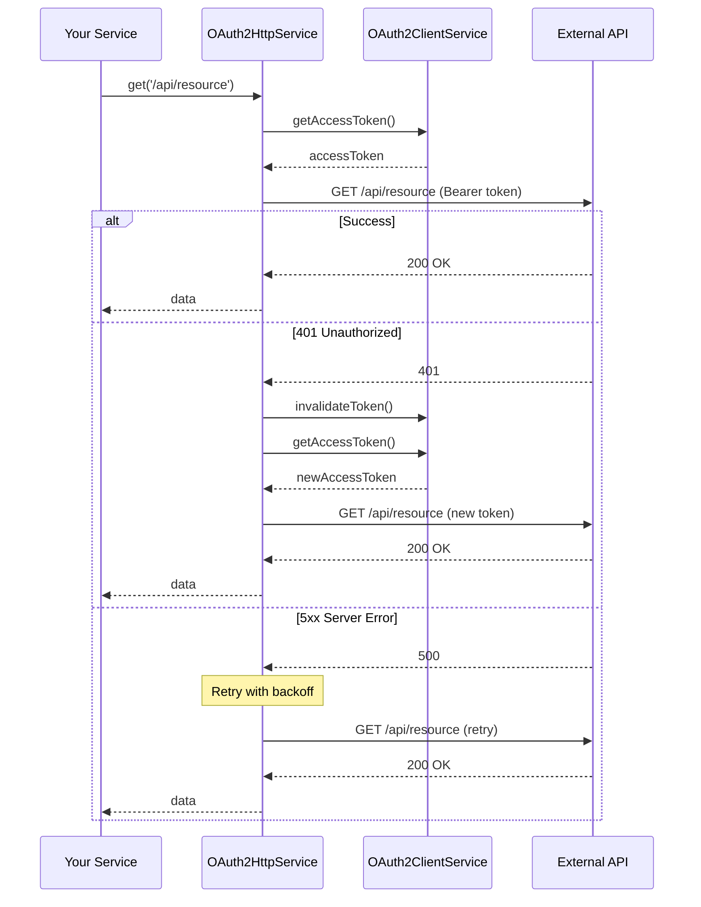

# OAuth2 Client Implementation Guide

> Hướng dẫn triển khai OAuth2 Client Module cho các server khác trong hệ sinh thái

**Version**: 1.2.1
**Last Updated**: 2025-11-29
**Tech Stack**: NestJS, TypeScript, ioredis, LRU Cache

---

## 📋 Mục lục

1. [Tổng quan](#-tổng-quan)
2. [Kiến trúc](#-kiến-trúc)
3. [Yêu cầu hệ thống](#-yêu-cầu-hệ-thống)
4. [Cài đặt & Cấu hình](#-cài-đặt--cấu-hình)
5. [Module Structure](#-module-structure)
6. [Core Services](#-core-services)
7. [Patterns & Best Practices](#-patterns--best-practices)
8. [Monitoring & Troubleshooting](#-monitoring--troubleshooting)
9. [Testing](#-testing)
10. [Migration Guide](#-migration-guide)

---

## 🎯 Tổng quan

### Chức năng chính

OAuth2 Client Module cung cấp giải pháp tích hợp OAuth2 Client Credentials Flow với:

- ✅ **Token Management**: Tự động fetch, cache, refresh token
- ✅ **HTTP Client**: Wrapper tự động inject OAuth2 token vào requests
- ✅ **Resilience**: Circuit breaker, rate limiting, retry logic
- ✅ **Caching**: 2-tier cache (LRU + Redis) với graceful degradation
- ✅ **Multi-instance**: Distributed locks cho multi-instance deployment
- ✅ **Security**: JWT verification, token validation
- ✅ **Monitoring**: Health check, metrics, audit logging

### Use Cases

- Microservices gọi API của Authorization Server (MKT Core)
- Server-to-server authentication với OAuth2
- Backend services cần access protected resources
- Multi-tenant applications

---

## 🏗️ Kiến trúc

### Component Diagram

```
┌─────────────────────────────────────────────────────────┐
│                   Your Application                       │
├─────────────────────────────────────────────────────────┤
│  Controllers / Services (Business Logic)                 │
│     ↓                                                    │
│  OAuth2HttpService (Auto Token Injection)                │
│     ↓                                                    │
│  OAuth2ClientService (Token Management)                  │
│     ↓                                                    │
│  ┌────────────┬──────────────┬───────────────┐          │
│  │ Cache      │ Circuit      │ Rate Limiter  │          │
│  │ Service    │ Breaker      │               │          │
│  └────────────┴──────────────┴───────────────┘          │
│                ↓                                         │
│  ┌─────────────────────────────────────────┐            │
│  │  Redis (Distributed Cache & Locks)      │            │
│  └─────────────────────────────────────────┘            │
└─────────────────────────────────────────────────────────┘
                    ↓ HTTPS
┌─────────────────────────────────────────────────────────┐
│         OAuth2 Authorization Server (MKT Core)          │
└─────────────────────────────────────────────────────────┘
```

### Data Flow

```
1. Request → OAuth2HttpService.get('/api/resource')
2. OAuth2ClientService.getAccessToken()
   ├─ Check LRU Cache → HIT: return
   ├─ Check Redis Cache → HIT: backfill LRU, return
   └─ MISS:
      ├─ Acquire distributed lock (prevent duplicate fetch)
      ├─ Check rate limit
      ├─ Circuit breaker check
      ├─ POST /oauth/token → MKT Core
      ├─ Verify JWT (optional)
      ├─ Cache token (LRU + Redis)
      └─ Release lock
3. Inject token → Authorization: Bearer {token}
4. Execute HTTP request
5. Handle response / retry on 401
```

---

## 📦 Yêu cầu hệ thống

### NPM Dependencies

```json
{
  "dependencies": {
    "@nestjs/common": "^10.0.0",
    "@nestjs/config": "^3.0.0",
    "@nestjs/axios": "^3.0.0",
    "axios": "^1.6.0",
    "lru-cache": "^10.0.0",
    "luxon": "^3.4.0",
    "zod": "^3.22.0",
    "ioredis": "^5.3.0",
    "jsonwebtoken": "^9.0.0"
  },
  "devDependencies": {
    "@types/luxon": "^3.3.0",
    "@types/jsonwebtoken": "^9.0.0"
  }
}
```

> **Lưu ý**: Hệ thống Twenty CRM sử dụng **ioredis** (không phải `redis` package). Đảm bảo sử dụng đúng library.

### Internal Dependencies (Sử dụng module có sẵn của Twenty CRM)

Module OAuth2 Client sử dụng các module **có sẵn** trong hệ thống Twenty CRM:

| Module/Path | Chức năng | File Location |
|-------------|-----------|---------------|
| `RedisClientService` | Redis connection (ioredis) | `src/engine/core-modules/redis-client/redis-client.service.ts` |
| `CacheStorageService` | Cache operations với namespace | `src/engine/core-modules/cache-storage/services/cache-storage.service.ts` |
| `CacheLockService` | Distributed locks | `src/engine/core-modules/cache-lock/cache-lock.service.ts` |
| `JwtAuthGuard` | JWT authentication guard | `src/engine/guards/jwt-auth.guard.ts` |
| `WorkspaceAuthGuard` | Workspace authorization | `src/engine/guards/workspace-auth.guard.ts` |
| `RestApiExceptionFilter` | REST API error handling | `src/engine/api/rest/rest-api-exception.filter.ts` |
| `TwentyConfigService` | Configuration service | `src/engine/core-modules/twenty-config/twenty-config.service.ts` |

**Không cần copy/implement** các Redis services - sử dụng trực tiếp từ Twenty CRM engine.

### Sử dụng CacheStorageService (từ Twenty CRM)

```typescript
import { Injectable } from '@nestjs/common';
import { InjectCacheStorage } from 'src/engine/core-modules/cache-storage/decorators/cache-storage.decorator';
import { CacheStorageService } from 'src/engine/core-modules/cache-storage/services/cache-storage.service';
import { CacheStorageNamespace } from 'src/engine/core-modules/cache-storage/types/cache-storage-namespace.enum';

@Injectable()
export class OAuth2CacheService {
  constructor(
    @InjectCacheStorage(CacheStorageNamespace.MktOAuth2) // Thêm namespace mới
    private readonly cacheStorage: CacheStorageService,
  ) {}

  async getToken(key: string): Promise<OAuth2Token | undefined> {
    return this.cacheStorage.get<OAuth2Token>(key);
  }

  async setToken(key: string, token: OAuth2Token, ttlMs: number): Promise<void> {
    await this.cacheStorage.set(key, token, ttlMs);
  }

  async invalidateToken(key: string): Promise<void> {
    await this.cacheStorage.del(key);
  }

  async invalidateByPattern(pattern: string): Promise<void> {
    await this.cacheStorage.flushByPattern(pattern);
  }
}
```

### Thêm Cache Namespace cho OAuth2

> **Quan trọng**: Cập nhật file `packages/twenty-server/src/engine/core-modules/cache-storage/types/cache-storage-namespace.enum.ts` để thêm `MktOAuth2 = 'mkt:oauth2'`. Xem chi tiết tại [phần Module Structure](#-module-structure).

### Sử dụng CacheLockService (từ Twenty CRM)

```typescript
import { Injectable } from '@nestjs/common';
import { CacheLockService } from 'src/engine/core-modules/cache-lock/cache-lock.service';

@Injectable()
export class OAuth2LockService {
  constructor(private readonly cacheLockService: CacheLockService) {}

  async executeWithLock<T>(
    lockKey: string,
    fn: () => Promise<T>,
    options?: { ms?: number; maxRetries?: number; ttl?: number },
  ): Promise<T> {
    return this.cacheLockService.withLock(fn, lockKey, options);
  }
}
```

**Lock Options** (theo Redis.md):

| Option | Default | Mô tả |
|--------|---------|-------|
| `ms` | 50 | Delay giữa các lần retry (milliseconds) |
| `maxRetries` | 20 | Số lần thử acquire lock tối đa |
| `ttl` | 500 | Lock auto-release sau TTL (milliseconds) |

### Infrastructure (theo Twenty CRM)

- **Redis**: 6.0+ (cho distributed cache & locks)
- **Node.js**: 18+ (LTS)
- **TypeScript**: 5.0+
- **Environment Variables cần thiết**:
  ```bash
  REDIS_URL=redis://localhost:6379
  CACHE_STORAGE_TTL=3600  # seconds
  ```

### OAuth2 Server Requirements

Authorization Server (MKT Core) phải hỗ trợ:

| Feature | Endpoint | Required |
|---------|----------|----------|
| Client Credentials Grant | `POST /oauth/token` | ✅ Yes |
| Token Introspection | `POST /oauth/introspect` | ⚠️ Planned |
| Token Revocation | `POST /oauth/revoke` | ⚠️ Planned |
| Public Key Endpoint | `GET /oauth/public-key` | JWT verification |

**Token Response Format** (RFC 6749 compliant):
```json
{
  "access_token": "eyJhbGciOiJSUzI1NiIs...",
  "token_type": "Bearer",
  "expires_in": 3600,
  "scope": "products:read versions:read"
}
```

---

## 🔧 Cài đặt & Cấu hình

### Bước 1: Tạo Module trong mkt-core

```bash
# Tạo folder module trong cấu trúc Nx monorepo
mkdir -p packages/twenty-server/src/mkt-core/oauth2-client/{config,constants,services,types,controllers}

# Verify structure
tree packages/twenty-server/src/mkt-core/oauth2-client/
```

> **Lưu ý**: Module nằm trong `packages/twenty-server/src/mkt-core/` theo cấu trúc Nx monorepo của Twenty CRM, không phải `src/modules/`.

### Bước 2: Install Dependencies

```bash
yarn add lru-cache luxon zod
yarn add -D @types/luxon
```

### Bước 3: Environment Variables

Thêm vào `.env`:

```bash
# ========== OAuth2 Server Configuration ==========
# Base URL của Authorization Server (MKT Core)
MKT_API_BASE_URL=http://localhost:3006

# Client credentials từ Authorization Server
MKT_OAUTH_CLIENT_ID=your_client_id
MKT_OAUTH_CLIENT_SECRET=your_client_secret_min_32_chars

# Scopes cần request (space-separated)
MKT_OAUTH_SCOPES=products:read versions:read licenses:read

# ========== OAuth2 Endpoints ==========
OAUTH2_TOKEN_ENDPOINT=/oauth/token
OAUTH2_INTROSPECT_ENDPOINT=/oauth/introspect
OAUTH2_REVOKE_ENDPOINT=/oauth/revoke

# ========== Cache Configuration ==========
# LRU cache size (in-memory)
OAUTH2_CACHE_LRU_MAX=10
# LRU TTL in milliseconds (1 hour)
OAUTH2_CACHE_LRU_TTL_MS=3600000
# Redis TTL in seconds (1 hour)
OAUTH2_CACHE_REDIS_TTL_SECONDS=3600

# ========== Token Refresh Configuration ==========
# Refresh threshold (5 minutes before expiry)
OAUTH2_REFRESH_THRESHOLD_SECONDS=300
# Background refresh interval (30 seconds)
OAUTH2_REFRESH_INTERVAL_MS=30000

# ========== HTTP Configuration ==========
# Request timeout (10 seconds)
OAUTH2_HTTP_TIMEOUT_MS=10000
# Max retry attempts
OAUTH2_HTTP_MAX_RETRIES=3
# Retry delay (1 second)
OAUTH2_HTTP_RETRY_DELAY_MS=1000

# ========== Rate Limiting ==========
OAUTH2_RATE_LIMIT_ENABLED=true
OAUTH2_RATE_LIMIT_MAX_ATTEMPTS=10
OAUTH2_RATE_LIMIT_WINDOW_MS=60000

# ========== Circuit Breaker ==========
OAUTH2_CIRCUIT_BREAKER_ENABLED=true
OAUTH2_CIRCUIT_BREAKER_FAILURE_THRESHOLD=5
OAUTH2_CIRCUIT_BREAKER_RESET_TIMEOUT_MS=60000
OAUTH2_CIRCUIT_BREAKER_HALF_OPEN_ATTEMPTS=3

# ========== JWT Verification (Optional) ==========
OAUTH2_JWT_VERIFICATION_ENABLED=false
OAUTH2_JWT_ALGORITHM=RS256
# OAUTH2_JWT_PUBLIC_KEY_URL=https://auth-server.com/.well-known/jwks.json
# OAUTH2_JWT_PUBLIC_KEY=-----BEGIN PUBLIC KEY-----\n...\n-----END PUBLIC KEY-----
# OAUTH2_JWT_ISSUER=https://auth-server.com
# OAUTH2_JWT_AUDIENCE=your-service
```

### Bước 4: Import Module

```typescript
// app.module.ts
import { Module } from '@nestjs/common';
import { ConfigModule } from '@nestjs/config';
import { OAuth2ClientModule } from './modules/oauth2-client/oauth2-client.module';

@Module({
  imports: [
    ConfigModule.forRoot({
      isGlobal: true,
      envFilePath: '.env',
    }),
    OAuth2ClientModule, // Import OAuth2 module
    // ... other modules
  ],
})
export class AppModule {}
```

---

## 📁 Module Structure (theo Twenty CRM mkt-core patterns)

```
packages/twenty-server/src/mkt-core/oauth2-client/
├── config/
│   ├── index.ts                           # Barrel export
│   ├── oauth2-client.config.ts            # Configuration loader (registerAs)
│   └── oauth2-client.validation.ts        # Zod validation schema
│
├── constants/
│   ├── index.ts                           # Barrel export
│   ├── oauth2-client.constant.ts          # Constants (timeouts, defaults)
│   └── oauth2-client-messages.constant.ts # Centralized messages
│
├── services/
│   ├── index.ts                           # Barrel export
│   ├── oauth2-client.service.ts           # Core token management
│   ├── oauth2-http.service.ts             # HTTP client wrapper (sử dụng @nestjs/axios)
│   ├── oauth2-cache.service.ts            # 2-tier caching (LRU + CacheStorageService)
│   ├── oauth2-lock.service.ts             # Wrapper cho CacheLockService
│   ├── oauth2-rate-limiter.service.ts     # Rate limiting
│   ├── oauth2-circuit-breaker.service.ts  # Circuit breaker
│   └── oauth2-jwt.service.ts              # JWT verification (optional)
│
├── types/
│   ├── index.ts                           # Barrel export
│   ├── oauth2-config.type.ts              # Config types
│   ├── oauth2-token.type.ts               # Token types
│   └── oauth2-error.type.ts               # Error types
│
├── controllers/
│   ├── index.ts                           # Barrel export
│   └── oauth2-management.controller.ts    # Management endpoints (JwtAuthGuard, WorkspaceAuthGuard)
│
└── oauth2-client.module.ts                # Module definition
```

### Dependencies từ Twenty CRM Engine

Module OAuth2 Client sử dụng các services có sẵn, **không cần tự implement**:

```
packages/twenty-server/src/engine/core-modules/
├── redis-client/
│   └── redis-client.service.ts        # RedisClientService (ioredis)
├── cache-storage/
│   ├── services/
│   │   └── cache-storage.service.ts   # CacheStorageService
│   ├── decorators/
│   │   └── cache-storage.decorator.ts # @InjectCacheStorage
│   └── types/
│       └── cache-storage-namespace.enum.ts # ⚠️ Thêm MktOAuth2 vào đây
├── cache-lock/
│   └── cache-lock.service.ts          # CacheLockService (withLock)
└── twenty-config/
    └── twenty-config.service.ts       # TwentyConfigService

packages/twenty-server/src/engine/guards/
├── jwt-auth.guard.ts                  # JwtAuthGuard
└── workspace-auth.guard.ts            # WorkspaceAuthGuard

packages/twenty-server/src/engine/api/rest/
└── rest-api-exception.filter.ts       # RestApiExceptionFilter
```

**Thêm Cache Namespace** - Cập nhật `cache-storage-namespace.enum.ts`:
```typescript
export enum CacheStorageNamespace {
  // ... existing namespaces
  MktOAuth2 = 'mkt:oauth2', // Thêm namespace cho OAuth2
}
```

### Core Files (BẮT BUỘC)

1. **oauth2-client.module.ts**: Module definition
2. **services/oauth2-client.service.ts**: Token management logic
3. **services/oauth2-http.service.ts**: HTTP client với auto token injection
4. **services/oauth2-cache.service.ts**: 2-tier caching
5. **config/oauth2-client.config.ts**: Configuration loader
6. **constants/**: All constants và messages

### Optional Files

- **controllers/oauth2-management.controller.ts**: Management API (có thể bỏ nếu không cần)
- **services/oauth2-jwt.service.ts**: JWT verification (nếu không verify JWT)

---

## 🔑 Core Services

### 1. OAuth2ClientService

**Purpose**: Core service quản lý token lifecycle

**Features**:
- Auto fetch token from OAuth2 server
- Background refresh job (proactive refresh trước khi expire)
- Distributed locking (multi-instance safe)
- Rate limiting protection
- Circuit breaker integration

**Usage**:

```typescript
@Injectable()
export class YourService {
  constructor(private readonly oauth2Client: OAuth2ClientService) {}

  async someMethod() {
    // Get valid token (auto fetch/refresh nếu cần)
    const token = await this.oauth2Client.getAccessToken();

    // Use token
    const response = await axios.get('https://api.example.com/data', {
      headers: { Authorization: `Bearer ${token}` }
    });
  }
}
```

**Key Methods**:
- `getAccessToken()`: Get valid token (cache-first)
- `invalidateToken()`: Force invalidate current token
- `getTokenMetadata()`: Get token metadata (expiry, scopes)
- `healthCheck()`: Service health status

---

### 2. OAuth2HttpService

**Purpose**: HTTP client tự động inject OAuth2 token

**Features**:
- Auto token injection vào Authorization header
- Retry logic với exponential backoff
- Auto token refresh on 401 Unauthorized
- User context headers (X-User-Id, X-User-Name) cho audit
- Type-safe methods
- Sử dụng `HttpService` từ `@nestjs/axios` (theo HTTP.md)

**Implementation** (theo Twenty CRM patterns):

```typescript
import { Injectable } from '@nestjs/common';
import { HttpService } from '@nestjs/axios';
import { AxiosRequestConfig } from 'axios';
import { firstValueFrom } from 'rxjs';

@Injectable()
export class OAuth2HttpService {
  constructor(
    private readonly httpService: HttpService,
    private readonly oauth2ClientService: OAuth2ClientService,
  ) {}

  async get<T>(url: string, config?: AxiosRequestConfig): Promise<T> {
    const token = await this.oauth2ClientService.getAccessToken();
    const response = await firstValueFrom(
      this.httpService.get<T>(url, {
        ...config,
        headers: {
          ...config?.headers,
          Authorization: `Bearer ${token}`,
        },
      }),
    );
    return response.data;
  }

  async post<T>(url: string, data?: unknown, config?: AxiosRequestConfig): Promise<T> {
    const token = await this.oauth2ClientService.getAccessToken();
    const response = await firstValueFrom(
      this.httpService.post<T>(url, data, {
        ...config,
        headers: {
          ...config?.headers,
          Authorization: `Bearer ${token}`,
        },
      }),
    );
    return response.data;
  }

  // put, patch, delete methods tương tự...
}
```

**Usage**:

```typescript
@Injectable()
export class ProductService {
  constructor(private readonly oauth2Http: OAuth2HttpService) {}

  async getProducts(): Promise<Product[]> {
    // Auto inject token, retry on error
    return this.oauth2Http.get<Product[]>(
      'http://mkt-core/api/products',
    );
  }

  async createProduct(dto: CreateProductDto): Promise<Product> {
    return this.oauth2Http.post<Product>(
      'http://mkt-core/api/products',
      dto
    );
  }

  async updateProduct(id: string, dto: UpdateProductDto): Promise<Product> {
    return this.oauth2Http.put<Product>(
      `http://mkt-core/api/products/${id}`,
      dto
    );
  }

  async deleteProduct(id: string): Promise<void> {
    return this.oauth2Http.delete<void>(
      `http://mkt-core/api/products/${id}`
    );
  }
}
```

**Methods**:
- `get<T>(url, config?, userContext?): Promise<T>`
- `post<T>(url, data?, config?, userContext?): Promise<T>`
- `put<T>(url, data?, config?, userContext?): Promise<T>`
- `patch<T>(url, data?, config?, userContext?): Promise<T>`
- `delete<T>(url, config?, userContext?): Promise<T>`

**User Context** (optional):
```typescript
type UserContext = {
  userId?: string;   // Injected as X-User-Id header
  userName?: string; // Injected as X-User-Name header
};
```

---

### 3. OAuth2CacheService

**Purpose**: 2-tier caching strategy

**Architecture** (theo Twenty CRM):

```
Request → LRU Cache (in-memory, fast)
            ↓ MISS
          CacheStorageService (Redis, persistent, shared)
            ↓ MISS
          Fetch from OAuth2 Server
            ↓
          Cache in both tiers
```

**Features** (sử dụng `CacheStorageService` từ Twenty CRM):
- **Tier 1 (LRU)**: Fast in-memory cache với automatic eviction (local)
- **Tier 2 (Redis)**: Qua `CacheStorageService` với namespace `MktOAuth2`
- **Backfilling**: Redis hit → backfill LRU
- **Graceful degradation**: Redis fail → fallback to LRU only
- **Auto expiry validation**: Không return expired token
- **Pattern-based invalidation**: Qua `flushByPattern()`

**Implementation** (theo Twenty CRM patterns):
```typescript
import { Injectable } from '@nestjs/common';
import { LRUCache } from 'lru-cache';
import { InjectCacheStorage } from 'src/engine/core-modules/cache-storage/decorators/cache-storage.decorator';
import { CacheStorageService } from 'src/engine/core-modules/cache-storage/services/cache-storage.service';
import { CacheStorageNamespace } from 'src/engine/core-modules/cache-storage/types/cache-storage-namespace.enum';

const OAUTH2_CACHE_CONSTANTS = {
  LRU_MAX: 10,
  LRU_TTL_MS: 3600000, // 1 hour
  REDIS_TTL_MS: 3600000, // 1 hour
} as const;

@Injectable()
export class OAuth2CacheService {
  private readonly lruCache: LRUCache<string, OAuth2Token>;

  constructor(
    @InjectCacheStorage(CacheStorageNamespace.MktOAuth2)
    private readonly cacheStorage: CacheStorageService,
  ) {
    this.lruCache = new LRUCache<string, OAuth2Token>({
      max: OAUTH2_CACHE_CONSTANTS.LRU_MAX,
      ttl: OAUTH2_CACHE_CONSTANTS.LRU_TTL_MS,
    });
  }

  async getToken(key: string): Promise<OAuth2Token | undefined> {
    // Tier 1: LRU
    const lruToken = this.lruCache.get(key);
    if (lruToken && !this.isExpired(lruToken)) {
      return lruToken;
    }

    // Tier 2: Redis (qua CacheStorageService)
    const redisToken = await this.cacheStorage.get<OAuth2Token>(key);
    if (redisToken && !this.isExpired(redisToken)) {
      // Backfill LRU
      this.lruCache.set(key, redisToken);
      return redisToken;
    }

    return undefined;
  }

  async setToken(key: string, token: OAuth2Token): Promise<void> {
    // Set both tiers
    this.lruCache.set(key, token);
    await this.cacheStorage.set(key, token, OAUTH2_CACHE_CONSTANTS.REDIS_TTL_MS);
  }

  async invalidateToken(key: string): Promise<void> {
    this.lruCache.delete(key);
    await this.cacheStorage.del(key);
  }

  async invalidateByPattern(pattern: string): Promise<void> {
    // Clear LRU (all keys)
    this.lruCache.clear();
    // Clear Redis by pattern
    await this.cacheStorage.flushByPattern(pattern);
  }

  private isExpired(token: OAuth2Token): boolean {
    return new Date() >= token.expiresAt;
  }
}
```

**Internal Usage** (used by OAuth2ClientService):
```typescript
// Get token (2-tier lookup)
const token = await this.cacheService.getToken(clientId);

// Set token (both tiers)
await this.cacheService.setToken(clientId, token);

// Invalidate token (both tiers)
await this.cacheService.invalidateToken(clientId);

// Invalidate by pattern
await this.cacheService.invalidateByPattern('mkt:oauth2:*');
```

---

### 4. OAuth2LockService

**Purpose**: Distributed locks cho multi-instance deployment

**Use Case**: Prevent duplicate token fetch khi multiple instances cùng refresh token

**Features** (sử dụng `CacheLockService` từ Twenty CRM):
- Redis-based distributed locks (qua `CacheStorageService`)
- Automatic expiration (TTL default 500ms)
- Retry with configurable delay (default 50ms)
- Max retries configurable (default 20)

**Implementation** (wrapper cho CacheLockService):
```typescript
import { Injectable } from '@nestjs/common';
import { CacheLockService } from 'src/engine/core-modules/cache-lock/cache-lock.service';

const OAUTH2_LOCK_OPTIONS = {
  ms: 100,        // retry delay
  maxRetries: 10, // max retry attempts
  ttl: 5000,      // lock TTL 5 seconds
} as const;

@Injectable()
export class OAuth2LockService {
  constructor(private readonly cacheLockService: CacheLockService) {}

  async executeWithLock<T>(
    lockKey: string,
    fn: () => Promise<T>,
  ): Promise<T> {
    return this.cacheLockService.withLock(fn, lockKey, OAUTH2_LOCK_OPTIONS);
  }
}
```

**Usage trong OAuth2ClientService**:
```typescript
async fetchNewToken(): Promise<OAuth2Token> {
  return this.lockService.executeWithLock(
    'oauth2:refresh:lock',
    async () => {
      // Critical section - fetch token từ Auth Server
      const response = await this.httpService.axiosRef.post(
        this.tokenEndpoint,
        this.buildTokenRequest(),
      );
      return this.parseTokenResponse(response.data);
    },
  );
}
```

---

### 5. OAuth2RateLimiterService

**Purpose**: Rate limiting protection

**Algorithm**: Sliding window

**Features**:
- Configurable max attempts per window
- Automatic cleanup of old attempts
- Retry-after calculation
- Can be disabled via config

**Behavior**:
```typescript
// Check rate limit (throws if exceeded)
this.rateLimiterService.checkRateLimit();
// → throws RateLimitException if limit exceeded

// Get status
const status = this.rateLimiterService.getStatus();
// {
//   enabled: true,
//   currentAttempts: 3,
//   maxAttempts: 10,
//   windowMs: 60000,
//   isLimited: false
// }
```

---

### 6. OAuth2CircuitBreakerService

**Purpose**: Circuit breaker pattern

**States**:
- **CLOSED**: Normal operation
- **OPEN**: Fail fast (block requests)
- **HALF_OPEN**: Testing recovery

**State Transitions**:
```
CLOSED → (failure count >= threshold) → OPEN
OPEN → (after reset timeout) → HALF_OPEN
HALF_OPEN → (success count >= threshold) → CLOSED
HALF_OPEN → (failure) → OPEN
```

**Features**:
- Auto state transitions
- Configurable thresholds
- Time-based recovery testing
- Can be disabled via config

**Internal Usage**:
```typescript
// Execute with circuit breaker
const token = await this.circuitBreaker.execute(async () => {
  return await this.fetchTokenFromServer();
});
// → throws CircuitBreakerOpenException if OPEN
```

---

## 📐 Patterns & Best Practices

### 1. Configuration Management

**Pattern**: Centralized config với Zod validation

```typescript
// config/oauth2-client.config.ts
export default registerAs('oauth2Client', (): OAuth2ClientConfig => ({
  serverUrl: process.env.MKT_API_BASE_URL ?? '',
  clientId: process.env.MKT_OAUTH_CLIENT_ID ?? '',
  clientSecret: process.env.MKT_OAUTH_CLIENT_SECRET ?? '',
  scopes: process.env.MKT_OAUTH_SCOPES ?? '',
  // ... load from env với defaults
}));

// config/oauth2-client.validation.ts
// Sử dụng đúng tên biến môi trường như trong .env
export const oauth2ClientConfigValidation = z.object({
  MKT_API_BASE_URL: z.string().url(),
  MKT_OAUTH_CLIENT_ID: z.string().min(1),
  MKT_OAUTH_CLIENT_SECRET: z.string().min(32),
  MKT_OAUTH_SCOPES: z.string().optional(),
  // ... validate all configs
});
```

**Best Practice**:
- ✅ Dùng `registerAs()` để namespace config
- ✅ Validate config at startup (fail fast)
- ✅ Provide sensible defaults
- ✅ Document all env vars

---

### 2. Error Handling

**Pattern**: Custom exceptions với RFC 6749 compliance

```typescript
// types/oauth2-error.type.ts
export class OAuth2Exception extends HttpException {
  constructor(
    public readonly code: OAuth2ErrorCode,
    public readonly description?: string,
    public readonly statusCode: HttpStatus = HttpStatus.INTERNAL_SERVER_ERROR,
  ) {
    super({ error: code, error_description: description }, statusCode);
  }

  static fromErrorResponse(errorResponse: OAuth2ErrorResponse): OAuth2Exception {
    // Map OAuth2 error codes to HTTP status
  }
}
```

**Usage**:
```typescript
try {
  await this.oauth2Http.get('/api/resource');
} catch (error) {
  if (error instanceof OAuth2Exception) {
    // Handle OAuth2 errors
    this.logger.error('OAuth2 error', { code: error.code });
  } else if (error instanceof RateLimitException) {
    // Handle rate limit
    this.logger.warn('Rate limited', { retryAfter: error.retryAfter });
  } else if (error instanceof CircuitBreakerOpenException) {
    // Handle circuit breaker
    this.logger.error('Circuit breaker open');
  }
}
```

---

### 3. Logging & Monitoring

**Pattern**: Structured logging với context

```typescript
// services/oauth2-client.service.ts
this.logger.info(OAUTH2_SUCCESS_MESSAGES.TOKEN_ACQUIRED(expiresIn, scopes));

this.logger.error(
  OAUTH2_ERROR_MESSAGES.TOKEN_REFRESH_FAILED(error.message),
  error,
  { context: { clientId, serverUrl } }
);
```

**Best Practice**:
- ✅ Centralize messages in constants
- ✅ Include context (clientId, URL, etc.)
- ✅ Use appropriate log levels
- ✅ Redact sensitive data (tokens, secrets)

---

### 4. Type Safety

**Pattern**: Dùng `type` thay vì `interface`

```typescript
// types/oauth2-token.type.ts
export type OAuth2Token = {
  accessToken: string;
  tokenType: string;
  expiresIn: number;
  expiresAt: Date;
  scopes: string[];
  issuedAt: Date;
};

// services/oauth2-http.service.ts
async get<T>(url: string, config?: AxiosRequestConfig): Promise<T> {
  // Type-safe return
}
```

**Best Practice**:
- ✅ Dùng `type` cho mọi type definitions
- ✅ Generic types cho reusable code
- ✅ Strict TypeScript config

---

### 5. Testing Strategy

**Unit Tests**:
```typescript
describe('OAuth2ClientService', () => {
  let service: OAuth2ClientService;
  let cacheService: jest.Mocked<OAuth2CacheService>;

  beforeEach(async () => {
    const module = await Test.createTestingModule({
      providers: [
        OAuth2ClientService,
        { provide: OAuth2CacheService, useValue: mockCacheService },
        // ... other mocks
      ],
    }).compile();

    service = module.get(OAuth2ClientService);
  });

  it('should return cached token if valid', async () => {
    const mockToken = { accessToken: 'token', expiresAt: futureDate };
    cacheService.getToken.mockResolvedValue(mockToken);

    const token = await service.getAccessToken();
    expect(token).toBe('token');
  });
});
```

**Integration Tests**:
```typescript
describe('OAuth2 Integration', () => {
  let app: INestApplication;
  let oauth2Http: OAuth2HttpService;

  beforeAll(async () => {
    const module = await Test.createTestingModule({
      imports: [OAuth2ClientModule, RedisModule],
    }).compile();

    app = module.createNestApplication();
    await app.init();

    oauth2Http = module.get(OAuth2HttpService);
  });

  it('should fetch token and make authenticated request', async () => {
    const result = await oauth2Http.get('/api/products');
    expect(result).toBeDefined();
  });
});
```

---

## 📊 Monitoring & Troubleshooting

### OAuth2 Management Controller (theo Twenty CRM patterns)

```typescript
// controllers/oauth2-management.controller.ts
import {
  Controller,
  Get,
  Post,
  UseGuards,
  UseFilters,
} from '@nestjs/common';
import { JwtAuthGuard } from 'src/engine/guards/jwt-auth.guard';
import { WorkspaceAuthGuard } from 'src/engine/guards/workspace-auth.guard';
import { RestApiExceptionFilter } from 'src/engine/api/rest/rest-api-exception.filter';
import { AuthWorkspace } from 'src/engine/decorators/auth/auth-workspace.decorator';
import { Workspace } from 'src/engine/core-modules/workspace/workspace.entity';

@Controller('rest/mkt-oauth2')
@UseGuards(JwtAuthGuard, WorkspaceAuthGuard)
@UseFilters(RestApiExceptionFilter)
export class OAuth2ManagementController {
  constructor(private readonly oauth2ClientService: OAuth2ClientService) {}

  @Get('health')
  async healthCheck(@AuthWorkspace() workspace: Workspace) {
    return this.oauth2ClientService.healthCheck();
  }

  @Get('token/status')
  async getTokenStatus(@AuthWorkspace() workspace: Workspace) {
    return this.oauth2ClientService.getTokenMetadata();
  }

  @Post('token/refresh')
  async refreshToken(@AuthWorkspace() workspace: Workspace) {
    await this.oauth2ClientService.invalidateToken();
    return this.oauth2ClientService.getAccessToken();
  }

  @Post('token/invalidate')
  async invalidateToken(@AuthWorkspace() workspace: Workspace) {
    await this.oauth2ClientService.invalidateToken();
    return { success: true };
  }
}
```

> **Lưu ý**: Controller sử dụng guards và filters theo pattern của Twenty CRM (xem HTTP.md).

---

### Health Check Endpoint

```http
GET /rest/mkt-oauth2/health
```

**Response**:
```json
{
  "success": true,
  "data": {
    "status": "healthy",
    "token": {
      "valid": true,
      "expiresIn": 3540,
      "scopes": ["products:read", "versions:read"]
    },
    "cache": {
      "lru": {
        "size": 1,
        "maxSize": 10
      },
      "redis": {
        "connected": true
      }
    },
    "circuitBreaker": {
      "state": "CLOSED",
      "failureCount": 0
    }
  }
}
```

### Token Status Endpoint

```http
GET /rest/mkt-oauth2/token/status
```

**Response**:
```json
{
  "success": true,
  "data": {
    "valid": true,
    "expiresIn": 3540,
    "scopes": ["products:read", "versions:read"],
    "issuedAt": "2025-11-29T10:00:00.000Z",
    "expiresAt": "2025-11-29T11:00:00.000Z",
    "lastRefreshedAt": "2025-11-29T10:00:00.000Z",
    "refreshCount": 1
  }
}
```

### Manual Token Refresh

```http
POST /rest/mkt-oauth2/token/refresh
```

### Invalidate Token

```http
POST /rest/mkt-oauth2/token/invalidate
```

---

### Common Issues

#### Issue 1: Token fetch rate limit exceeded

**Symptom**:
```
RateLimitException: Token fetch rate limit exceeded
```

**Solution**:
- Increase `OAUTH2_RATE_LIMIT_MAX_ATTEMPTS`
- Increase `OAUTH2_RATE_LIMIT_WINDOW_MS`
- Check for infinite retry loops
- Verify background refresh job interval

---

#### Issue 2: Circuit breaker OPEN

**Symptom**:
```
CircuitBreakerOpenException: Circuit breaker is OPEN
```

**Solution**:
- Check OAuth2 server availability
- Verify network connectivity
- Check server logs for errors
- Manual reset: `POST /rest/mkt-oauth2/token/refresh`

---

#### Issue 3: Redis connection lost

**Symptom**:
```
WARN: Redis unavailable, falling back to LRU-only caching
```

**Impact**: Mất khả năng share cache across instances

**Solution**:
- Check Redis server status
- Verify Redis connection config
- Module vẫn hoạt động (degraded mode)

---

#### Issue 4: Token không tự động refresh

**Symptom**: Token expired khi request

**Solution**:
- Check background refresh job: `OAUTH2_REFRESH_INTERVAL_MS`
- Verify refresh threshold: `OAUTH2_REFRESH_THRESHOLD_SECONDS`
- Check logs for refresh errors
- Ensure distributed lock hoạt động

---

## ✅ Testing

### Unit Test Coverage

Minimum 80% coverage. Sử dụng lệnh Nx theo chuẩn Twenty CRM:

```bash
# Chạy test cho file cụ thể
npx nx test twenty-server --testPathPattern=oauth2-client

# Hoặc chạy test với coverage
npx nx test twenty-server --testPathPattern=oauth2-client --coverage
```

**Files cần test** (đặt trong `packages/twenty-server/src/mkt-core/oauth2-client/__tests__/`):
- ⬜ `oauth2-client.service.spec.ts`
- ⬜ `oauth2-http.service.spec.ts`
- ⬜ `oauth2-cache.service.spec.ts`
- ⬜ `oauth2-rate-limiter.service.spec.ts`
- ⬜ `oauth2-circuit-breaker.service.spec.ts`

> **Lưu ý**: Module hiện tại chưa có unit tests. Cần tạo khi triển khai.

### Test Templates

#### OAuth2ClientService Test

```typescript
// __tests__/oauth2-client.service.spec.ts
import { Test, TestingModule } from '@nestjs/testing';
import { ConfigService } from '@nestjs/config';
import { HttpService } from '@nestjs/axios';
import { OAuth2ClientService } from '../services/oauth2-client.service';
import { OAuth2CacheService } from '../services/oauth2-cache.service';
import { OAuth2LockService } from '../services/oauth2-lock.service';
import { OAuth2RateLimiterService } from '../services/oauth2-rate-limiter.service';
import { OAuth2CircuitBreakerService } from '../services/oauth2-circuit-breaker.service';
import { CustomLoggerService } from '@core/logger';
import { DateTime } from 'luxon';

describe('OAuth2ClientService', () => {
  let service: OAuth2ClientService;
  let cacheService: jest.Mocked<OAuth2CacheService>;
  let httpService: jest.Mocked<HttpService>;

  const mockToken = {
    accessToken: 'test-token',
    tokenType: 'Bearer',
    expiresIn: 3600,
    expiresAt: DateTime.utc().plus({ hours: 1 }).toJSDate(),
    scopes: ['products:read'],
    issuedAt: DateTime.utc().toJSDate(),
  };

  beforeEach(async () => {
    const module: TestingModule = await Test.createTestingModule({
      providers: [
        OAuth2ClientService,
        {
          provide: ConfigService,
          useValue: {
            get: jest.fn((key: string, defaultValue?: unknown) => {
              const config: Record<string, unknown> = {
                'oauth2Client.clientId': 'test-client',
                'oauth2Client.clientSecret': 'test-secret',
                'oauth2Client.serverUrl': 'http://localhost:3006',
                'oauth2Client.tokenEndpoint': '/oauth/token',
                'oauth2Client.refresh.intervalMs': 30000,
                'oauth2Client.refresh.thresholdSeconds': 300,
              };
              return config[key] ?? defaultValue;
            }),
          },
        },
        {
          provide: HttpService,
          useValue: { post: jest.fn() },
        },
        {
          provide: OAuth2CacheService,
          useValue: {
            getToken: jest.fn(),
            setToken: jest.fn(),
            invalidateToken: jest.fn(),
            getStats: jest.fn().mockResolvedValue({ lru: { size: 0, maxSize: 10 } }),
          },
        },
        {
          provide: OAuth2LockService,
          useValue: {
            acquire: jest.fn().mockResolvedValue({ key: 'lock', value: 'token', expiresAt: new Date() }),
            release: jest.fn(),
          },
        },
        {
          provide: OAuth2RateLimiterService,
          useValue: { checkRateLimit: jest.fn() },
        },
        {
          provide: OAuth2CircuitBreakerService,
          useValue: {
            execute: jest.fn((fn) => fn()),
            getStatus: jest.fn().mockReturnValue({ state: 'CLOSED', failureCount: 0 }),
          },
        },
        {
          provide: CustomLoggerService,
          useValue: {
            info: jest.fn(),
            debug: jest.fn(),
            warn: jest.fn(),
            error: jest.fn(),
          },
        },
      ],
    }).compile();

    service = module.get<OAuth2ClientService>(OAuth2ClientService);
    cacheService = module.get(OAuth2CacheService);
  });

  afterEach(() => {
    jest.clearAllMocks();
  });

  describe('getAccessToken', () => {
    it('should return cached token if valid', async () => {
      cacheService.getToken.mockResolvedValue(mockToken);

      const result = await service.getAccessToken();

      expect(result).toBe('test-token');
      expect(cacheService.getToken).toHaveBeenCalled();
    });

    it('should fetch new token if cache miss', async () => {
      cacheService.getToken.mockResolvedValue(null);
      // Mock HTTP response...

      // Test fetch logic
    });
  });

  describe('invalidateToken', () => {
    it('should invalidate cached token', async () => {
      await service.invalidateToken();

      expect(cacheService.invalidateToken).toHaveBeenCalled();
    });
  });

  describe('healthCheck', () => {
    it('should return healthy status with valid token', async () => {
      cacheService.getToken.mockResolvedValue(mockToken);

      const result = await service.healthCheck();

      expect(result.status).toBe('healthy');
      expect(result.token.valid).toBe(true);
    });
  });
});
```

#### OAuth2HttpService Test

```typescript
// __tests__/oauth2-http.service.spec.ts
describe('OAuth2HttpService', () => {
  let service: OAuth2HttpService;
  let oauth2ClientService: jest.Mocked<OAuth2ClientService>;
  let httpService: jest.Mocked<HttpService>;

  beforeEach(async () => {
    // Setup...
  });

  describe('get', () => {
    it('should inject authorization header', async () => {
      oauth2ClientService.getAccessToken.mockResolvedValue('test-token');
      httpService.get.mockReturnValue(of({ data: { id: 1 } }));

      await service.get('http://api/resource');

      expect(httpService.get).toHaveBeenCalledWith(
        'http://api/resource',
        expect.objectContaining({
          headers: expect.objectContaining({
            Authorization: 'Bearer test-token',
          }),
        }),
      );
    });

    it('should retry on 401 and fetch new token', async () => {
      // Test retry logic
    });
  });
});
```

### Integration Tests

```typescript
// test/oauth2-integration.e2e-spec.ts
describe('OAuth2 Integration (e2e)', () => {
  it('should authenticate and fetch protected resource', async () => {
    const result = await request(app.getHttpServer())
      .get('/api/products')
      .expect(200);

    expect(result.body.data).toBeDefined();
  });

  it('should handle token expiry and refresh', async () => {
    // Invalidate token
    await oauth2Client.invalidateToken();

    // Should auto fetch new token
    const result = await oauth2Http.get('/api/products');
    expect(result).toBeDefined();
  });
});
```

### Manual Testing

```bash
# Lấy JWT token trước (theo Twenty CRM auth flow)
TOKEN="your-jwt-token"

# Health check
curl -H "Authorization: Bearer $TOKEN" http://localhost:3000/rest/mkt-oauth2/health

# Token status
curl -H "Authorization: Bearer $TOKEN" http://localhost:3000/rest/mkt-oauth2/token/status

# Force refresh
curl -X POST -H "Authorization: Bearer $TOKEN" http://localhost:3000/rest/mkt-oauth2/token/refresh

# Invalidate
curl -X POST -H "Authorization: Bearer $TOKEN" http://localhost:3000/rest/mkt-oauth2/token/invalidate
```

> **Lưu ý**: Tất cả endpoints đều yêu cầu JWT authentication theo `JwtAuthGuard` và `WorkspaceAuthGuard`.

---

## 🚀 Migration Guide

### From Manual Token Management

**Before**:
```typescript
@Injectable()
export class ProductService {
  async getProducts() {
    // Manual token fetch
    const tokenResponse = await axios.post('http://auth/oauth/token', {
      grant_type: 'client_credentials',
      client_id: 'xxx',
      client_secret: 'yyy',
    });

    // Manual token injection
    const products = await axios.get('http://api/products', {
      headers: { Authorization: `Bearer ${tokenResponse.data.access_token}` }
    });

    return products.data;
  }
}
```

**After**:
```typescript
@Injectable()
export class ProductService {
  constructor(private readonly oauth2Http: OAuth2HttpService) {}

  async getProducts() {
    // Auto token fetch, cache, refresh, inject
    return this.oauth2Http.get<Product[]>('http://api/products');
  }
}
```

**Benefits**:
- ✅ 70% less code
- ✅ Auto caching (no duplicate fetches)
- ✅ Auto refresh (proactive)
- ✅ Retry logic
- ✅ Circuit breaker protection
- ✅ Rate limiting
- ✅ Multi-instance safe

---

### From Other OAuth2 Libraries

**Passport-OAuth2**:
```typescript
// Before: Passport strategy
@Injectable()
export class OAuth2Strategy extends PassportStrategy(Strategy, 'oauth2') {
  constructor() {
    super({
      authorizationURL: 'xxx',
      tokenURL: 'yyy',
      // ... complex config
    });
  }
}

// After: Simple service injection
@Injectable()
export class YourService {
  constructor(private readonly oauth2Http: OAuth2HttpService) {}
}
```

---

## 📝 Checklist (theo Twenty CRM)

### Pre-deployment

- [ ] **Environment variables** configured (xem phần Environment Variables)
- [ ] **Redis connection** tested (`REDIS_URL`)
- [ ] **OAuth2 server credentials** verified (`MKT_OAUTH_CLIENT_ID`, `MKT_OAUTH_CLIENT_SECRET`)
- [ ] **CacheStorageNamespace** đã thêm `MktOAuth2`
- [ ] **Module** đã import vào `mkt-core.module.ts`
- [ ] Health check endpoint accessible (`/rest/mkt-oauth2/health`)
- [ ] Logs show successful token fetch
- [ ] Unit tests pass (coverage > 80%)

### Production

- [ ] Circuit breaker enabled (`OAUTH2_CIRCUIT_BREAKER_ENABLED=true`)
- [ ] Rate limiting enabled (`OAUTH2_RATE_LIMIT_ENABLED=true`)
- [ ] Redis connection stable (check qua `RedisClientService`)
- [ ] Monitoring alerts setup cho:
  - Circuit breaker OPEN state
  - Rate limit exceeded
  - Token fetch failures
- [ ] Token refresh job running (background interval)
- [ ] Health check monitored

---

## 🔗 Related Documentation

- [OAuth 2.0 RFC 6749](https://datatracker.ietf.org/doc/html/rfc6749)
- [Client Credentials Grant](https://oauth.net/2/grant-types/client-credentials/)
- [JWT RFC 7519](https://datatracker.ietf.org/doc/html/rfc7519)
- [Circuit Breaker Pattern](https://martinfowler.com/bliki/CircuitBreaker.html)

---

## 🐳 Docker & Kubernetes

### Docker Compose

```yaml
# docker-compose.yml (ví dụ minh họa - điều chỉnh theo project thực tế)
version: '3.8'
services:
  twenty-server:
    build:
      context: .
      dockerfile: packages/twenty-server/Dockerfile
    ports:
      - "3000:3000"
    environment:
      - MKT_API_BASE_URL=http://mkt-core:3006
      - MKT_OAUTH_CLIENT_ID=${MKT_OAUTH_CLIENT_ID}
      - MKT_OAUTH_CLIENT_SECRET=${MKT_OAUTH_CLIENT_SECRET}
      - MKT_OAUTH_SCOPES=products:read versions:read
      - REDIS_URL=redis://redis:6379
    depends_on:
      - redis
    healthcheck:
      test: [ "CMD", "curl", "-f", "http://localhost:3000/rest/mkt-oauth2/health" ]
      interval: 30s
      timeout: 10s
      retries: 3
      start_period: 40s

  redis:
    image: redis:7-alpine
    ports:
      - "6379:6379"
    volumes:
      - redis-data:/data

volumes:
  redis-data:
```

### Kubernetes Deployment

```yaml
# k8s/deployment.yaml
apiVersion: apps/v1
kind: Deployment
metadata:
  name: your-service
spec:
  replicas: 3
  template:
    spec:
      containers:
        - name: app
          image: your-service:latest
          ports:
            - containerPort: 3000
          env:
            - name: MKT_API_BASE_URL
              valueFrom:
                configMapKeyRef:
                  name: oauth2-config
                  key: MKT_API_BASE_URL
            - name: MKT_OAUTH_CLIENT_ID
              valueFrom:
                secretKeyRef:
                  name: oauth2-secrets
                  key: client-id
            - name: MKT_OAUTH_CLIENT_SECRET
              valueFrom:
                secretKeyRef:
                  name: oauth2-secrets
                  key: client-secret
          livenessProbe:
            httpGet:
              path: /rest/mkt-oauth2/health
              port: 3000
            initialDelaySeconds: 30
            periodSeconds: 10
          readinessProbe:
            httpGet:
              path: /rest/mkt-oauth2/health
              port: 3000
            initialDelaySeconds: 5
            periodSeconds: 5
```

---

## 📈 Metrics & Prometheus (Optional)

### Custom Metrics

Thêm metrics export cho monitoring:

```typescript
// services/oauth2-metrics.service.ts
import { Injectable } from '@nestjs/common';
import { Counter, Gauge, Histogram } from 'prom-client';

@Injectable()
export class OAuth2MetricsService {
  private readonly tokenFetchCounter: Counter;
  private readonly tokenCacheHitCounter: Counter;
  private readonly tokenExpiryGauge: Gauge;
  private readonly tokenFetchDuration: Histogram;

  constructor() {
    this.tokenFetchCounter = new Counter({
      name: 'oauth2_token_fetch_total',
      help: 'Total number of token fetch attempts',
      labelNames: ['status'],
    });

    this.tokenCacheHitCounter = new Counter({
      name: 'oauth2_cache_hit_total',
      help: 'Total number of cache hits',
      labelNames: ['tier'], // 'lru' or 'redis'
    });

    this.tokenExpiryGauge = new Gauge({
      name: 'oauth2_token_expiry_seconds',
      help: 'Seconds until token expires',
    });

    this.tokenFetchDuration = new Histogram({
      name: 'oauth2_token_fetch_duration_seconds',
      help: 'Token fetch duration in seconds',
      buckets: [0.1, 0.5, 1, 2, 5],
    });
  }

  recordTokenFetch(success: boolean): void {
    this.tokenFetchCounter.inc({ status: success ? 'success' : 'failure' });
  }

  recordCacheHit(tier: 'lru' | 'redis'): void {
    this.tokenCacheHitCounter.inc({ tier });
  }

  setTokenExpiry(seconds: number): void {
    this.tokenExpiryGauge.set(seconds);
  }

  recordFetchDuration(seconds: number): void {
    this.tokenFetchDuration.observe(seconds);
  }
}
```

### Grafana Dashboard Queries

```promql
# Token fetch success rate
rate(oauth2_token_fetch_total{status="success"}[5m]) /
rate(oauth2_token_fetch_total[5m])

# Cache hit ratio
sum(rate(oauth2_cache_hit_total[5m])) /
sum(rate(oauth2_token_fetch_total[5m]))

# Token expiry alert
oauth2_token_expiry_seconds < 300
```

---

## ⚠️ Known Limitations

### 1. JWKS (JSON Web Key Set) không được hỗ trợ

**Hiện tại**: JWT service chỉ hỗ trợ plain public key endpoint.

**Giải pháp**: Nếu OAuth2 server dùng JWKS format (.well-known/jwks.json), cần extend `OAuth2JwtService`:

```typescript
// Extend để hỗ trợ JWKS
import jwksClient from 'jwks-rsa';

async fetchPublicKeyFromJwks(): Promise<void> {
  const client = jwksClient({
    jwksUri: this.jwtConfig.publicKeyUrl,
    cache: true,
    rateLimit: true,
  });
  // ... implement key fetching
}
```

### 2. Token Introspection & Revocation chưa implement

**Config có**: `introspectEndpoint`, `revokeEndpoint`

**Chưa có service**: Cần implement nếu yêu cầu.

### 3. Multi-tenant không được hỗ trợ sẵn

**Hiện tại**: Một client credentials cho toàn bộ service.

**Giải pháp**: Extend cache key với tenant ID:

```typescript
private getRedisKey(clientId: string, tenantId?: string): string {
  const base = `${OAUTH2_CACHE_CONSTANTS.REDIS_KEY_PREFIX}:${clientId}`;
  return tenantId ? `${base}:${tenantId}:token` : `${base}:token`;
}
```

### 4. Không có token encryption at rest

**Hiện tại**: Token được cache dạng plain text trong Redis.

**Giải pháp**: Encrypt trước khi cache nếu cần compliance.

---

## 🔄 Sequence Diagrams

### Token Fetch Flow



### HTTP Request with Auto-Retry



---

## 📞 Support

Nếu gặp vấn đề trong quá trình triển khai:

1. Check health endpoint: `GET /rest/mkt-oauth2/health`
2. Review logs với keyword `[OAuth2`
3. Verify environment variables
4. Test Redis connection
5. Contact backend team

---

## 📋 Summary: Những gì cần làm khi triển khai (Twenty CRM)

### Checklist nhanh

- [ ] Tạo folder `packages/twenty-server/src/mkt-core/oauth2-client/`
- [ ] Install NPM dependencies nếu chưa có (`lru-cache`, `luxon`, `zod`)
- [ ] Thêm `MktOAuth2` vào `CacheStorageNamespace` enum
- [ ] Configure environment variables (`.env`)
- [ ] Import `OAuth2ClientModule` vào `mkt-core.module.ts`
- [ ] Test health check endpoint (`/rest/mkt-oauth2/health`)
- [ ] Create unit tests

### Những gì KHÔNG cần làm

- ❌ **Không copy** `@core/redis` - sử dụng `RedisClientService` có sẵn
- ❌ **Không copy** `@core/logger` - sử dụng NestJS Logger hoặc TwentyLogger
- ❌ **Không implement** Redis operations - sử dụng `CacheStorageService`
- ❌ **Không implement** distributed locks - sử dụng `CacheLockService`
- ❌ **Không tự tạo** auth guards - sử dụng `JwtAuthGuard`, `WorkspaceAuthGuard`

### Module Definition

```typescript
// oauth2-client.module.ts
import { Module } from '@nestjs/common';
import { HttpModule } from '@nestjs/axios';
import { CacheStorageModule } from 'src/engine/core-modules/cache-storage/cache-storage.module';
import { CacheLockModule } from 'src/engine/core-modules/cache-lock/cache-lock.module';

import { OAuth2ClientService } from './services/oauth2-client.service';
import { OAuth2HttpService } from './services/oauth2-http.service';
import { OAuth2CacheService } from './services/oauth2-cache.service';
import { OAuth2LockService } from './services/oauth2-lock.service';
import { OAuth2RateLimiterService } from './services/oauth2-rate-limiter.service';
import { OAuth2CircuitBreakerService } from './services/oauth2-circuit-breaker.service';
import { OAuth2ManagementController } from './controllers/oauth2-management.controller';

@Module({
  imports: [
    HttpModule,
    CacheStorageModule,
    CacheLockModule,
  ],
  controllers: [OAuth2ManagementController],
  providers: [
    OAuth2ClientService,
    OAuth2HttpService,
    OAuth2CacheService,
    OAuth2LockService,
    OAuth2RateLimiterService,
    OAuth2CircuitBreakerService,
  ],
  exports: [OAuth2ClientService, OAuth2HttpService],
})
export class OAuth2ClientModule {}
```

### Register trong mkt-core.module.ts

```typescript
// mkt-core.module.ts
import { OAuth2ClientModule } from './oauth2-client/oauth2-client.module';

@Module({
  imports: [
    // ... existing modules
    OAuth2ClientModule,
  ],
})
export class MktCoreModule {}
```

---

**Version**: 1.2.1
**Maintainer**: Backend Team
**Last Review**: 2025-11-29

**Changelog**:
- v1.2.1: **Sửa lỗi theo review**
  - Đồng bộ version header với changelog (1.0 → 1.2)
  - Sửa đường dẫn module từ `src/modules/` sang `packages/twenty-server/src/mkt-core/`
  - Đồng bộ tên biến môi trường trong validation schema với `.env`
  - Sửa backtick dư gây lỗi Markdown
  - Chuẩn hóa tất cả endpoint sang `/rest/mkt-oauth2/*`
  - Sửa đường dẫn Docker build context
  - Cập nhật lệnh test theo Nx (`npx nx test twenty-server`)
  - Gộp nội dung trùng lặp về cache namespace
- v1.2: **Cập nhật tương thích Twenty CRM**
  - Đổi từ `redis` package sang `ioredis`
  - Sử dụng `CacheStorageService` thay vì tự implement Redis operations
  - Sử dụng `CacheLockService` cho distributed locks
  - Cập nhật controller pattern với `JwtAuthGuard`, `WorkspaceAuthGuard`
  - Cập nhật route từ `/api/oauth2` sang `/rest/mkt-oauth2`
  - Thêm hướng dẫn tích hợp với `mkt-core.module.ts`
  - Loại bỏ internal dependencies không cần thiết
- v1.1: Thêm Internal Dependencies, Test Templates, Docker/K8s, Metrics, Known Limitations, Sequence Diagrams
- v1.0: Initial version
