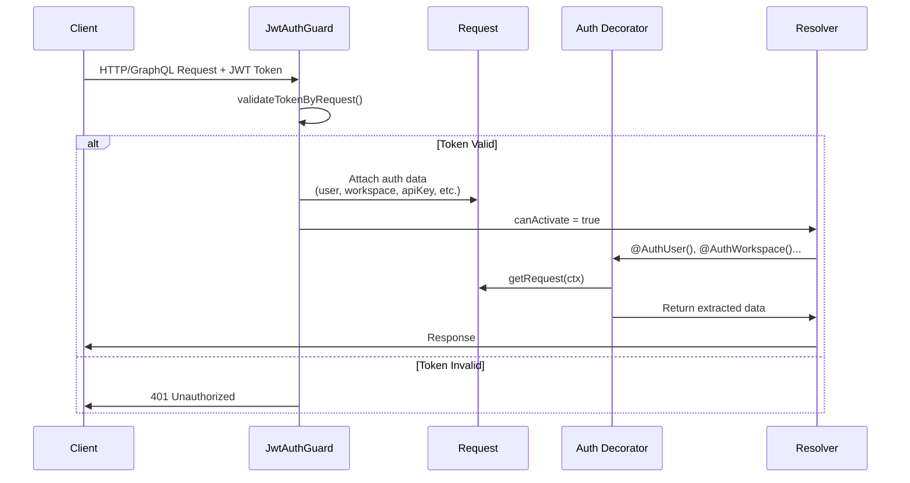
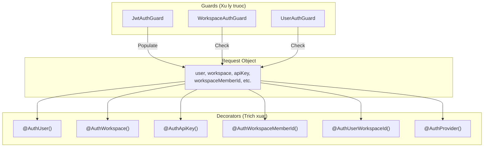
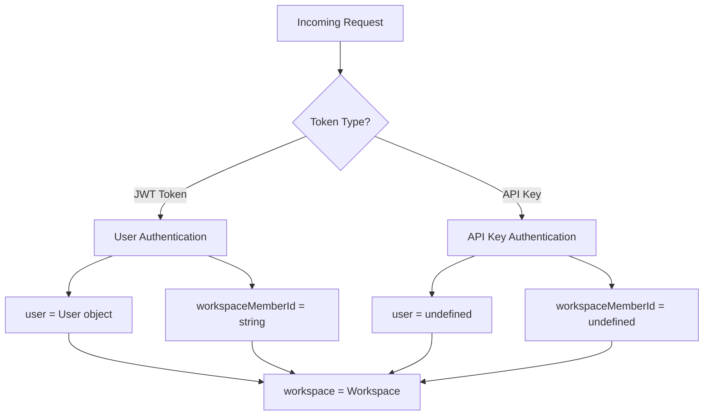

# Auth Decorators - Tài lieu Tham khao

> **Duong dan source**: `packages/twenty-server/src/engine/decorators/auth/`

## Muc luc

1. [Tong quan](#1-tong-quan)
2. [Kien truc va Flow](#2-kien-truc-va-flow)
3. [Chi tiet tung Decorator](#3-chi-tiet-tung-decorator)
   - [AuthUser](#31-authuser)
   - [AuthWorkspace](#32-authworkspace)
   - [AuthApiKey](#33-authapikey)
   - [AuthWorkspaceMemberId](#34-authworkspacememberid)
   - [AuthUserWorkspaceId](#35-authuserworkspaceid)
   - [AuthProvider](#36-authprovider)
4. [Cach su dung trong thuc te](#4-cach-su-dung-trong-thuc-te)
5. [Best Practices](#5-best-practices)
6. [Luu y quan trong](#6-luu-y-quan-trong)

---

## 1. Tong quan

Auth Decorators la tap hop cac **Parameter Decorators** trong NestJS duoc thiet ke de trich xuat thong tin xac thuc (authentication) tu request context. Cac decorators nay hoat dong cung voi Guards de cung cap mot cach thuan tien de truy cap thong tin nguoi dung, workspace, API key trong cac resolvers va controllers.

### Danh sach Decorators

| Decorator | Muc dich | Tra ve |
|-----------|----------|--------|
| `@AuthUser()` | Lay thong tin User da xac thuc | `User \| undefined` |
| `@AuthWorkspace()` | Lay thong tin Workspace hien tai | `Workspace \| undefined` |
| `@AuthApiKey()` | Lay API Key neu co | `string \| undefined` |
| `@AuthWorkspaceMemberId()` | Lay ID cua workspace member | `string \| undefined` |
| `@AuthUserWorkspaceId()` | Lay ID cua user-workspace relationship | `string \| undefined` |
| `@AuthProvider()` | Lay loai auth provider (Google, SAML, etc.) | `AuthProviderEnum \| undefined` |

### File Locations

```
packages/twenty-server/src/engine/decorators/auth/
├── auth-user.decorator.ts
├── auth-workspace.decorator.ts
├── auth-api-key.decorator.ts
├── auth-workspace-member-id.decorator.ts
├── auth-user-workspace-id.decorator.ts
└── auth-provider.decorator.ts
```

---

## 2. Kien truc va Flow

### 2.1 Authentication Flow Diagram



### 2.2 Request Object Structure

Sau khi `JwtAuthGuard` xu ly, request object se chua cac properties sau:

```typescript
interface AuthenticatedRequest {
  user?: User;                    // Thong tin user (null neu dung API key)
  workspace?: Workspace;          // Thong tin workspace
  workspaceId?: string;           // ID cua workspace
  apiKey?: string;                // API key (neu xac thuc bang API key)
  workspaceMemberId?: string;     // ID cua workspace member
  userWorkspaceId?: string;       // ID cua user-workspace relationship
  workspaceMetadataVersion?: number; // Version cua metadata
  authProvider?: AuthProviderEnum;   // Provider su dung de login
}
```

### 2.3 Guard - Decorator Relationship



---

## 3. Chi tiet tung Decorator

### 3.1 AuthUser

**Muc dich**: Trich xuat thong tin User da xac thuc tu request.

**Source code**:
```typescript
// auth-user.decorator.ts
import {
  ExecutionContext,
  ForbiddenException,
  createParamDecorator,
} from '@nestjs/common';
import { getRequest } from 'src/utils/extract-request';

interface DecoratorOptions {
  allowUndefined?: boolean;
}

export const AuthUser = createParamDecorator(
  (options: DecoratorOptions | undefined, ctx: ExecutionContext) => {
    const request = getRequest(ctx);

    if (!options?.allowUndefined && !request.user) {
      throw new ForbiddenException(
        "You're not authorized to do this. " +
          "Note: This endpoint requires a user and won't work with just an API key.",
      );
    }

    return request.user;
  },
);
```

**Dac diem**:
- **Co validation**: Throw `ForbiddenException` neu user khong ton tai (mac dinh)
- **Ho tro option `allowUndefined`**: Cho phep tra ve `undefined` thay vi throw error
- **Use case**: Dung khi can thong tin user cu the (email, id, name, etc.)

**Vi du su dung**:

```typescript
// Bat buoc co user - throw error neu khong co
@Mutation(() => AuthTokens)
@UseGuards(WorkspaceAuthGuard, UserAuthGuard)
async deleteUser(@AuthUser() user: User) {
  // user duoc dam bao khong null
  return this.userService.delete(user.id);
}

// Cho phep undefined - xu ly ca truong hop API key
@Query(() => AuditLog)
@UseGuards(WorkspaceAuthGuard)
async getAuditLog(
  @AuthUser({ allowUndefined: true }) user: User | undefined,
) {
  // user co the la undefined neu request dung API key
  const userId = user?.id ?? 'system';
  return this.auditService.getLog(userId);
}
```

---

### 3.2 AuthWorkspace

**Muc dich**: Trich xuat thong tin Workspace hien tai tu request.

**Source code**:
```typescript
// auth-workspace.decorator.ts
import {
  ExecutionContext,
  InternalServerErrorException,
  createParamDecorator,
} from '@nestjs/common';
import { getRequest } from 'src/utils/extract-request';

interface DecoratorOptions {
  allowUndefined?: boolean;
}

export const AuthWorkspace = createParamDecorator(
  (options: DecoratorOptions | undefined, ctx: ExecutionContext) => {
    const request = getRequest(ctx);

    if (!options?.allowUndefined && !request.workspace) {
      // Throw InternalServerErrorException vi day la loi logic
      // Auth nen duoc xu ly qua Guards, khong phai Decorators
      throw new InternalServerErrorException(
        "You're not authorized to do this. This should not ever happen.",
      );
    }

    return request.workspace;
  },
);
```

**Dac diem**:
- **Throw `InternalServerErrorException`**: Khac voi `AuthUser`, day la loi he thong vi workspace can duoc kiem tra o Guards
- **Ho tro option `allowUndefined`**: Tuong tu `AuthUser`
- **Use case**: Dung de lay workspaceId cho cac operations trong workspace context

**Vi du su dung**:

```typescript
// Su dung voi destructuring de lay workspaceId
@Query(() => [OrganizationLevel])
@UseGuards(WorkspaceAuthGuard)
async getOrganizationLevels(
  @AuthWorkspace() { id: workspaceId }: Workspace,
) {
  return this.orgLevelService.findAll(workspaceId);
}

// Su dung full workspace object
@Mutation(() => Order)
@UseGuards(WorkspaceAuthGuard, UserAuthGuard)
async createOrder(
  @AuthWorkspace() workspace: Workspace,
  @Args('input') input: CreateOrderInput,
) {
  return this.orderService.create(workspace.id, input);
}
```

---

### 3.3 AuthApiKey

**Muc dich**: Trich xuat API Key neu request duoc xac thuc bang API key.

**Source code**:
```typescript
// auth-api-key.decorator.ts
import { createParamDecorator, ExecutionContext } from '@nestjs/common';
import { getRequest } from 'src/utils/extract-request';

export const AuthApiKey = createParamDecorator(
  (data: unknown, ctx: ExecutionContext) => {
    const request = getRequest(ctx);
    return request.apiKey;
  },
);
```

**Dac diem**:
- **Khong co validation**: Luon tra ve gia tri tu request (co the la `undefined`)
- **Dung de phan biet**: Xac dinh request den tu user hay API key
- **Use case**: Kiem tra quyen han dac biet cho API key vs User

**Vi du su dung**:

```typescript
@Mutation(() => BillingSessionOutput)
@UseGuards(WorkspaceAuthGuard, UserAuthGuard)
async checkoutSession(
  @AuthWorkspace() workspace: Workspace,
  @AuthUser() user: User,
  @AuthApiKey() apiKey?: string,
) {
  // Kiem tra neu la API key thi co quyen checkout khong
  await this.validateCanCheckoutSessionPermissionOrThrow({
    workspaceId: workspace.id,
    isExecutedByApiKey: isDefined(apiKey),
  });

  return this.billingService.createSession(workspace, user);
}
```

---

### 3.4 AuthWorkspaceMemberId

**Muc dich**: Trich xuat ID cua workspace member (quan he giua user va workspace).

**Source code**:
```typescript
// auth-workspace-member-id.decorator.ts
import { ExecutionContext, createParamDecorator } from '@nestjs/common';
import { getRequest } from 'src/utils/extract-request';

export const AuthWorkspaceMemberId = createParamDecorator(
  (data: unknown, ctx: ExecutionContext) => {
    const request = getRequest(ctx);
    return request.workspaceMemberId;
  },
);
```

**Dac diem**:
- **Khong co validation**: Tra ve `undefined` neu khong co
- **Workspace Member**: La entity lien ket User voi Workspace, chua thong tin nhu role, permissions
- **Use case**: Audit log, RBAC, tracking ai thuc hien action

**Vi du su dung**:

```typescript
@Mutation(() => CreateOrderResponseDto)
@UseGuards(WorkspaceAuthGuard)
async createOrderWithItems(
  @AuthWorkspace() workspace: Workspace,
  @AuthWorkspaceMemberId() workspaceMemberId: string | undefined,
  @Args('input') input: CreateOrderWithItemsInputDto,
) {
  // workspaceMemberId dung de ghi nhan ai tao order
  return this.orderService.createOrderWithItems(
    workspace.id,
    workspaceMemberId,  // Co the undefined neu dung API key
    input,
  );
}

// Su dung trong RBAC
@Query(() => [Permission])
@UseGuards(WorkspaceAuthGuard, UserAuthGuard)
async getMyPermissions(
  @AuthWorkspaceMemberId() workspaceMemberId: string,
) {
  return this.rbacService.getPermissionsForMember(workspaceMemberId);
}
```

---

### 3.5 AuthUserWorkspaceId

**Muc dich**: Trich xuat ID cua user-workspace relationship.

**Source code**:
```typescript
// auth-user-workspace-id.decorator.ts
import { ExecutionContext, createParamDecorator } from '@nestjs/common';
import { getRequest } from 'src/utils/extract-request';

export const AuthUserWorkspaceId = createParamDecorator(
  (data: unknown, ctx: ExecutionContext) => {
    const request = getRequest(ctx);
    return request.userWorkspaceId;
  },
);
```

**Dac diem**:
- **Khac voi workspaceMemberId**: Day la ID tu bang `UserWorkspace`, khong phai `WorkspaceMember`
- **Use case**: Cac operations lien quan den user settings trong workspace

**Vi du su dung**:

```typescript
@Mutation(() => BillingSessionOutput)
@UseGuards(WorkspaceAuthGuard, UserAuthGuard)
async checkoutSession(
  @AuthWorkspace() workspace: Workspace,
  @AuthUser() user: User,
  @AuthUserWorkspaceId() userWorkspaceId: string,
  @Args() input: BillingCheckoutSessionInput,
) {
  await this.validateCanCheckoutSessionPermissionOrThrow({
    workspaceId: workspace.id,
    userWorkspaceId,  // Dung de kiem tra quyen cua user trong workspace
  });

  return this.billingService.createSession(workspace, user, input);
}

// Agent chat context
@Query(() => [AgentChat])
async getAgentChats(
  @AuthUserWorkspaceId() userWorkspaceId: string,
) {
  return this.agentChatService.getChatsByUserWorkspace(userWorkspaceId);
}
```

---

### 3.6 AuthProvider

**Muc dich**: Trich xuat loai authentication provider duoc su dung de dang nhap.

**Source code**:
```typescript
// auth-provider.decorator.ts
import { ExecutionContext, createParamDecorator } from '@nestjs/common';
import { getRequest } from 'src/utils/extract-request';

export const AuthProvider = createParamDecorator(
  (_: unknown, ctx: ExecutionContext) => {
    const request = getRequest(ctx);
    return request.authProvider;
  },
);
```

**Dac diem**:
- **AuthProviderEnum**: Co the la `Google`, `Microsoft`, `SAML`, `Password`, etc.
- **Use case**: Logic khac nhau tuy theo provider (vi du: Google co them scopes)

**Vi du su dung**:

```typescript
@Mutation(() => GetLoginTokenFromEmailVerificationTokenOutput)
@UseGuards(PublicEndpointGuard)
async getLoginTokenFromEmailVerificationToken(
  @Args() input: GetLoginTokenFromEmailVerificationTokenInput,
  @Args('origin') origin: string,
  @AuthProvider() authProvider: AuthProviderEnum,
) {
  // authProvider xac dinh nguoi dung dang nhap bang cach nao
  const loginToken = await this.loginTokenService.generateLoginToken(
    email,
    workspaceId,
    authProvider,  // Luu lai de tracking va security
  );

  return { loginToken };
}
```

---

## 4. Cach su dung trong thuc te

### 4.1 Pattern co ban

```typescript
import { UseGuards } from '@nestjs/common';
import { Mutation, Query, Resolver, Args } from '@nestjs/graphql';
import {
  AuthUser,
  AuthWorkspace,
  AuthWorkspaceMemberId
} from 'src/engine/decorators/auth';
import { WorkspaceAuthGuard, UserAuthGuard } from 'src/engine/guards';

@Resolver()
export class MyResolver {

  // Pattern 1: Chi can workspace (cho phep API key)
  @Query(() => [Item])
  @UseGuards(WorkspaceAuthGuard)
  async getItems(@AuthWorkspace() workspace: Workspace) {
    return this.itemService.findAll(workspace.id);
  }

  // Pattern 2: Can ca workspace va user
  @Mutation(() => Item)
  @UseGuards(WorkspaceAuthGuard, UserAuthGuard)
  async createItem(
    @AuthWorkspace() workspace: Workspace,
    @AuthUser() user: User,
    @Args('input') input: CreateItemInput,
  ) {
    return this.itemService.create(workspace.id, user.id, input);
  }

  // Pattern 3: Voi audit trail
  @Mutation(() => Order)
  @UseGuards(WorkspaceAuthGuard)
  async createOrder(
    @AuthWorkspace() workspace: Workspace,
    @AuthWorkspaceMemberId() workspaceMemberId: string | undefined,
    @Args('input') input: CreateOrderInput,
  ) {
    return this.orderService.create(
      workspace.id,
      workspaceMemberId,  // Ghi nhan nguoi tao
      input
    );
  }
}
```

### 4.2 Ket hop voi Custom Guards

```typescript
import { RequireDepartment } from 'src/mkt-core/mkt-rbac-enterprise-grade/decorators';

@Resolver()
export class OrderMutationResolver {

  // Ket hop Auth decorators voi RBAC decorator
  @RequireDepartment({
    department: 'SALES',
    minLevel: OrganizationLevelCode.MANAGER,
  })
  @Mutation(() => CreateOrderResponseDto)
  async createOrderWithItems(
    @AuthWorkspace() workspace: Workspace,
    @AuthWorkspaceMemberId() workspaceMemberId: string | undefined,
    @Args('input') input: CreateOrderWithItemsInputDto,
  ) {
    return this.orderService.create(workspace.id, workspaceMemberId, input);
  }
}
```

### 4.3 Destructuring Pattern

```typescript
// Lay chi workspaceId tu workspace object
@Query(() => [Department])
async getDepartments(
  @AuthWorkspace() { id: workspaceId }: Workspace,
) {
  return this.departmentService.findAll(workspaceId);
}

// Lay nhieu properties
@Mutation(() => User)
async updateUserProfile(
  @AuthUser() { id: userId, email }: User,
  @Args('input') input: UpdateProfileInput,
) {
  return this.userService.updateProfile(userId, email, input);
}
```

---

## 5. Best Practices

### 5.1 Luon su dung dung Guards

```typescript
// DUNG: Guards truoc, Decorators sau
@UseGuards(WorkspaceAuthGuard, UserAuthGuard)
async myMethod(
  @AuthWorkspace() workspace: Workspace,
  @AuthUser() user: User,
) { ... }

// SAI: Khong co guards, decorator co the throw error khong mong muon
async myMethod(
  @AuthWorkspace() workspace: Workspace,  // Se throw InternalServerError
) { ... }
```

### 5.2 Type Safety

```typescript
// DUNG: Khai bao dung type
@AuthWorkspaceMemberId() workspaceMemberId: string | undefined,
@AuthApiKey() apiKey: string | undefined,

// SAI: Gia dinh luon co gia tri
@AuthWorkspaceMemberId() workspaceMemberId: string,  // Co the la undefined!
```

### 5.3 Su dung allowUndefined dung cach

```typescript
// Khi endpoint ho tro ca User va API key
@Query(() => Data)
@UseGuards(WorkspaceAuthGuard)  // Chi can workspace, khong can user
async getData(
  @AuthWorkspace() workspace: Workspace,
  @AuthUser({ allowUndefined: true }) user: User | undefined,
) {
  const requestor = user?.email ?? 'API_KEY';
  return this.dataService.get(workspace.id, requestor);
}
```

### 5.4 Thu tu decorators

```typescript
// Thu tu chuan: Workspace -> User -> Member -> ApiKey -> Args
async myMethod(
  @AuthWorkspace() workspace: Workspace,
  @AuthUser() user: User,
  @AuthWorkspaceMemberId() memberId: string | undefined,
  @AuthApiKey() apiKey: string | undefined,
  @Args('input') input: InputDto,
) { ... }
```

---

## 6. Luu y quan trong

### 6.1 Phan biet cac IDs

| ID | Mo ta | Khi nao dung |
|----|-------|--------------|
| `workspace.id` | ID cua workspace | Data isolation, multi-tenancy |
| `user.id` | ID cua user (global) | User operations khong phu thuoc workspace |
| `workspaceMemberId` | ID trong bang WorkspaceMember | Audit, RBAC, workspace-specific permissions |
| `userWorkspaceId` | ID trong bang UserWorkspace | User settings trong workspace |

### 6.2 API Key vs User Authentication



### 6.3 Error Handling

| Decorator | Error Type | Khi nao throw |
|-----------|-----------|---------------|
| `@AuthUser()` | `ForbiddenException` | user undefined va khong co `allowUndefined` |
| `@AuthWorkspace()` | `InternalServerErrorException` | workspace undefined va khong co `allowUndefined` |
| Others | Khong throw | Tra ve `undefined` |

### 6.4 Performance Considerations

- Decorators chi doc tu request object, khong co database calls
- `getRequest()` xu ly ca HTTP va GraphQL contexts
- Khong cache - moi lan goi decorator se doc lai tu request

### 6.5 Security Notes

1. **Khong tin tuong decorator de authorization**: Decorators chi trich xuat data, Guards moi enforce security
2. **Kiem tra undefined**: Luon xu ly truong hop undefined cho cac decorators khong co validation
3. **Audit trail**: Su dung `workspaceMemberId` de ghi nhan nguoi thuc hien action

---

## Tham khao

- **Source Files**: `packages/twenty-server/src/engine/decorators/auth/`
- **Guards**: `packages/twenty-server/src/engine/guards/`
- **Request Extraction**: `packages/twenty-server/src/utils/extract-request.ts`
- **Twenty CRM Architecture**: `/docs/TWENTY_WORKSPACE_ARCHITECTURE.md`
