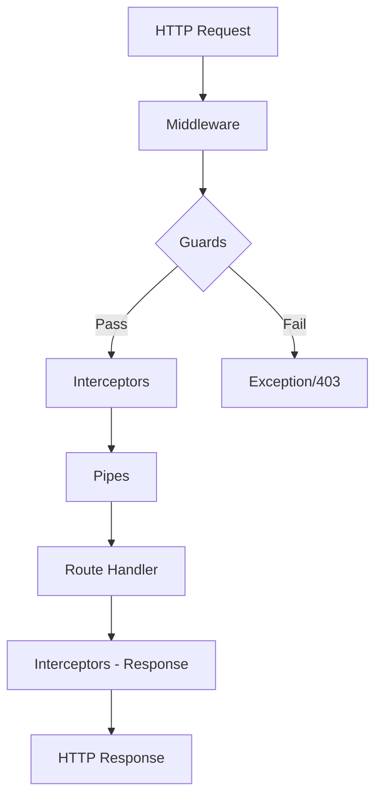
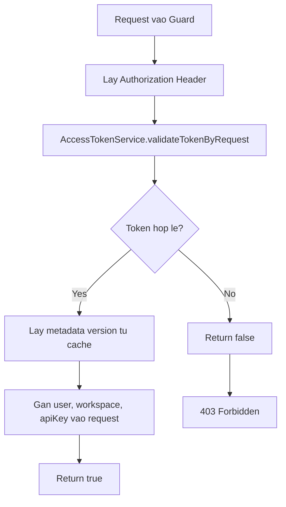
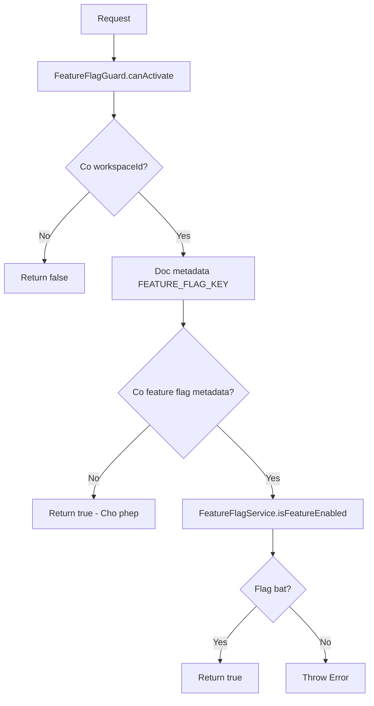
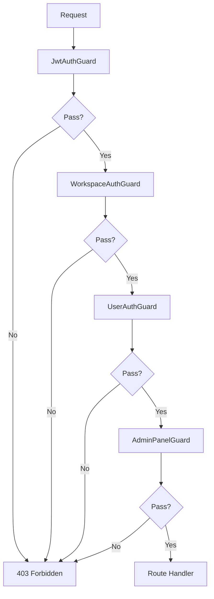

# Engine Guards Documentation

## Muc luc

- [1. Tong quan](#1-tong-quan)
- [2. Danh sach Guards](#2-danh-sach-guards)
  - [2.1. JwtAuthGuard](#21-jwtauthguard)
  - [2.2. WorkspaceAuthGuard](#22-workspaceauthguard)
  - [2.3. UserAuthGuard](#23-userauthguard)
  - [2.4. AdminPanelGuard](#24-adminpanelguard)
  - [2.5. ImpersonateGuard](#25-impersonateguard)
  - [2.6. FeatureFlagGuard](#26-featureflagguard)
  - [2.7. SettingsPermissionsGuard](#27-settingspermissionsguard)
  - [2.8. PublicEndpointGuard](#28-publicendpointguard)
- [3. Flow Diagram](#3-flow-diagram)
- [4. Thu tu su dung Guards](#4-thu-tu-su-dung-guards)
- [5. Cach su dung voi Vi du Code](#5-cach-su-dung-voi-vi-du-code)
- [6. Best Practices](#6-best-practices)
- [7. Luu y quan trong](#7-luu-y-quan-trong)

---

## 1. Tong quan

Guards trong NestJS la cac lop implement interface `CanActivate`, duoc su dung de kiem soat quyen truy cap vao cac endpoint (REST API hoac GraphQL resolver). Guards chay **sau middleware** nhung **truoc interceptors va pipes**.

**Vi tri file:** `/packages/twenty-server/src/engine/guards/`

**Cac guards co san:**

| Guard | Muc dich | Injectable |
|-------|----------|------------|
| `JwtAuthGuard` | Xac thuc JWT token va gan thong tin user/workspace vao request | Co |
| `WorkspaceAuthGuard` | Kiem tra request co workspace hop le | Khong |
| `UserAuthGuard` | Kiem tra request co user da dang nhap | Khong |
| `AdminPanelGuard` | Kiem tra quyen truy cap Admin Panel | Khong |
| `ImpersonateGuard` | Kiem tra quyen impersonate (gia lap user khac) | Khong |
| `FeatureFlagGuard` | Kiem tra feature flag co duoc bat cho workspace | Co |
| `SettingsPermissionsGuard` | Kiem tra quyen settings cu the | Co (Mixin) |
| `PublicEndpointGuard` | Danh dau endpoint la public (luon cho phep) | Co |

---

## 2. Danh sach Guards

### 2.1. JwtAuthGuard

**File:** `jwt-auth.guard.ts`

**Muc dich:** Xac thuc JWT access token tu request header va populate thong tin authentication vao request object.

**Cach hoat dong:**
1. Lay request tu ExecutionContext
2. Goi `AccessTokenService.validateTokenByRequest()` de verify JWT token
3. Neu hop le, lay metadata version tu workspace cache
4. Gan cac thong tin vao request:
   - `request.user` - Thong tin user
   - `request.apiKey` - API key (neu su dung)
   - `request.workspace` - Thong tin workspace
   - `request.workspaceId` - ID cua workspace
   - `request.workspaceMetadataVersion` - Version metadata
   - `request.workspaceMemberId` - ID workspace member
   - `request.userWorkspaceId` - ID user trong workspace

**Return:**
- `true` - Token hop le
- `false` - Token khong hop le hoac loi

```typescript
@Injectable()
export class JwtAuthGuard implements CanActivate {
  constructor(
    private readonly accessTokenService: AccessTokenService,
    private readonly workspaceStorageCacheService: WorkspaceCacheStorageService,
  ) {}

  async canActivate(context: ExecutionContext): Promise<boolean> {
    const request = context.switchToHttp().getRequest();

    try {
      const data = await this.accessTokenService.validateTokenByRequest(request);
      const metadataVersion = data.workspace
        ? await this.workspaceStorageCacheService.getMetadataVersion(data.workspace.id)
        : undefined;

      request.user = data.user;
      request.apiKey = data.apiKey;
      request.workspace = data.workspace;
      request.workspaceId = data.workspace?.id;
      request.workspaceMetadataVersion = metadataVersion;
      request.workspaceMemberId = data.workspaceMemberId;
      request.userWorkspaceId = data.userWorkspaceId;

      return true;
    } catch (error) {
      return false;
    }
  }
}
```

---

### 2.2. WorkspaceAuthGuard

**File:** `workspace-auth.guard.ts`

**Muc dich:** Dam bao request da duoc gan workspace hop le (thuong su dung sau JwtAuthGuard).

**Cach hoat dong:**
1. Chuyen ExecutionContext thanh GqlExecutionContext (GraphQL)
2. Kiem tra `request.workspace !== undefined`

**Return:**
- `true` - Co workspace
- `false` - Khong co workspace

```typescript
export class WorkspaceAuthGuard implements CanActivate {
  canActivate(
    context: ExecutionContext,
  ): boolean | Promise<boolean> | Observable<boolean> {
    const ctx = GqlExecutionContext.create(context);
    const request = ctx.getContext().req;

    return request.workspace !== undefined;
  }
}
```

**Luu y:** Guard nay **khong co decorator `@Injectable()`**, nen khong the inject dependencies.

---

### 2.3. UserAuthGuard

**File:** `user-auth.guard.ts`

**Muc dich:** Dam bao request da duoc gan user hop le (da dang nhap).

**Cach hoat dong:**
1. Chuyen ExecutionContext thanh GqlExecutionContext
2. Kiem tra `request.user !== undefined`

**Return:**
- `true` - Co user
- `false` - Khong co user

```typescript
export class UserAuthGuard implements CanActivate {
  canActivate(
    context: ExecutionContext,
  ): boolean | Promise<boolean> | Observable<boolean> {
    const ctx = GqlExecutionContext.create(context);
    const request = ctx.getContext().req;

    return request.user !== undefined;
  }
}
```

---

### 2.4. AdminPanelGuard

**File:** `admin-panel-guard.ts`

**Muc dich:** Kiem tra user co quyen truy cap **toan bo** Admin Panel hay khong.

**Cach hoat dong:**
1. Lay user tu request
2. Kiem tra `request.user.canAccessFullAdminPanel === true`

**Return:**
- `true` - Co quyen admin panel
- `false` - Khong co quyen

```typescript
export class AdminPanelGuard implements CanActivate {
  canActivate(
    context: ExecutionContext,
  ): boolean | Promise<boolean> | Observable<boolean> {
    const ctx = GqlExecutionContext.create(context);
    const request = ctx.getContext().req;

    return request.user.canAccessFullAdminPanel === true;
  }
}
```

**Use case:** Cac thao tac quan tri he thong nhu xem config variables, system health, queue metrics.

---

### 2.5. ImpersonateGuard

**File:** `impersonate-guard.ts`

**Muc dich:** Kiem tra user co quyen impersonate (gia lap dang nhap duoi danh nghia user khac) hay khong.

**Cach hoat dong:**
1. Lay user tu request
2. Kiem tra `request.user.canImpersonate === true`

**Return:**
- `true` - Co quyen impersonate
- `false` - Khong co quyen

```typescript
export class ImpersonateGuard implements CanActivate {
  canActivate(
    context: ExecutionContext,
  ): boolean | Promise<boolean> | Observable<boolean> {
    const ctx = GqlExecutionContext.create(context);
    const request = ctx.getContext().req;

    return request.user.canImpersonate === true;
  }
}
```

**Use case:** Cho phep admin gia lap session cua user khac de debug hoac ho tro.

---

### 2.6. FeatureFlagGuard

**File:** `feature-flag.guard.ts`

**Muc dich:** Kiem tra mot feature flag cu the da duoc bat cho workspace hay chua.

**Thanh phan:**
1. **Decorator `@RequireFeatureFlag(flag)`** - Danh dau method can kiem tra feature flag
2. **Guard `FeatureFlagGuard`** - Doc metadata va kiem tra flag

**Cach hoat dong:**
1. Lay `workspaceId` tu request
2. Doc metadata `FEATURE_FLAG_KEY` tu handler (duoc set boi decorator)
3. Neu khong co metadata -> cho phep (return true)
4. Goi `FeatureFlagService.isFeatureEnabled(flag, workspaceId)`
5. Neu flag tat -> throw Error

```typescript
export const FEATURE_FLAG_KEY = 'feature-flag-metadata-args';

export function RequireFeatureFlag(featureFlag: FeatureFlagKey) {
  return (
    target: object,
    propertyKey?: string,
    descriptor?: PropertyDescriptor,
  ) => {
    TypedReflect.defineMetadata(
      FEATURE_FLAG_KEY,
      featureFlag,
      descriptor?.value || target,
    );
    return descriptor;
  };
}

@Injectable()
export class FeatureFlagGuard implements CanActivate {
  constructor(
    private readonly reflector: Reflector,
    private readonly featureFlagService: FeatureFlagService,
  ) {}

  async canActivate(context: ExecutionContext): Promise<boolean> {
    const ctx = GqlExecutionContext.create(context);
    const request = ctx.getContext().req;
    const workspaceId = request.workspace?.id;

    if (!workspaceId) {
      return false;
    }

    const featureFlag = this.reflector.get<FeatureFlagKey>(
      FEATURE_FLAG_KEY,
      context.getHandler(),
    );

    if (!featureFlag) {
      return true;
    }

    const isEnabled = await this.featureFlagService.isFeatureEnabled(
      featureFlag,
      workspaceId,
    );

    if (!isEnabled) {
      throw new Error(
        `Feature flag "${featureFlag}" is not enabled for this workspace`,
      );
    }

    return true;
  }
}
```

**Luu y:** Guard nay throw Error thay vi return false khi flag bi tat.

---

### 2.7. SettingsPermissionsGuard

**File:** `settings-permissions.guard.ts`

**Muc dich:** Kiem tra user co quyen thuc hien mot thao tac settings cu the hay khong.

**Dac diem:** Day la **Mixin Guard** - mot factory function tra ve guard class dong.

**Cach hoat dong:**
1. Nhan `requiredPermission` (PermissionFlagType) khi khoi tao
2. Lay `workspaceId`, `userWorkspaceId`, `activationStatus` tu request
3. Neu workspace dang trong trang thai PENDING_CREATION hoac ONGOING_CREATION -> cho phep
4. Goi `PermissionsService.userHasWorkspaceSettingPermission()`
5. Neu khong co quyen -> throw PermissionsException

```typescript
export const SettingsPermissionsGuard = (
  requiredPermission: PermissionFlagType,
): Type<CanActivate> => {
  @Injectable()
  class SettingsPermissionsMixin implements CanActivate {
    constructor(private readonly permissionsService: PermissionsService) {}

    async canActivate(context: ExecutionContext): Promise<boolean> {
      const ctx = GqlExecutionContext.create(context);
      const workspaceId = ctx.getContext().req.workspace.id;
      const userWorkspaceId = ctx.getContext().req.userWorkspaceId;
      const workspaceActivationStatus =
        ctx.getContext().req.workspace.activationStatus;

      // Cho phep trong qua trinh tao workspace
      if (
        [
          WorkspaceActivationStatus.PENDING_CREATION,
          WorkspaceActivationStatus.ONGOING_CREATION,
        ].includes(workspaceActivationStatus)
      ) {
        return true;
      }

      const hasPermission =
        await this.permissionsService.userHasWorkspaceSettingPermission({
          userWorkspaceId,
          setting: requiredPermission,
          workspaceId,
          isExecutedByApiKey: isDefined(ctx.getContext().req.apiKey),
        });

      if (hasPermission === true) {
        return true;
      }

      throw new PermissionsException(
        PermissionsExceptionMessage.PERMISSION_DENIED,
        PermissionsExceptionCode.PERMISSION_DENIED,
      );
    }
  }

  return mixin(SettingsPermissionsMixin);
};
```

**Cac loai permission co san (PermissionFlagType):**

| Permission | Mo ta |
|------------|-------|
| `API_KEYS_AND_WEBHOOKS` | Quan ly API keys va webhooks |
| `WORKSPACE` | Cau hinh workspace |
| `WORKSPACE_MEMBERS` | Quan ly thanh vien |
| `ROLES` | Quan ly roles |
| `DATA_MODEL` | Thay doi data model (objects, fields) |
| `ADMIN_PANEL` | Truy cap admin panel |
| `SECURITY` | Cau hinh bao mat (SSO, etc.) |
| `WORKFLOWS` | Quan ly workflows |
| `SEND_EMAIL_TOOL` | Quyen gui email |
| `IMPORT_CSV` | Import CSV |
| `EXPORT_CSV` | Export CSV |

---

### 2.8. PublicEndpointGuard

**File:** `public-endpoint.guard.ts`

**Muc dich:** Danh dau endpoint la **public** - khong can xac thuc.

**Cach hoat dong:** Luon return `true`.

```typescript
/**
 * Guard that explicitly marks an endpoint as public/unprotected.
 * This guard always returns true and serves as documentation
 * that the endpoint is intentionally accessible without authentication.
 *
 * Usage: @UseGuards(PublicEndpointGuard)
 */
@Injectable()
export class PublicEndpointGuard implements CanActivate {
  canActivate(_context: ExecutionContext): boolean {
    // Always allow access - this is an explicit marker for public endpoints
    return true;
  }
}
```

**Use case:**
- Webhook endpoints (SEPay, Stripe)
- Health check endpoints
- Public API documentation
- SSO callback endpoints
- Email verification

---

## 3. Flow Diagram

### 3.1. Tong quan Guard Pipeline



### 3.2. Flow JwtAuthGuard



### 3.3. Flow FeatureFlagGuard voi Decorator



### 3.4. Flow ket hop nhieu Guards



---

## 4. Thu tu su dung Guards

### 4.1. Thu tu chuan

Khi su dung nhieu guards, thu tu trong `@UseGuards()` la **tu trai sang phai**:

```typescript
@UseGuards(Guard1, Guard2, Guard3)
// Guard1 chay truoc -> Guard2 -> Guard3
```

### 4.2. Thu tu khuyen nghi

| Level | Guards | Mo ta |
|-------|--------|-------|
| 1 | `JwtAuthGuard` | Xac thuc token, populate request |
| 2 | `WorkspaceAuthGuard` | Kiem tra co workspace |
| 3 | `UserAuthGuard` | Kiem tra co user |
| 4 | `FeatureFlagGuard` | Kiem tra feature flag |
| 5 | `AdminPanelGuard` / `ImpersonateGuard` | Quyen dac biet |
| 6 | `SettingsPermissionsGuard(...)` | Quyen settings cu the |

### 4.3. Cac to hop pho bien

```typescript
// 1. API can xac thuc workspace
@UseGuards(JwtAuthGuard, WorkspaceAuthGuard)

// 2. API can xac thuc user
@UseGuards(JwtAuthGuard, UserAuthGuard)

// 3. API can ca workspace va user
@UseGuards(WorkspaceAuthGuard, UserAuthGuard)

// 4. API Admin Panel
@UseGuards(WorkspaceAuthGuard, UserAuthGuard, AdminPanelGuard)

// 5. API Impersonate
@UseGuards(WorkspaceAuthGuard, UserAuthGuard, ImpersonateGuard)

// 6. API voi Feature Flag
@UseGuards(WorkspaceAuthGuard, FeatureFlagGuard)

// 7. API Settings voi permission cu the
@UseGuards(SettingsPermissionsGuard(PermissionFlagType.DATA_MODEL))

// 8. Public endpoint
@UseGuards(PublicEndpointGuard)
```

---

## 5. Cach su dung voi Vi du Code

### 5.1. API co ban - Workspace Authentication

```typescript
import { UseGuards } from '@nestjs/common';
import { Resolver, Query } from '@nestjs/graphql';
import { JwtAuthGuard } from 'src/engine/guards/jwt-auth.guard';
import { WorkspaceAuthGuard } from 'src/engine/guards/workspace-auth.guard';
import { AuthWorkspace } from 'src/engine/decorators/auth/auth-workspace.decorator';
import { Workspace } from 'src/engine/core-modules/workspace/workspace.entity';

@UseGuards(JwtAuthGuard, WorkspaceAuthGuard)
@Resolver()
export class OrderResolver {
  @Query(() => [OrderDTO])
  async orders(@AuthWorkspace() workspace: Workspace) {
    // workspace da duoc verify boi guards
    return this.orderService.findByWorkspace(workspace.id);
  }
}
```

### 5.2. API can User Authentication

```typescript
import { JwtAuthGuard } from 'src/engine/guards/jwt-auth.guard';
import { UserAuthGuard } from 'src/engine/guards/user-auth.guard';
import { AuthUser } from 'src/engine/decorators/auth/auth-user.decorator';
import { User } from 'src/engine/core-modules/user/user.entity';

@UseGuards(JwtAuthGuard, UserAuthGuard)
@Resolver()
export class InvoiceResolver {
  @Query(() => InvoiceDTO)
  async myInvoices(@AuthUser() user: User) {
    return this.invoiceService.findByUser(user.id);
  }
}
```

### 5.3. API Admin Panel

```typescript
import { WorkspaceAuthGuard } from 'src/engine/guards/workspace-auth.guard';
import { UserAuthGuard } from 'src/engine/guards/user-auth.guard';
import { AdminPanelGuard } from 'src/engine/guards/admin-panel-guard';

@Resolver()
export class AdminResolver {
  @UseGuards(WorkspaceAuthGuard, UserAuthGuard, AdminPanelGuard)
  @Query(() => SystemHealth)
  async getSystemHealth() {
    return this.adminService.getSystemHealth();
  }

  @UseGuards(WorkspaceAuthGuard, UserAuthGuard, ImpersonateGuard)
  @Mutation(() => ImpersonateOutput)
  async impersonate(
    @Args('userId') userId: string,
    @Args('workspaceId') workspaceId: string,
  ) {
    return this.adminService.impersonate(userId, workspaceId);
  }
}
```

### 5.4. API voi Feature Flag

```typescript
import { FeatureFlagGuard, RequireFeatureFlag } from 'src/engine/guards/feature-flag.guard';
import { WorkspaceAuthGuard } from 'src/engine/guards/workspace-auth.guard';
import { FeatureFlagKey } from 'src/engine/core-modules/feature-flag/enums/feature-flag-key.enum';

@UseGuards(WorkspaceAuthGuard, FeatureFlagGuard)
@Resolver()
export class AgentResolver {
  // Guard o class level + decorator o method level
  @Query(() => [AgentDTO])
  @RequireFeatureFlag(FeatureFlagKey.IS_AI_ENABLED)
  async agents(@AuthWorkspace() workspace: Workspace) {
    return this.agentService.findAll(workspace.id);
  }

  // Method khac khong can feature flag
  @Query(() => AgentDTO)
  async agent(@Args('id') id: string) {
    return this.agentService.findOne(id);
  }
}
```

### 5.5. API voi Settings Permissions

```typescript
import { SettingsPermissionsGuard } from 'src/engine/guards/settings-permissions.guard';
import { PermissionFlagType } from 'src/engine/metadata-modules/permissions/constants/permission-flag-type.constants';

@Resolver()
export class ObjectMetadataResolver {
  @UseGuards(SettingsPermissionsGuard(PermissionFlagType.DATA_MODEL))
  @Mutation(() => ObjectMetadataDTO)
  async createOneObject(@Args('input') input: CreateObjectInput) {
    return this.objectMetadataService.create(input);
  }

  @UseGuards(SettingsPermissionsGuard(PermissionFlagType.DATA_MODEL))
  @Mutation(() => ObjectMetadataDTO)
  async updateOneObject(@Args('input') input: UpdateObjectInput) {
    return this.objectMetadataService.update(input);
  }
}
```

### 5.6. Public Endpoint

```typescript
import { PublicEndpointGuard } from 'src/engine/guards/public-endpoint.guard';
import { Controller, Post, Body } from '@nestjs/common';

@Controller('webhooks')
export class WebhookController {
  @UseGuards(PublicEndpointGuard)
  @Post('sepay')
  async handleSepayWebhook(@Body() payload: SepayWebhookPayload) {
    // Khong can xac thuc - public endpoint
    return this.paymentService.processWebhook(payload);
  }

  @UseGuards(PublicEndpointGuard)
  @Get('health')
  async healthCheck() {
    return { status: 'ok' };
  }
}
```

### 5.7. Ket hop nhieu Guards trong Resolver

```typescript
import { UseGuards } from '@nestjs/common';
import { Resolver, Query, Mutation } from '@nestjs/graphql';
import { JwtAuthGuard } from 'src/engine/guards/jwt-auth.guard';
import { WorkspaceAuthGuard } from 'src/engine/guards/workspace-auth.guard';
import { UserAuthGuard } from 'src/engine/guards/user-auth.guard';
import { SettingsPermissionsGuard } from 'src/engine/guards/settings-permissions.guard';
import { PermissionFlagType } from 'src/engine/metadata-modules/permissions/constants/permission-flag-type.constants';

// Guard chung cho ca class
@UseGuards(JwtAuthGuard, WorkspaceAuthGuard)
@Resolver()
export class WorkspaceSettingsResolver {
  // Chi can workspace auth
  @Query(() => WorkspaceSettingsDTO)
  async workspaceSettings(@AuthWorkspace() workspace: Workspace) {
    return this.settingsService.get(workspace.id);
  }

  // Can them user auth
  @UseGuards(UserAuthGuard)
  @Query(() => UserPreferencesDTO)
  async userPreferences(@AuthUser() user: User) {
    return this.preferencesService.get(user.id);
  }

  // Can them permission cu the
  @UseGuards(SettingsPermissionsGuard(PermissionFlagType.WORKSPACE))
  @Mutation(() => WorkspaceSettingsDTO)
  async updateWorkspaceSettings(
    @Args('input') input: UpdateWorkspaceSettingsInput,
    @AuthWorkspace() workspace: Workspace,
  ) {
    return this.settingsService.update(workspace.id, input);
  }
}
```

---

## 6. Best Practices

### 6.1. Dat Guards o Class Level khi co the

```typescript
// Tot - Tat ca methods deu can xac thuc
@UseGuards(JwtAuthGuard, WorkspaceAuthGuard)
@Resolver()
export class OrderResolver {
  @Query(() => [OrderDTO])
  async orders() { /* ... */ }

  @Mutation(() => OrderDTO)
  async createOrder() { /* ... */ }
}
```

### 6.2. Su dung Guards cu the o Method Level khi can

```typescript
@UseGuards(JwtAuthGuard, WorkspaceAuthGuard)
@Resolver()
export class MixedResolver {
  // Su dung guards mac dinh tu class
  @Query(() => DataDTO)
  async getData() { /* ... */ }

  // Them guards bo sung
  @UseGuards(UserAuthGuard)
  @Mutation(() => DataDTO)
  async updateData() { /* ... */ }

  // Override guards - endpoint nay la public
  @UseGuards(PublicEndpointGuard)
  @Query(() => PublicDataDTO)
  async getPublicData() { /* ... */ }
}
```

### 6.3. Luon kiem tra thu tu Guards

```typescript
// Dung - JwtAuthGuard populate request.workspace truoc
@UseGuards(JwtAuthGuard, WorkspaceAuthGuard)

// Sai - WorkspaceAuthGuard se fail vi chua co request.workspace
@UseGuards(WorkspaceAuthGuard, JwtAuthGuard)
```

### 6.4. Su dung PublicEndpointGuard de danh dau ro rang

```typescript
// Tot - Danh dau ro endpoint la public
@UseGuards(PublicEndpointGuard)
@Post('webhook')
async handleWebhook() { /* ... */ }

// Khong tot - De trong de nguoi doc khong biet la co chu dich hay quen
@Post('webhook')
async handleWebhook() { /* ... */ }
```

### 6.5. Ket hop Feature Flag dung cach

```typescript
// Tot - Guard o class, decorator o method
@UseGuards(WorkspaceAuthGuard, FeatureFlagGuard)
@Resolver()
export class AIResolver {
  @RequireFeatureFlag(FeatureFlagKey.IS_AI_ENABLED)
  @Query(() => AIResponseDTO)
  async askAI() { /* ... */ }
}

// Cung tot - Toan bo resolver can feature flag
@UseGuards(WorkspaceAuthGuard, FeatureFlagGuard)
@RequireFeatureFlag(FeatureFlagKey.IS_AI_ENABLED)
@Resolver()
export class AIOnlyResolver {
  // Tat ca methods can IS_AI_ENABLED
}
```

### 6.6. Xu ly loi tu Guards

Guards co 2 cach bao loi:
1. **Return false** - NestJS se tra ve 403 Forbidden chung
2. **Throw exception** - Co the custom message

```typescript
// SettingsPermissionsGuard throw exception cu the
throw new PermissionsException(
  PermissionsExceptionMessage.PERMISSION_DENIED,
  PermissionsExceptionCode.PERMISSION_DENIED,
);

// FeatureFlagGuard throw Error voi message cu the
throw new Error(`Feature flag "${featureFlag}" is not enabled for this workspace`);
```

---

## 7. Luu y quan trong

### 7.1. JwtAuthGuard la tien de cho cac guards khac

JwtAuthGuard populate `request.user`, `request.workspace`, etc. Cac guards khac deu dua vao du lieu nay.

```typescript
// LUON dat JwtAuthGuard dau tien (neu can)
@UseGuards(JwtAuthGuard, WorkspaceAuthGuard, UserAuthGuard)
```

### 7.2. GraphQL context khac REST context

Cac guards su dung `GqlExecutionContext.create(context)` de lay request tu GraphQL context:

```typescript
const ctx = GqlExecutionContext.create(context);
const request = ctx.getContext().req;
```

Voi REST controller, co the dung truc tiep:
```typescript
const request = context.switchToHttp().getRequest();
```

### 7.3. Guards khong co @Injectable() khong the inject dependencies

```typescript
// WorkspaceAuthGuard, UserAuthGuard, AdminPanelGuard, ImpersonateGuard
// KHONG co @Injectable() -> khong the inject service
export class WorkspaceAuthGuard implements CanActivate {
  // Khong co constructor voi DI
}
```

### 7.4. SettingsPermissionsGuard la factory function

```typescript
// Dung - Goi nhu function voi tham so
@UseGuards(SettingsPermissionsGuard(PermissionFlagType.DATA_MODEL))

// Sai - Khong phai class thong thuong
@UseGuards(SettingsPermissionsGuard)
```

### 7.5. PublicEndpointGuard phuc vu muc dich documentation

Du endpoint khong can guard, su dung `PublicEndpointGuard` giup:
- Danh dau ro endpoint la public
- Tranh nham lan voi endpoint quen dat guard
- De dang review security

### 7.6. FeatureFlagGuard can ca Guard va Decorator

```typescript
// Can ca 2: Guard de active va Decorator de chi dinh flag
@UseGuards(WorkspaceAuthGuard, FeatureFlagGuard)
@Resolver()
export class MyResolver {
  @RequireFeatureFlag(FeatureFlagKey.SOME_FLAG)
  @Query(() => DataDTO)
  async getData() { /* ... */ }
}
```

### 7.7. Test Guards

Khi test resolver/controller co guards:
1. Mock dependencies cua guards
2. Hoac su dung `.overrideGuard()` de disable

```typescript
const module = await Test.createTestingModule({
  providers: [MyResolver],
})
.overrideGuard(JwtAuthGuard)
.useValue({ canActivate: () => true })
.compile();
```

---

## Tham khao

- **Files:** `/packages/twenty-server/src/engine/guards/`
- **Tests:** `/packages/twenty-server/src/engine/guards/__tests__/`
- **NestJS Guards Documentation:** https://docs.nestjs.com/guards
- **PermissionFlagType:** `/packages/twenty-server/src/engine/metadata-modules/permissions/constants/permission-flag-type.constants.ts`
