# Order Module - Workflow Documentation

## Tong quan

Order module su dung **Saga Pattern** de xu ly toan bo vong doi don hang. Moi luong nghiep vu duoc thuc hien qua cac saga voi cac buoc (steps) co kha nang rollback (compensate).

### Kien truc

```
GraphQL Mutations
       |
OrderOrchestrationService (Facade)
       |
  +---------+---------+---------+
  |         |         |         |
CreateOrder ConfirmOrder Update Refund
  Saga       Saga     Saga   Saga
  |         |         |         |
  Steps     Steps     Steps   Steps
  |         |                   |
  v         v                   v
BullMQ   BullMQ              EventEmitter
(license) (license +           |
           delayed jobs)  LicenseLifecycle
                          Listener
                              |
                           BullMQ
                          (revoke)
```

### Tech Stack

| Component | Technology |
|-----------|-----------|
| API Layer | GraphQL (NestJS Resolvers) |
| Orchestration | Saga Pattern (custom implementation) |
| Async License Jobs | BullMQ via `MessageQueueService` (queue: `license-queue`) |
| Delayed Jobs | BullMQ via `DelayedJobService` (queue: `mkt-delayed-job-queue`) |
| Cron Jobs | BullMQ via `MessageQueue.cronQueue` |
| Events | NestJS `EventEmitter2` + Twenty `WorkspaceEventEmitter` |
| Database | PostgreSQL via TypeORM (workspace schema) |
| Cache | Redis |

---

## Order Status (Trang thai don hang)

### Danh sach status

| Status | Label (VI) | Mo ta |
|--------|-----------|-------|
| `DRAFT` | Nhap | Don hang dang duoc soan, chua gui di |
| `PENDING_PAYMENT` | Cho thanh toan | Don hang da gui, dang cho khach thanh toan (legacy) |
| `CONFIRMED` | Da xac nhan | Don hang da xac nhan, san sang tao license |
| `LICENSE_PENDING` | Cho tao license | Jobs da enqueue, dang cho worker xu ly |
| `PROCESSING` | Dang xu ly | License da cap voi status PENDING_PAYMENT, dang cho thanh toan |
| `COMPLETED` | Hoan thanh | Don hang hoan tat, license da active |
| `LICENSE_FAILED` | Tao license that bai | Can xu ly thu cong |
| `LOCKED` | Khoa do qua han | License bi lock tren MKT Server do qua han thanh toan |
| `TRIAL` | Dung thu | Don trial, license trial da duoc tao ngay |
| `TRIAL_EXPIRED` | Trial het han | Don trial da het thoi gian dung thu |
| `CANCELED` | Da huy | Don hang bi huy (terminal) |
| `BLOCKED` | Bi khoa | Don hang bi khoa do vi pham chinh sach (terminal) |
| `REFUND` | Hoan tien | Don hang da duoc hoan tien toan bo (terminal) |
| `REFUND_PARTIAL` | Hoan tien mot phan | Don hang da duoc hoan tien mot phan |

### State Machine - Chuyen trang thai hop le

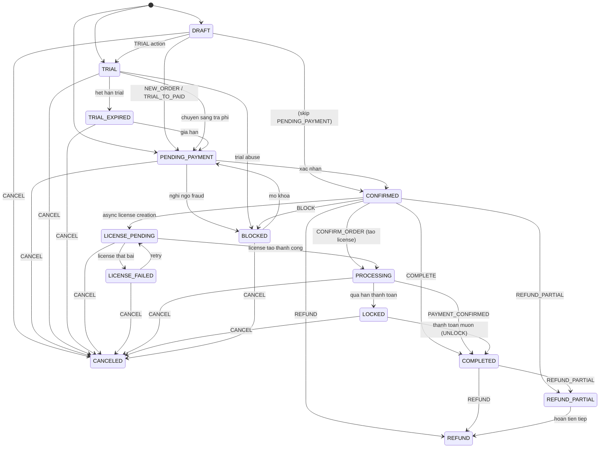

### Terminal Statuses (khong chuyen tiep duoc)

- `CANCELED`
- `REFUND`

---

## Order Actions (Hanh dong)

| Action | Mo ta | Mutation |
|--------|-------|---------|
| `NEW_ORDER` | Tao don hang moi | `createOrderWithItems` |
| `TRIAL_TO_PAID` | Chuyen trial sang tra phi | `createOrderWithItems` |
| `LICENSE_RENEWING` | Gia han license | `createOrderWithItems` |
| `CHANGE_VARIANT` | Doi goi san pham | `createOrderWithItems` |
| `CONFIRM_ORDER` | Xac nhan don, tao license | `confirmOrderWithLicense` |
| `PAYMENT_CONFIRMED` | Xac nhan thanh toan | `confirmOrderPayment` |
| `LOCK_OVERDUE` | Khoa do qua han | Auto (delayed job / cron) |
| `UNLOCK_AFTER_PAYMENT` | Mo khoa sau thanh toan muon | `unlockOrderAfterPayment` |
| `COMPLETE` | Hoan thanh don hang | `updateOrderStatus` |
| `CANCEL` | Huy don hang | `updateOrderStatus` |
| `BLOCK` | Khoa don hang | `updateOrderStatus` |
| `REFUND` | Hoan tien toan bo | `refundOrder` |
| `REFUND_PARTIAL` | Hoan tien mot phan | `refundOrder` |

---

## Flow 1: Tao don hang (CreateOrderSaga)

### Entry Point

```graphql
mutation {
  createOrderWithItems(input: {
    action: NEW_ORDER           # hoac TRIAL_TO_PAID, LICENSE_RENEWING, CHANGE_VARIANT
    customerId: "..."
    isDraft: false              # true → DRAFT, false → PENDING_PAYMENT
    items: [{ externalMktProductId, externalMktPackageId, quantity, maxDevices }]
  }) {
    success orderId orderCode
  }
}
```

### Cac buoc (Saga Steps)

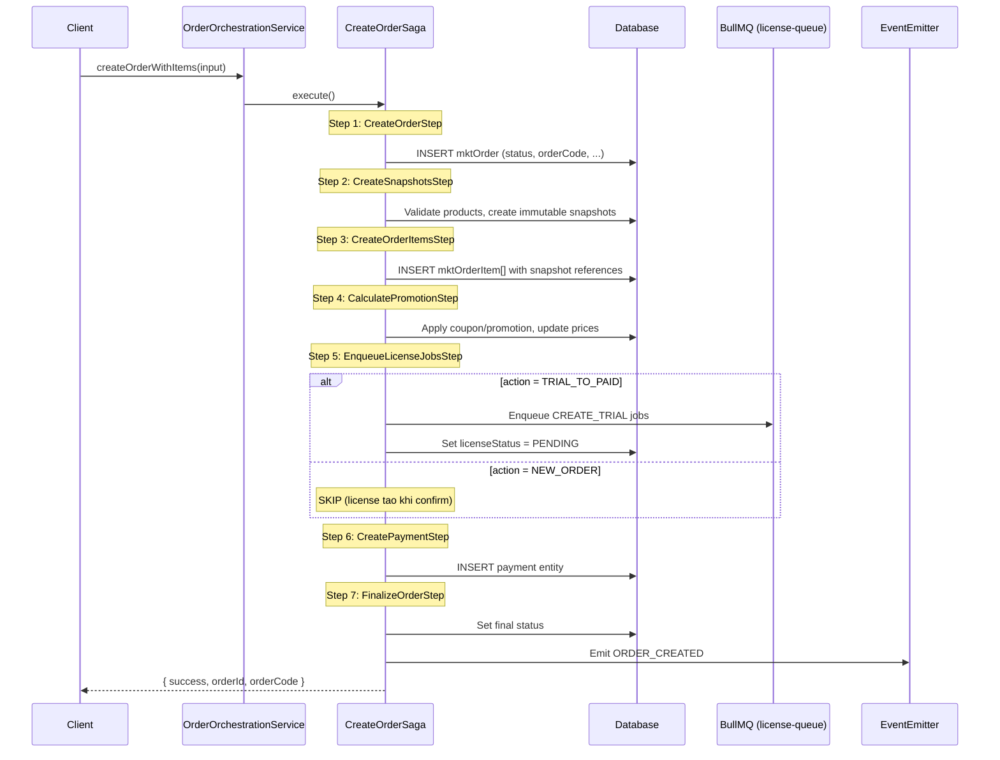

### Status sau khi tao

| isDraft | Action | Status |
|---------|--------|--------|
| `true` | bat ky | `DRAFT` |
| `false` | `NEW_ORDER` | `PENDING_PAYMENT` |
| `false` | `TRIAL_TO_PAID` | `TRIAL` (voi license trial) |

### License behavior

| Action | License luc tao | License luc confirm |
|--------|----------------|-------------------|
| `NEW_ORDER` | Khong tao | `CREATE_OFFICIAL` |
| `TRIAL_TO_PAID` | `CREATE_TRIAL` (async) | `UPGRADE` trial → official |
| `LICENSE_RENEWING` | Khong tao | Renew existing |
| `CHANGE_VARIANT` | Khong tao | Change package |

---

## Flow 2: Xac nhan don hang (ConfirmOrderSaga)

### Entry Point

```graphql
mutation {
  confirmOrderWithLicense(input: {
    orderId: "..."
    action: CONFIRM_ORDER
  }) {
    success orderId newStatus
  }
}
```

### Cac buoc (Saga Steps)

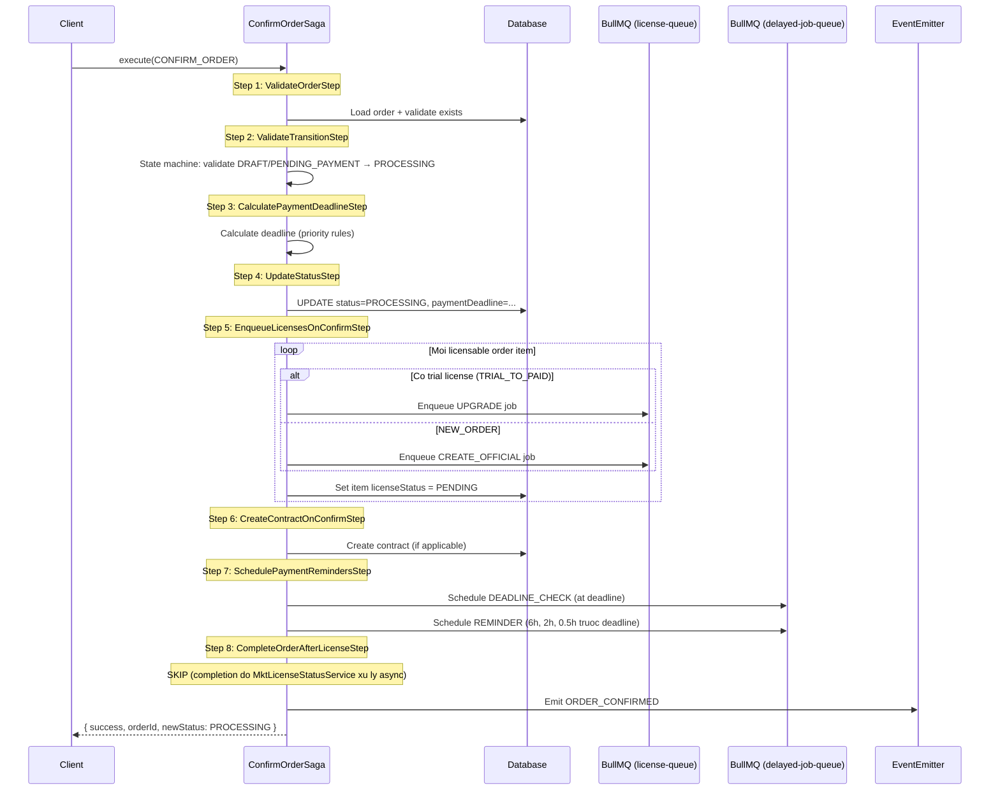

### Payment Deadline - Thu tu uu tien

| # | Nguon | Mo ta |
|---|-------|-------|
| 1 | MANUAL | Nguoi dung truyen truc tiep `paymentDeadlineHours` |
| 2 | RESELLER_TIER | Cau hinh theo tier cua reseller |
| 3 | CUSTOMER_TYPE | Cau hinh theo loai khach hang |
| 4 | PRODUCT | Cau hinh theo san pham |
| 5 | GLOBAL | Mac dinh: 24 gio |

### Delayed Jobs duoc schedule

| Job | Thoi diem | Queue |
|-----|-----------|-------|
| `DEADLINE_CHECK` | Dung luc deadline | `mkt-delayed-job-queue` (PAYMENT_DEADLINE) |
| `REMINDER` (6h) | 6h truoc deadline | `mkt-delayed-job-queue` (PAYMENT_REMINDER) |
| `REMINDER` (2h) | 2h truoc deadline | `mkt-delayed-job-queue` (PAYMENT_REMINDER) |
| `REMINDER` (30min) | 30 phut truoc deadline | `mkt-delayed-job-queue` (PAYMENT_REMINDER) |

---

## Flow 3: Xac nhan thanh toan (Payment Confirmed)

### Entry Point

```graphql
mutation {
  confirmOrderPayment(input: {
    orderId: "..."
    action: PAYMENT_CONFIRMED
    paymentAmount: 149000
  }) {
    success orderId
  }
}
```

### Flow

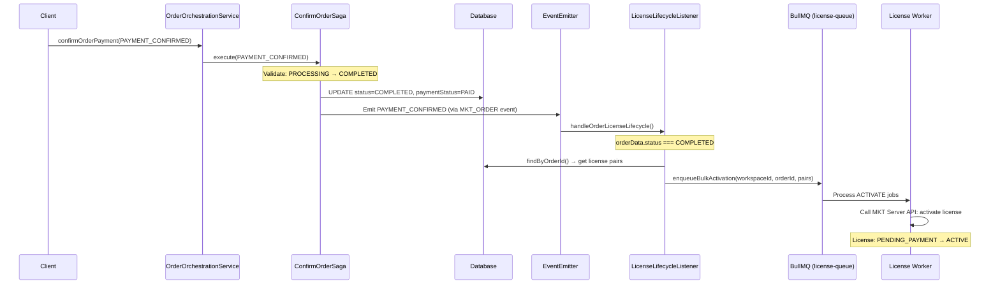

### Status transition

```
PROCESSING → COMPLETED
```

### Async jobs

- `LicenseLifecycleListener` bat event `PAYMENT_CONFIRMED`
- Enqueue `ACTIVATE` jobs cho tat ca licenses cua order
- Worker goi MKT Server API de activate tung license

---

## Flow 4: Qua han thanh toan (Payment Overdue → Lock)

### Co che kep (Dual mechanism)

```
                    ┌──────────────────────┐
                    │   Order PROCESSING    │
                    │   + paymentDeadline   │
                    └──────────┬───────────┘
                               │
              ┌────────────────┼────────────────┐
              │                │                 │
     ┌────────▼───────┐  ┌────▼──────────┐  ┌──▼──────────────┐
     │ Delayed Job     │  │ Cron Scan     │  │ Reminders       │
     │ (chinh)         │  │ (backup)      │  │ (thong bao)     │
     │                 │  │               │  │                  │
     │ DEADLINE_CHECK  │  │ Moi 5 phut   │  │ 6h, 2h, 30min  │
     │ fire dung luc   │  │ quet tat ca  │  │ truoc deadline  │
     │ deadline        │  │ overdue       │  │                  │
     └────────┬────────┘  └──────┬────────┘  └────────┬────────┘
              │                   │                     │
              ▼                   ▼                     ▼
     OrderLockService     OrderLockService      TODO: Notification
     .lockLicenses()      .lockLicenses()       Service
              │                   │
              ▼                   ▼
     ┌────────────────────────────────┐
     │  1. Enqueue REVOKE jobs       │
     │  2. Update status → LOCKED    │
     │  3. Set lockedAt, lockedReason│
     └────────────────────────────────┘
```

### Delayed Job Flow (PaymentDeadlineProcessor)

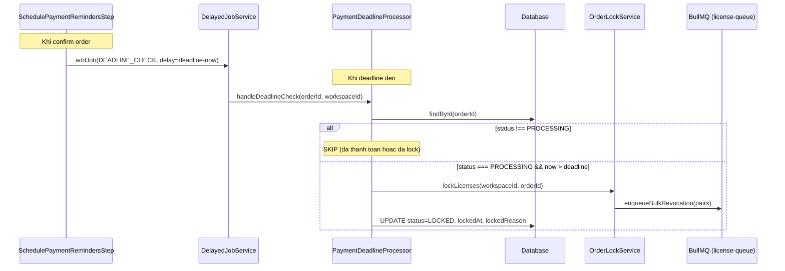

### Cron Scan Flow (PaymentOverdueScanJob)

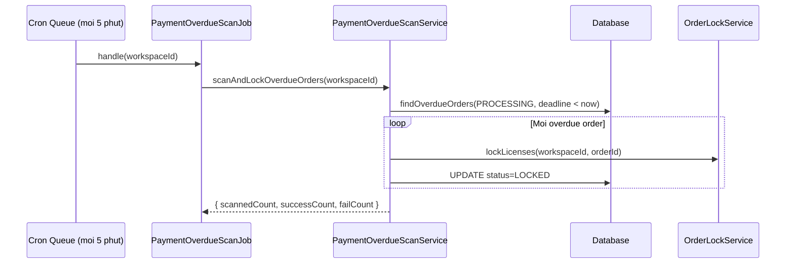

---

## Flow 5: Mo khoa sau thanh toan muon (Unlock)

### Entry Point

```graphql
mutation {
  unlockOrderAfterPayment(input: {
    orderId: "..."
    paymentAmount: 149000
  }) {
    success orderId
  }
}
```

### Flow

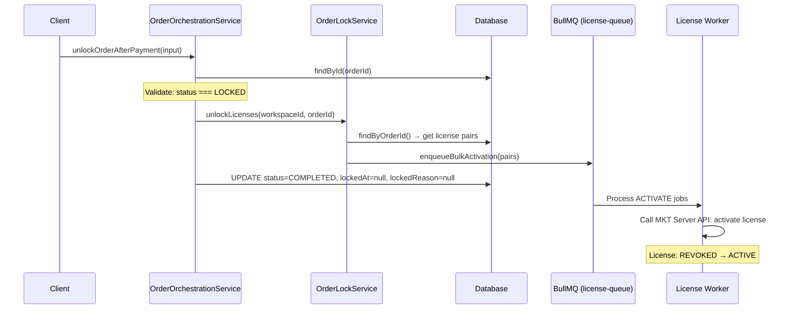

### Status transition

```
LOCKED → COMPLETED
```

---

## Flow 6: Hoan tien (RefundOrderSaga)

### Entry Point

```graphql
mutation {
  refundOrder(input: {
    orderId: "..."
    refundAmount: 100000
    reason: "Khach yeu cau hoan tien"
    isPartial: false            # true → REFUND_PARTIAL, false → REFUND
  }) {
    success orderId refundedAmount newStatus
  }
}
```

### Flow

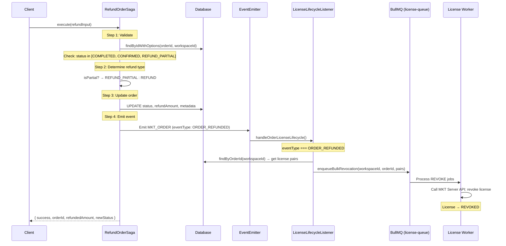

### Status transition

```
COMPLETED → REFUND (hoan toan bo)
COMPLETED → REFUND_PARTIAL (hoan mot phan)
CONFIRMED → REFUND
REFUND_PARTIAL → REFUND (hoan tiep phan con lai)
```

---

## Flow 7: Xac nhan thanh toan boi Sale / Ke toan

### Entry Points

```graphql
# Sale xac nhan
mutation { confirmPaymentBySale(input: { orderId: "..." }) { ... } }

# Ke toan xac nhan
mutation { confirmPaymentByAccounting(input: { orderId: "...", paymentAmount: 149000 }) { ... } }

# Thu hoi xac nhan
mutation { revokePaymentConfirmation(input: { orderId: "...", type: SALE }) { ... } }
```

### Flow

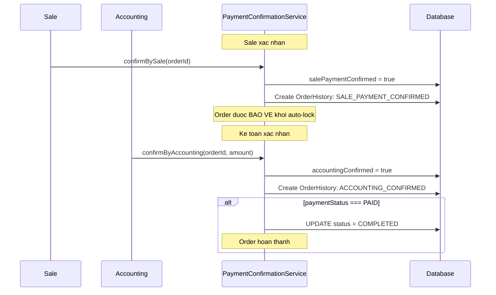

### Quy tac bao ve

- Neu `salePaymentConfirmed = true` HOAC `accountingConfirmed = true` → Order **KHONG bi auto-lock** du qua deadline
- Thu hoi xac nhan cua Sale khi Ke toan da xac nhan → **KHONG cho phep**
- Thu hoi khi da qua deadline → Canh bao `willBeLocked = true`

---

## License Lifecycle (Vong doi License)

### Job Types va Config

| Job Type | Attempts | Backoff | Timeout | Trigger |
|----------|----------|---------|---------|---------|
| `CREATE_TRIAL` | 5 | Exponential: 2s → 32s | 30s | CreateOrderSaga (TRIAL_TO_PAID) |
| `CREATE_OFFICIAL` | 5 | Exponential: 2s → 32s | 30s | ConfirmOrderSaga (CONFIRM_ORDER) |
| `UPGRADE` | 5 | Exponential: 2s → 32s | 30s | ConfirmOrderSaga (TRIAL_TO_PAID) |
| `ACTIVATE` | 10 | Exponential: 1s → ... | 15s | LicenseLifecycleListener (COMPLETED) |
| `REVOKE` | 3 | Fixed: 5s | 15s | OrderLockService / Refund Listener |

### Idempotency

- Job ID: `{action}-{orderItemId}-{licenseId}` (deterministic)
- Processor kiem tra trang thai license truoc khi xu ly
- Duplicate jobs bi BullMQ tu dong loai bo

### License Status Flow

```
                    CREATE_TRIAL
                         |
                         v
            ┌──── TRIAL ─────┐
            │                  │
            │    UPGRADE       │
            v                  v
     CREATE_OFFICIAL     PENDING_PAYMENT
            |                  |
            v                  |
     PENDING_PAYMENT ─────────┘
            |
            |  ACTIVATE (payment confirmed)
            v
         ACTIVE
            |
            |  REVOKE (lock/refund)
            v
         REVOKED
            |
            |  ACTIVATE (unlock after late payment)
            v
         ACTIVE
```

---

## Event System

### Event Flow

```
OrderEventService.emitOrderEvent()
  → workspaceEventEmitter.emitCustomBatchEvent(MKT_EVENT_TYPE.MKT_ORDER, events, workspaceId)
    → @OnEvent(MKT_EVENT_TYPE.MKT_ORDER)
      ├── MktOrderCustomEventListener (order history, customer tier update)
      └── LicenseLifecycleListener (license activate/revoke)
```

### Event Types

| Event Name | Event Type | Trigger | Listener Action |
|-----------|-----------|---------|----------------|
| `MKT_ORDER` | `ORDER_CREATED` | CreateOrderSaga | Log, history |
| `MKT_ORDER` | `ORDER_CONFIRMED` | ConfirmOrderSaga (CONFIRM_ORDER) | Log, history |
| `MKT_ORDER` | `PAYMENT_CONFIRMED` | ConfirmOrderSaga (PAYMENT_CONFIRMED) | **Activate licenses** |
| `MKT_ORDER` | `ORDER_REFUNDED` | RefundOrderSaga | **Revoke licenses** |
| `MKT_ORDER` | `ORDER_UPDATED` | UpdateOrderSaga | Log, history |
| `MKT_ORDER` | `ORDER_LOCKED` | OrderLockService | Log, history |

---

## Async Processing - Tong hop

### Queues

| Queue | Technology | Muc dich |
|-------|-----------|---------|
| `license-queue` | Twenty MessageQueueService (BullMQ) | License create/activate/revoke/upgrade |
| `mkt-delayed-job-queue` (PAYMENT_DEADLINE) | DelayedJobService (BullMQ direct) | Deadline check jobs |
| `mkt-delayed-job-queue` (PAYMENT_REMINDER) | DelayedJobService (BullMQ direct) | Payment reminders |
| `cron-queue` | Twenty MessageQueueService (BullMQ) | PaymentOverdueScanJob (moi 5 phut) |

### Workers

| Worker | Queue | Concurrency |
|--------|-------|-------------|
| `MktLicenseJobProcessor` | `license-queue` | 5 |
| `PaymentDeadlineProcessor` (deadline) | `PAYMENT_DEADLINE` | 5 |
| `PaymentDeadlineProcessor` (reminder) | `PAYMENT_REMINDER` | 10 |
| `PaymentOverdueScanJob` | `cron-queue` | 1 (cron) |

---

## Full Order Lifecycle - Happy Path

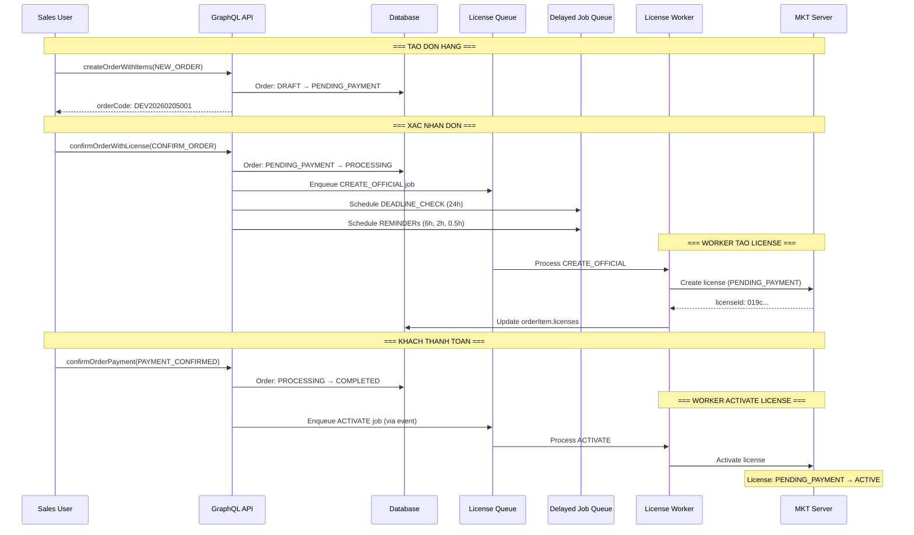

## Full Order Lifecycle - Overdue Path

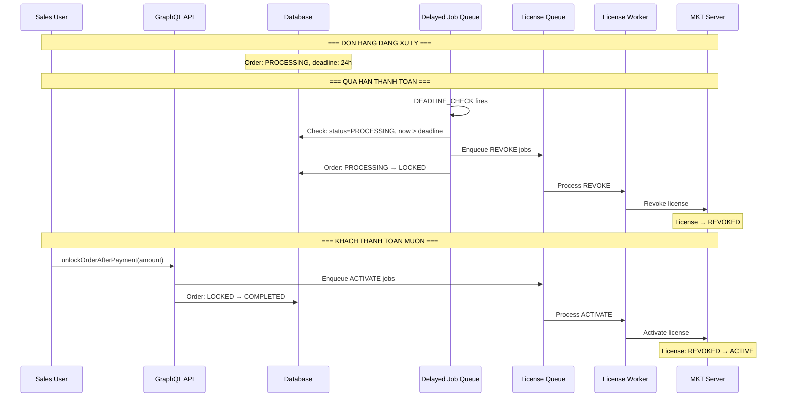

## Full Order Lifecycle - Refund Path

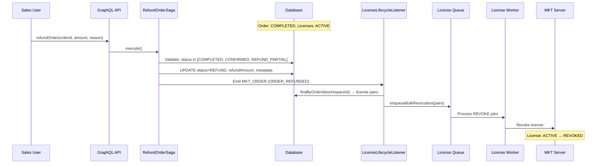

---

## GraphQL Mutations - Tong hop

| Mutation | Saga/Service | Input chinh | Output |
|----------|-------------|-------------|--------|
| `createOrderWithItems` | CreateOrderSaga | action, customerId, items[], isDraft | success, orderId, orderCode |
| `confirmOrderWithLicense` | ConfirmOrderSaga | orderId, action=CONFIRM_ORDER | success, orderId, newStatus |
| `confirmOrderPayment` | ConfirmOrderSaga | orderId, action=PAYMENT_CONFIRMED, paymentAmount | success, orderId |
| `updateOrderStatus` | UpdateOrderSaga | orderId, status, action | success, orderId |
| `refundOrder` | RefundOrderSaga | orderId, refundAmount, reason, isPartial | success, orderId, refundedAmount, newStatus |
| `unlockOrderAfterPayment` | OrderOrchestrationService | orderId, paymentAmount | success, orderId |
| `publishDraftOrder` | OrderOrchestrationService | orderId | success, orderId |
| `confirmPaymentBySale` | PaymentConfirmationService | orderId | success |
| `confirmPaymentByAccounting` | PaymentConfirmationService | orderId, paymentAmount | success |
| `revokePaymentConfirmation` | PaymentConfirmationService | orderId, type | success |

---

## Compensate (Rollback) Strategy

| Saga | Compensate Action |
|------|-------------------|
| CreateOrderSaga | Reset licenseStatus = NOT_APPLICABLE; orphaned BullMQ jobs handled by idempotency |
| ConfirmOrderSaga | Reset licenseStatus = NOT_APPLICABLE; delayed jobs auto-skip khi status thay doi |
| UpdateOrderSaga | Khong co compensate (side effects toi thieu) |
| RefundOrderSaga | Khong co compensate (reverse bang refund rieng) |

---

## Cau hinh (Environment Variables)

| Variable | Default | Mo ta |
|----------|---------|-------|
| `MKT_ORDER_CRON_ENABLED` | `true` | Enable/disable order cron jobs |
| `PAYMENT_OVERDUE_SCAN_CONFIG.CRON_PATTERN` | `0 */5 * * * *` | Tan suat quet overdue |
| `PAYMENT_DEADLINE_CONFIG.DEFAULT_HOURS` | `24` | Deadline thanh toan mac dinh |
| `PAYMENT_DEADLINE_CONFIG.REMINDER_SCHEDULE` | `[6, 2, 0.5]` | Thoi diem nhac nho (gio truoc deadline) |
