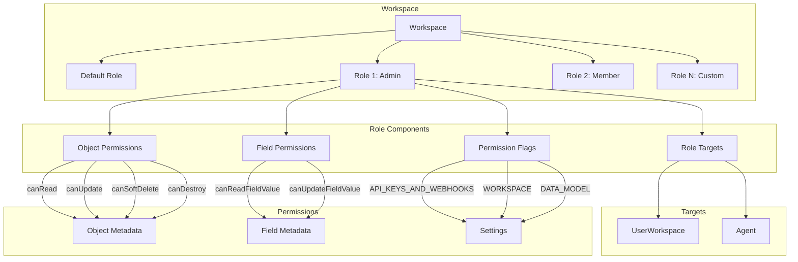
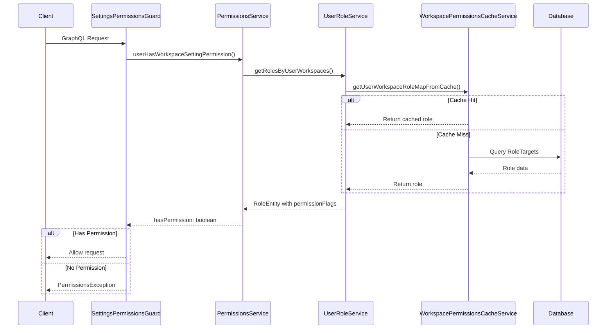
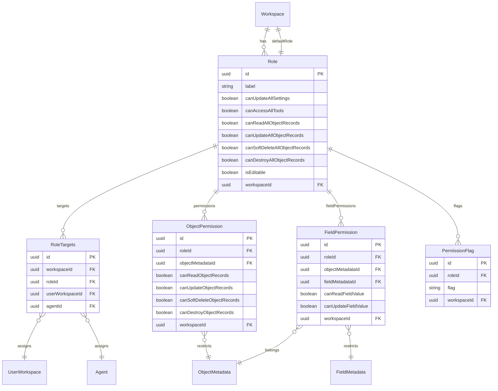
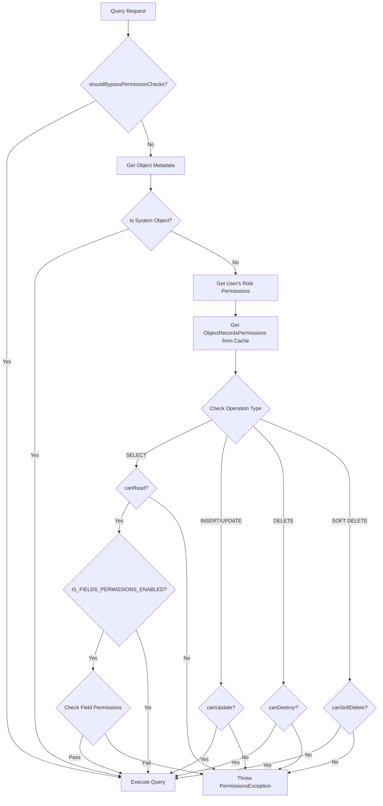
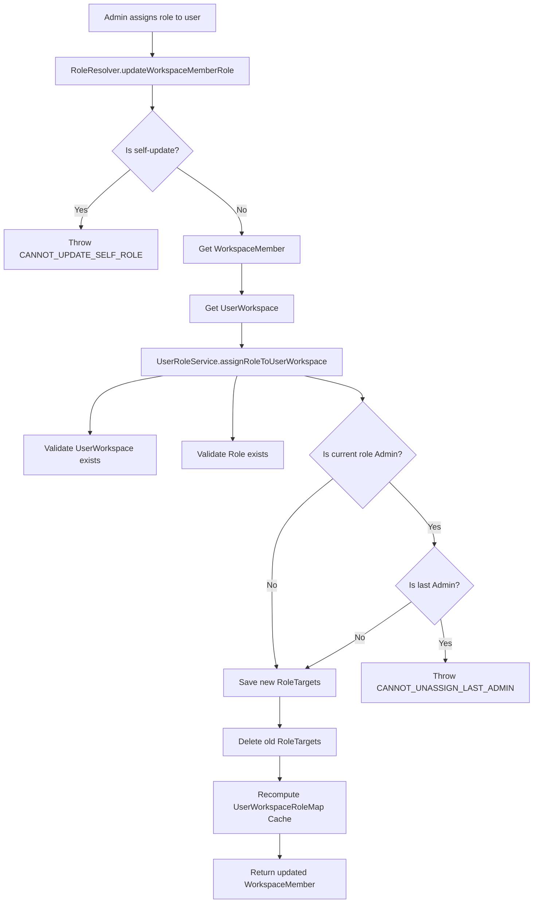
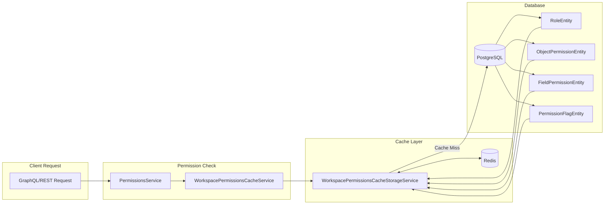

# Twenty CRM Default Permission System

## 1. Tong Quan He Thong Phan Quyen

Twenty CRM su dung he thong phan quyen dua tren **Role-Based Access Control (RBAC)** voi cac dac diem chinh:

- **Workspace-level Permissions**: Moi workspace co cac roles va permissions rieng biet
- **Object-level Permissions**: Phan quyen theo tung object metadata (Person, Company, etc.)
- **Field-level Permissions**: Phan quyen theo tung field cua object (feature flag)
- **Settings Permissions**: Phan quyen truy cap cac cai dat he thong
- **Tool Permissions**: Phan quyen su dung cac cong cu nhu CSV import/export, Send Email

### 1.1 Mo Hinh Phan Quyen Tong The



## 2. Kien Truc va Components

### 2.1 Core Modules

| Module | Mo Ta | Vi Tri |
|--------|-------|--------|
| `permissions` | Cung cap PermissionsService, exception handling | `engine/metadata-modules/permissions/` |
| `role` | Quan ly roles (CRUD, validation) | `engine/metadata-modules/role/` |
| `user-role` | Gan role cho user workspace | `engine/metadata-modules/user-role/` |
| `object-permission` | Quan ly permissions theo object | `engine/metadata-modules/object-permission/` |
| `field-permission` | Quan ly permissions theo field | `engine/metadata-modules/object-permission/field-permission/` |
| `permission-flag` | Quan ly settings/tool permissions | `engine/metadata-modules/permission-flag/` |
| `workspace-permissions-cache` | Cache permissions de toi uu performance | `engine/metadata-modules/workspace-permissions-cache/` |

### 2.2 Guards va Middleware

| Guard | Chuc Nang | Su Dung |
|-------|-----------|---------|
| `SettingsPermissionsGuard` | Kiem tra quyen truy cap settings | GraphQL resolvers cho settings |
| `WorkspaceAuthGuard` | Xac thuc workspace | Tat ca endpoints |
| `UserAuthGuard` | Xac thuc user | User-specific operations |
| `FeatureFlagGuard` | Kiem tra feature flag | Tinh nang thi nghiem |

### 2.3 Flow Kiem Tra Quyen



## 3. Data Models (Entities)

### 3.1 RoleEntity

```typescript
// packages/twenty-server/src/engine/metadata-modules/role/role.entity.ts

@Entity('role')
export class RoleEntity {
  @PrimaryGeneratedColumn('uuid')
  id: string;

  @Column({ nullable: false })
  label: string;  // 'Admin', 'Member', 'Guest', etc.

  // Global Object Permissions
  @Column({ nullable: false, default: false })
  canUpdateAllSettings: boolean;

  @Column({ nullable: false, default: false })
  canAccessAllTools: boolean;

  @Column({ nullable: false, default: false })
  canReadAllObjectRecords: boolean;

  @Column({ nullable: false, default: false })
  canUpdateAllObjectRecords: boolean;

  @Column({ nullable: false, default: false })
  canSoftDeleteAllObjectRecords: boolean;

  @Column({ nullable: false, default: false })
  canDestroyAllObjectRecords: boolean;

  @Column({ nullable: false, default: true })
  isEditable: boolean;

  @Column({ nullable: false, type: 'uuid' })
  workspaceId: string;

  // Relations
  @OneToMany(() => RoleTargetsEntity, ...)
  roleTargets: Relation<RoleTargetsEntity[]>;

  @OneToMany(() => ObjectPermissionEntity, ...)
  objectPermissions: Relation<ObjectPermissionEntity[]>;

  @OneToMany(() => PermissionFlagEntity, ...)
  permissionFlags: Relation<PermissionFlagEntity[]>;

  @OneToMany(() => FieldPermissionEntity, ...)
  fieldPermissions: Relation<FieldPermissionEntity[]>;
}
```

### 3.2 ObjectPermissionEntity

```typescript
// packages/twenty-server/src/engine/metadata-modules/object-permission/object-permission.entity.ts

@Entity('objectPermission')
export class ObjectPermissionEntity {
  @PrimaryGeneratedColumn('uuid')
  id: string;

  @Column({ nullable: false, type: 'uuid' })
  roleId: string;

  @Column({ nullable: false, type: 'uuid' })
  objectMetadataId: string;

  // Permissions Override (null = inherit from role)
  @Column({ nullable: true, type: 'boolean' })
  canReadObjectRecords?: boolean;

  @Column({ nullable: true, type: 'boolean' })
  canUpdateObjectRecords?: boolean;

  @Column({ nullable: true, type: 'boolean' })
  canSoftDeleteObjectRecords?: boolean;

  @Column({ nullable: true, type: 'boolean' })
  canDestroyObjectRecords?: boolean;

  @Column({ nullable: false, type: 'uuid' })
  workspaceId: string;
}
```

### 3.3 FieldPermissionEntity

```typescript
// packages/twenty-server/src/engine/metadata-modules/object-permission/field-permission/field-permission.entity.ts

@Entity('fieldPermission')
export class FieldPermissionEntity {
  @PrimaryGeneratedColumn('uuid')
  id: string;

  @Column({ nullable: false, type: 'uuid' })
  roleId: string;

  @Column({ nullable: false, type: 'uuid' })
  objectMetadataId: string;

  @Column({ nullable: false, type: 'uuid' })
  fieldMetadataId: string;

  // Chi cho phep restrict (false/null), khong cho phep grant them
  @Column({ nullable: true, type: 'boolean' })
  canReadFieldValue?: boolean | null;

  @Column({ nullable: true, type: 'boolean' })
  canUpdateFieldValue?: boolean | null;

  @Column({ nullable: false, type: 'uuid' })
  workspaceId: string;
}
```

### 3.4 PermissionFlagEntity

```typescript
// packages/twenty-server/src/engine/metadata-modules/permission-flag/permission-flag.entity.ts

@Entity('permissionFlag')
export class PermissionFlagEntity {
  @PrimaryGeneratedColumn('uuid')
  id: string;

  @Column({ nullable: false, type: 'uuid' })
  roleId: string;

  @Column({ nullable: false, type: 'varchar' })
  flag: PermissionFlagType;  // 'API_KEYS_AND_WEBHOOKS', 'WORKSPACE', etc.

  @Column({ nullable: false, type: 'uuid' })
  workspaceId: string;
}
```

### 3.5 RoleTargetsEntity

```typescript
// packages/twenty-server/src/engine/metadata-modules/role/role-targets.entity.ts

@Entity('roleTargets')
export class RoleTargetsEntity {
  @PrimaryGeneratedColumn('uuid')
  id: string;

  @Column({ nullable: false, type: 'uuid' })
  workspaceId: string;

  @Column({ nullable: false, type: 'uuid' })
  roleId: string;

  // Chi 1 trong 2 duoc set (XOR constraint)
  @Column({ nullable: true, type: 'uuid' })
  userWorkspaceId: string;

  @Column({ nullable: true, type: 'uuid' })
  agentId: string;
}
```

### 3.6 Entity Relationship Diagram



## 4. Roles va Permissions Mac Dinh

### 4.1 Default Roles

| Role | Label | isEditable | Tao Boi |
|------|-------|------------|---------|
| Admin | `Admin` | false | `WorkspaceManagerService.initPermissions()` |
| Member | `Member` | true | `WorkspaceManagerService.initPermissions()` |
| Guest | `Guest` | false | Dev seeding only |

### 4.2 Admin Role Permissions

```typescript
// packages/twenty-server/src/engine/metadata-modules/role/role.service.ts

async createAdminRole({ workspaceId }) {
  return this.roleRepository.save({
    label: 'Admin',           // ADMIN_ROLE_LABEL
    description: 'Admin role',
    icon: 'IconUserCog',
    canUpdateAllSettings: true,        // Full settings access
    canAccessAllTools: true,           // All tools
    canReadAllObjectRecords: true,     // Read all objects
    canUpdateAllObjectRecords: true,   // Update all objects
    canSoftDeleteAllObjectRecords: true,
    canDestroyAllObjectRecords: true,
    isEditable: false,                 // Cannot be modified
    workspaceId,
  });
}
```

### 4.3 Member Role Permissions

```typescript
async createMemberRole({ workspaceId }) {
  return this.roleRepository.save({
    label: 'Member',          // MEMBER_ROLE_LABEL
    description: 'Member role',
    icon: 'IconUser',
    canUpdateAllSettings: false,       // No settings access
    canAccessAllTools: false,          // No tools by default
    canReadAllObjectRecords: true,     // Read all objects
    canUpdateAllObjectRecords: true,   // Update all objects
    canSoftDeleteAllObjectRecords: true,
    canDestroyAllObjectRecords: true,
    isEditable: true,                  // Can be customized
    workspaceId,
  });
}
```

### 4.4 Guest Role Permissions (Dev Only)

```typescript
async createGuestRole({ workspaceId }) {
  return this.roleRepository.save({
    label: 'Guest',
    description: 'Guest role',
    icon: 'IconUser',
    canUpdateAllSettings: false,
    canAccessAllTools: false,
    canReadAllObjectRecords: true,     // Read only
    canUpdateAllObjectRecords: false,
    canSoftDeleteAllObjectRecords: false,
    canDestroyAllObjectRecords: false,
    isEditable: false,
    workspaceId,
  });
}
```

### 4.5 Permission Flags (Settings/Tools)

```typescript
// packages/twenty-server/src/engine/metadata-modules/permissions/constants/permission-flag-type.constants.ts

export enum PermissionFlagType {
  // Settings permissions (kiem tra qua canUpdateAllSettings)
  API_KEYS_AND_WEBHOOKS = 'API_KEYS_AND_WEBHOOKS',
  WORKSPACE = 'WORKSPACE',
  WORKSPACE_MEMBERS = 'WORKSPACE_MEMBERS',
  ROLES = 'ROLES',
  DATA_MODEL = 'DATA_MODEL',
  ADMIN_PANEL = 'ADMIN_PANEL',
  SECURITY = 'SECURITY',
  WORKFLOWS = 'WORKFLOWS',

  // Tool permissions (kiem tra qua canAccessAllTools)
  SEND_EMAIL_TOOL = 'SEND_EMAIL_TOOL',
  IMPORT_CSV = 'IMPORT_CSV',
  EXPORT_CSV = 'EXPORT_CSV',
}
```

### 4.6 Object Records Permissions

```typescript
// packages/twenty-shared/src/constants/PermissionsOnAllObjectRecords.ts

export enum PermissionsOnAllObjectRecords {
  READ_ALL_OBJECT_RECORDS = 'READ_ALL_OBJECT_RECORDS',
  UPDATE_ALL_OBJECT_RECORDS = 'UPDATE_ALL_OBJECT_RECORDS',
  SOFT_DELETE_ALL_OBJECT_RECORDS = 'SOFT_DELETE_ALL_OBJECT_RECORDS',
  DESTROY_ALL_OBJECT_RECORDS = 'DESTROY_ALL_OBJECT_RECORDS',
}
```

### 4.7 Permission Matrix

| Permission | Admin | Member | Guest |
|------------|-------|--------|-------|
| canUpdateAllSettings | Yes | No | No |
| canAccessAllTools | Yes | No | No |
| canReadAllObjectRecords | Yes | Yes | Yes |
| canUpdateAllObjectRecords | Yes | Yes | No |
| canSoftDeleteAllObjectRecords | Yes | Yes | No |
| canDestroyAllObjectRecords | Yes | Yes | No |
| isEditable | No | Yes | No |

## 5. Permission Enforcement

### 5.1 Settings Permissions Guard

```typescript
// packages/twenty-server/src/engine/guards/settings-permissions.guard.ts

export const SettingsPermissionsGuard = (
  requiredPermission: PermissionFlagType,
): Type<CanActivate> => {
  @Injectable()
  class SettingsPermissionsMixin implements CanActivate {
    constructor(private readonly permissionsService: PermissionsService) {}

    async canActivate(context: ExecutionContext): Promise<boolean> {
      const ctx = GqlExecutionContext.create(context);
      const workspaceId = ctx.getContext().req.workspace.id;
      const userWorkspaceId = ctx.getContext().req.userWorkspaceId;

      // Bypass cho workspace dang tao
      if ([WorkspaceActivationStatus.PENDING_CREATION,
           WorkspaceActivationStatus.ONGOING_CREATION].includes(...)) {
        return true;
      }

      const hasPermission = await this.permissionsService
        .userHasWorkspaceSettingPermission({
          userWorkspaceId,
          setting: requiredPermission,
          workspaceId,
          isExecutedByApiKey: isDefined(ctx.getContext().req.apiKey),
        });

      if (!hasPermission) {
        throw new PermissionsException(
          PermissionsExceptionMessage.PERMISSION_DENIED,
          PermissionsExceptionCode.PERMISSION_DENIED,
        );
      }

      return true;
    }
  }

  return mixin(SettingsPermissionsMixin);
};
```

### 5.2 Usage in Resolvers

```typescript
// packages/twenty-server/src/engine/metadata-modules/role/role.resolver.ts

@Resolver(() => RoleDTO)
@UseGuards(
  WorkspaceAuthGuard,
  SettingsPermissionsGuard(PermissionFlagType.ROLES),  // Yeu cau quyen ROLES
)
export class RoleResolver {
  @Query(() => [RoleDTO])
  async getRoles(@AuthWorkspace() workspace: Workspace): Promise<RoleDTO[]> {
    return this.roleService.getWorkspaceRoles(workspace.id);
  }

  @Mutation(() => RoleDTO)
  async createOneRole(...) { ... }
}
```

### 5.3 Object Records Permission Validation

```typescript
// packages/twenty-server/src/engine/twenty-orm/repository/permissions.utils.ts

export const validateOperationIsPermittedOrThrow = ({
  entityName,
  operationType,
  objectRecordsPermissions,
  objectMetadataMaps,
  selectedColumns,
  isFieldPermissionsEnabled,
  allFieldsSelected,
}: { ... }) => {
  // Tim object metadata ID
  const objectMetadataIdForEntity = objectMetadataMaps.idByNameSingular[entityName];
  const objectMetadata = objectMetadataMaps.byId[objectMetadataIdForEntity];

  // System objects duoc bypass
  if (objectMetadata.isSystem === true) {
    return;
  }

  const permissionsForEntity = objectRecordsPermissions[objectMetadataIdForEntity];

  switch (operationType) {
    case 'select':
      if (!permissionsForEntity?.canRead) {
        throw new PermissionsException(...);
      }
      // Kiem tra field permissions neu enabled
      if (isFieldPermissionsEnabled) {
        validateReadFieldPermissionOrThrow({ ... });
      }
      break;

    case 'insert':
    case 'update':
      if (!permissionsForEntity?.canUpdate) {
        throw new PermissionsException(...);
      }
      break;

    case 'delete':
      if (!permissionsForEntity?.canDestroy) {
        throw new PermissionsException(...);
      }
      break;

    case 'soft-delete':
    case 'restore':
      if (!permissionsForEntity?.canSoftDelete) {
        throw new PermissionsException(...);
      }
      break;
  }
};
```

### 5.4 Query Builder Integration

```typescript
// packages/twenty-server/src/engine/twenty-orm/repository/workspace-select-query-builder.ts

export class WorkspaceSelectQueryBuilder<T> extends SelectQueryBuilder<T> {
  objectRecordsPermissions: ObjectRecordsPermissions;
  shouldBypassPermissionChecks: boolean;

  override async getMany(): Promise<T[]> {
    this.validatePermissions();  // Kiem tra truoc khi execute
    // ...
  }

  override async getOne(): Promise<T | null> {
    this.validatePermissions();
    // ...
  }

  private validatePermissions(): void {
    const isFieldPermissionsEnabled =
      this.featureFlagMap?.[FeatureFlagKey.IS_FIELDS_PERMISSIONS_ENABLED];

    validateQueryIsPermittedOrThrow({
      expressionMap: this.expressionMap,
      objectRecordsPermissions: this.objectRecordsPermissions,
      objectMetadataMaps: this.internalContext.objectMetadataMaps,
      shouldBypassPermissionChecks: this.shouldBypassPermissionChecks,
      isFieldPermissionsEnabled,
    });
  }
}
```

### 5.5 shouldBypassPermissionChecks

Permission checks co the bypass trong cac truong hop:

1. **System operations**: Background jobs, migrations
2. **Seeding**: Dev seeder prefills data
3. **Internal services**: Timeline activity, workflow execution
4. **API Keys**: Requests voi API key duoc bypass settings permissions

```typescript
// Vi du: Workflow execution bypass permissions
await this.twentyORMManager.getRepository<T>(
  objectMetadata,
  { shouldBypassPermissionChecks: true }  // Bypass cho workflow
);
```

## 6. Feature Flags

### 6.1 Permission-Related Feature Flags

```typescript
// packages/twenty-server/src/engine/core-modules/feature-flag/enums/feature-flag-key.enum.ts

export enum FeatureFlagKey {
  // ...
  IS_FIELDS_PERMISSIONS_ENABLED = 'IS_FIELDS_PERMISSIONS_ENABLED',
  // ...
}
```

### 6.2 IS_FIELDS_PERMISSIONS_ENABLED

Khi enabled:
- Field-level permissions duoc ap dung
- `restrictedFields` trong ObjectRecordsPermissions duoc xu ly
- UI hien thi field permission settings

```typescript
// Kiem tra trong cache service
const isFieldPermissionsEnabled =
  workspaceFeatureFlagsMap[FeatureFlagKey.IS_FIELDS_PERMISSIONS_ENABLED];

if (isFieldPermissionsEnabled) {
  // Load field permissions vao cache
  roles = await this.roleRepository.find({
    relations: ['objectPermissions', 'permissionFlags', 'fieldPermissions'],
  });
}
```

### 6.3 Enable Feature Flag

```typescript
// packages/twenty-server/src/engine/core-modules/feature-flag/services/feature-flag.service.ts

await this.featureFlagService.enableFeatureFlags(
  [FeatureFlagKey.IS_FIELDS_PERMISSIONS_ENABLED],
  workspaceId
);
```

## 7. Cach Customize/Extend Permissions

### 7.1 Tao Custom Role

```typescript
// Tao role moi voi permissions tuy chinh
const customRole = await this.roleService.createRole({
  workspaceId,
  input: {
    label: 'Sales Manager',
    description: 'Sales team manager role',
    icon: 'IconBriefcase',
    canUpdateAllSettings: false,
    canAccessAllTools: true,          // Cho phep CSV import/export
    canReadAllObjectRecords: true,
    canUpdateAllObjectRecords: true,
    canSoftDeleteAllObjectRecords: true,
    canDestroyAllObjectRecords: false, // Khong cho phep xoa vinh vien
  },
});
```

### 7.2 Override Object Permissions

```typescript
// Gioi han quyen tren object cu the
await this.objectPermissionService.upsertObjectPermissions({
  workspaceId,
  input: {
    roleId: customRole.id,
    objectPermissions: [
      {
        objectMetadataId: companyObjectId,
        canReadObjectRecords: true,
        canUpdateObjectRecords: true,
        canSoftDeleteObjectRecords: false,  // Khong cho xoa company
        canDestroyObjectRecords: false,
      },
      {
        objectMetadataId: invoiceObjectId,
        canReadObjectRecords: true,
        canUpdateObjectRecords: false,      // Chi doc invoice
        canSoftDeleteObjectRecords: false,
        canDestroyObjectRecords: false,
      },
    ],
  },
});
```

### 7.3 Add Permission Flags

```typescript
// Them settings permissions cho role
await this.permissionFlagService.upsertPermissionFlags({
  workspaceId,
  input: {
    roleId: customRole.id,
    permissionFlagKeys: [
      PermissionFlagType.EXPORT_CSV,
      PermissionFlagType.IMPORT_CSV,
    ],
  },
});
```

### 7.4 Field Permissions (Requires Feature Flag)

```typescript
// Restrict field access
await this.fieldPermissionService.upsertFieldPermissions({
  workspaceId,
  input: {
    roleId: customRole.id,
    fieldPermissions: [
      {
        objectMetadataId: personObjectId,
        fieldMetadataId: salaryFieldId,
        canReadFieldValue: false,      // An truong salary
        canUpdateFieldValue: null,
      },
    ],
  },
});
```

### 7.5 Assign Role to User

```typescript
// Gan role cho user workspace
await this.userRoleService.assignRoleToUserWorkspace({
  workspaceId,
  userWorkspaceId: targetUserWorkspace.id,
  roleId: customRole.id,
});
```

### 7.6 Set Default Role

```typescript
// Set default role cho workspace (new users get this role)
await this.workspaceRepository.update(workspaceId, {
  defaultRoleId: memberRole.id,
});
```

## 8. Files Reference

### 8.1 Core Permission Files

| File | Mo Ta |
|------|-------|
| `engine/metadata-modules/permissions/permissions.service.ts` | Main permission service |
| `engine/metadata-modules/permissions/permissions.exception.ts` | Permission exceptions |
| `engine/metadata-modules/permissions/types/user-workspace-permissions.ts` | Permission types |
| `engine/metadata-modules/permissions/constants/permission-flag-type.constants.ts` | Permission flag enum |
| `engine/metadata-modules/permissions/constants/admin-role-label.constants.ts` | Admin role constant |
| `engine/metadata-modules/permissions/constants/member-role-label.constants.ts` | Member role constant |
| `engine/metadata-modules/permissions/constants/tool-permission-flags.ts` | Tool permission list |

### 8.2 Role Management Files

| File | Mo Ta |
|------|-------|
| `engine/metadata-modules/role/role.entity.ts` | Role entity |
| `engine/metadata-modules/role/role.service.ts` | Role CRUD service |
| `engine/metadata-modules/role/role.resolver.ts` | GraphQL resolver |
| `engine/metadata-modules/role/role-targets.entity.ts` | Role assignment entity |
| `engine/metadata-modules/user-role/user-role.service.ts` | User-role mapping |

### 8.3 Object/Field Permission Files

| File | Mo Ta |
|------|-------|
| `engine/metadata-modules/object-permission/object-permission.entity.ts` | Object permission entity |
| `engine/metadata-modules/object-permission/object-permission.service.ts` | Object permission service |
| `engine/metadata-modules/object-permission/field-permission/field-permission.entity.ts` | Field permission entity |
| `engine/metadata-modules/object-permission/field-permission/field-permission.service.ts` | Field permission service |
| `engine/metadata-modules/permission-flag/permission-flag.entity.ts` | Permission flag entity |
| `engine/metadata-modules/permission-flag/permission-flag.service.ts` | Permission flag service |

### 8.4 Cache and Validation Files

| File | Mo Ta |
|------|-------|
| `engine/metadata-modules/workspace-permissions-cache/workspace-permissions-cache.service.ts` | Permission caching |
| `engine/metadata-modules/workspace-permissions-cache/workspace-permissions-cache-storage.service.ts` | Redis storage |
| `engine/twenty-orm/repository/permissions.utils.ts` | Query permission validation |
| `engine/guards/settings-permissions.guard.ts` | Settings permission guard |

### 8.5 Workspace Initialization

| File | Mo Ta |
|------|-------|
| `engine/workspace-manager/workspace-manager.service.ts` | Khoi tao permissions khi tao workspace |
| `engine/workspace-manager/dev-seeder/core/services/dev-seeder-permissions.service.ts` | Dev seeding permissions |

### 8.6 Shared Types

| File | Mo Ta |
|------|-------|
| `twenty-shared/src/constants/PermissionsOnAllObjectRecords.ts` | Permission enum |
| `twenty-shared/src/types/ObjectRecordsPermissions.ts` | Permission type |
| `twenty-shared/src/types/ObjectRecordsPermissionsByRoleId.ts` | Permissions by role |

## 9. Diagrams

### 9.1 Permission Check Flow (Object Records)



### 9.2 Role Assignment Flow



### 9.3 Permission Caching Architecture



## 10. Best Practices

### 10.1 Khi Tao Custom Role

1. **Luon set `isEditable: true`** cho custom roles de cho phep chinh sua sau
2. **Principle of Least Privilege**: Bat dau voi quyen toi thieu, them dan
3. **Test thoroughly**: Kiem tra voi tat ca operations (CRUD)

### 10.2 Object Permission Override

1. **Chi override khi can thiet**: Su dung role-level permissions khi co the
2. **Khong override system objects**: He thong tu dong bypass
3. **Consistency check**: Phai co `canRead` truoc khi cho `canUpdate/Delete`

### 10.3 Field Permissions

1. **Enable feature flag truoc**: `IS_FIELDS_PERMISSIONS_ENABLED`
2. **Chi restrict, khong grant**: Field permissions chi de han che, khong them quyen
3. **Kiem tra object permission truoc**: Object phai readable truoc khi restrict fields

### 10.4 Performance

1. **Su dung cache**: Luon goi qua cache service
2. **Recompute khi can**: Goi `recomputeRolesPermissionsCache()` sau khi thay doi
3. **Batch operations**: Gop nhieu permission changes vao 1 transaction

## 11. Troubleshooting

### 11.1 Common Errors

| Error | Nguyen Nhan | Giai Phap |
|-------|-------------|-----------|
| `NO_ROLE_FOUND_FOR_USER_WORKSPACE` | User chua duoc gan role | Gan role cho user |
| `ROLE_NOT_EDITABLE` | Sua Admin role | Tao custom role thay vi sua Admin |
| `CANNOT_UNASSIGN_LAST_ADMIN` | Co gang bo Admin cuoi | Dam bao co it nhat 2 Admin |
| `PERMISSION_DENIED` | Thieu quyen | Kiem tra role va object permissions |

### 11.2 Debug Commands

```bash
# Check user's role
SELECT rt.*, r.label
FROM "roleTargets" rt
JOIN role r ON rt."roleId" = r.id
WHERE rt."userWorkspaceId" = 'xxx';

# Check object permissions for role
SELECT op.*, om."nameSingular"
FROM "objectPermission" op
JOIN "objectMetadata" om ON op."objectMetadataId" = om.id
WHERE op."roleId" = 'xxx';

# Check permission flags
SELECT * FROM "permissionFlag" WHERE "roleId" = 'xxx';
```

## 12. References

- Twenty CRM GitHub: https://github.com/twentyhq/twenty
- NestJS Guards: https://docs.nestjs.com/guards
- TypeORM Relations: https://typeorm.io/relations
