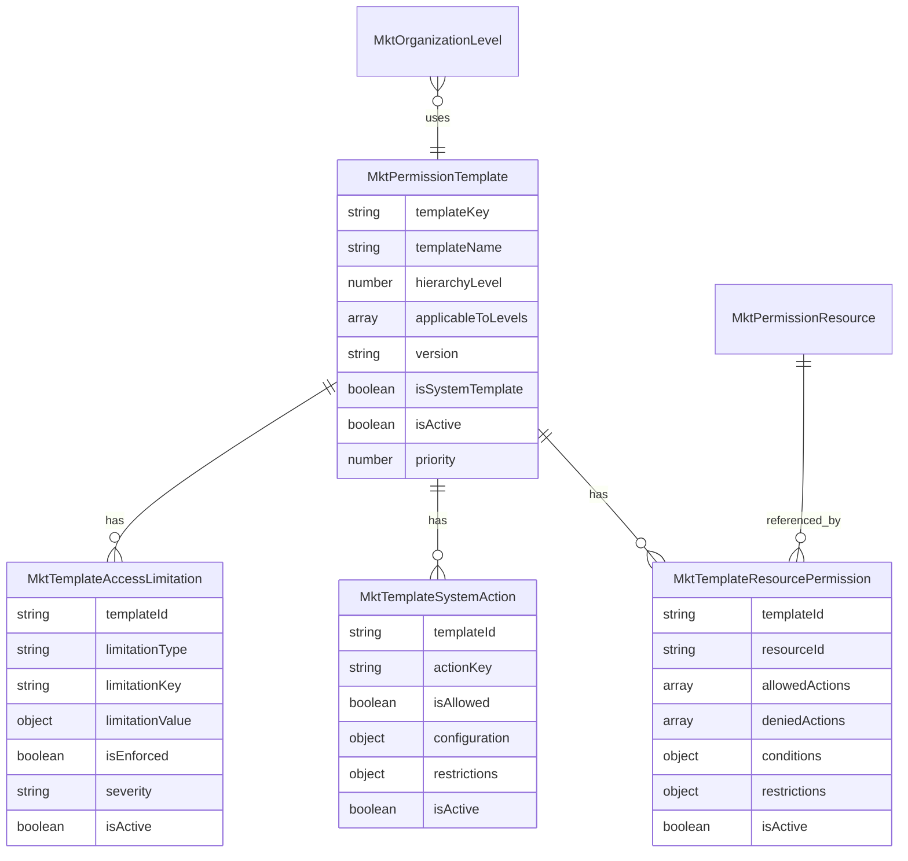

# RBAC Database Design: Dynamic Permission Templates

## 1. Tổng quan

Tài liệu này mô tả thiết kế database để lưu trữ Permission Templates động thay vì hardcode trong constants. Thiết kế này cho phép quản lý permissions qua UI, versioning, và multi-tenant support.

## 2. Kiến trúc tổng thể

### 2.1 Chuyển đổi từ Static sang Dynamic

**Hiện tại (Static):**
```typescript
// Hardcoded trong constants
export const PERMISSION_TEMPLATES = {
  CEO: {
    defaultPermissions: { ... },
    accessLimitations: { ... }
  }
}
```

**Mới (Dynamic):**
```typescript
// Stored trong database với relationships
Template -> ResourcePermissions -> Actions
Template -> SystemActions
Template -> AccessLimitations
```

### 2.2 Lợi ích chính

- **Flexibility**: Thay đổi permissions không cần deploy
- **Multi-tenant**: Mỗi workspace có templates riêng
- **Versioning**: Track changes và rollback
- **UI Management**: Quản lý qua admin interface
- **Audit Trail**: Log tất cả modifications

## 3. Database Schema

### 3.1 Core Entities

#### 3.1.1 MktPermissionTemplateWorkspaceEntity

**Bảng chính lưu trữ permission templates**

```typescript
@WorkspaceEntity({
  standardId: 'mkt-permission-template',
  namePlural: 'mktPermissionTemplates',
  labelSingular: 'Permission Template',
  labelPlural: 'Permission Templates',
  description: 'Templates defining permission sets for organization levels',
  icon: 'IconShield',
})
export class MktPermissionTemplateWorkspaceEntity extends BaseWorkspaceEntity {
  // Template identification
  @WorkspaceField({
    type: FieldMetadataType.TEXT,
    label: 'Template Key',
    description: 'Unique identifier for template (CEO, VP, DIRECTOR, etc.)',
  })
  templateKey: string;

  @WorkspaceField({
    type: FieldMetadataType.TEXT,
    label: 'Template Name',
    description: 'Human-readable name (Chief Executive Officer)',
  })
  templateName: string;

  @WorkspaceField({
    type: FieldMetadataType.TEXT,
    label: 'Description',
    description: 'Detailed description of template purpose',
  })
  description: string;

  // Hierarchy mapping
  @WorkspaceField({
    type: FieldMetadataType.NUMBER,
    label: 'Primary Hierarchy Level',
    description: 'Primary hierarchy level this template applies to',
  })
  hierarchyLevel: number;

  @WorkspaceField({
    type: FieldMetadataType.RAW_JSON,
    label: 'Applicable Levels',
    description: 'Array of hierarchy levels this template can apply to',
  })
  applicableToLevels: number[];

  // Template metadata
  @WorkspaceField({
    type: FieldMetadataType.TEXT,
    label: 'Version',
    description: 'Template version for change tracking',
    defaultValue: '1.0.0',
  })
  version: string;

  @WorkspaceField({
    type: FieldMetadataType.BOOLEAN,
    label: 'Is System Template',
    description: 'Whether this is a built-in system template',
    defaultValue: false,
  })
  isSystemTemplate: boolean;

  @WorkspaceField({
    type: FieldMetadataType.BOOLEAN,
    label: 'Is Active',
    description: 'Whether template is currently active',
    defaultValue: true,
  })
  isActive: boolean;

  @WorkspaceField({
    type: FieldMetadataType.NUMBER,
    label: 'Priority',
    description: 'Priority for template resolution conflicts',
    defaultValue: 100,
  })
  priority: number;

  // Audit fields
  @WorkspaceField({
    type: FieldMetadataType.SELECT,
    label: 'Created By Source',
    description: 'Source that created this template',
    options: [
      { value: 'SYSTEM', label: 'System' },
      { value: 'ADMIN', label: 'Admin' },
      { value: 'USER', label: 'User' },
    ],
    defaultValue: 'ADMIN',
  })
  createdBySource: string;

  @WorkspaceField({
    type: FieldMetadataType.TEXT,
    label: 'Last Modified By',
    description: 'User who last modified this template',
  })
  lastModifiedBy: string;

  @WorkspaceField({
    type: FieldMetadataType.DATE_TIME,
    label: 'Last Modified At',
    description: 'When template was last modified',
  })
  lastModifiedAt: Date;
}
```

#### 3.1.2 MktPermissionResourceWorkspaceEntity

**Bảng định nghĩa các resources có thể được phân quyền**

```typescript
@WorkspaceEntity({
  standardId: 'mkt-permission-resource',
  namePlural: 'mktPermissionResources',
  labelSingular: 'Permission Resource',
  labelPlural: 'Permission Resources',
  description: 'Defines resources that can have permissions applied',
  icon: 'IconBox',
})
export class MktPermissionResourceWorkspaceEntity extends BaseWorkspaceEntity {
  @WorkspaceField({
    type: FieldMetadataType.TEXT,
    label: 'Resource Key',
    description: 'Unique key for resource (CUSTOMERS, ORDERS, PRODUCTS)',
  })
  resourceKey: string;

  @WorkspaceField({
    type: FieldMetadataType.TEXT,
    label: 'Resource Name',
    description: 'Human-readable name (Customers, Orders, Products)',
  })
  resourceName: string;

  @WorkspaceField({
    type: FieldMetadataType.SELECT,
    label: 'Resource Category',
    description: 'Category for grouping resources',
    options: [
      { value: 'BUSINESS_DATA', label: 'Business Data' },
      { value: 'SYSTEM_CONFIG', label: 'System Configuration' },
      { value: 'USER_MGMT', label: 'User Management' },
      { value: 'FINANCIAL', label: 'Financial Data' },
      { value: 'REPORTING', label: 'Reporting' },
    ],
  })
  resourceCategory: string;

  @WorkspaceField({
    type: FieldMetadataType.TEXT,
    label: 'Description',
    description: 'Detailed description of the resource',
  })
  description: string;

  @WorkspaceField({
    type: FieldMetadataType.BOOLEAN,
    label: 'Is System Resource',
    description: 'Whether this is a core system resource',
    defaultValue: false,
  })
  isSystemResource: boolean;

  @WorkspaceField({
    type: FieldMetadataType.BOOLEAN,
    label: 'Is Active',
    description: 'Whether resource is currently active',
    defaultValue: true,
  })
  isActive: boolean;

  @WorkspaceField({
    type: FieldMetadataType.NUMBER,
    label: 'Display Order',
    description: 'Order for UI display',
    defaultValue: 0,
  })
  displayOrder: number;

  // UI metadata
  @WorkspaceField({
    type: FieldMetadataType.TEXT,
    label: 'Icon',
    description: 'Icon name for UI display',
  })
  icon: string;

  @WorkspaceField({
    type: FieldMetadataType.TEXT,
    label: 'Color Code',
    description: 'Color code for UI theming',
  })
  colorCode: string;
}
```

#### 3.1.3 MktPermissionActionWorkspaceEntity

**Bảng định nghĩa các actions có thể thực hiện**

```typescript
@WorkspaceEntity({
  standardId: 'mkt-permission-action',
  namePlural: 'mktPermissionActions',
  labelSingular: 'Permission Action',
  labelPlural: 'Permission Actions',
  description: 'Defines actions that can be performed on resources',
  icon: 'IconClick',
})
export class MktPermissionActionWorkspaceEntity extends BaseWorkspaceEntity {
  @WorkspaceField({
    type: FieldMetadataType.TEXT,
    label: 'Action Key',
    description: 'Unique key for action (READ, CREATE, UPDATE, DELETE)',
  })
  actionKey: string;

  @WorkspaceField({
    type: FieldMetadataType.TEXT,
    label: 'Action Name',
    description: 'Human-readable name (Read, Create, Update, Delete)',
  })
  actionName: string;

  @WorkspaceField({
    type: FieldMetadataType.SELECT,
    label: 'Action Category',
    description: 'Category for grouping actions',
    options: [
      { value: 'BASIC_CRUD', label: 'Basic CRUD' },
      { value: 'ADVANCED', label: 'Advanced Operations' },
      { value: 'SYSTEM', label: 'System Operations' },
      { value: 'APPROVAL', label: 'Approval Actions' },
    ],
  })
  actionCategory: string;

  @WorkspaceField({
    type: FieldMetadataType.TEXT,
    label: 'Description',
    description: 'Detailed description of the action',
  })
  description: string;

  @WorkspaceField({
    type: FieldMetadataType.SELECT,
    label: 'Risk Level',
    description: 'Risk level associated with this action',
    options: [
      { value: 'LOW', label: 'Low Risk' },
      { value: 'MEDIUM', label: 'Medium Risk' },
      { value: 'HIGH', label: 'High Risk' },
      { value: 'CRITICAL', label: 'Critical Risk' },
    ],
    defaultValue: 'LOW',
  })
  riskLevel: string;

  @WorkspaceField({
    type: FieldMetadataType.BOOLEAN,
    label: 'Requires Approval',
    description: 'Whether this action requires approval by default',
    defaultValue: false,
  })
  requiresApproval: boolean;

  @WorkspaceField({
    type: FieldMetadataType.BOOLEAN,
    label: 'Is System Action',
    description: 'Whether this is a core system action',
    defaultValue: false,
  })
  isSystemAction: boolean;

  @WorkspaceField({
    type: FieldMetadataType.BOOLEAN,
    label: 'Is Active',
    description: 'Whether action is currently active',
    defaultValue: true,
  })
  isActive: boolean;
}
```

### 3.2 Junction Tables

#### 3.2.1 MktTemplateResourcePermissionWorkspaceEntity

**Bảng junction lưu quyền của template trên từng resource**

```typescript
@WorkspaceEntity({
  standardId: 'mkt-template-resource-permission',
  namePlural: 'mktTemplateResourcePermissions',
  labelSingular: 'Template Resource Permission',
  labelPlural: 'Template Resource Permissions',
  description: 'Maps template permissions to specific resources',
  icon: 'IconLock',
})
export class MktTemplateResourcePermissionWorkspaceEntity extends BaseWorkspaceEntity {
  // Relationships
  @WorkspaceRelation({
    standardId: 'template',
    type: RelationType.MANY_TO_ONE,
    label: 'Permission Template',
    description: 'Template this permission belongs to',
    inverseSideTarget: () => MktPermissionTemplateWorkspaceEntity,
    inverseSideFieldKey: 'resourcePermissions',
    onDelete: RelationOnDeleteAction.CASCADE,
  })
  template: Relation<MktPermissionTemplateWorkspaceEntity>;

  @WorkspaceJoinColumn('template')
  templateId: string;

  @WorkspaceRelation({
    standardId: 'resource',
    type: RelationType.MANY_TO_ONE,
    label: 'Permission Resource',
    description: 'Resource this permission applies to',
    inverseSideTarget: () => MktPermissionResourceWorkspaceEntity,
    inverseSideFieldKey: 'templatePermissions',
    onDelete: RelationOnDeleteAction.CASCADE,
  })
  resource: Relation<MktPermissionResourceWorkspaceEntity>;

  @WorkspaceJoinColumn('resource')
  resourceId: string;

  // Permission configuration
  @WorkspaceField({
    type: FieldMetadataType.RAW_JSON,
    label: 'Allowed Actions',
    description: 'Array of allowed action keys',
  })
  allowedActions: string[]; // ['READ', 'CREATE', 'UPDATE']

  @WorkspaceField({
    type: FieldMetadataType.RAW_JSON,
    label: 'Denied Actions',
    description: 'Array of explicitly denied action keys',
  })
  deniedActions: string[]; // ['DELETE'] - explicit denial

  @WorkspaceField({
    type: FieldMetadataType.RAW_JSON,
    label: 'Conditions',
    description: 'JSON conditions for conditional access',
  })
  conditions: object; // Conditional logic

  @WorkspaceField({
    type: FieldMetadataType.RAW_JSON,
    label: 'Restrictions',
    description: 'JSON restrictions (time, IP, etc.)',
  })
  restrictions: object; // Access restrictions

  @WorkspaceField({
    type: FieldMetadataType.BOOLEAN,
    label: 'Is Active',
    description: 'Whether this permission is active',
    defaultValue: true,
  })
  isActive: boolean;
}
```

#### 3.2.2 MktTemplateSystemActionWorkspaceEntity

**Bảng lưu system actions của template**

```typescript
@WorkspaceEntity({
  standardId: 'mkt-template-system-action',
  namePlural: 'mktTemplateSystemActions',
  labelSingular: 'Template System Action',
  labelPlural: 'Template System Actions',
  description: 'System-level actions for templates',
  icon: 'IconSettings',
})
export class MktTemplateSystemActionWorkspaceEntity extends BaseWorkspaceEntity {
  // Relationship
  @WorkspaceRelation({
    standardId: 'template',
    type: RelationType.MANY_TO_ONE,
    label: 'Permission Template',
    description: 'Template this system action belongs to',
    inverseSideTarget: () => MktPermissionTemplateWorkspaceEntity,
    inverseSideFieldKey: 'systemActions',
    onDelete: RelationOnDeleteAction.CASCADE,
  })
  template: Relation<MktPermissionTemplateWorkspaceEntity>;

  @WorkspaceJoinColumn('template')
  templateId: string;

  // System action configuration
  @WorkspaceField({
    type: FieldMetadataType.SELECT,
    label: 'Action Key',
    description: 'System action identifier',
    options: [
      { value: 'DATA_EXPORT', label: 'Data Export' },
      { value: 'BULK_OPERATIONS', label: 'Bulk Operations' },
      { value: 'ADMIN_FUNCTIONS', label: 'Admin Functions' },
      { value: 'CROSS_DEPARTMENT_VIEW', label: 'Cross Department View' },
      { value: 'ESCALATION_APPROVE', label: 'Escalation Approval' },
      { value: 'BUDGET_APPROVE', label: 'Budget Approval' },
      { value: 'SYSTEM_CONFIGURATION', label: 'System Configuration' },
      { value: 'USER_MANAGEMENT', label: 'User Management' },
    ],
  })
  actionKey: string;

  @WorkspaceField({
    type: FieldMetadataType.BOOLEAN,
    label: 'Is Allowed',
    description: 'Whether this system action is allowed',
    defaultValue: false,
  })
  isAllowed: boolean;

  @WorkspaceField({
    type: FieldMetadataType.RAW_JSON,
    label: 'Configuration',
    description: 'JSON configuration for the action',
  })
  configuration: object; // Action-specific config

  @WorkspaceField({
    type: FieldMetadataType.RAW_JSON,
    label: 'Restrictions',
    description: 'JSON restrictions for the action',
  })
  restrictions: object; // Action restrictions

  @WorkspaceField({
    type: FieldMetadataType.BOOLEAN,
    label: 'Is Active',
    description: 'Whether this system action is active',
    defaultValue: true,
  })
  isActive: boolean;
}
```

#### 3.2.3 MktTemplateAccessLimitationWorkspaceEntity

**Bảng lưu access limitations của template**

```typescript
@WorkspaceEntity({
  standardId: 'mkt-template-access-limitation',
  namePlural: 'mktTemplateAccessLimitations',
  labelSingular: 'Template Access Limitation',
  labelPlural: 'Template Access Limitations',
  description: 'Access limitations for templates',
  icon: 'IconShieldLock',
})
export class MktTemplateAccessLimitationWorkspaceEntity extends BaseWorkspaceEntity {
  // Relationship
  @WorkspaceRelation({
    standardId: 'template',
    type: RelationType.MANY_TO_ONE,
    label: 'Permission Template',
    description: 'Template this limitation belongs to',
    inverseSideTarget: () => MktPermissionTemplateWorkspaceEntity,
    inverseSideFieldKey: 'accessLimitations',
    onDelete: RelationOnDeleteAction.CASCADE,
  })
  template: Relation<MktPermissionTemplateWorkspaceEntity>;

  @WorkspaceJoinColumn('template')
  templateId: string;

  // Limitation configuration
  @WorkspaceField({
    type: FieldMetadataType.SELECT,
    label: 'Limitation Type',
    description: 'Category of limitation',
    options: [
      { value: 'TEMPORAL', label: 'Time-based Limitations' },
      { value: 'DATA_ACCESS', label: 'Data Access Limitations' },
      { value: 'OPERATIONAL', label: 'Operational Limitations' },
      { value: 'FUNCTIONAL', label: 'Functional Limitations' },
    ],
  })
  limitationType: string;

  @WorkspaceField({
    type: FieldMetadataType.TEXT,
    label: 'Limitation Key',
    description: 'Specific limitation identifier',
  })
  limitationKey: string; // 'working_hours', 'session_timeout', etc.

  @WorkspaceField({
    type: FieldMetadataType.RAW_JSON,
    label: 'Limitation Value',
    description: 'JSON configuration for the limitation',
  })
  limitationValue: object; // Limitation-specific config

  @WorkspaceField({
    type: FieldMetadataType.BOOLEAN,
    label: 'Is Enforced',
    description: 'Whether limitation is currently enforced',
    defaultValue: true,
  })
  isEnforced: boolean; // Can be temporarily disabled

  @WorkspaceField({
    type: FieldMetadataType.SELECT,
    label: 'Severity',
    description: 'Severity level of limitation',
    options: [
      { value: 'INFO', label: 'Informational' },
      { value: 'WARNING', label: 'Warning' },
      { value: 'BLOCKING', label: 'Blocking' },
    ],
    defaultValue: 'WARNING',
  })
  severity: string;

  @WorkspaceField({
    type: FieldMetadataType.BOOLEAN,
    label: 'Is Active',
    description: 'Whether limitation is active',
    defaultValue: true,
  })
  isActive: boolean;
}
```

## 4. Relationships Design

### 4.1 Relationship Overview



### 4.2 Relationship Details

#### Template to Resource Permissions (One-to-Many)
```typescript
// Template có nhiều resource permissions
@WorkspaceRelation({
  type: RelationType.ONE_TO_MANY,
  inverseSideTarget: () => MktTemplateResourcePermissionWorkspaceEntity,
  inverseSideFieldKey: 'template',
})
resourcePermissions: Relation<MktTemplateResourcePermissionWorkspaceEntity[]>;
```

#### Template to System Actions (One-to-Many)
```typescript
// Template có nhiều system actions
@WorkspaceRelation({
  type: RelationType.ONE_TO_MANY,
  inverseSideTarget: () => MktTemplateSystemActionWorkspaceEntity,
  inverseSideFieldKey: 'template',
})
systemActions: Relation<MktTemplateSystemActionWorkspaceEntity[]>;
```

#### Template to Access Limitations (One-to-Many)
```typescript
// Template có nhiều access limitations
@WorkspaceRelation({
  type: RelationType.ONE_TO_MANY,
  inverseSideTarget: () => MktTemplateAccessLimitationWorkspaceEntity,
  inverseSideFieldKey: 'template',
})
accessLimitations: Relation<MktTemplateAccessLimitationWorkspaceEntity[]>;
```

#### Organization Level to Template (Many-to-One)
```typescript
// Organization Level sử dụng một template
@WorkspaceRelation({
  type: RelationType.MANY_TO_ONE,
  inverseSideTarget: () => MktPermissionTemplateWorkspaceEntity,
  inverseSideFieldKey: 'organizationLevels',
})
permissionTemplate: Relation<MktPermissionTemplateWorkspaceEntity>;
```

## 5. Data Migration Strategy

### 5.1 Migration Process Overview

```typescript
// Migration phases:
Phase 1: Create Schema
  ├── Create all entity tables
  ├── Set up relationships
  └── Add indexes for performance

Phase 2: Seed Master Data
  ├── Seed MktPermissionResource (CUSTOMERS, ORDERS, etc.)
  ├── Seed MktPermissionAction (READ, CREATE, UPDATE, etc.)
  └── Create system-level reference data

Phase 3: Migrate Templates
  ├── Convert PERMISSION_TEMPLATES constants to database records
  ├── Create MktPermissionTemplate records
  ├── Create junction table records
  └── Verify data integrity

Phase 4: Update Services
  ├── Update PermissionTemplateService to use database
  ├── Add caching layer
  ├── Update existing code references
  └── Performance testing
```

### 5.2 Seeding Data Structure

#### 5.2.1 Master Data Seeds

```typescript
// Permission Resources Seed Data
export const PERMISSION_RESOURCES_SEED = [
  {
    resourceKey: 'CUSTOMERS',
    resourceName: 'Customers',
    resourceCategory: 'BUSINESS_DATA',
    description: 'Customer records and profiles',
    isSystemResource: true,
    displayOrder: 1,
    icon: 'IconUsers',
    colorCode: '#3B82F6'
  },
  {
    resourceKey: 'ORDERS',
    resourceName: 'Orders',
    resourceCategory: 'BUSINESS_DATA',
    description: 'Order records and transactions',
    isSystemResource: true,
    displayOrder: 2,
    icon: 'IconShoppingCart',
    colorCode: '#10B981'
  },
  // ... more resources
];

// Permission Actions Seed Data
export const PERMISSION_ACTIONS_SEED = [
  {
    actionKey: 'READ',
    actionName: 'Read',
    actionCategory: 'BASIC_CRUD',
    description: 'View and read records',
    riskLevel: 'LOW',
    requiresApproval: false,
    isSystemAction: true
  },
  {
    actionKey: 'CREATE',
    actionName: 'Create',
    actionCategory: 'BASIC_CRUD',
    description: 'Create new records',
    riskLevel: 'MEDIUM',
    requiresApproval: false,
    isSystemAction: true
  },
  // ... more actions
];
```

#### 5.2.2 Template Migration

```typescript
// Convert existing PERMISSION_TEMPLATES to database structure
export class PermissionTemplateMigrationService {
  async migrateConstantsToDatabase(): Promise<void> {
    // 1. Create template records
    for (const [templateKey, template] of Object.entries(PERMISSION_TEMPLATES)) {
      const templateRecord = await this.createTemplateRecord(templateKey, template);

      // 2. Create resource permissions
      await this.createResourcePermissions(templateRecord.id, template.defaultPermissions.resources);

      // 3. Create system actions
      await this.createSystemActions(templateRecord.id, template.defaultPermissions.actions);

      // 4. Create access limitations
      await this.createAccessLimitations(templateRecord.id, template.accessLimitations);
    }
  }

  private async createTemplateRecord(templateKey: string, template: any): Promise<MktPermissionTemplate> {
    return await this.templateRepository.create({
      templateKey,
      templateName: this.getTemplateDisplayName(templateKey),
      description: `Migrated template for ${templateKey}`,
      hierarchyLevel: this.getHierarchyLevel(templateKey),
      applicableToLevels: [this.getHierarchyLevel(templateKey)],
      version: '1.0.0',
      isSystemTemplate: true,
      isActive: true,
      priority: 100,
      createdBySource: 'SYSTEM',
      lastModifiedBy: 'migration-script',
      lastModifiedAt: new Date()
    });
  }
}
```

### 5.3 Template Resolution Logic

```typescript
// Service layer implementation
@Injectable()
export class DatabasePermissionTemplateService {
  constructor(
    private readonly templateRepository: Repository<MktPermissionTemplate>,
    private readonly resourcePermissionRepository: Repository<MktTemplateResourcePermission>,
    private readonly systemActionRepository: Repository<MktTemplateSystemAction>,
    private readonly limitationRepository: Repository<MktTemplateAccessLimitation>,
    private readonly cacheManager: CacheManager
  ) {}

  async getTemplateByHierarchyLevel(level: number, workspaceId: string): Promise<ResolvedTemplate> {
    // 1. Check cache first
    const cacheKey = `template:${workspaceId}:${level}`;
    const cached = await this.cacheManager.get(cacheKey);
    if (cached) return cached;

    // 2. Find applicable templates
    const templates = await this.templateRepository.find({
      where: {
        applicableToLevels: Raw(alias => `JSON_CONTAINS(${alias}, '${level}')`),
        isActive: true
      },
      order: { priority: 'DESC' }
    });

    if (templates.length === 0) {
      throw new Error(`No template found for hierarchy level: ${level}`);
    }

    // 3. Get highest priority template
    const activeTemplate = templates[0];

    // 4. Load complete permissions
    const resolvedTemplate = await this.buildResolvedTemplate(activeTemplate);

    // 5. Cache result
    await this.cacheManager.set(cacheKey, resolvedTemplate, 3600); // 1 hour TTL

    return resolvedTemplate;
  }

  private async buildResolvedTemplate(template: MktPermissionTemplate): Promise<ResolvedTemplate> {
    // Load all related data in parallel
    const [resourcePermissions, systemActions, limitations] = await Promise.all([
      this.loadResourcePermissions(template.id),
      this.loadSystemActions(template.id),
      this.loadAccessLimitations(template.id)
    ]);

    // Build final template structure
    return {
      templateKey: template.templateKey,
      templateName: template.templateName,
      hierarchyLevel: template.hierarchyLevel,
      version: template.version,
      defaultPermissions: {
        resources: this.buildResourcePermissions(resourcePermissions),
        actions: this.buildSystemActions(systemActions),
        restrictions: this.buildRestrictions(limitations)
      },
      accessLimitations: this.buildAccessLimitations(limitations)
    };
  }

  private async loadResourcePermissions(templateId: string): Promise<MktTemplateResourcePermission[]> {
    return await this.resourcePermissionRepository.find({
      where: { templateId, isActive: true },
      relations: ['resource']
    });
  }

  private buildResourcePermissions(permissions: MktTemplateResourcePermission[]): ResourcePermissions {
    const result = {};

    for (const permission of permissions) {
      result[permission.resource.resourceKey] = permission.allowedActions;
    }

    return result;
  }
}
```

## 6. Performance Considerations

### 6.1 Database Indexes

```sql
-- Template lookup optimization
CREATE INDEX idx_template_hierarchy_active ON mkt_permission_template (hierarchy_level, is_active, priority DESC);
CREATE INDEX idx_template_applicable_levels ON mkt_permission_template USING GIN (applicable_to_levels);

-- Resource permission lookup
CREATE INDEX idx_resource_permission_template ON mkt_template_resource_permission (template_id, is_active);
CREATE INDEX idx_resource_permission_resource ON mkt_template_resource_permission (resource_id, is_active);

-- System action lookup
CREATE INDEX idx_system_action_template ON mkt_template_system_action (template_id, is_active);

-- Limitation lookup
CREATE INDEX idx_limitation_template ON mkt_template_access_limitation (template_id, is_active);
CREATE INDEX idx_limitation_type_key ON mkt_template_access_limitation (limitation_type, limitation_key);
```

### 6.2 Caching Strategy

```typescript
// Multi-level caching strategy
export class PermissionTemplateCacheService {
  // Level 1: In-memory cache for hot templates
  private readonly memoryCache = new Map<string, ResolvedTemplate>();

  // Level 2: Redis cache for distributed caching
  constructor(private readonly redisCache: CacheManager) {}

  async getTemplate(level: number, workspaceId: string): Promise<ResolvedTemplate> {
    const cacheKey = `template:${workspaceId}:${level}`;

    // 1. Check memory cache
    if (this.memoryCache.has(cacheKey)) {
      return this.memoryCache.get(cacheKey);
    }

    // 2. Check Redis cache
    const cached = await this.redisCache.get(cacheKey);
    if (cached) {
      this.memoryCache.set(cacheKey, cached);
      return cached;
    }

    // 3. Load from database
    const template = await this.loadFromDatabase(level, workspaceId);

    // 4. Cache at both levels
    this.memoryCache.set(cacheKey, template);
    await this.redisCache.set(cacheKey, template, 3600);

    return template;
  }

  async invalidateTemplate(templateId: string): Promise<void> {
    // Invalidate all related cache entries
    const pattern = `template:*:*`;
    await this.redisCache.del(pattern);
    this.memoryCache.clear();
  }
}
```

### 6.3 Query Optimization

```typescript
// Optimized queries with proper joins and projections
export class OptimizedTemplateService {
  async getTemplateWithPermissions(level: number): Promise<ResolvedTemplate> {
    // Single query with joins instead of multiple queries
    const result = await this.templateRepository
      .createQueryBuilder('template')
      .leftJoinAndSelect('template.resourcePermissions', 'rp', 'rp.isActive = true')
      .leftJoinAndSelect('rp.resource', 'resource', 'resource.isActive = true')
      .leftJoinAndSelect('template.systemActions', 'sa', 'sa.isActive = true')
      .leftJoinAndSelect('template.accessLimitations', 'al', 'al.isActive = true')
      .where('JSON_CONTAINS(template.applicableToLevels, :level)', { level })
      .andWhere('template.isActive = true')
      .orderBy('template.priority', 'DESC')
      .getOne();

    return this.transformToResolvedTemplate(result);
  }
}
```

## 7. Implementation Phases

### 7.1 Phase 1: Core Schema (Week 1-2)

**Deliverables:**
- [ ] Create all 6 workspace entities
- [ ] Set up relationships with proper foreign keys
- [ ] Create database migrations
- [ ] Add essential indexes
- [ ] Write basic CRUD operations

**Testing:**
- Unit tests for entity relationships
- Integration tests for basic operations
- Performance tests for query execution

### 7.2 Phase 2: Data Migration (Week 3)

**Deliverables:**
- [ ] Create migration service for constants → database
- [ ] Seed master data (resources, actions)
- [ ] Migrate existing permission templates
- [ ] Data integrity validation
- [ ] Rollback mechanisms

**Testing:**
- Verify data migration accuracy
- Test rollback procedures
- Validate relationship integrity

### 7.3 Phase 3: Service Layer (Week 4-5)

**Deliverables:**
- [ ] Implement DatabasePermissionTemplateService
- [ ] Add caching layer with Redis
- [ ] Update existing services to use new implementation
- [ ] Performance optimization
- [ ] Error handling and logging

**Testing:**
- Performance benchmarks vs constants approach
- Cache hit rate monitoring
- Error scenario testing

### 7.4 Phase 4: UI Management (Week 6-8)

**Deliverables:**
- [ ] Admin interface for template management
- [ ] Permission editor with drag-drop interface
- [ ] Template versioning UI
- [ ] Audit log viewer
- [ ] Template inheritance features

**Features:**
- Visual permission matrix editor
- Template comparison tools
- Bulk permission operations
- Import/export capabilities

### 7.5 Phase 5: Advanced Features (Week 9-10)

**Deliverables:**
- [ ] Template inheritance system
- [ ] Conditional permissions engine
- [ ] Advanced limitation rules
- [ ] A/B testing framework for permissions
- [ ] Analytics and reporting

## 8. Benefits Realization

### 8.1 Immediate Benefits

**Flexibility:**
- Change permissions without code deployment
- Real-time permission updates
- Environment-specific configurations

**Maintainability:**
- Visual permission management
- Clear audit trails
- Easier debugging and troubleshooting

### 8.2 Long-term Benefits

**Scalability:**
- Support for complex enterprise requirements
- Multi-tenant permission isolation
- Performance optimization through caching

**Extensibility:**
- Custom permission types
- Integration with external systems
- Advanced analytics and monitoring

### 8.3 ROI Metrics

**Development Efficiency:**
- 50% reduction in permission-related deployment cycles
- 75% faster permission troubleshooting
- 90% reduction in permission configuration errors

**Business Value:**
- Faster go-to-market for new features
- Better compliance and audit capabilities
- Improved user experience through precise permissions

## 9. Sample Implementation

### 9.1 GraphQL Queries

```graphql
# Get all permission templates
query GetPermissionTemplates {
  findManyMktPermissionTemplate(
    filter: { isActive: { eq: true } }
    orderBy: [{ hierarchyLevel: AscNullsFirst }]
  ) {
    id
    templateKey
    templateName
    hierarchyLevel
    version
    resourcePermissions {
      resource {
        resourceKey
        resourceName
      }
      allowedActions
      deniedActions
    }
    systemActions {
      actionKey
      isAllowed
      configuration
    }
    accessLimitations {
      limitationType
      limitationKey
      limitationValue
      isEnforced
    }
  }
}

# Create new permission template
mutation CreatePermissionTemplate($data: CreateOneMktPermissionTemplateInput!) {
  createOneMktPermissionTemplate(data: $data) {
    id
    templateKey
    templateName
    hierarchyLevel
  }
}

# Update template resource permissions
mutation UpdateResourcePermissions($templateId: String!, $permissions: [ResourcePermissionInput!]!) {
  updateTemplateResourcePermissions(templateId: $templateId, permissions: $permissions) {
    success
    updatedCount
  }
}
```

### 9.2 Service Usage Example

```typescript
// Using the new database-driven template service
@Injectable()
export class PolicyCreationService {
  constructor(
    private readonly templateService: DatabasePermissionTemplateService
  ) {}

  async createPolicyForUser(userId: string, hierarchyLevel: number): Promise<DataAccessPolicy> {
    // Get resolved template from database
    const template = await this.templateService.getTemplateByHierarchyLevel(
      hierarchyLevel,
      workspaceId
    );

    // Create policy using resolved template
    return await this.createPolicy({
      name: `Auto Policy - ${template.templateName}`,
      templateUsed: template.templateKey,
      version: template.version,
      permissions: template.defaultPermissions,
      limitations: template.accessLimitations
    });
  }
}
```

## 10. Conclusion

Thiết kế database này chuyển đổi hệ thống RBAC từ static configuration sang dynamic management, mang lại:

- **Flexibility**: Quản lý permissions real-time
- **Scalability**: Support enterprise-level requirements
- **Maintainability**: Visual management và audit trails
- **Performance**: Optimized caching và indexing
- **Extensibility**: Foundation cho advanced features

Việc triển khai theo phases đảm bảo minimal disruption và cho phép early feedback để fine-tune design.