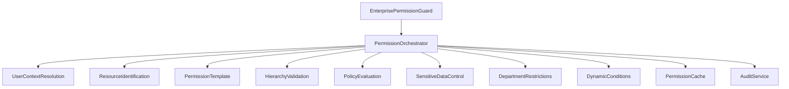

# Kế Hoạch Tái Cấu Trúc Module RBAC
## Triển Khai 15 Bước Kiểm Tra Quyền Theo Chuẩn Enterprise Security

---

## 📋 Tổng Quan Dự Án

### Mục Tiêu
Tái cấu trúc hoàn toàn module RBAC hiện tại để triển khai hệ thống kiểm tra quyền 15 bước theo chuẩn enterprise security, đảm bảo bảo mật cao và hiệu suất tối ưu.

### Phạm Vi Công Việc
- **Thời gian ước tính**: 8-10 tuần
- **Độ phức tạp**: Cao
- **Tác động**: Toàn bộ hệ thống permission
- **Rủi ro**: Trung bình - Cao

### Kết Quả Mong Đợi
- ✅ Hệ thống RBAC enterprise-grade với 15 bước validation
- ✅ Hiệu suất cao với caching thông minh
- ✅ Audit trail toàn diện
- ✅ Khả năng mở rộng và bảo trì
- ✅ Backwards compatibility

---

## 🎯 Phân Tích Hiện Trạng

### Điểm Mạnh Hiện Tại
- ✅ Cache system hoàn chỉnh (PermissionCacheService)
- ✅ Audit & logging comprehensive
- ✅ Basic validation framework
- ✅ Database structure tốt
- ✅ Error handling security-first

### Khoảng Cách Cần Khắc Phục
- ❌ Permission template system (0% complete)
- ❌ Hierarchy-based validation (0% complete)
- ❌ Policy evaluation engine (30% complete)
- ❌ Advanced action types (40% complete)
- ❌ Dynamic conditions (0% complete)
- ❌ Financial/sensitive data controls (0% complete)
- ❌ Department restrictions (20% complete)

---

## 📅 Kế Hoạch Thực Hiện (4 Phase)

### **PHASE 1: Core Foundation**
**Timeline: 3 tuần**
**Priority: CRITICAL**

#### Week 1: Infrastructure & Types
**Mục tiêu**: Xây dựng foundation types và core services

**Tasks**:
1. **Enhanced Permission Context Types** ⏱️ 2 ngày
   - Tạo `EnhancedPermissionContext` với đầy đủ context cho 15 bước
   - Enhanced User Context với hierarchy information
   - Resource Context với ownership và sensitivity
   - Dynamic Conditions types
   ```typescript
   // Files to create/update:
   - types/enhanced-permission-context.type.ts ✅
   - types/hierarchy-context.type.ts
   - types/policy-context.type.ts
   ```

2. **Permission Template Integration** ⏱️ 3 ngày
   - Import tất cả entities từ mkt-permission-template
   - Tạo PermissionTemplateService
   - Template resolution logic cơ bản
   ```typescript
   // Files to create:
   - services/permission-template.service.ts
   - services/template-resolver.service.ts
   - interfaces/template-service.interface.ts
   ```

#### Week 2: Core Services Development
**Mục tiêu**: Triển khai các service cốt lõi

3. **User Context Resolution Service** ⏱️ 2 ngày
   - Extract hierarchy level từ user data
   - Department và organization level loading
   - Reporting relationship resolution
   ```typescript
   // Files to create:
   - services/step2-user-context-resolution.service.ts
   - interfaces/user-context.interface.ts
   ```

4. **Resource Identification Service** ⏱️ 2 ngày
   - Resource metadata loading
   - Ownership identification
   - Sensitivity classification
   ```typescript
   // Files to create:
   - services/step3-resource-identification.service.ts
   - interfaces/resource-context.interface.ts
   ```

5. **Basic Policy Evaluation Engine** ⏱️ 1 ngày
   - JSON filter condition parser
   - Basic policy resolution
   ```typescript
   // Files to update:
   - services/policy-evaluation.service.ts (new)
   - Complete TODO in mkt-rbac.service.ts
   ```

#### Week 3: Integration & Testing
**Mục tiêu**: Tích hợp và test các component

6. **Service Integration** ⏱️ 2 ngày
   - Kết nối các services với nhau
   - Dependency injection setup
   - Basic error handling

7. **Unit Testing Phase 1** ⏱️ 2 ngày
   - Test coverage cho core services
   - Mock dependencies
   - Edge cases testing

8. **Performance Baseline** ⏱️ 1 ngày
   - Đo performance hiện tại
   - Identify bottlenecks
   - Cache optimization planning

---

### **PHASE 2: Advanced Validation Logic**
**Timeline: 3 tuần**
**Priority: HIGH**

#### Week 4: Hierarchy & Department Logic
**Mục tiêu**: Triển khai validation dựa trên hierarchy và department

9. **Hierarchy-based Validation Service** ⏱️ 3 ngày
   - 11-level hierarchy validation
   - Cross-hierarchy access rules
   - Subordinate/superior relationship checks
   - Hierarchy-based data filtering
   ```typescript
   // Files to create:
   - services/hierarchy-validation.service.ts
   - services/role-hierarchy.service.ts (enhance existing)
   - constants/hierarchy-rules.constants.ts
   ```

10. **Department & Team Restrictions** ⏱️ 2 ngày
    - Department-based access control
    - Cross-department restrictions
    - Team management permissions
    - Reporting relationship validation
    ```typescript
    // Files to create:
    - services/department-restrictions.service.ts
    - services/team-access.service.ts
    ```

#### Week 5: Financial & Sensitive Data Controls
**Mục tiêu**: Implement controls cho dữ liệu nhạy cảm

11. **Financial/Sensitive Data Controls** ⏱️ 3 ngày
    - Data classification system
    - Salary data access controls
    - Financial transaction permissions
    - Confidential information handling
    ```typescript
    // Files to create:
    - services/sensitive-data-control.service.ts
    - services/financial-access.service.ts
    - constants/data-classification.constants.ts
    ```

12. **Action Permission Enhancement** ⏱️ 2 ngày
    - TEAM_MANAGEMENT actions
    - FINANCIAL operations
    - APPROVAL workflow actions
    - Risk level validation
    ```typescript
    // Files to update:
    - constants/permission-actions.constants.ts (import from template)
    - services/action-validation.service.ts
    ```

#### Week 6: Dynamic Conditions
**Mục tiêu**: Triển khai dynamic conditions system

13. **Dynamic Conditions System** ⏱️ 3 ngày
    - Time-based restrictions
    - IP/location-based rules
    - Device restrictions
    - Business rule engine
    ```typescript
    // Files to create:
    - services/dynamic-conditions.service.ts
    - services/time-restrictions.service.ts
    - services/location-access.service.ts
    - services/business-rules.service.ts
    ```

14. **Integration Testing Phase 2** ⏱️ 2 ngày
    - Test advanced validation logic
    - Cross-service integration
    - Performance impact assessment

---

### **PHASE 3: Enterprise Guard & Complete Integration**
**Timeline: 2 tuần**
**Priority: HIGH**

#### Week 7: Enterprise Guard Implementation
**Mục tiêu**: Tạo enterprise-grade guard với 15-step validation

15. **Enhanced Enterprise Guard** ⏱️ 3 ngày
    - Implement 15-step validation sequence
    - Optimized execution order
    - Early exit conditions
    - Performance monitoring
    ```typescript
    // Files to create:
    - guards/enterprise-permission.guard.ts
    - interfaces/validation-step.interface.ts
    - services/permission-orchestrator.service.ts
    ```

16. **Enhanced RBAC Service Update** ⏱️ 2 ngày
    - Integrate với tất cả new services
    - Maintain backwards compatibility
    - Enhanced error handling
    ```typescript
    // Files to update:
    - services/mkt-rbac.service.ts (major refactor)
    - interfaces/rbac-service.interface.ts
    ```

#### Week 8: Module Configuration & Optimization
**Mục tiêu**: Hoàn thiện module configuration và optimization

17. **Module Configuration Update** ⏱️ 2 ngày
    - Update dependency injection
    - Import permission template entities
    - Service registration
    - Configuration management
    ```typescript
    // Files to update:
    - mkt-rbac.module.ts
    - Add imports from mkt-permission-template
    - Add new service providers
    ```

18. **Performance Optimization** ⏱️ 2 ngày
    - Cache strategy refinement
    - Database query optimization
    - Parallel processing where possible
    - Memory usage optimization

19. **Security Hardening** ⏱️ 1 ngày
    - Security review
    - Input validation enhancement
    - Audit logging optimization
    - Rate limiting considerations

---

### **PHASE 4: Testing, Documentation & Deployment**
**Timeline: 2 tuần**
**Priority: MEDIUM**

#### Week 9: Comprehensive Testing
**Mục tiêu**: Đảm bảo chất lượng và reliability

20. **Integration Testing Suite** ⏱️ 3 ngày
    - End-to-end permission flows
    - Cross-module integration
    - Performance benchmarking
    - Load testing
    ```typescript
    // Files to create:
    - tests/integration/rbac-enterprise.spec.ts
    - tests/performance/permission-benchmarks.spec.ts
    - tests/load/rbac-stress.spec.ts
    ```

21. **Security Testing** ⏱️ 2 ngày
    - Permission bypass attempts
    - Privilege escalation testing
    - Audit log verification
    - Error message security review

#### Week 10: Documentation & Deployment
**Mục tiêu**: Hoàn thiện documentation và chuẩn bị deployment

22. **Technical Documentation** ⏱️ 2 ngày
    - API documentation
    - Service architecture documentation
    - Configuration guide
    - Troubleshooting guide

23. **Migration Guide** ⏱️ 1 ngày
    - Backwards compatibility guide
    - Breaking changes documentation
    - Migration scripts (if needed)

24. **Deployment Preparation** ⏱️ 2 ngày
    - Production deployment checklist
    - Rollback procedures
    - Monitoring setup
    - Performance alerts

---

## 🏗️ Kiến Trúc Mới

### Service Architecture



### File Structure
```
mkt-rbac/
├── guards/
│   ├── enterprise-permission.guard.ts          # NEW
│   ├── module-access.guard.ts                  # EXISTING
│   └── action-permission.guard.ts              # EXISTING
├── services/
│   ├── mkt-rbac.service.ts                     # MAJOR UPDATE
│   ├── permission-orchestrator.service.ts      # NEW
│   ├── step2-user-context-resolution.service.ts      # NEW
│   ├── step3-resource-identification.service.ts      # NEW
│   ├── permission-template.service.ts          # NEW
│   ├── hierarchy-validation.service.ts         # NEW
│   ├── policy-evaluation.service.ts            # NEW
│   ├── sensitive-data-control.service.ts       # NEW
│   ├── department-restrictions.service.ts      # NEW
│   ├── dynamic-conditions.service.ts           # NEW
│   ├── permission-cache.service.ts             # EXISTING
│   └── permission-context.service.ts           # EXISTING
├── types/
│   ├── enhanced-permission-context.type.ts     # NEW
│   ├── hierarchy-context.type.ts               # NEW
│   ├── policy-context.type.ts                  # NEW
│   └── permission-context.type.ts              # EXISTING
├── interfaces/
│   ├── rbac-service.interface.ts               # UPDATE
│   ├── validation-step.interface.ts            # NEW
│   ├── template-service.interface.ts           # NEW
│   └── policy-engine.interface.ts              # NEW
├── constants/
│   ├── rbac.constants.ts                       # UPDATE
│   ├── hierarchy-rules.constants.ts            # NEW
│   ├── data-classification.constants.ts        # NEW
│   └── validation-steps.constants.ts           # NEW
└── mkt-rbac.module.ts                          # MAJOR UPDATE
```

---

## 🔧 Chi Tiết Technical Implementation

### 1. Enhanced Permission Context
```typescript
interface EnhancedPermissionContext {
  // Step 1: Basic validation
  action: PermissionAction;
  operationType?: GraphQLOperationType;

  // Step 2: User context với hierarchy
  userContext: {
    workspaceMemberId: string;
    workspaceId: string;
    hierarchyLevel: number; // 1-11
    departmentId: string;
    roles: string[];
    isActive: boolean;
  };

  // Step 3: Resource context
  resourceContext: {
    objectName: string;
    resourceType: string;
    confidentialityLevel: string;
    ownerId?: string;
  };

  // ... other contexts for remaining steps
}
```

### 2. Permission Orchestrator
```typescript
@Injectable()
export class PermissionOrchestratorService {
  private readonly validationSteps: PermissionValidationStep[] = [
    new PreValidationStep(),           // Step 1
    new UserContextStep(),             // Step 2
    new ResourceIdentificationStep(), // Step 3
    // ... 12 more steps
  ];

  async validatePermission(
    context: EnhancedPermissionContext
  ): Promise<EnhancedPermissionResult> {
    const result: EnhancedPermissionResult = {
      result: CheckResult.DENIED,
      stepResults: []
    };

    for (const step of this.validationSteps) {
      if (context.skipSteps?.includes(step.stepNumber)) {
        continue;
      }

      const stepResult = await step.validate(context);
      result.stepResults.push({
        step: step.stepNumber,
        name: step.stepName,
        result: stepResult.result,
        reason: stepResult.reason
      });

      if (stepResult.result === 'FAIL' && !stepResult.continue) {
        result.result = CheckResult.DENIED;
        result.reason = stepResult.reason;
        return result;
      }
    }

    result.result = CheckResult.GRANTED;
    return result;
  }
}
```

### 3. Validation Steps Implementation
```typescript
export class HierarchyValidationStep implements PermissionValidationStep {
  stepNumber = 7;
  stepName = 'Hierarchy-based Validation';
  isRequired = true;
  canSkip = false;

  async validate(context: EnhancedPermissionContext) {
    const userLevel = context.userContext.hierarchyLevel;
    const requiredLevel = this.getRequiredLevel(context.action);

    if (userLevel > requiredLevel) {
      return {
        result: 'FAIL' as const,
        reason: `Insufficient hierarchy level: ${userLevel} > ${requiredLevel}`,
        continue: false
      };
    }

    return {
      result: 'PASS' as const,
      continue: true
    };
  }
}
```

### 4. Enhanced Enterprise Guard
```typescript
@Injectable()
export class EnterprisePermissionGuard implements CanActivate {
  constructor(
    private orchestrator: PermissionOrchestratorService,
    private contextBuilder: PermissionContextBuilderService,
    private cache: PermissionCacheService
  ) {}

  async canActivate(context: ExecutionContext): Promise<boolean> {
    // Build enhanced context
    const permissionContext = await this.contextBuilder.build(context);

    // Check cache first
    const cached = await this.cache.getPermission(permissionContext);
    if (cached) {
      return cached.result === CheckResult.GRANTED;
    }

    // Execute 15-step validation
    const result = await this.orchestrator.validatePermission(permissionContext);

    // Cache result
    await this.cache.setPermission(permissionContext, result);

    return result.result === CheckResult.GRANTED;
  }
}
```

---

## 📊 Performance Considerations

### Caching Strategy
```typescript
// Multi-level caching
1. Memory Cache (L1) - 1-5 seconds TTL
2. Redis Cache (L2) - 5-60 minutes TTL
3. Database Cache (L3) - Permission templates

// Cache keys hierarchy
- User-level cache: user:{id}:permissions
- Resource-level cache: resource:{type}:{id}:permissions
- Template cache: template:{id}:resolved
- Policy cache: policy:{id}:conditions
```

### Performance Targets
- **Basic permission check**: < 10ms
- **Complex hierarchy check**: < 50ms
- **Full 15-step validation**: < 100ms
- **Cache hit rate**: > 85%
- **Database queries per check**: < 3

### Optimization Techniques
1. **Early Exit Conditions**: Fail fast on obvious denials
2. **Parallel Processing**: Run independent steps concurrently
3. **Lazy Loading**: Load data only when needed
4. **Connection Pooling**: Optimize database connections
5. **Query Optimization**: Use proper indexes

---

## 🧪 Testing Strategy

### Test Coverage Goals
- **Unit Tests**: 90%+ coverage
- **Integration Tests**: 80%+ coverage
- **Performance Tests**: All critical paths
- **Security Tests**: Comprehensive penetration testing

### Test Categories

#### 1. Unit Tests
```typescript
describe('HierarchyValidationService', () => {
  it('should deny access when hierarchy level insufficient');
  it('should allow access for sufficient hierarchy level');
  it('should handle cross-department access rules');
  it('should validate reporting relationships');
});
```

#### 2. Integration Tests
```typescript
describe('Enterprise Permission Flow', () => {
  it('should complete full 15-step validation');
  it('should handle permission template resolution');
  it('should apply data access policies correctly');
  it('should cache results appropriately');
});
```

#### 3. Performance Tests
```typescript
describe('Performance Benchmarks', () => {
  it('should complete basic check in <10ms');
  it('should handle 1000 concurrent requests');
  it('should maintain cache hit rate >85%');
});
```

#### 4. Security Tests
```typescript
describe('Security Validation', () => {
  it('should prevent privilege escalation');
  it('should audit all permission checks');
  it('should handle malicious input safely');
  it('should protect sensitive data access');
});
```

---

## 🚨 Risk Assessment & Mitigation

### High Risk Items

#### 1. Performance Degradation
**Risk**: 15-step validation có thể làm chậm hệ thống
**Mitigation**:
- Aggressive caching strategy
- Parallel processing
- Early exit conditions
- Performance monitoring

#### 2. Backwards Compatibility
**Risk**: Breaking existing functionality
**Mitigation**:
- Maintain legacy interfaces
- Gradual migration approach
- Comprehensive testing
- Feature flags

#### 3. Complexity Management
**Risk**: Code phức tạp khó maintain
**Mitigation**:
- Modular design
- Clear interfaces
- Comprehensive documentation
- Code review process

### Medium Risk Items

#### 4. Data Migration
**Risk**: Permission data inconsistency
**Mitigation**:
- Data validation scripts
- Migration rollback procedures
- Staging environment testing

#### 5. Team Learning Curve
**Risk**: Team cần time để học new system
**Mitigation**:
- Technical training sessions
- Documentation workshops
- Gradual rollout

---

## 📈 Success Metrics

### Technical Metrics
- **Permission Check Latency**: < 100ms (99th percentile)
- **System Availability**: > 99.9%
- **Cache Hit Rate**: > 85%
- **Error Rate**: < 0.1%

### Security Metrics
- **Audit Coverage**: 100% of permission checks
- **Unauthorized Access Attempts**: 0 successful
- **Privilege Escalation Incidents**: 0
- **Data Breach Risk**: Minimized

### Business Metrics
- **Compliance Score**: Improved enterprise security rating
- **Developer Productivity**: Maintained or improved
- **System Reliability**: Improved uptime
- **Feature Delivery**: No impact on development velocity

---

## 🎯 Milestones & Deliverables

### Phase 1 Deliverables
- [ ] Enhanced permission context types
- [ ] Core service implementations
- [ ] Permission template integration
- [ ] Basic policy evaluation
- [ ] Unit test suite Phase 1

### Phase 2 Deliverables
- [ ] Hierarchy validation service
- [ ] Financial data controls
- [ ] Department restrictions
- [ ] Dynamic conditions system
- [ ] Integration test suite

### Phase 3 Deliverables
- [ ] Enterprise permission guard
- [ ] Permission orchestrator
- [ ] Complete RBAC service update
- [ ] Performance optimization
- [ ] Security hardening

### Phase 4 Deliverables
- [ ] Comprehensive test suite
- [ ] Technical documentation
- [ ] Migration guides
- [ ] Deployment procedures
- [ ] Monitoring setup

---

## 🔄 Deployment Strategy

### Development Environment
1. **Feature Branch**: `feature/rbac-enterprise-restructure`
2. **Development Testing**: Continuous integration
3. **Code Review**: Mandatory peer review
4. **Quality Gates**: Tests, linting, security scan

### Staging Environment
1. **Integration Testing**: Full system testing
2. **Performance Testing**: Load and stress testing
3. **Security Testing**: Penetration testing
4. **User Acceptance**: Stakeholder validation

### Production Deployment
1. **Blue-Green Deployment**: Zero downtime
2. **Feature Flags**: Gradual rollout control
3. **Monitoring**: Real-time performance tracking
4. **Rollback Plan**: Quick revert capability

### Rollback Procedures
```bash
# Emergency rollback commands
1. Disable feature flag: RBAC_ENTERPRISE_ENABLED=false
2. Switch to previous version
3. Clear cache to force reload
4. Monitor system stability
```

---

## 📚 Documentation Plan

### Technical Documentation
1. **Architecture Overview**: System design and component interaction
2. **API Documentation**: Service interfaces and usage examples
3. **Configuration Guide**: Setup and customization options
4. **Performance Guide**: Optimization techniques and monitoring

### Developer Documentation
1. **Getting Started**: Quick setup guide
2. **Service Reference**: Detailed service documentation
3. **Testing Guide**: How to write and run tests
4. **Contribution Guide**: Code standards and review process

### Operations Documentation
1. **Deployment Guide**: Step-by-step deployment instructions
2. **Monitoring Guide**: Metrics and alerting setup
3. **Troubleshooting Guide**: Common issues and solutions
4. **Security Guide**: Security best practices and compliance

---

## 🤝 Team & Resource Requirements

### Development Team
- **Backend Lead Developer**: 1 person (full-time)
- **Senior Backend Developer**: 1 person (full-time)
- **Security Specialist**: 0.5 person (part-time)
- **DevOps Engineer**: 0.5 person (part-time)

### Skill Requirements
- Advanced NestJS/TypeScript
- Enterprise security patterns
- Performance optimization
- Database optimization
- Caching strategies

### External Dependencies
- Permission template modules (existing)
- Organization hierarchy data
- Department structure
- User management system

---

## ✅ Definition of Done

### Code Quality
- [ ] Code review completed and approved
- [ ] Unit test coverage > 90%
- [ ] Integration tests passing
- [ ] Performance benchmarks met
- [ ] Security review completed
- [ ] Documentation updated

### Functionality
- [ ] All 15 validation steps implemented
- [ ] Backwards compatibility maintained
- [ ] Error handling comprehensive
- [ ] Audit logging complete
- [ ] Cache system optimized

### Deployment Readiness
- [ ] Staging deployment successful
- [ ] Performance testing passed
- [ ] Security testing completed
- [ ] Rollback procedures tested
- [ ] Monitoring configured
- [ ] Team training completed

---

*Tài liệu này sẽ được cập nhật định kỳ theo tiến độ dự án và phản hồi từ team.*

Hệ thống 15 bước kiểm tra quyền (Enterprise RBAC Validation)

Giai đoạn 1: Kiểm tra cơ bản (Steps 1-3)

1. Basic Input Validation - Kiểm tra dữ liệu đầu vào
2. User Context Resolution - Phân giải thông tin người dùng và cấp bậc
3. Resource Identification - Xác định loại tài nguyên và độ nhạy cảm

Giai đoạn 2: Kiểm tra nâng cao (Steps 4-7)

4. Permission Template Check - Kiểm tra template quyền theo vai trò
5. Action Permission Validation - Xác thực quyền thực hiện hành động
6. Resource Access Control - Kiểm soát truy cập tài nguyên
7. Hierarchy-based Validation - Xác thực dựa trên cấp bậc tổ chức

Giai đoạn 3: Kiểm tra chuyên biệt (Steps 8-12)

8. Data Access Policy - Chính sách truy cập dữ liệu
9. Special Permissions - Quyền đặc biệt (khẩn cấp, bảo trì)
10. Financial/Sensitive Data Checks - Kiểm tra dữ liệu tài chính/nhạy cảm
11. Department & Team Restrictions - Hạn chế theo phòng ban và nhóm
12. Dynamic Conditions - Điều kiện động (thời gian, địa điểm)

Giai đoạn 4: Hoàn thiện (Steps 13-15)

13. Cache & Performance - Tối ưu cache và hiệu suất
14. Audit & Compliance - Kiểm toán và tuân thủ
15. Final Decision & Response - Quyết định cuối cùng và phản hồi

Mục đích từng bước:

- Steps 1-3: Đảm bảo dữ liệu hợp lệ và xác định context
- Steps 4-7: Kiểm tra quyền cơ bản theo vai trò và cấp bậc
- Steps 8-12: Áp dụng các ràng buộc chuyên biệt và bảo mật cao
- Steps 13-15: Tối ưu hiệu suất và đảm bảo tuân thủ

Hệ thống này đảm bảo an ninh cấp doanh nghiệp với khả năng kiểm soát chi tiết từng cấp độ truy cập.