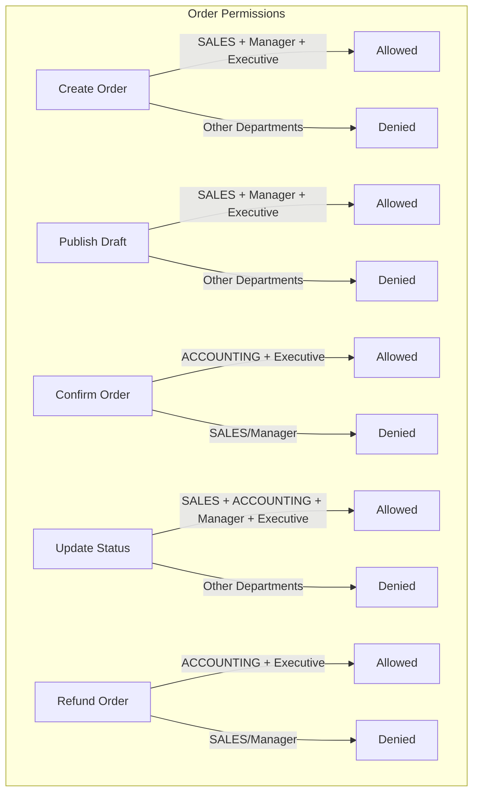
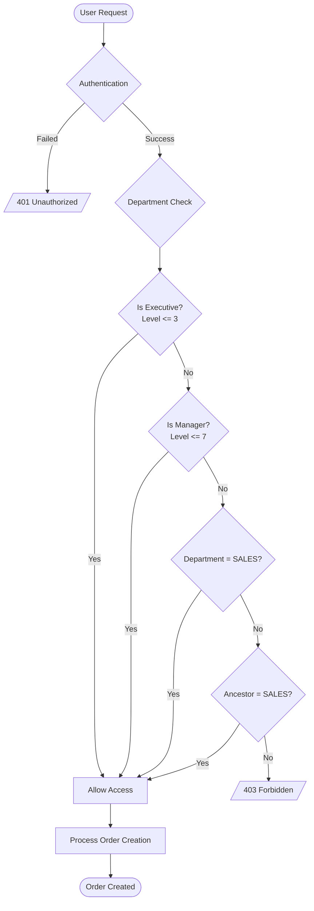
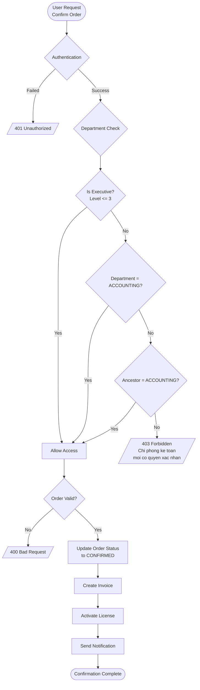
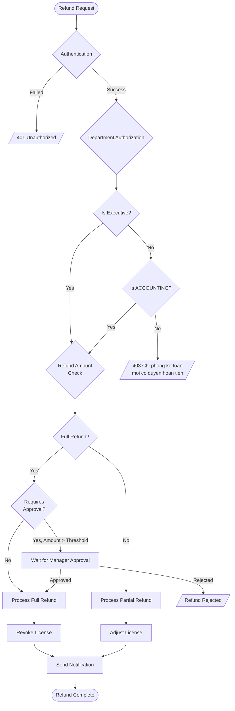
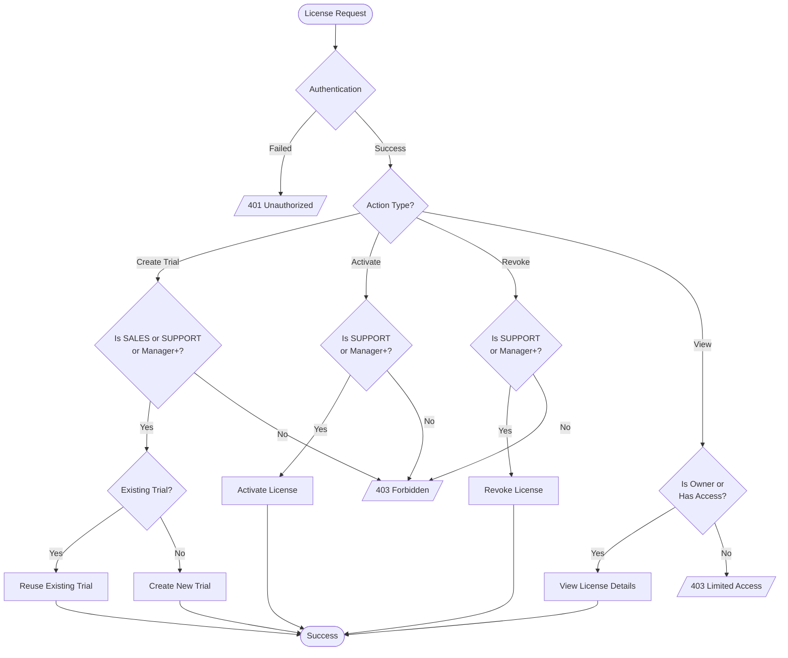

# RBAC Business Documentation - CRM System

## 1. Overview

### 1.1 Purpose
Tai lieu nay mo ta chi tiet he thong phan quyen (Role-Based Access Control) trong CRM, giup thong nhat hieu biet giua cac phong ban ve quyen han va trach nhiem cua tung vai tro trong he thong.

### 1.2 Actors
| Actor | Mo ta | Hierarchy Level |
|-------|-------|-----------------|
| **Executive** | CEO, C-Level, VP | 1-3 |
| **Manager** | Senior Director, Director, Senior Manager, Manager | 4-7 |
| **Admin** | Quan tri he thong, full quyen truy cap | N/A |
| **Sale** | Nhan vien kinh doanh, quan ly don hang va khach hang | 8-11 trong SALES |
| **Ke toan** | Nhan vien ke toan, xu ly thanh toan va hoa don | 8-11 trong ACCOUNTING |
| **Support** | Nhan vien ho tro, quan ly license va ho tro khach hang | 8-11 trong SUPPORT |

### 1.3 Trigger
- User dang nhap he thong va thuc hien cac thao tac
- He thong tu dong kiem tra quyen dua tren department va hierarchy level

---

## 2. Business Context

### 2.1 Hierarchy Level (Cap bac to chuc)

```
Level 1:  CEO (Giam doc dieu hanh)
Level 2:  C_LEVEL (CTO, CFO, COO, CMO)
Level 3:  VP (Pho Giam doc)
Level 4:  SENIOR_DIRECTOR (Giam doc Cap cao)
Level 5:  DIRECTOR (Giam doc)
Level 6:  SENIOR_MANAGER (Quan ly Cap cao)
Level 7:  MANAGER (Quan ly)
Level 8:  SENIOR_SPECIALIST (Chuyen vien Cap cao)
Level 9:  SPECIALIST (Chuyen vien)
Level 10: JUNIOR_SPECIALIST (Chuyen vien So cap)
Level 11: INTERN (Thuc tap sinh)
```

### 2.2 Department Structure (Cau truc Phong ban)

```
SALES (Kinh doanh)
├── SALES_DOMESTIC (KD Noi dia)
├── SALES_INTERNATIONAL (KD Quoc te)
├── SALES_PARTNER (KD Doi tac)
└── SALES_ONLINE (KD Online)

ACCOUNTING (Ke toan)
├── ACCOUNTING_PAYABLE (Ke toan Chi)
├── ACCOUNTING_RECEIVABLE (Ke toan Thu)
├── ACCOUNTING_AUDIT (Kiem toan)
└── ACCOUNTING_TAX (Thue)

SUPPORT (Ho tro)
├── SUPPORT_CUSTOMER (Ho tro Khach hang)
├── SUPPORT_TECHNICAL (Ho tro Ky thuat)
└── SUPPORT_INTERNAL (Ho tro Noi bo)

HR (Nhan su)
├── HR_RECRUITMENT (Tuyen dung)
├── HR_TRAINING (Dao tao)
└── HR_PAYROLL (Luong)

TECH (Cong nghe)
├── TECH_BACKEND (Backend)
├── TECH_FRONTEND (Frontend)
├── TECH_DEVOPS (DevOps)
├── TECH_QA (QA/Testing)
└── TECH_DATA (Data)
```

### 2.3 Data Access Scope

| Hierarchy Level | Data Access Scope | Mo ta |
|-----------------|-------------------|-------|
| 1-3 (Executive) | ALL_DEPARTMENTS | Truy cap toan bo du lieu |
| 4-6 (Director) | OWN_AND_CHILD_DEPARTMENTS | Phong ban minh va cac phong ban con |
| 7 (Manager) | OWN_DEPARTMENT_AND_TEAM | Phong ban va team truc thuoc |
| 8-11 (Staff) | OWN_RECORDS | Chi ban ghi cua minh |

---

## 3. Permission Matrix

### 3.1 Order Module (Quan ly Don hang)



| Thao tac | Admin | Executive (1-3) | Manager (4-7) | Sale | Ke toan | Support |
|----------|-------|-----------------|---------------|------|---------|---------|
| **Tao don hang** | YES | YES | YES | YES | NO | NO |
| **Publish draft** | YES | YES | YES | YES | NO | NO |
| **Xac nhan thanh toan** | YES | YES | NO* | NO | YES | NO |
| **Cap nhat trang thai** | YES | YES | YES | YES | YES | NO |
| **Hoan tien** | YES | YES | NO* | NO | YES | NO |

> *Manager chi duoc phep neu thuoc phong ACCOUNTING

### 3.2 Invoice Module (Quan ly Hoa don)

| Thao tac | Admin | Executive | Manager | Sale | Ke toan | Support |
|----------|-------|-----------|---------|------|---------|---------|
| **Xem hoa don** | YES | YES | YES | Own | YES | Own |
| **Tao hoa don** | YES | YES | YES | YES | YES | NO |
| **Cap nhat hoa don** | YES | YES | YES | NO | YES | NO |
| **Xoa hoa don** | YES | YES | NO | NO | YES | NO |
| **Xuat hoa don** | YES | YES | YES | YES | YES | YES |

### 3.3 License Module (Quan ly License)

| Thao tac | Admin | Executive | Manager | Sale | Ke toan | Support |
|----------|-------|-----------|---------|------|---------|---------|
| **Xem license** | YES | YES | YES | Own | Own | YES |
| **Tao license** | YES | YES | YES | YES | NO | YES |
| **Tao trial license** | YES | YES | YES | YES | NO | YES |
| **Active license** | YES | YES | YES | NO | NO | YES |
| **Revoke license** | YES | YES | YES | NO | NO | YES |
| **Bulk operations** | YES | YES | YES | NO | NO | NO |

### 3.4 Payment Module (Quan ly Thanh toan)

| Thao tac | Admin | Executive | Manager | Sale | Ke toan | Support |
|----------|-------|-----------|---------|------|---------|---------|
| **Xem thanh toan** | YES | YES | YES | Own | YES | Own |
| **Tao thanh toan** | YES | YES | YES | YES | YES | NO |
| **Cap nhat thanh toan** | YES | YES | NO | NO | YES | NO |
| **Xac nhan thanh toan** | YES | YES | NO | NO | YES | NO |

### 3.5 Customer Module (Quan ly Khach hang)

| Thao tac | Admin | Executive | Manager | Sale | Ke toan | Support |
|----------|-------|-----------|---------|------|---------|---------|
| **Xem khach hang** | YES | YES | YES | Own | Own | Own |
| **Tao khach hang** | YES | YES | YES | YES | NO | YES |
| **Cap nhat khach hang** | YES | YES | YES | YES | NO | YES |
| **Xoa khach hang** | YES | YES | YES | NO | NO | NO |
| **Export khach hang** | YES | YES | YES | NO | NO | NO |

### 3.6 Department Module (Quan ly Phong ban)

| Thao tac | Admin | Executive | Manager | Sale | Ke toan | Support |
|----------|-------|-----------|---------|------|---------|---------|
| **Xem phong ban** | YES | YES | YES | Own | Own | Own |
| **Tao phong ban** | YES | YES | NO | NO | NO | NO |
| **Cap nhat phong ban** | YES | YES | NO | NO | NO | NO |
| **Xoa phong ban** | YES | YES | NO | NO | NO | NO |
| **Quan ly nhan vien** | YES | YES | YES | NO | NO | NO |

---

## 4. Flow Diagrams

### 4.1 Order Creation Flow



### 4.2 Payment Confirmation Flow



### 4.3 Refund Authorization Flow



### 4.4 License Management Flow



---

## 5. Exception Handling

| Exception | Trigger Condition | Handling |
|-----------|-------------------|----------|
| **User Not Authenticated** | Token khong hop le hoac het han | Tra ve 401, yeu cau dang nhap lai |
| **Workspace Not Found** | Workspace ID khong ton tai | Tra ve 403, kiem tra cau hinh |
| **Context Not Found** | Khong the resolve user context | Tra ve 403, kiem tra workspace member |
| **Department Denied** | User khong thuoc phong ban duoc phep | Tra ve 403 voi message cu the |
| **Hierarchy Denied** | Level qua thap cho thao tac | Tra ve 403 voi yeu cau escalation |
| **Data Access Denied** | Truy cap du lieu ngoai scope | Tra ve 403, chi tra ve du lieu duoc phep |

---

## 6. Data Entities

### 6.1 WorkspaceMember (Thanh vien Workspace)

| Field | Type | Required | Description |
|-------|------|----------|-------------|
| id | UUID | Yes | Primary key |
| userId | UUID | Yes | Reference to User |
| departmentId | UUID | No | Phong ban truc thuoc |
| organizationLevelId | UUID | No | Cap bac to chuc |
| supportForMemberId | UUID | No | Ho tro cho member khac |

### 6.2 MktDepartment (Phong ban)

| Field | Type | Required | Description |
|-------|------|----------|-------------|
| id | UUID | Yes | Primary key |
| departmentCode | String | Yes | Ma phong ban (SALES, ACCOUNTING) |
| departmentName | String | Yes | Ten phong ban |
| departmentType | Enum | Yes | Loai (DEPARTMENT, TEAM) |
| managerId | UUID | No | Manager cua phong ban |

### 6.3 MktOrganizationLevel (Cap bac to chuc)

| Field | Type | Required | Description |
|-------|------|----------|-------------|
| id | UUID | Yes | Primary key |
| levelCode | String | Yes | Ma cap bac (CEO, MANAGER) |
| levelName | String | Yes | Ten cap bac |
| hierarchyLevel | Number | Yes | So thu tu (1-11) |

### 6.4 MktPermissionTemplate (Mau quyen)

| Field | Type | Required | Description |
|-------|------|----------|-------------|
| id | UUID | Yes | Primary key |
| templateKey | String | Yes | Ma template |
| templateName | String | Yes | Ten template |
| hierarchyLevel | Number | No | Cap bac ap dung |
| departmentType | String | No | Loai phong ban ap dung |
| isActive | Boolean | Yes | Trang thai hoat dong |

---

## 7. Integration Points

### 7.1 Internal Integrations

| Module | Integration | Description |
|--------|-------------|-------------|
| **Order -> Invoice** | Auto-create | Tao hoa don khi xac nhan don hang |
| **Order -> License** | Auto-activate | Kich hoat license khi thanh toan thanh cong |
| **Order -> Payment** | Status sync | Dong bo trang thai thanh toan |
| **Customer -> License** | Relationship | Quan ly license theo khach hang |

### 7.2 External Integrations

| System | Protocol | Description |
|--------|----------|-------------|
| **SEPay** | Webhook | Xu ly thong bao thanh toan |
| **BIDV** | REST API | Tao QR Code thanh toan |
| **MKT Server** | OAuth2 | Dong bo san pham va license |
| **Email Service** | SMTP | Gui thong bao |

---

## 8. Acceptance Criteria

### 8.1 Order Module

- [ ] Nhan vien SALES co the tao va publish don hang
- [ ] Nhan vien ACCOUNTING co the xac nhan va hoan tien don hang
- [ ] Manager tu bat ky phong ban co the tao don hang
- [ ] Executive (Level 1-3) co full quyen tren Order
- [ ] User ngoai phong ban SALES/ACCOUNTING khong the thao tac tren Order (tru Executive)

### 8.2 License Module

- [ ] Nhan vien SUPPORT co the quan ly license (create, activate, revoke)
- [ ] Nhan vien SALES co the tao trial license
- [ ] User chi xem duoc license lien quan den don hang cua minh
- [ ] Bulk operations chi cho phep Executive va Manager

### 8.3 Payment Module

- [ ] Chi phong ACCOUNTING duoc phep xac nhan thanh toan
- [ ] User chi xem duoc thanh toan cua don hang minh quan ly
- [ ] Executive co full quyen tren Payment

### 8.4 General

- [ ] He thong log audit cho moi thao tac nhay cam
- [ ] Performance: Auth check < 100ms
- [ ] Cache context user de giam tai DB

---

## 9. Technical Notes

### 9.1 Authentication & Authorization Stack

```
Request
   |
   v
[WorkspaceAuthGuard] --> Verify workspace token
   |
   v
[UserAuthGuard] --> Verify user session
   |
   v
[DepartmentAuthorizationGuard] --> Check department permissions
   |
   v
[RequirePermission (Casbin)] --> Fine-grained permissions
   |
   v
Controller/Resolver
```

### 9.2 Department Authorization Logic

```typescript
// Thu tu kiem tra
1. allowExecutives? && hierarchyLevel <= 3 => ALLOW
2. allowManagers? && hierarchyLevel <= 7 => ALLOW
3. departmentCode IN allowedDepartments => ALLOW
4. departmentAncestors INTERSECT allowedDepartments => ALLOW
5. => DENY
```

### 9.3 Caching Strategy

- User context cache TTL: 5 minutes
- Department tree cache TTL: 30 minutes
- Permission cache TTL: 5 minutes
- Invalidation: On user/department/permission changes

### 9.4 Environment Variables

| Variable | Default | Description |
|----------|---------|-------------|
| RBAC_CACHE_TTL | 300 | Cache TTL in seconds |
| RBAC_EMERGENCY_ACCESS_DURATION | 60 | Emergency access minutes |
| RBAC_MAX_SUBORDINATES | 50 | Max subordinates per manager |

---

## 10. Open Questions

- [ ] Can xac dinh chinh sach cho truong hop user khong co department (contractor, guest)?
- [ ] Can xac dinh quy trinh approval cho cac thao tac nhay cam (refund > threshold)?
- [ ] Can xac dinh chinh sach cross-department access cho cac truong hop dac biet?
- [ ] Can xac dinh thoi gian Emergency Access va quy trinh cap phat?
- [ ] Can lam ro quyen han cua Sub-Manager trong tung module?

---

## 11. Revision History

| Version | Date | Author | Changes |
|---------|------|--------|---------|
| 1.0 | 2026-01-14 | System | Initial document |

---

## 12. Appendix

### A. Department Code Reference

```typescript
const DEPARTMENT = {
  SALES: 'SALES',
  SUPPORT: 'SUPPORT',
  ACCOUNTING: 'ACCOUNTING',
  HR: 'HR',
  TECH: 'TECH',
  ADMIN: 'ADMIN',
};
```

### B. Hierarchy Level Constants

```typescript
const HIERARCHY_LEVEL = {
  CEO: 1,
  C_LEVEL: 2,
  VP: 3,
  SENIOR_DIRECTOR: 4,
  DIRECTOR: 5,
  SENIOR_MANAGER: 6,
  MANAGER: 7,
  SENIOR_SPECIALIST: 8,
  SPECIALIST: 9,
  JUNIOR_SPECIALIST: 10,
  INTERN: 11,
};

// Executive threshold
const EXECUTIVE_MAX_LEVEL = 3;

// Manager threshold
const MANAGER_MAX_LEVEL = 7;
```

### C. Error Messages (Vietnamese)

```typescript
const DEPARTMENT_AUTH_MESSAGES = {
  CREATE_ORDER: 'Chi nhan vien kinh doanh hoac quan ly moi co quyen tao don hang',
  PUBLISH_DRAFT: 'Chi nhan vien kinh doanh hoac quan ly moi co quyen publish don hang',
  CONFIRM_ORDER: 'Chi phong ke toan moi co quyen xac nhan thanh toan don hang',
  UPDATE_STATUS: 'Chi nhan vien kinh doanh, ke toan hoac quan ly moi co quyen cap nhat trang thai don hang',
  REFUND_ORDER: 'Chi phong ke toan moi co quyen hoan tien don hang',
};
```
