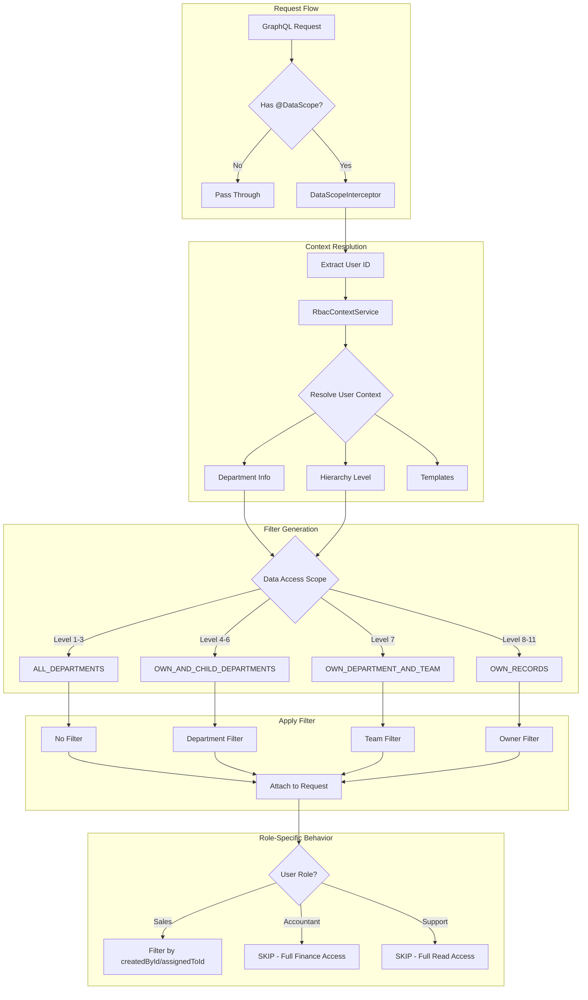

# DataScope Configuration Guide

Hướng dẫn thiết lập DataScope (Row-Level Security) cho các business modules với các role: **Sales**, **Accountant**, **Support**.

## 1. Tổng Quan DataScope

### 1.1 DataScope là gì?

DataScope là cơ chế Row-Level Security (RLS) tự động lọc dữ liệu dựa trên:
- **User context**: Thông tin người dùng (department, hierarchy level, team)
- **Access policies**: Chính sách truy cập (Casbin rules + Permission Templates)
- **Resource type**: Loại tài nguyên đang truy cập

### 1.2 Cách hoạt động

```
Request → @DataScope Decorator → DataScopeInterceptor
                                        ↓
                            RbacContextService (resolve user context)
                                        ↓
                            RbacEnforcerService (get data filter)
                                        ↓
                            Attach filter to request.dataScope
                                        ↓
                            Service/Repository applies filter
```

### 1.3 Filter Modes

| Mode | Mô tả | Use case |
|------|-------|----------|
| `AUTO` | Tự động áp dụng filter | Query list, Query single record |
| `MANUAL` | Gắn filter nhưng không auto-apply | Khi cần custom logic |
| `SKIP` | Bỏ qua filtering | Create operation, Aggregation |

### 1.4 Audit Levels

| Level | Mô tả | Use case |
|-------|-------|----------|
| `low` | Minimal logging | List queries, bulk operations |
| `medium` | Standard logging | Single record queries |
| `high` | Detailed logging | Mutations, sensitive data |

---

## 2. Data Access Scope theo Hierarchy Level

| Hierarchy Level | Role Examples | Data Access Scope | Mô tả |
|-----------------|---------------|-------------------|-------|
| 1-3 | CEO, C_LEVEL, VP | `ALL_DEPARTMENTS` | Truy cập tất cả dữ liệu |
| 4-6 | DIRECTOR, MANAGER | `OWN_AND_CHILD_DEPARTMENTS` | Department mình và con |
| 7 | TEAM_LEAD | `OWN_DEPARTMENT_AND_TEAM` | Department mình và team |
| 8-11 | STAFF (Sales, Accountant, Support) | `OWN_RECORDS` | Chỉ record của mình |

---

## 3. DataScope cho từng Role Staff

### 3.1 Sales Staff (Hierarchy Level 8-10)

**Permission Template**: `SALES_STAFF`

| Resource | Allowed Actions | Data Scope | Filter Logic |
|----------|----------------|------------|--------------|
| `mktCustomer` | READ, CREATE, UPDATE | `OWN_RECORDS` | `createdById = userId` hoặc `assignedToId = userId` |
| `mktOrder` | READ, CREATE, UPDATE | `OWN_RECORDS` | `createdById = userId` |
| `mktLicense` | READ | `OWN_RECORDS` | Licenses của customers mình quản lý |
| `mktInvoice` | READ | `OWN_RECORDS` | Invoices của orders mình tạo |
| `mktProduct` | READ | `ALL` | Tất cả products (catalog) |

**Recommended DataScope Config**:

```typescript
// sales-data-scope.constants.ts
export const SALES_DATA_SCOPE = {
  // Customer queries - filter by assignee/creator
  QUERY_CUSTOMER: {
    resource: 'mktCustomer',
    mode: 'AUTO',
    auditLevel: 'medium',
    additionalConditions: [
      { field: 'deletedAt', operator: 'IS_NULL', value: null }
    ],
  },

  // Order queries - filter by creator
  QUERY_ORDER: {
    resource: 'mktOrder',
    mode: 'AUTO',
    auditLevel: 'medium',
  },

  // Create order - no filter needed
  MUTATION_CREATE_ORDER: {
    resource: 'mktOrder',
    mode: 'SKIP',
    auditLevel: 'high',
  },

  // Update order - must own the order
  MUTATION_UPDATE_ORDER: {
    resource: 'mktOrder',
    mode: 'AUTO',
    auditLevel: 'high',
  },

  // License read - filter by customer ownership
  QUERY_LICENSE: {
    resource: 'mktLicense',
    mode: 'AUTO',
    auditLevel: 'low',
  },

  // Product read - no filter (public catalog)
  QUERY_PRODUCT: {
    resource: 'mktProduct',
    mode: 'SKIP',
    auditLevel: 'low',
  },
};
```

---

### 3.2 Accountant Staff (Hierarchy Level 8)

**Permission Template**: `ACCOUNTANT_STAFF`

| Resource | Allowed Actions | Data Scope | Filter Logic |
|----------|----------------|------------|--------------|
| `mktInvoice` | READ, CREATE, UPDATE, EXPORT | `ALL` | Tất cả invoices (finance role) |
| `mktPayment` | READ, CREATE, UPDATE, EXPORT | `ALL` | Tất cả payments |
| `mktOrder` | READ | `ALL` | Tất cả orders (để đối soát) |
| `mktCustomer` | READ | `ALL` | Tất cả customers (thông tin thanh toán) |
| `mktLicense` | READ | `ALL` | Tất cả licenses |
| `mktReport` | READ, EXPORT | `ALL` | Financial reports |

**Recommended DataScope Config**:

```typescript
// accountant-data-scope.constants.ts
export const ACCOUNTANT_DATA_SCOPE = {
  // Invoice - full department access (no row filter, only action filter)
  QUERY_INVOICE: {
    resource: 'mktInvoice',
    mode: 'SKIP', // Accountants see all invoices
    auditLevel: 'medium',
    additionalConditions: [
      { field: 'deletedAt', operator: 'IS_NULL', value: null }
    ],
  },

  MUTATION_CREATE_INVOICE: {
    resource: 'mktInvoice',
    mode: 'SKIP',
    auditLevel: 'high',
  },

  MUTATION_UPDATE_INVOICE: {
    resource: 'mktInvoice',
    mode: 'SKIP', // Can update any invoice
    auditLevel: 'high',
  },

  // Payment - full department access
  QUERY_PAYMENT: {
    resource: 'mktPayment',
    mode: 'SKIP',
    auditLevel: 'medium',
  },

  MUTATION_CREATE_PAYMENT: {
    resource: 'mktPayment',
    mode: 'SKIP',
    auditLevel: 'high',
  },

  // Order - read only, no filter (for reconciliation)
  QUERY_ORDER: {
    resource: 'mktOrder',
    mode: 'SKIP',
    auditLevel: 'low',
  },

  // Customer - read only, no filter
  QUERY_CUSTOMER: {
    resource: 'mktCustomer',
    mode: 'SKIP',
    auditLevel: 'low',
  },

  // Report - export access
  QUERY_REPORT: {
    resource: 'mktReport',
    mode: 'SKIP',
    auditLevel: 'medium',
  },

  MUTATION_EXPORT_REPORT: {
    resource: 'mktReport',
    mode: 'SKIP',
    auditLevel: 'high',
  },
};
```

**Lưu ý quan trọng cho Accountant**:
- Accountant có đặc quyền **không bị filter** ở các resource tài chính
- Cần kiểm tra action permission thay vì row-level filter
- Sử dụng `mode: 'SKIP'` kết hợp với `@RequirePermission` decorator

---

### 3.3 Support Staff (Hierarchy Level 8)

**Permission Template**: `SUPPORT_STAFF`

| Resource | Allowed Actions | Data Scope | Filter Logic |
|----------|----------------|------------|--------------|
| `mktCustomer` | READ, UPDATE (notes/tags only) | `ALL` | Tất cả customers |
| `mktOrder` | READ, UPDATE (status only) | `ALL` | Tất cả orders |
| `mktLicense` | READ | `ALL` | Tất cả licenses |
| `mktProduct` | READ | `ALL` | Tất cả products |
| `mktInvoice` | READ | `ALL` | Tất cả invoices |
| `mktPayment` | READ | `ALL` | Tất cả payments |

**Recommended DataScope Config**:

```typescript
// support-data-scope.constants.ts
export const SUPPORT_DATA_SCOPE = {
  // Customer - full read, restricted update
  QUERY_CUSTOMER: {
    resource: 'mktCustomer',
    mode: 'SKIP', // Support sees all customers
    auditLevel: 'medium',
  },

  MUTATION_UPDATE_CUSTOMER: {
    resource: 'mktCustomer',
    mode: 'SKIP',
    auditLevel: 'high',
    excludeFields: ['creditLimit', 'paymentTerms', 'priceLevel'], // Không được sửa
  },

  // Order - full read, restricted update (status only)
  QUERY_ORDER: {
    resource: 'mktOrder',
    mode: 'SKIP',
    auditLevel: 'medium',
  },

  MUTATION_UPDATE_ORDER_STATUS: {
    resource: 'mktOrder',
    mode: 'SKIP',
    auditLevel: 'high',
    excludeFields: ['totalAmount', 'discountAmount', 'customerId'], // Không được sửa
  },

  // License - read only
  QUERY_LICENSE: {
    resource: 'mktLicense',
    mode: 'SKIP',
    auditLevel: 'low',
  },

  // Product - read only
  QUERY_PRODUCT: {
    resource: 'mktProduct',
    mode: 'SKIP',
    auditLevel: 'low',
  },

  // Invoice - read only
  QUERY_INVOICE: {
    resource: 'mktInvoice',
    mode: 'SKIP',
    auditLevel: 'low',
  },

  // Payment - read only
  QUERY_PAYMENT: {
    resource: 'mktPayment',
    mode: 'SKIP',
    auditLevel: 'low',
  },
};
```

**Lưu ý quan trọng cho Support**:
- Support có quyền **read tất cả** để hỗ trợ khách hàng
- Update bị giới hạn bởi `excludeFields` - chỉ update được các fields cho phép
- Cần kết hợp với field-level validation trong service

---

## 4. Ma trận DataScope theo Module

### 4.1 Customer Module

| Role | Query Single | Query List | Create | Update | Delete |
|------|--------------|------------|--------|--------|--------|
| Sales Staff | `AUTO` (own) | `AUTO` (own) | `SKIP` | `AUTO` (own) | ❌ |
| Accountant | `SKIP` (all) | `SKIP` (all) | ❌ | ❌ | ❌ |
| Support | `SKIP` (all) | `SKIP` (all) | ❌ | `SKIP` (restricted) | ❌ |

### 4.2 Order Module

| Role | Query Single | Query List | Create | Update | Delete |
|------|--------------|------------|--------|--------|--------|
| Sales Staff | `AUTO` (own) | `AUTO` (own) | `SKIP` | `AUTO` (own) | ❌ |
| Accountant | `SKIP` (all) | `SKIP` (all) | ❌ | ❌ | ❌ |
| Support | `SKIP` (all) | `SKIP` (all) | ❌ | `SKIP` (status only) | ❌ |

### 4.3 Invoice Module

| Role | Query Single | Query List | Create | Update | Delete |
|------|--------------|------------|--------|--------|--------|
| Sales Staff | `AUTO` (own orders) | `AUTO` (own orders) | ❌ | ❌ | ❌ |
| Accountant | `SKIP` (all) | `SKIP` (all) | `SKIP` | `SKIP` | ❌ |
| Support | `SKIP` (all) | `SKIP` (all) | ❌ | ❌ | ❌ |

### 4.4 Payment Module

| Role | Query Single | Query List | Create | Update | Delete |
|------|--------------|------------|--------|--------|--------|
| Sales Staff | `AUTO` (own orders) | `AUTO` (own orders) | ❌ | ❌ | ❌ |
| Accountant | `SKIP` (all) | `SKIP` (all) | `SKIP` | `SKIP` | ❌ |
| Support | `SKIP` (all) | `SKIP` (all) | ❌ | ❌ | ❌ |

### 4.5 License Module

| Role | Query Single | Query List | Create | Update | Delete |
|------|--------------|------------|--------|--------|--------|
| Sales Staff | `AUTO` (own customers) | `AUTO` (own customers) | ❌ | ❌ | ❌ |
| Accountant | `SKIP` (all) | `SKIP` (all) | ❌ | ❌ | ❌ |
| Support | `SKIP` (all) | `SKIP` (all) | ❌ | ❌ | ❌ |

### 4.6 Product Module

| Role | Query Single | Query List | Create | Update | Delete |
|------|--------------|------------|--------|--------|--------|
| Sales Staff | `SKIP` (all) | `SKIP` (all) | ❌ | ❌ | ❌ |
| Accountant | `SKIP` (all) | `SKIP` (all) | ❌ | ❌ | ❌ |
| Support | `SKIP` (all) | `SKIP` (all) | ❌ | ❌ | ❌ |

---

## 5. Implementation Guide

### 5.1 Tạo Constants File

```typescript
// src/mkt-core/[module]/constants/[module]-data-scope.constants.ts

import { DataScopeOptions } from 'src/mkt-core/mkt-rbac-enterprise-grade/interceptors/types';

const MODULE_ENTITY_NAME = 'mktModule';

export const DATA_SCOPE_MODE = {
  AUTO: 'AUTO',
  MANUAL: 'MANUAL',
  SKIP: 'SKIP',
} as const;

export const DATA_SCOPE_AUDIT_LEVEL = {
  LOW: 'low',
  MEDIUM: 'medium',
  HIGH: 'high',
} as const;

const BASE_CONFIG = {
  resource: MODULE_ENTITY_NAME,
} as const;

export const MODULE_DATA_SCOPE = {
  QUERY_SINGLE: {
    ...BASE_CONFIG,
    mode: DATA_SCOPE_MODE.AUTO,
    auditLevel: DATA_SCOPE_AUDIT_LEVEL.MEDIUM,
  } satisfies DataScopeOptions,

  QUERY_LIST: {
    ...BASE_CONFIG,
    mode: DATA_SCOPE_MODE.AUTO,
    auditLevel: DATA_SCOPE_AUDIT_LEVEL.LOW,
  } satisfies DataScopeOptions,

  MUTATION_CREATE: {
    ...BASE_CONFIG,
    mode: DATA_SCOPE_MODE.SKIP,
    auditLevel: DATA_SCOPE_AUDIT_LEVEL.HIGH,
  } satisfies DataScopeOptions,

  MUTATION_UPDATE: {
    ...BASE_CONFIG,
    mode: DATA_SCOPE_MODE.AUTO,
    auditLevel: DATA_SCOPE_AUDIT_LEVEL.HIGH,
  } satisfies DataScopeOptions,
} as const;
```

### 5.2 Áp dụng trong Resolver

```typescript
// src/mkt-core/[module]/resolvers/[module]-query.resolver.ts

import { DataScope } from 'src/mkt-core/mkt-rbac-enterprise-grade/decorators';
import { MODULE_DATA_SCOPE } from '../constants/[module]-data-scope.constants';

@Resolver()
@UseGuards(WorkspaceAuthGuard, UserAuthGuard)
export class ModuleQueryResolver {

  @Query(() => ModuleOutput)
  @DataScope(MODULE_DATA_SCOPE.QUERY_SINGLE)
  async getModuleById(
    @Args('id') id: string,
    @Context() ctx: GraphQLContext,
  ): Promise<ModuleOutput> {
    // DataScope filter available in ctx.req.dataScope
    const whereClause = this.buildWhereClause({ id }, ctx);
    return this.repository.findOneWithWhere(whereClause);
  }

  @Query(() => [ModuleOutput])
  @DataScope(MODULE_DATA_SCOPE.QUERY_LIST)
  async getModules(
    @Context() ctx: GraphQLContext,
  ): Promise<ModuleOutput[]> {
    const whereClause = this.buildWhereClause({}, ctx);
    return this.repository.findManyWithWhere(whereClause);
  }
}
```

### 5.3 Build Where Clause Helper

```typescript
private buildWhereClause(
  baseWhere: FindOptionsWhere<Entity>,
  ctx: GraphQLContext,
): FindOptionsWhere<Entity> {
  const dataScope = ctx.req.dataScope;

  // No filter if skipped or has full access
  if (dataScope?.skipped || dataScope?.hasFullAccess) {
    return baseWhere;
  }

  // Convert DataScope filter to TypeORM where
  if (dataScope?.filter) {
    const scopeWhere = filterToWhere(dataScope.filter);
    return { ...baseWhere, ...scopeWhere };
  }

  return baseWhere;
}
```

### 5.4 Kết hợp với Permission Guards

```typescript
// Kết hợp DataScope với Permission check
@Query(() => InvoiceOutput)
@RequirePermission('mktInvoice', 'read')  // Action-level check
@DataScope(INVOICE_DATA_SCOPE.QUERY_SINGLE)  // Row-level filter
async getInvoiceById(@Args('id') id: string): Promise<InvoiceOutput> {
  // ...
}
```

---

## 6. Filter Conditions cho từng Role

### 6.1 Sales Staff - OWN_RECORDS Filter

```typescript
// Auto-generated filter for Sales Staff (level 8-10)
const salesStaffFilter: FilterCondition = {
  type: 'OR',
  conditions: [
    { field: 'createdById', operator: '=', value: '{userId}' },
    { field: 'assignedToId', operator: '=', value: '{userId}' },
  ],
};
```

### 6.2 Accountant Staff - Department Filter

```typescript
// Accountant có department-level access cho finance resources
// Không cần row-level filter, chỉ cần action check
const accountantFilter: FilterCondition | null = null; // SKIP mode
```

### 6.3 Support Staff - Full Read Access

```typescript
// Support có full read access
const supportFilter: FilterCondition | null = null; // SKIP mode

// Nhưng UPDATE bị restrict bởi field validation
const supportUpdateRestriction = {
  allowedFields: ['notes', 'tags', 'supportStatus'],
  deniedFields: ['*'], // Tất cả fields khác
};
```

---

## 7. Mermaid Diagram



---

## 8. Checklist Implementation

### 8.1 Cho mỗi Module

- [ ] Tạo `[module]-data-scope.constants.ts`
- [ ] Định nghĩa presets cho QUERY_SINGLE, QUERY_LIST, MUTATION_*
- [ ] Update Query Resolver với @DataScope decorator
- [ ] Update Mutation Resolver với @DataScope decorator
- [ ] Implement buildWhereClause helper
- [ ] Test với từng role (Sales, Accountant, Support)

### 8.2 Cho RBAC System

- [ ] Verify Permission Templates đã có đủ (SALES_STAFF, ACCOUNTANT_STAFF, SUPPORT_STAFF)
- [ ] Verify Casbin Rules đã mapping đúng resources và actions
- [ ] Verify Template Resource Permissions đã định nghĩa đúng allowed/denied actions
- [ ] Test RbacEnforcerService.getDataFilter() cho từng role

---

## 9. Troubleshooting

### 9.1 Filter không được apply

1. Check @DataScope decorator có được add không
2. Check mode có phải là 'AUTO' không
3. Check user context có được resolve không (xem logs)
4. Check hierarchy level của user

### 9.2 User không thấy data nào

1. Check hierarchy level - nếu level 8-11 thì chỉ thấy OWN_RECORDS
2. Check createdById hoặc assignedToId có match với user không
3. Check department assignment

### 9.3 Accountant/Support thấy tất cả nhưng không nên

1. Check mode có phải là 'SKIP' không (đúng cho đọc, sai cho write)
2. Thêm @RequirePermission decorator để check action
3. Thêm field validation trong service cho UPDATE operations

---

## 10. References

- `src/mkt-core/mkt-rbac-enterprise-grade/decorators/data-scope.decorator.ts`
- `src/mkt-core/mkt-rbac-enterprise-grade/interceptors/data-scope.interceptor.ts`
- `src/mkt-core/mkt-rbac-enterprise-grade/services/rbac-context.service.ts`
- `src/mkt-core/mkt-rbac-enterprise-grade/services/rbac-enforcer.service.ts`
- `src/mkt-core/contract/constants/contract-data-scope.constants.ts` (example)
