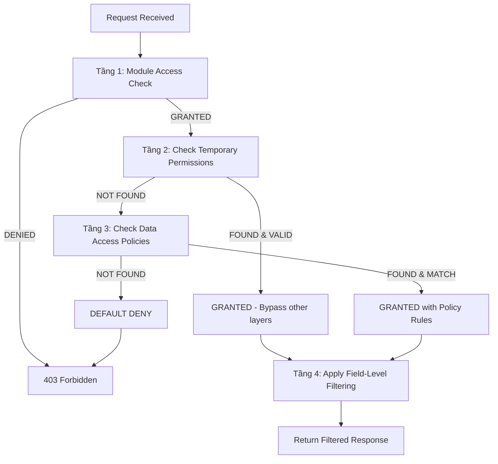

# Marketing CRM RBAC (Role-Based Access Control) System

## 🎯 Tổng Quan

Hệ thống RBAC 4 tầng toàn diện được thiết kế cho nền tảng Marketing CRM, cung cấp kiểm soát quyền truy cập chi tiết, bảo mật và linh hoạt trên nhiều cấp độ khác nhau của ứng dụng.

## 🏗️ Kiến Trúc 4 Tầng

Hệ thống RBAC triển khai mô hình phân quyền phân cấp với 4 tầng bảo mật riêng biệt:

### 🔹 Tầng 1: Kiểm Soát Truy Cập Module
**Component**: `ModuleAccessGuard`  
**Phạm vi**: Các module ứng dụng (order, invoice, license, v.v.)  
**Mục đích**: Kiểm soát người dùng có thể truy cập các module kinh doanh cụ thể hay không

```typescript
// Ví dụ: Kiểm tra user có thể truy cập module Order không
@RequireModuleAccess('order')
@Resolver(() => MktOrder)
export class MktOrderResolver {
  // Tất cả methods đều yêu cầu quyền truy cập Order module
}
```

**Tính năng:**
- Tự động phát hiện module từ tên resolver class
- Yêu cầu module rõ ràng qua decorators
- Thiết kế fail-safe (cho phép truy cập nếu không xác định được module)

### 🔸 Tầng 2: Quyền Tạm Thời (Ưu tiên cao nhất)
**Component**: `MktTemporaryPermissionWorkspaceEntity`  
**Phạm vi**: Quyền giới hạn thời gian, chi tiết  
**Mục đích**: Truy cập khẩn cấp, ủy quyền, kịch bản break-glass

```typescript
// Ví dụ truy cập khẩn cấp
const emergencyPermission = {
  granteeWorkspaceMemberId: "support-agent-id",
  objectName: "mktOrder",
  recordId: "urgent-order-id", // Chỉ record cụ thể
  canRead: true,
  canUpdate: true,
  expiresAt: new Date(Date.now() + 2*60*60*1000), // 2 giờ
  reason: "Khiếu nại khách hàng - yêu cầu của CEO"
}
```

**Tính năng chính:**
- **Override Authority**: Bypass tất cả các tầng quyền khác
- **Kiểm soát thời gian**: Tự động hết hạn
- **Phạm vi chi tiết**: Truy cập cấp object hoặc record cụ thể
- **Audit trail đầy đủ**: Theo dõi ai, gì, khi nào, tại sao
- **Hỗ trợ thu hồi**: Có thể thu hồi trước khi hết hạn

**Use Cases:**
- Truy cập khẩn cấp break-glass
- Ủy quyền manager khi vắng mặt
- Khiếu nại hỗ trợ khách hàng
- Audit tuân thủ quy định
- Triển khai zero standing privileges

### 🔹 Tầng 3: Chính Sách Truy Cập Dữ Liệu
**Component**: `MktDataAccessPolicyWorkspaceEntity`  
**Phạm vi**: Quyền cấp object với điều kiện lọc  
**Mục đích**: Kiểm soát truy cập dựa trên role và department

```typescript
// Chính sách truy cập dựa trên department
const salesPolicy = {
  name: "Sales Team Order Access",
  objectName: "mktOrder",
  departmentId: "sales-dept-id",
  priority: 100,
  filterConditions: {
    "assignedSalesRep": "{user.workspaceMemberId}"
  },
  isActive: true
}
```

**Tính năng:**
- Quyền dựa trên department
- Gán user cá nhân
- Điều kiện lọc JSON cho kiểm soát truy cập động
- Đánh giá policy dựa trên priority
- Hỗ trợ quy tắc kinh doanh phức tạp

### 🔹 Tầng 4: Quyền Cấp Field
**Component**: `GraphQLFieldPermissionInterceptor`  
**Phạm vi**: Các field riêng lẻ trong objects  
**Mục đích**: Bảo vệ dữ liệu nhạy cảm và kiểm soát truy cập cấp field

```typescript
// Ví dụ lọc cấp field
const orderData = {
  id: "order-123",
  customerName: "John Doe",
  totalAmount: 1000,      // ❌ Ẩn với junior sales
  internalNotes: "...",   // ❌ Ẩn với external users
  status: "processing"    // ✅ Hiển thị cho tất cả
}
```

**Tính năng:**
- Tự động lọc field trong GraphQL responses
- Hiển thị field dựa trên role
- Bảo vệ dữ liệu nhạy cảm
- Lọc tối ưu hiệu năng

## 🔄 Luồng Phân Giải Quyền



## 🛡️ Nguyên Tắc Bảo Mật

### 1. **Defense in Depth**
Mỗi tầng cung cấp một loại bảo vệ khác nhau:
- Tầng 1: Truy cập module thô sơ
- Tầng 2: Override khẩn cấp với giới hạn thời gian
- Tầng 3: Thực thi quy tắc kinh doanh
- Tầng 4: Bảo vệ độ nhạy cảm dữ liệu

### 2. **Nguyên Tắc Quyền Tối Thiểu**
- Users bắt đầu với quyền tối thiểu
- Quyền tạm thời cho các tác vụ cụ thể
- Tự động hết hạn truy cập nâng cao
- Kiểm soát chi tiết cấp record

### 3. **Zero Trust Architecture**
- Mọi request đều được xác thực và ủy quyền
- Không có trust ngầm định dựa trên vị trí mạng
- Audit logging toàn diện
- Đánh giá quyền động

### 4. **Fail-Safe Defaults**
- Mặc định DENY khi policies không rõ ràng
- Degradation graceful khi services không khả dụng
- Xử lý lỗi và logging toàn diện

## 📊 Các Component Cốt Lõi

### Services
- **`MktRbacService`**: Service kiểm tra quyền trung tâm
- **`PermissionContextService`**: Trích xuất và validation context
- **`RbacContextEnrichmentMiddleware`**: Tối ưu hiệu năng qua caching

### Guards
- **`ModuleAccessGuard`**: Bảo vệ tầng 1
- **`GraphQLPermissionGuard`**: Kiểm soát truy cập GraphQL tổng quát
- **`ActionPermissionGuard`**: Kiểm tra quyền cụ thể theo action

### Entities
- **`MktTemporaryPermissionWorkspaceEntity`**: Lưu trữ quyền tạm thời
- **`MktDataAccessPolicyWorkspaceEntity`**: Định nghĩa policies
- **`MktPermissionAuditWorkspaceEntity`**: Lưu trữ audit trail

### Interceptors
- **`GraphQLFieldPermissionInterceptor`**: Lọc cấp field
- **`SensitiveFieldHidingInterceptor`**: Bảo vệ PII tự động
- **`DataOwnershipInterceptor`**: Kiểm soát truy cập dựa trên ownership

## 🚀 Tối Ưu Hiệu Năng

### 1. **Permission Caching**
```typescript
// Middleware pre-loads các quyền thông dụng
req.rbacContext = {
  commonPermissions: [...],     // Quyền đã pre-load
  permissionCache: new Map(),   // Runtime cache
  userRoleInfo: {...}          // User context
}
```

### 2. **Smart Auto-Detection**
```typescript
// Guards tự động phát hiện modules cần thiết
const patterns = [
  /^Mkt(\w+)Resolver$/,  // MktOrderResolver -> order
  /^(\w+)Resolver$/,     // OrderResolver -> order
]
```

### 3. **Batch Permission Checks**
```typescript
const results = await rbacService.checkMultiplePermissions([
  { action: 'QUERY', objectName: 'mktOrder' },
  { action: 'MUTATION', objectName: 'mktInvoice' }
])
```

## 🔧 Cấu Hình

### Module Registration
```typescript
@Module({
  imports: [
    // Business modules trước
    MktOrderModule,
    MktInvoiceModule,  
    MktLicenseModule,
    
    // RBAC module cuối cùng cho DI đúng
    MktRbacModule.forRoot(),
  ],
})
export class MktCoreModule {}
```

### Middleware Setup
```typescript
// RBAC enrichment chạy sau authentication
consumer
  .apply(RbacContextEnrichmentMiddleware)
  .forRoutes({ path: 'graphql', method: RequestMethod.ALL });
```

## 📋 Ví Dụ Sử Dụng

### 1. Bảo Vệ Module Cơ Bản
```typescript
@RequireModuleAccess('order')
@Resolver(() => MktOrder)
export class MktOrderResolver {
  @Query(() => [MktOrder])
  getMktOrders(): Promise<MktOrder[]> {
    // Tự động bảo vệ bởi ModuleAccessGuard
    return this.orderService.findAll();
  }
}
```

### 2. Truy Cập Tạm Thời Khẩn Cấp
```typescript
// Cấp quyền truy cập khẩn cấp
await temporaryPermissionService.create({
  granteeWorkspaceMemberId: userId,
  objectName: 'mktOrder',
  canRead: true,
  canUpdate: true,
  expiresAt: new Date(Date.now() + 60*60*1000), // 1 giờ
  reason: 'Giải quyết khiếu nại khách hàng',
  granterWorkspaceMemberId: managerId
});
```

### 3. Kiểm Tra Quyền Tùy Chỉnh
```typescript
const hasPermission = await rbacService.checkPermission({
  action: 'MUTATION',
  objectName: 'mktOrder',
  recordId: orderId,
  workspaceMemberId: userId,
  workspaceId: workspaceId
});

if (hasPermission.result !== 'GRANTED') {
  throw new ForbiddenException('Truy cập bị từ chối');
}
```

## 🔍 Audit & Compliance

### Cấu Trúc Audit Trail
```typescript
interface PermissionAudit {
  workspaceMemberId: string;
  action: PermissionAuditAction;
  objectName: string;
  recordId?: string;
  permissionSource: PermissionSource;
  checkResult: CheckResult;
  checkDurationMs: number;
  denialReason?: string;
  requestContext: {
    ipAddress?: string;
    userAgent?: string;
    sessionId?: string;
    metadata?: any;
  };
}
```

### Tính Năng Compliance
- **SOX Compliance**: Audit trail đầy đủ về ai truy cập dữ liệu gì
- **GDPR Compliance**: Lý do cho việc truy cập dữ liệu với giới hạn thời gian
- **Internal Audit**: Quản lý quyền và ủy quyền minh bạch
- **Security Monitoring**: Logging kiểm tra quyền real-time

## Tính năng

- **Decorators Quyền GraphQL Chuyên Biệt**: Bảo vệ resolvers, mutations, subscriptions và fields
- **Kiểm Soát Quyền Cấp Field**: Kiểm soát truy cập đến từng GraphQL field riêng biệt  
- **Audit Logging Toàn Diện**: Mọi kiểm tra quyền đều được ghi log vào `mktPermissionAudit`
- **Đa Nguồn Cấp Quyền**: Hỗ trợ quyền dựa trên role, policy và quyền tạm thời
- **Theo Dõi Context GraphQL**: Tự động trích xuất metadata của GraphQL operation để phân tích bảo mật
- **Tối Ưu Hiệu Năng**: Caching thông minh và kiểm tra quyền hàng loạt
- **Giám Sát Bảo Mật Thời Gian Thực**: Tích hợp sẵn giám sát GraphQL operation và phát hiện mối đe dọa

## Bắt Đầu Nhanh

### 1. GraphQL Resolver Cơ Bản với Quyền

```typescript
import { Resolver, Query, Mutation, Args, ResolveField, Parent } from '@nestjs/graphql';
import { RequireQuery, RequireCreateMutation, RequireFieldRead } from 'src/mkt-core/mkt-rbac';

@Resolver(() => MktKpi)
export class MktKpiResolver {
  @Query(() => [MktKpi])
  @RequireQueryList('mktKpi')
  async findMktKpis(): Promise<MktKpi[]> {
    // User phải có quyền QUERY trên mktKpi
    return this.kpiService.findAll();
  }

  @Query(() => MktKpi, { nullable: true })
  @RequireQuery('mktKpi', 'id')
  async findMktKpi(@Args('id') id: string): Promise<MktKpi | null> {
    // User phải có quyền QUERY trên record KPI cụ thể
    return this.kpiService.findById(id);
  }

  @Mutation(() => MktKpi)
  @RequireCreateMutation('mktKpi')
  async createMktKpi(@Args('input') input: CreateMktKpiInput): Promise<MktKpi> {
    // User phải có quyền MUTATION trên mktKpi
    return this.kpiService.create(input);
  }

  @ResolveField(() => String, { nullable: true })
  @RequireFieldRead('sensitiveData', 'mktKpi', true)
  async sensitiveData(@Parent() kpi: MktKpi): Promise<string | null> {
    // User phải có quyền FIELD_READ cho field cụ thể này
    return kpi.sensitiveData;
  }
}
```

### 2. Kiểm Tra Quyền Theo Chương Trình

```typescript
import { Injectable } from '@nestjs/common';
import { MktRbacService, PermissionContext } from 'src/mkt-core/mkt-rbac';

@Injectable()
export class MyService {
  constructor(private readonly rbacService: MktRbacService) {}

  async checkUserAccess(userId: string, workspaceId: string): Promise<boolean> {
    const context: PermissionContext = {
      action: 'QUERY',
      operationType: 'query',
      operationName: 'findMktKpi',
      objectName: 'mktKpi',
      workspaceMemberId: userId,
      workspaceId: workspaceId,
    };

    const result = await this.rbacService.checkPermission(context);
    return result.result === 'GRANTED';
  }
}
```

## Các Decorators GraphQL Có Sẵn

### Query Decorators
- `@RequireQuery(objectName, recordIdVariable?)` - Yêu cầu quyền QUERY
- `@RequireQueryList(objectName)` - Yêu cầu quyền QUERY để liệt kê

### Mutation Decorators
- `@RequireMutation(objectName, recordIdVariable?, requireOwnership?)` - Quyền mutation tổng quát
- `@RequireCreateMutation(objectName)` - Yêu cầu quyền MUTATION để tạo
- `@RequireUpdateMutation(objectName, recordIdVariable)` - Yêu cầu quyền MUTATION để cập nhật
- `@RequireDeleteMutation(objectName, recordIdVariable)` - Yêu cầu quyền MUTATION để xóa

### Subscription Decorators
- `@RequireSubscription(objectName)` - Yêu cầu quyền SUBSCRIPTION

### Field-Level Decorators
- `@RequireFieldRead(fieldName, objectName, allowNull?)` - Yêu cầu quyền FIELD_READ
- `@RequireFieldWrite(fieldName, objectName)` - Yêu cầu quyền FIELD_WRITE
- `@RequireSensitiveField(fieldName, objectName, defaultValue?)` - Cho các field nhạy cảm với giá trị mặc định

### Advanced GraphQL Permission Decorator
```typescript
@RequireGraphQLPermission({
  action: 'QUERY',
  objectName: 'mktKpi',
  operationType: 'query',
  recordIdVariable: 'id',
  allowPartial: true,     // Cho phép truy cập một phần field
  skipAudit: false,       // Có bỏ qua audit logging không
  requireOwnership: true  // Kiểm tra xem user có sở hữu record không
})
```

## Nguồn Cấp Quyền (Theo Thứ Tự Ưu Tiên)

1. **Quyền Tạm Thời** - Quyền giới hạn thời gian với ngày hết hạn
2. **Chính Sách Truy Cập Dữ Liệu** - Quyền dựa trên policy linh hoạt với điều kiện
3. **Quyền Dựa Trên Role** - Quyền truy cập dựa trên role truyền thống (mặc định từ chối)

## Audit Logging

Mọi kiểm tra quyền đều được tự động ghi log vào entity `mktPermissionAudit` với:

- **Chi Tiết Action**: Action gì được thử trên object nào
- **Context User**: Ai thực hiện request và từ đâu
- **Kết Quả**: Truy cập được cấp/từ chối và tại sao
- **Metrics Hiệu Năng**: Kiểm tra quyền mất bao lâu
- **Context Bảo Mật**: Địa chỉ IP, user agent, chi tiết request
- **Metadata**: Context bổ sung về operation

## Tính Năng Bảo Mật

### Phát Hiện Mối Đe Dọa
Hệ thống tự động phát hiện và ghi log:
- Các cố gắng SQL injection trong query parameters
- Các cố gắng XSS trong request data
- User agents đáng ngờ
- Phát hiện sử dụng proxy

### Fingerprinting Request
Mỗi request có một fingerprint duy nhất để phân tích bảo mật dựa trên:
- Địa chỉ IP client
- User agent
- Accept-Language header

### Vệ Sinh Dữ Liệu
- Dữ liệu nhạy cảm tự động bị che trong logs
- Payload lớn bị cắt ngắn
- Định danh cá nhân bị che một phần

## Cấu Hình

### Bỏ Qua Audit Logging
Cho các endpoint quan trọng về hiệu năng:
```typescript
@RequireGraphQLPermission({ 
  action: 'QUERY', 
  objectName: 'mktKpi',
  skipAudit: true 
})
```

### Cho Phép Truy Cập Một Phần
Cho quyền cấp field:
```typescript
@RequireGraphQLPermission({ 
  action: 'QUERY', 
  objectName: 'mktKpi',
  allowPartial: true 
})
async getPartialData() {
  const context = this.permissionContext.getContext();
  const result = context?.getPermissionResult();
  
  if (result?.result === 'PARTIAL') {
    // Chỉ trả về các field được phép
    return { allowedFields: result.grantedFields };
  }
}
```

## Tích Hợp với Middleware

Hệ thống bao gồm middleware tự động:
- Log tất cả API requests với permission context
- Phát hiện loại operation từ REST và GraphQL endpoints
- Cung cấp audit trail chi tiết cho phân tích bảo mật

## Cân Nhắc Hiệu Năng

- Kết quả permission được cache mỗi request
- Kiểm tra quyền hàng loạt được tối ưu
- Audit logging là bất đồng bộ nếu có thể
- Database queries được tối ưu với indexing thích hợp

## Xử Lý Lỗi

### Từ Chối Quyền
```json
{
  "statusCode": 403,
  "message": "Insufficient permissions",
  "reason": "No explicit permission found - default deny",
  "action": "QUERY",
  "objectName": "mktKpi",
  "operationName": "findMktKpi"
}
```

### Yêu Cầu Xác Thực
```json
{
  "statusCode": 401,
  "message": "Authentication required"
}
```

## Ví Dụ

Xem `src/mkt-core/mkt-rbac/examples/mkt-kpi-graphql.example.ts` để có ví dụ sử dụng toàn diện bao gồm:
- Các operation CRUD cơ bản với kiểm tra quyền
- Xử lý truy cập một phần
- Xác minh quyền thủ công
- Làm phù metadata audit

## Kiến Trúc

```
┌─────────────────┐    ┌──────────────────┐    ┌─────────────────────┐
│   Decorators    │────│   GraphQL        │────│   RBAC Service      │
│   (@Require*)   │    │   Permission     │    │   (Logic Cốt Lõi)   │
│                 │    │   Guard          │    │                     │
└─────────────────┘    └──────────────────┘    └─────────────────────┘
         │                       │                        │
         │                       │                        │
         ▼                       ▼                        ▼
┌─────────────────┐    ┌──────────────────┐    ┌─────────────────────┐
│   Permission    │    │   Field          │    │   Audit Logging     │
│   Context       │    │   Permission     │    │   (mktPermission    │
│   Service       │    │   Interceptor    │    │   Audit)            │
└─────────────────┘    └──────────────────┘    └─────────────────────┘
```

Hệ thống được thiết kế để:
- **Không Xâm Lấn**: Hoạt động với controllers hiện có thông qua decorators
- **Toàn Diện**: Bao phủ tất cả các khía cạnh quản lý quyền
- **Có Thể Audit**: Trail đầy đủ của tất cả cố gắng truy cập
- **Hiệu Năng Cao**: Tối ưu cho sử dụng production
- **Bảo Mật**: Tích hợp sẵn phát hiện mối đe dọa và bảo vệ dữ liệu

## Lưu Ý Sử Dụng

1. **Luôn sử dụng decorators**: Thay vì kiểm tra quyền thủ công, sử dụng decorators để bảo vệ resolvers
2. **Field-level security**: Sử dụng `@RequireFieldRead` cho dữ liệu nhạy cảm
3. **Audit everything**: Các operation quan trọng luôn được audit tự động
4. **Handle partial access**: Xử lý trường hợp user chỉ có quyền truy cập một phần dữ liệu
5. **Monitor security**: Theo dõi logs để phát hiện các cố gắng truy cập bất thường

Hệ thống RBAC MKT cung cấp bảo mật toàn diện cho GraphQL APIs với khả năng kiểm soát chi tiết từ operation-level đến field-level!